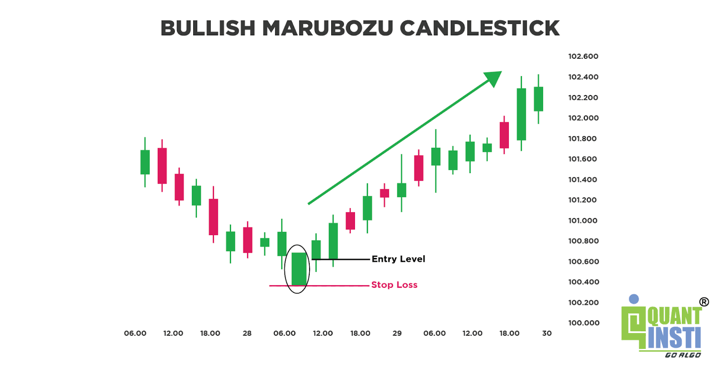

Candlestick patterns are a cornerstone of technical analysis used by traders worldwide to predict market movements. These patterns, which depict price movements for a given time interval, help traders understand market dynamics by providing visual insight into the struggle between buyers and sellers. Among these patterns, the Marubozu is particularly notable for its simplicity and strong indication of market sentiment. The Marubozu candlestick is characterized by its lack of shadows, representing pure buying or selling pressure, and thus provides clear and direct signals about market direction. In this article, we will explore the Marubozu pattern in detail, its significance in technical analysis, and its application in algorithmic trading. Our aim is to provide a comprehensive guide on how traders can leverage this pattern for better decision-making, enhancing both manual and automated trading strategies. By understanding the Marubozu pattern, traders can gain valuable insights into market trends and potentially improve their trading performance.

## Table of Contents



## Understanding the Marubozu Candlestick

The Marubozu candlestick pattern is one of the most straightforward yet powerful indicators within technical analysis, often recognized by its long, unbroken structure. Characterized by a prominent body with no shadows—no upper or lower wicks—the Marubozu unequivocally represents the battle between buyers and sellers, where one side dominates entirely.

The Marubozu pattern can manifest as two primary types: the Bullish Marubozu and the Bearish Marubozu. A Bullish Marubozu is indicative of robust buying pressure, as it opens at its lowest price and closes at its highest price for the given period. This pattern suggests that buyers have been in control since the market opened, showing unwavering strength without any significant selling pressure throughout the session.

Conversely, the Bearish Marubozu symbolizes potent selling pressure. In this scenario, the candlestick opens at its highest price and closes at its lowest, conveying that sellers have decisively controlled the market from the onset to the close of the period, overpowering any buy-side attempts.

In essence, the absence of shadows within a Marubozu is a clear indicator of market sentiment, reflecting pure buyer or seller sentiment driven by dominant market forces. This simplification makes the Marubozu a pivotal tool for identifying potential continuations or reversals in market trends.

To effectively model or identify a Marubozu with programming, one could implement a simple check for price levels in Python:

```python
def is_bullish_marubozu(open_price, close_price, high_price, low_price):
    return open_price == low_price and close_price == high_price

def is_bearish_marubozu(open_price, close_price, high_price, low_price):
    return open_price == high_price and close_price == low_price
```

These functions take in the prices at open, close, high, and low and return a boolean indicating whether a given candlestick can be classified as a Bullish or Bearish Marubozu, providing an efficient way to integrate this analysis into broader trading strategies.

## The Importance of Marubozu in Technical Analysis

The absence of shadows in a Marubozu candlestick offers a compelling view of market sentiment, indicating decisive action by buyers or sellers. This feature makes Marubozu a powerful tool in technical analysis. When a candlestick lacks shadows, it suggests that the opening and closing prices are the lowest and highest of the day, respectively for a Bullish Marubozu, or vice-versa for a Bearish Marubozu. This lack of price fluctuation within the period signals a strong commitment from either buyers or sellers, depending on the direction of the Marubozu, making it a clear indicator of market dominance.

Technical analysts highly regard the Marubozu pattern for its ability to provide predictive insights into market trends. For instance, a Bullish Marubozu often signals the continuation of an uptrend, while a Bearish Marubozu could indicate further downward pressure in a downtrend. The pattern's strength lies in its ability to signify potential reversals or continuations in the market. A Bullish Marubozu could suggest that buyers have seized control, likely continuing the upward trend. Conversely, a Bearish Marubozu may indicate that sellers have taken over, increasing the potential for continued declines.

Moreover, Marubozu patterns can be particularly useful in spotting breakouts and reversals during consolidation periods. When markets consolidate, they tend to move sideways without a clear trend. The formation of a Marubozu in such conditions can provide a strong signal that the consolidation phase might end, with a new trend emerging. For instance, spotting a Bullish Marubozu after a consolidation phase may indicate that the [breakout](/wiki/breakout-trading) is more likely to be upward.

While the Marubozu pattern offers strong market insights, it is crucial to complement it with other technical indicators for confirmation and to mitigate the risk of false signals, especially in choppy market conditions where other factors might obscure its directness. Integrating it with tools such as [volume](/wiki/volume-trading-strategy) analysis or oscillators can enhance its reliability, providing a more comprehensive market analysis toolkit.

## Applying Marubozu Pattern in Algorithmic Trading

Algorithmic trading, characterized by the use of computer programs to execute trades at high speeds and volumes, greatly benefits from well-defined patterns such as the Marubozu. This candlestick pattern, known for its distinct lack of shadows, provides precise entry and [exit](/wiki/exit-strategy) signals that are crucial for automated trading systems.

Traders often develop algorithms to detect Marubozu patterns, leveraging these clear signals for initiating or closing positions. For instance, a bullish Marubozu might trigger a buy order, while a bearish Marubozu could initiate a sell order. These algorithms can be further enhanced by integrating additional technical indicators such as the Relative Strength Index (RSI) or the Moving Average Convergence Divergence (MACD) to increase the reliability of trading decisions.

Here's a basic example of how one might use Python to integrate a Marubozu detection into an [algorithmic trading](/wiki/algorithmic-trading) strategy:

```python
import pandas as pd

def detect_marubozu(data):
    """
    Detect Marubozu candles in the OHLC data.

    Args:
    data (pd.DataFrame): DataFrame with 'Open', 'High', 'Low', 'Close' columns.

    Returns:
    pd.Series: Boolean Series indicating the presence of Marubozu candles.
    """
    is_bullish_marubozu = (data['Open'] == data['Low']) & (data['Close'] == data['High'])
    is_bearish_marubozu = (data['Open'] == data['High']) & (data['Close'] == data['Low'])
    return is_bullish_marubozu | is_bearish_marubozu

# An example usage with some OHLC data
ohlc_data = pd.DataFrame({
    'Open': [100, 105, 110],
    'High': [110, 112, 115],
    'Low': [100, 105, 105],
    'Close': [110, 108, 105]
})

marubozu_signals = detect_marubozu(ohlc_data)
print(marubozu_signals)
```

The above code evaluates whether each candlestick in the dataset is a Marubozu by comparing the opening and closing prices to the highs and lows. Such detections can be pivotal in an algorithmic trade decision system when combined with RSI or MACD for additional confirmation. 

For instance, a Marubozu pattern accompanied by an RSI indicating an overbought or oversold condition can provide stronger validation for a trade. Similarly, observing the MACD crossing can signal whether to enter or exit a position more confidently in conjunction with Marubozu signals.

The synergy of Marubozu patterns with such indicators helps filter out noise and reduces the likelihood of false signals, thereby enhancing the effectiveness of algorithmic strategies. Thus, the integration of the Marubozu pattern in algorithmic trading systems not only simplifies decision-making but also adds precision and robustness to automated trading strategies.

## Trading Strategies Using Marubozu Patterns

A bullish Marubozu candle, evident in an uptrend, often acts as a robust affirmation of the existing trend's strength and persistence. It indicates strong buying pressure, and traders can interpret its appearance as a signal to maintain long positions or consider new entries, anticipating further price appreciation. This strategy capitalizes on the [momentum](/wiki/momentum) suggested by the full-bodied candle, devoid of shadows, which implies that the buyers were in control from open to close.

In contrast, a bearish Marubozu appearing during a downtrend signals intensifying selling pressure. This pattern suggests the continuation of downward momentum, offering traders a cue to maintain or initiate short positions. The absence of shadows indicates that sellers dominated the session, pushing the price consistently lower. This pattern provides traders with a relatively clear signal to expect further declines, allowing them to position themselves accordingly.

Additionally, Marubozu candles serve as valuable indicators at potential reversal points. For instance, a bullish Marubozu forming at a support level during a downtrend can suggest the exhaustion of selling pressure and the potential onset of a bullish reversal. Conversely, a bearish Marubozu emerging at a resistance level in an uptrend can imply the diminishing strength of buyers and the possibility of a bearish reversal. Traders may incorporate these patterns into their strategies by identifying key support and resistance levels and observing Marubozu formations as a sign of potential market shifts.

Integrating Marubozu patterns with other analytical tools, such as trend lines and support/resistance analysis, adds depth to the trading strategy. For a more systematic approach, consider the following Python snippet that identifies Marubozu candlesticks in historical data:

```python
import pandas as pd

def is_marubozu(row):
    body_size = abs(row['Close'] - row['Open'])
    shadow1 = abs(row['High'] - max(row['Close'], row['Open']))
    shadow2 = abs(row['Low'] - min(row['Close'], row['Open']))
    total_range = abs(row['High'] - row['Low'])

    return shadow1 <= 0.1 * body_size and shadow2 <= 0.1 * body_size

# Example usage
data = pd.DataFrame({
    'Open': [100, 105, 98, 103],
    'High': [105, 110, 100, 105],
    'Low': [95, 100, 95, 102],
    'Close': [110, 102, 95, 102]
})

data['Marubozu'] = data.apply(is_marubozu, axis=1)
print(data)
```

This code evaluates each candlestick in a dataset, checking for minimal shadow lengths in accordance to body size, which characterizes a Marubozu. Traders equipped with such tools are better positioned to recognize these patterns quickly, facilitating timely decision-making in dynamic market conditions.

## Example of Using Marubozu in Market Analysis

Consider a scenario where a stock has been in a persistent downtrend, and a bullish Marubozu forms at a significant support level. This occurrence can serve as a vital signal for traders, suggesting the potential for a market reversal. A bullish Marubozu, characterized by its open at the low and close at the high, indicates strong buying pressure that could overpower the existing selling trend at the support area. This pattern suggests an influx of buyer interest capable of reversing the downtrend.

To strengthen the trade setup, incorporating volume analysis is crucial. High trading volume accompanying the Marubozu pattern provides additional confirmation of a potential reversal. Elevated volume indicates a commitment by traders to the new directional shift, reinforcing the likelihood of sustained momentum in the opposite direction. 

For instance, in Python, traders might use a script to identify Marubozu patterns by checking for candles with negligible shadows relative to their body length. Key elements include:

```python
# Hypothetical data setup
candlestick_data = {
    'open': [100, 95, 90, 85, 70],  # Example downtrend data
    'close': [99, 94, 88, 75, 80],  # Last candle is a Bullish Marubozu
    'high': [99, 95, 90, 85, 80],
    'low': [98, 93, 87, 80, 70],
    'volume': [500, 600, 550, 500, 1200]  # Last candle has a significant volume surge
}

def is_bullish_marubozu(idx, data):
    body_size = data['close'][idx] - data['open'][idx]
    upper_shadow = data['high'][idx] - data['close'][idx]
    lower_shadow = data['open'][idx] - data['low'][idx]
    return upper_shadow < body_size * 0.1 and lower_shadow < body_size * 0.1

# Detect Marubozu and evaluate volume
last_index = len(candlestick_data['open']) - 1
if is_bullish_marubozu(last_index, candlestick_data):
    print(f"Bullish Marubozu detected at index {last_index}, potential reversal")
    if candlestick_data['volume'][last_index] > candlestick_data['volume'][last_index - 1] * 1.5:
        print("Confirmed by significant volume increase. Consider entering a long position.")
```

In this example, the formation of a bullish Marubozu at a support level, paired with a marked increase in trading volume, provides compelling evidence for traders to consider establishing a long position, anticipating a trend reversal and subsequent price increase.

## Advantages and Limitations of Marubozu Candlesticks

The Marubozu candlestick pattern is widely appreciated for its ability to provide strong signals of market direction, largely due to its design featuring minimal noise. This clarity makes it an effective tool for traders seeking to quickly gauge market momentum. With no shadows, the Marubozu clearly reveals a dominant force in the market, either bullish or bearish, making it easier to identify potential trends.

However, the effectiveness of the Marubozu pattern can diminish significantly when used in isolation. Market context is crucial for accurately interpreting any pattern, including the Marubozu. Without considering the broader market environment and integrating additional technical indicators, the reliability of trading decisions based solely on this pattern can be compromised. For example, in volatile or choppy markets, the straightforward nature of the Marubozu might lead to false signals. The pattern can suggest a continuation of a trend or a reversal, but these outcomes are not guaranteed without supporting evidence from other indicators or market conditions.

To mitigate such limitations, traders often combine the Marubozu pattern with other analytical tools or indicators, such as moving averages, relative strength index (RSI), or moving average convergence divergence (MACD). This multi-faceted approach can provide a more comprehensive market analysis and enhance the validity of trading signals derived from the Marubozu candlestick pattern.

In conclusion, while the Marubozu candlestick is a valuable component of technical analysis, traders should be cautious to employ it as part of a broader strategy, utilizing additional data to confirm potential market signals and avoid misinterpretation.

## Conclusion

Marubozu candlesticks are instrumental in understanding trader sentiment and predicting market direction. These patterns, characterized by their long bodies and absence of shadows, are indicative of strong market pressure, either from buyers or sellers, depending on whether a bullish or bearish Marubozu is observed. Their clear signals make them particularly valuable for both manual and algorithmic trading approaches.

When Marubozu patterns are combined with complementary technical indicators, such as the Relative Strength Index (RSI) or the Moving Average Convergence Divergence (MACD), traders benefit from enhanced decision-making capabilities. These additional indicators provide context and confirmation, which help mitigate potential false signals that the Marubozu pattern might generate in isolation. For instance, a Bullish Marubozu following an oversold RSI condition could suggest a stronger buy signal, while a Bearish Marubozu coupled with a MACD crossover might indicate a more reliable sell opportunity.

Incorporating market context is another critical element in leveraging the Marubozu pattern effectively. Understanding market trends, support and resistance levels, and overall market conditions ensures that traders do not misinterpret the signals provided by the Marubozu candlesticks. For example, in trending markets, the Marubozu could be a powerful indicator of trend continuation, whereas in range-bound markets, caution is required as the pattern may not fully play out.

Mastering the application of the Marubozu pattern provides traders a robust tool that enhances technical analysis strategies and supports algorithmic trading systems. This understanding allows traders to better gauge market sentiment, make more informed trading decisions, and potentially improve their trading outcomes through precise and calculated entries and exits.

## References & Further Reading

[1]: Nison, S. (2001). ["Japanese Candlestick Charting Techniques: A Contemporary Guide to the Ancient Investment Techniques of the Far East"](https://archive.org/details/japanesecandlest0000niso). Penguin Publishing Group.

[2]: Bulkowski, T. N. (2008). ["Encyclopedia of Candlestick Charts"](https://onlinelibrary.wiley.com/doi/book/10.1002/9781119202288). Wiley.

[3]: ["The Candlestick Trading Bible"](https://www.amazon.com/Candlestick-Trading-Bible-Techniques-Psychology/dp/B0DCBFL7SM) by Minoo Tepatti

[4]: Murphy, J. J. (1999). ["Technical Analysis of the Financial Markets: A Comprehensive Guide to Trading Methods and Applications"](https://archive.org/details/technicalanalysi0000murp). New York Institute of Finance.

[5]: Pring, M. J. (2002). ["Technical Analysis Explained: The Successful Investor's Guide to Spotting Investment Trends and Turning Points"](https://www.amazon.com/Technical-Analysis-Explained-Fifth-Successful/dp/0071825177). McGraw-Hill Education.