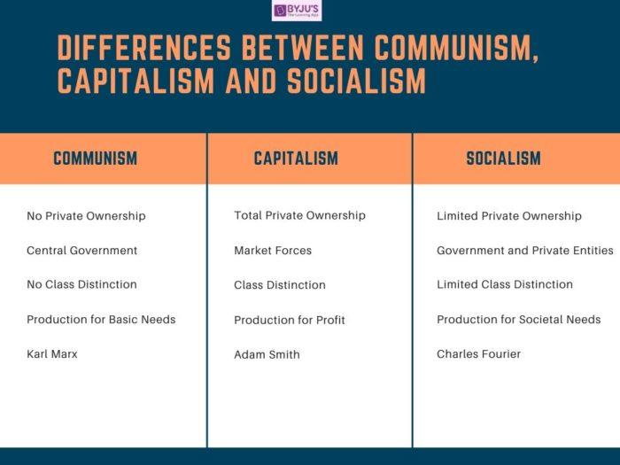

## Table of Contents

## What is Marxism and who was Karl Marx?

Marxism is a way of thinking about the world that focuses on how society is divided into different groups based on who owns things and who doesn't. It says that the people who own businesses and factories, called the bourgeoisie, control everything and make money from the people who work for them, called the proletariat. Marxism believes that this system is unfair and that it will eventually lead to a revolution where the workers take over and create a society where everyone shares what they have equally. This idea is often linked to communism, where the goal is to have no private property and for everyone to work together for the common good.

Karl Marx was a German thinker and writer who came up with the ideas behind Marxism. He was born in 1818 and spent much of his life studying and writing about how societies work. Along with Friedrich Engels, he wrote a very important book called "The Communist Manifesto," which explains how the working class can rise up against the rich. Marx also wrote a big book called "Das Kapital," which looks at how the economy works and why he thought capitalism would fail. His ideas have influenced many people and movements around the world, even though he died in 1883.

## How does Marxism differ from communism?

Marxism is a way of thinking about the world and how societies work. It was created by Karl Marx and focuses on how society is divided into groups based on who owns things and who doesn't. Marxism says that the people who own businesses and factories, called the bourgeoisie, control everything and make money from the workers, called the proletariat. Marx believed this system is unfair and will lead to a revolution where the workers take over and create a fairer society.

Communism is a type of political and economic system that aims to create a society where there is no private property and everyone works together for the common good. It is based on the ideas of Marxism, but it is more about the actual system of government and economy. In a communist society, the goal is for everyone to share what they have equally, and for the government to control the means of production, like factories and farms, to make sure everyone's needs are met. So, Marxism is more about the theory and ideas, while communism is about putting those ideas into practice.

## What are the key principles of socialism and how do they relate to Marxism?

Socialism is a way of organizing society where the main idea is that everyone should share the wealth and resources more equally. In a socialist system, the government or the community owns and controls important things like factories, farms, and services. The goal is to make sure everyone has what they need, like food, housing, and healthcare, and to reduce the big differences between rich and poor people. Socialism believes that if everyone works together and shares, society will be fairer and happier.

Socialism and Marxism are closely related because Marxism is one of the main theories that helped to develop socialist ideas. Karl Marx thought that the workers, or proletariat, should take over from the rich owners, or bourgeoisie, and create a new society. This new society would be socialist at first, where the government would control the economy to make things fair. Marx believed that eventually, this would lead to communism, where there would be no need for government control because everyone would work and share naturally. So, Marxism provides the theory and ideas about how to get to socialism, and socialism is seen as a step towards the ultimate goal of communism.

## Can you explain the basic tenets of capitalism and how they contrast with Marxism?

Capitalism is a way of organizing an economy where people can own businesses and make money from them. In capitalism, the idea is that if people can own things and make money, they will work hard and come up with new ideas. This is supposed to make the economy grow and make life better for everyone. People can buy and sell things freely, and the government doesn't control everything. The main goal in capitalism is to make a profit, and people who own businesses, called capitalists, are the ones who decide what to make and how much to charge.

Capitalism and Marxism are very different because Marxism thinks capitalism is unfair. Marxism says that in capitalism, the rich people who own businesses, called the bourgeoisie, make money by paying workers, called the proletariat, very little. Marxists believe this system creates a big divide between the rich and the poor and that it will lead to problems. Marxism wants to change this by having the workers take over and create a new system where everyone shares what they have. In Marxism, the goal is not to make a profit but to make sure everyone's needs are met, and the government or the community controls the economy to make things fair.

## What historical events were influenced by Marxist ideology?

Many big events in history were influenced by Marxist ideas. One of the most famous is the Russian Revolution in 1917. People in Russia were tired of being poor and unhappy under the rule of the Tsar. They were inspired by Marxism and wanted to change their society. They overthrew the Tsar and tried to create a new society where everyone shared the wealth. This led to the creation of the Soviet Union, which was the first country to try to put Marxist ideas into practice on a large scale.

Another important event influenced by Marxism was the Chinese Revolution. In the 1940s, many people in China were poor and unhappy with the government. Mao Zedong, who was inspired by Marxist ideas, led a group of people to fight against the government. They wanted to create a new society where everyone was equal and shared the wealth. In 1949, they won and created the People's Republic of China, which also tried to follow Marxist ideas.

Marxist ideas also played a big role in the Cuban Revolution in 1959. Fidel Castro and his group wanted to overthrow the government in Cuba because they thought it was unfair to the poor people. They were inspired by Marxism and wanted to create a new society where everyone had what they needed. After they won, Cuba became a communist country, trying to follow Marxist ideas to make life better for everyone.

## How do Marxist theories address economic inequality?

Marxist theories focus a lot on economic inequality. They say that in a capitalist system, the rich people, called the bourgeoisie, own businesses and make money from the workers, called the proletariat. The workers do all the hard work but get paid very little, while the owners get richer and richer. This makes the gap between rich and poor bigger and bigger. Marxists believe this system is unfair and that it leads to a lot of problems, like poverty and unhappiness. They think that the workers should rise up and take control of the businesses and the economy so that everyone can share the wealth more equally.

To fix economic inequality, Marxists want to change the whole system. They believe that after the workers take over, there should be a new society where the government or the community owns everything important, like factories and farms. This is called socialism, and the idea is that by controlling the economy, the government can make sure everyone's needs are met and reduce the big differences between rich and poor. Marxists see this as a step towards communism, where there is no private property and everyone works together naturally for the common good. They think that if everyone shares what they have, economic inequality will go away and society will be fairer and happier.

## What criticisms are commonly leveled against Marxism?

People often criticize Marxism because they think it doesn't work well in real life. They say that when countries try to follow Marxist ideas, like in the Soviet Union or China, it leads to problems. For example, the government ends up having too much control, and people lose their freedom. Critics also say that Marxism doesn't understand how people really act. They think that people won't work hard if they don't get to keep what they earn, and that can make the economy weak.

Another common criticism is that Marxism ignores important things like how people can be creative and start new businesses. In a capitalist system, people can come up with new ideas and make money from them, which can help the economy grow. Critics say that Marxism doesn't encourage this kind of innovation. They also argue that Marxism focuses too much on class struggle and doesn't pay enough attention to other important issues, like individual rights and personal freedom.

## How have different countries implemented Marxist ideas, and what were the outcomes?

In the Soviet Union, Marxist ideas were put into action after the Russian Revolution in 1917. The leaders, like Lenin and later Stalin, wanted to create a society where everyone shared the wealth. They took over businesses and farms, and the government controlled everything. At first, there were some successes, like building schools and hospitals for everyone. But over time, many people felt that the government had too much power. They couldn't speak freely or start their own businesses. The economy didn't grow as well as it could have, and many people were unhappy. In the end, the Soviet Union fell apart in 1991 because the system wasn't working.

In China, Marxist ideas were used during the Chinese Revolution led by Mao Zedong. After they won in 1949, they tried to make a society where everyone was equal. The government took control of businesses and farms, and they started big projects to help the country grow. But there were also big problems. The Great Leap Forward and the Cultural Revolution caused a lot of suffering and didn't help the economy. Over time, China started to mix some capitalist ideas with Marxism. They let people start businesses and trade with other countries. This helped China's economy grow a lot, but it also made the gap between rich and poor bigger. Today, China still calls itself a socialist country, but it uses a lot of capitalist ideas to make money.

In Cuba, Marxist ideas were used after the Cuban Revolution in 1959. Fidel Castro and his group wanted to create a society where everyone had what they needed. The government took over businesses and farms, and they made sure everyone had healthcare and education. But Cuba faced a lot of problems too. The economy didn't grow very well because they couldn't trade freely with other countries. Many people wanted more freedom and to be able to start their own businesses. Even though Cuba is still a communist country, they have started to let people do some business and trade to help the economy.

## What is the role of the state in Marxist theory compared to other economic systems?

In Marxist theory, the state plays a very important role, especially during the transition from capitalism to socialism. Marxists believe that under capitalism, the state works to help the rich people, called the bourgeoisie, keep their power and wealth. They say the state makes laws and rules that help the rich get richer and keep the workers, called the proletariat, down. When the workers take over in a revolution, the state's job changes. It needs to take control of the economy, like businesses and farms, to make sure everyone's needs are met. This is called the "dictatorship of the proletariat," where the state helps create a fair society by controlling things until communism can be reached. In communism, the state would eventually go away because everyone would work together naturally without needing a government to control everything.

In other economic systems, like capitalism, the role of the state is very different. In capitalism, the state's job is to protect people's rights to own things and make money. The government makes laws to help businesses work well and to keep the economy growing. But it doesn't control the economy the way it does in Marxism. The state in capitalism is there to help businesses and people make money, not to control everything. In socialism, which is different from Marxism but related, the state also plays a big role. The government owns important things like factories and farms to make sure everyone has what they need. But unlike in Marxism, the state in socialism might not be seen as a temporary step towards communism, and it might not focus as much on class struggle.

## How does Marxism view the concept of class struggle and its resolution?

Marxism sees class struggle as the main force that drives history and changes society. Karl Marx believed that all of history is about different groups fighting over who gets to control things. In a capitalist system, the rich people, called the bourgeoisie, own businesses and make money from the workers, called the proletariat. The workers do all the hard work but don't get much money, while the owners get richer. This makes the workers unhappy and angry, and they start to fight back against the rich people. Marxists think that this struggle between the classes will get bigger and bigger until the workers finally rise up in a revolution.

After the revolution, Marxists believe the workers will take over and create a new society where everyone shares the wealth. At first, the government will control everything to make sure everyone's needs are met. This is called socialism, and it's seen as a step towards communism. In communism, there won't be any rich or poor people, and everyone will work together without needing a government to control everything. Marxists think that by solving the class struggle and making everyone equal, society will be much happier and fairer.

## What are the modern interpretations and adaptations of Marxism?

Today, people still use Marxist ideas but in new ways. Some people call themselves "neo-Marxists." They look at how things like race, gender, and culture can also cause unfairness, not just money and class. They think that to make the world fairer, we need to look at all these things together. For example, some people talk about "intersectionality," which means looking at how different kinds of unfairness can affect someone at the same time. Neo-Marxists also use ideas from other thinkers to make their ideas better and more useful for today's world.

Another modern way people use Marxism is called "Western Marxism." This focuses more on ideas and culture than on just changing the economy. People who follow Western Marxism think that changing how people think and what they believe is important for making society better. They look at things like art, movies, and [books](/wiki/algo-trading-books) to see how they can help or hurt people's understanding of the world. Western Marxism is popular in schools and universities, where people study these ideas to understand society better.

Some countries, like China and Vietnam, have mixed Marxist ideas with capitalism. They call this "market socialism." In these places, the government still controls some big parts of the economy, but they also let people start businesses and make money. They think this can help the economy grow while still trying to make things fairer for everyone. This is different from what Marx thought, but it shows how people can take his ideas and change them to fit today's world.

## How do Marxist theories intersect with other social theories like feminism and postcolonialism?

Marxist theories intersect with feminism because both are about making society fairer. Marxism talks about how the rich people, called the bourgeoisie, control everything and make money from the workers, called the proletariat. Feminism talks about how men have more power than women and how that's not fair. Some feminists use Marxist ideas to say that women are also part of the working class and that the rich people keep them down too. They call this "Marxist feminism." They think that to make things better for women, we need to change the whole system, not just give women more rights. They believe that if we can fix the problems with money and class, it will also help fix the problems with gender.

Marxist theories also connect with postcolonialism, which looks at how countries that used to be colonies are still affected by their past. Marxism says that the rich countries, which are often the ones that used to have colonies, keep the poor countries down to make money. Postcolonial thinkers use Marxist ideas to talk about how this happens and how it's not fair. They say that the rich countries take resources and money from the poor countries, just like the rich people take money from the workers. This is called "dependency theory." Postcolonial thinkers believe that to make things better for the poor countries, we need to change the whole system, not just help them a little bit. They think that if we can fix the problems with money and class on a global level, it will help fix the problems left over from colonialism.

## References & Further Reading

[1]: ["Das Kapital"](https://www.marxists.org/archive/marx/works/download/pdf/Capital-Volume-I.pdf) by Karl Marx

[2]: ["The Wealth of Nations"](https://en.wikipedia.org/wiki/The_Wealth_of_Nations) by Adam Smith

[3]: ["Algorithmic Trading and DMA: An Introduction to Direct Access Trading Strategies"](https://www.amazon.com/Algorithmic-Trading-DMA-introduction-strategies/dp/0956399207) by Barry Johnson

[4]: ["Advances in Financial Machine Learning"](https://www.wiley.com/en-us/Advances+in+Financial+Machine+Learning-p-9781119482086) by Marcos Lopez de Prado

[5]: ["The Communist Manifesto"](https://www.marxists.org/admin/books/manifesto/Manifesto.pdf) by Karl Marx and Friedrich Engels

[6]: ["The Road to Serfdom"](https://en.wikipedia.org/wiki/The_Road_to_Serfdom) by Friedrich Hayek