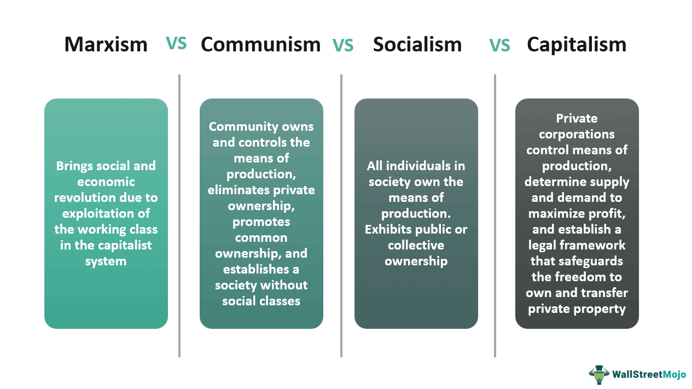

Economic systems are fundamental frameworks that determine how resources are allocated and goods are distributed within societies. Understanding how these systems interact with financial markets is essential, as they profoundly influence economic behavior, policy-making, and global trade. Historically, economic systems are characterized by distinct ideological foundations, such as communism, Marxism, capitalism, and socialism, each of which presents unique perspectives on ownership, production, and the distribution of wealth.

Communism, for instance, is characterized by the absence of private property, with all property being publicly owned. Its core principle is the idea of classless society, where goods and services are distributed according to need. Marxism, closely linked to communism, offers a critical approach to understanding and transforming capitalist societies, focusing on the conflicts between classes and advocating for a proletarian revolution to dismantle capitalist structures.

In contrast, capitalism is based on the principles of private ownership, free markets, and competition. It operates on the belief that market forces, driven by supply and demand, should dictate resource allocation, fostering innovation and efficiency. Socialism serves as a middle ground between these ideologies, advocating for collective ownership or regulation of key economic sectors while allowing for some degree of private enterprise and market-driven activities.

Understanding these economic systems is crucial in today's interconnected global economy as they underpin national policies and economic strategies that impact international trade, investment, and economic growth. Each system's philosophy shapes the structure of financial markets, governance practices, and the broader socio-economic environment.

In contemporary financial markets, algorithmic trading has emerged as a powerful tool, reshaping how trades are executed and information is processed. By using complex algorithms to execute orders at speeds and volumes beyond human capabilities, algorithmic trading enhances market efficiency and liquidity but also introduces new risks and regulatory challenges.

This article aims to analyze the intricate interplay between established economic theories—communism, Marxism, capitalism, and socialism—and the increasingly dominant practice of algorithmic trading. By examining how these economic systems respond to and are affected by technological advancements in trading, we can better understand their capacity to adapt and remain relevant in a rapidly evolving financial landscape.

## Table of Contents

## Understanding Economic Systems: Communism, Marxism, Capitalism, Socialism

Economic systems form the structural foundation upon which societies organize production, distribution, and consumption of goods and services. Each system reflects distinct philosophies about property ownership, economic decision-making, and wealth distribution. This section provides a comprehensive overview of four major economic systems: communism, Marxism, capitalism, and socialism.

**Communism: Core Principles**

Communism is an economic ideology advocating for a classless society in which all property is publicly owned, and each person works and is remunerated according to their abilities and needs. The central tenet of communism is the abolition of private property, achieving a stateless and classless society. Karl Marx's vision of communism involves a revolutionary overthrow of capitalist systems, ultimately leading to a society where the means of production are communally owned. The communist ideology posits that such a system would eradicate societal inequities born from private ownership and capital accumulation.

**Marxism: Interpretation within Communist Ideology**

Marxism serves as the theoretical backbone of communist ideology. It is a socio-economic theory developed by Karl Marx and Friedrich Engels that analyzes the impact of capitalism and advocates for a proletariat revolution. Central to Marxism is the labor theory of value, which posits that the value of a commodity is derived from the total amount of socially necessary labor required to produce it. Marxism interprets history as a series of class struggles and views capitalism as merely a stage in historical development, leading to socialism and ultimately communism. In this interpretation, the exploitation of labor under capitalism is identified as a central conflict that needs to be resolved through the establishment of a classless society.

**Capitalism: Principles of Free Market and Competition**

Capitalism is characterized by private ownership of the factors of production and operates on principles of a free market and competition. It is based on the belief that when individuals act in their self-interest, markets tend to self-regulate through the laws of supply and demand. The profit motive drives innovation and efficiency, theoretically leading to wealth generation and improved standards of living. Capitalism supports minimal government intervention, suggesting that economic freedom allows markets to allocate resources more efficiently than planned economies. Critics of capitalism, however, often cite inequalities and boom-bust cycles as inherent flaws in the system.

**Socialism: A Middle Ground**

Socialism represents a middle ground between capitalism and communism, advocating for public or collective ownership of major industries while allowing for some private ownership. This economic system emphasizes redistributive policies to reduce social inequalities, often through progressive taxation and social welfare programs. Socialism seeks to balance individual rights with collective good, aiming to provide a safety net through government intervention in the economy. The extent to which markets are free and the role of government can vary significantly among socialist frameworks, with some leaning closer to capitalist principles and others to communist ideals.

**Comparative Analysis and Historical Contexts**

The historical evolution of these economic systems reflects varying responses to economic challenges and societal values at different times and places. Communism gained prominence in the 20th century in response to industrialization's economic inequalities, leading to revolutions in Russia and China. Capitalism's roots trace back to the Enlightenment and the Industrial Revolution, with Adam Smith's "The Wealth of Nations" advocating for invisible hand market mechanisms. Socialism emerged as a critique of capitalism's excesses, advocating for humane working conditions and equitable societal wealth distribution. Understanding these systems in their historical contexts allows for a nuanced appreciation of their contributions and limitations, especially as modern economies continue to evolve. 

The interplay between these economic systems often results in hybrid approaches tailored to meet the specific needs of different countries. These adaptations show the complexity and dynamism intrinsic to economic theory and practice.

## Algorithmic Trading: A New Frontier in Financial Markets

Algorithmic trading, often referred to as algo-trading, is the process of using computer programs to execute trading orders at speeds and frequencies that a human trader cannot achieve. At its core, [algorithmic trading](/wiki/algorithmic-trading) leverages pre-defined instructions, often based on timing, price, quantity, or any mathematical model, to make trading decisions. This approach to trading has significantly transformed the landscape of modern financial markets, emphasizing efficiencies and strategic advancements.

One of the primary ways algorithms are transforming trading strategies is through enhanced market efficiencies. By systematically analyzing a plethora of data at high speeds, algorithms can identify trends and execute trades across various markets simultaneously, thus optimizing the opportunities for returns. This technological evolution reduces transaction costs and mitigates human error, allowing for more consistent and objective trading outcomes.

High-frequency trading ([HFT](/wiki/high-frequency-trading-strategies)) is a subset of algorithmic trading distinguished by high turnover rates and significant order-to-trade ratios. HFT utilizes sophisticated algorithms to engage in rapid-fire trades that can be executed within fractions of a second. This automated decision-making capability enables HFT firms to capitalize on minute price discrepancies across different markets or exchanges, thus contributing to tighter bid-ask spreads and enhanced [liquidity](/wiki/liquidity-risk-premium). However, the sheer speed and [volume](/wiki/volume-trading-strategy) of HFT transactions also raise concerns about market [volatility](/wiki/volatility-trading-strategies) and systemic risks.

The advantages of algorithmic trading are manifold. It provides traders with the ability to back-test strategies using historical data, ensuring that the approach is robust before deploying it in live markets. Furthermore, algorithmic trading can handle large volumes of data efficiently, leading to increased trading accuracy and execution at optimal price levels. Despite these benefits, algo-trading also presents challenges. The heavy reliance on technology exposes markets to risks associated with technical failures, such as system outages or glitches. Additionally, the complexities of algorithmic models require rigorous oversight and continuous updating to remain effective in the dynamic market environment.

Regulatory perspectives on algorithmic trading vary globally, with financial regulators increasingly scrutinizing its impact on market stability. While algorithmic trading can enhance liquidity and efficiency, its potential to disrupt markets necessitates a robust regulatory framework. Authorities are particularly concerned about "flash crashes," wherein large volumes of trades executed in milliseconds can lead to dramatic market fluctuations. Consequently, regulators focus on implementing policies that mandate transparency, such as requiring firms to register their trading algorithms and maintain records for audit purposes. Furthermore, there are discussions on imposing speed limits on trading and minimum resting times for orders to reduce the likelihood of manipulative practices.

In conclusion, algorithmic trading represents a paradigm shift in how trades are conducted in financial markets. It offers numerous benefits in terms of efficiency and precision, yet it also poses significant challenges that require vigilant regulation and oversight. As markets continue to evolve, the interplay between technology and regulatory frameworks will shape the future landscape of trading.

## Interplay Between Economic Systems and Algorithmic Trading

Capitalist markets have played a crucial role in fostering the growth of algorithmic trading due, primarily, to the inherent characteristics of capitalism such as competition, innovation, and the profit motive. Capitalism, characterized by private ownership and free markets, encourages technological advancements and efficiency improvements to maximize returns. Within this framework, algorithmic trading has emerged as a significant development, leveraging technology to execute trades at speeds and frequencies impossible for human traders.

Algorithmic trading's impact on global markets within a capitalist framework is profound. By enabling rapid execution of trades and optimizing bid-ask spreads, it enhances market liquidity and efficiency. Furthermore, the technology reduces human emotion's influence on market decisions, thereby providing a potentially more reliable pricing mechanism. However, the high-frequency nature of algorithmic trading also presents risks such as flash crashes, where rapid sell-offs can exacerbate volatility. In capitalist markets, the benefits of speed and efficiency come with the challenge of ensuring stability and fairness.

In socialist economies, where the state plays a more significant role in economic activities and market operations, the implications of algorithmic trading are nuanced. While algorithmic trading can offer similar benefits in terms of efficiency and liquidity, its integration may be hampered by regulatory constraints and a greater focus on equitable distribution of resources over profit maximization. The centralized decision-making in socialist settings may slow technology adoption or require significant adaptation to align with state objectives, such as reducing inequality or maintaining employment levels.

Communist regimes, characterized by state ownership of productive resources and a planned economy, present a distinct set of challenges for algorithmic trading. In such systems, where market forces are subdued or controlled entirely by the state, the competitive pressure driving algorithmic trading in capitalist markets is largely absent. Implementing algorithmic trading within these systems would likely conflict with central planning strategies, posing difficulties in harmonizing automated high-frequency trading's profit-driven nature with broader economic plans.

From a Marxist perspective, algorithmic trading could be critiqued for magnifying the commodification inherent in capitalist markets. Marxist theory emphasizes the exploitation and alienation resulting from commodifying human labor and market elements. Algorithmic trading intensifies market dynamics, prioritizing capital movement and profit generation, potentially at the expense of labor and equity considerations. This automation might be seen as furthering the disconnect between workers and their labor, exacerbating social inequalities and concentrating wealth among those with access to advanced technologies.

In summary, while algorithmic trading thrives on the principles of capitalism, its integration and effect in socialist and communist systems highlight the tension between rapid technological advancement and differing economic ideologies. The Marxist critique raises essential questions about commodification and the ethical implications of technology-driven market practices. Understanding these dynamics is crucial as we continue to explore the future of economic systems and their intersection with evolving financial technologies.

## The Future of Economic Systems in the Age of Algorithmic Trading

As advanced technologies continue to evolve, they are expected to bring transformative shifts in economic paradigms, particularly through the application of algorithmic trading. One of the critical focal points is how emerging markets might integrate these advanced trading systems. Emerging markets stand to benefit from algorithmic trading by improving market liquidity, minimizing transaction costs, and reducing the information asymmetry that often characterizes these economies. However, successful adoption will largely depend on the existing financial infrastructure, technological readiness, and regulatory environment. Economies like India and China have already begun implementing algorithmic trading frameworks, signaling a trend that might soon encompass other developing nations.

In speculative scenarios, a blend of different economic systems with algorithmic trading could lead to novel market dynamics. For instance, in a socialist-oriented market, algorithmic trading might be used to optimize resource allocation and achieve economic equity by focusing on societal welfare rather than individual profits. Alternatively, in a strictly capitalist framework, the emphasis would remain on maximizing efficiency and profitability, potentially widening the gap between different economic classes due to algorithmic advantages.

Governments and regulatory bodies play a pivotal role in shaping the future landscape of algorithmic trading. With the potential risks associated with high-frequency trading, such as market manipulation and systemic risks, regulatory frameworks must evolve to maintain market stability and protect investor interests. This includes implementing robust surveillance mechanisms and ensuring transparency in algorithmic practices. Furthermore, international cooperation among regulatory bodies could establish unified standards, fostering an environment conducive to technological advancements while mitigating risks.

In conclusion, the coexistence of traditional economic ideologies and technological advancements like algorithmic trading presents both challenges and opportunities. While capitalist markets inherently support technological growth, socialist and communist systems may need significant adaptations to align with these changes. The successful integration of algorithmic trading across various economic systems will depend on adaptive policy-making that recognizes the importance of innovative financial technologies while upholding core economic principles. Ultimately, the future landscape will likely feature a dynamic interplay between established economic ideologies and cutting-edge technological practices, requiring continuous dialogue and collaboration among all stakeholders.

## Conclusion

The various economic theories such as communism, Marxism, capitalism, and socialism significantly influence financial markets by shaping their structure, dynamics, and regulatory frameworks. Capitalism, with its emphasis on free markets and competition, has been a catalyst for the innovation and expansion of algorithmic trading. This advanced trading method enhances market efficiency and liquidity by executing trades at speeds and volumes unattainable by human traders. On the other hand, Marxism and socialism provide critical perspectives on the commodification processes inherent in algorithmic trading, questioning the socio-economic disparities it might exacerbate.

Adapting to technologies like algorithmic trading is crucial for economic systems to remain relevant and functional. As algorithmic trading becomes further embedded within financial markets, stakeholders must address its challenges, such as market volatility and ethical concerns regarding automated decision-making. The sustainability of any economic system in the context of these technological advancements hinges on its ability to integrate innovation while safeguarding economic equity.

The integration of Marxist, capitalist, and socialist ideas in financial innovation remains relevant. While capitalism fosters technological growth, Marxist critiques offer valuable insights into the socio-economic implications, and socialism highlights the need for regulatory mechanisms to ensure equitable benefit distribution. This interplay creates an environment that promotes both innovation and inclusivity.

Future economic policies must account for the rapid evolution of technologies by combining economic theory with technological regulation. This alignment calls for robust research and collaborative policy-making, encouraging diverse stakeholder participation to navigate the complexities of contemporary financial markets effectively. Enhanced interdisciplinary approaches can help reconcile traditional economic ideologies with modern technological realities, fostering sustainable economic progress.

## References & Further Reading

[1]: ["Das Kapital"](https://www.marxists.org/archive/marx/works/download/pdf/Capital-Volume-I.pdf) by Karl Marx

[2]: ["The Wealth of Nations"](https://en.wikipedia.org/wiki/The_Wealth_of_Nations) by Adam Smith

[3]: ["Algorithmic Trading and DMA: An Introduction to Direct Access Trading Strategies"](https://www.amazon.com/Algorithmic-Trading-DMA-introduction-strategies/dp/0956399207) by Barry Johnson

[4]: ["Advances in Financial Machine Learning"](https://www.wiley.com/en-us/Advances+in+Financial+Machine+Learning-p-9781119482086) by Marcos Lopez de Prado

[5]: ["The Communist Manifesto"](https://www.marxists.org/admin/books/manifesto/Manifesto.pdf) by Karl Marx and Friedrich Engels

[6]: ["The Road to Serfdom"](https://en.wikipedia.org/wiki/The_Road_to_Serfdom) by Friedrich Hayek