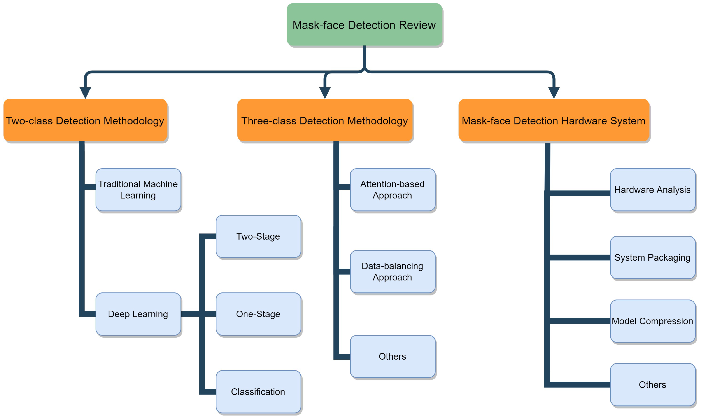

## Table of Contents

## What are Mask Branches in the context of machine learning?

Mask branches are a part of certain machine learning models, especially those used for image segmentation tasks. In simple terms, image segmentation means dividing an image into different parts or segments. The mask branch helps the model to create these segments by generating a mask, which is like a map that shows which pixels belong to which part of the image. For example, if you want to identify all the cats in a picture, the mask branch would help highlight all the pixels that make up the cats.

These branches are often used in models like Mask R-CNN, which stands for Mask Region-based Convolutional Neural Network. In Mask R-CNN, after the model detects where objects are in the image, the mask branch takes over. It creates a binary mask for each detected object, where the value 1 indicates that a pixel is part of the object, and 0 indicates it is not. This helps the model to not only tell where an object is but also to outline its exact shape within the image.

## How do Mask Branches relate to object detection and segmentation tasks?

Mask branches are an important part of models that do both object detection and segmentation. Object detection is when a model finds and marks where things are in a picture, like drawing boxes around cats or cars. Segmentation goes a step further by not just finding the objects but also showing their exact shapes. The mask branch helps with this by creating a special map, called a mask, that shows which parts of the picture belong to each object. This mask is like a coloring book outline that helps the computer know exactly which pixels make up, say, a cat's body.

In models like Mask R-CNN, the mask branch works together with the parts that do object detection. First, the model finds the objects and puts boxes around them. Then, the mask branch steps in and creates a detailed mask for each object inside those boxes. For example, if the model finds a dog, the mask branch will make a mask that shows the exact shape of the dog, including its ears and tail. This way, the model can tell not just where the dog is, but also what the dog looks like in detail. This makes the model very useful for tasks where knowing the shape and boundaries of objects is important.

## What is the basic architecture of a Mask Branch?

The basic architecture of a Mask Branch in a model like Mask R-CNN starts with the features that the model has already found from the image. These features come from the earlier parts of the model, like the backbone and the region proposal network. The Mask Branch takes these features and uses them to make a mask for each object that the model has found. It does this by using a few layers, usually convolutional layers, to change the features into a mask. The mask is like a coloring book outline that shows which parts of the image are the object.

The Mask Branch usually has a few convolutional layers followed by a final layer that makes the mask. Each layer in the Mask Branch looks at the features and changes them a little bit, making them more and more like the shape of the object. The final layer turns these changed features into a mask that is the same size as the box around the object. This mask uses numbers, usually 0s and 1s, to show which parts of the box are the object. If a pixel in the mask has a 1, it means that pixel is part of the object. If it has a 0, it means that pixel is not part of the object. This way, the Mask Branch helps the model know exactly what the object looks like.

## How does a Mask Branch use spatial attention in its operations?

A Mask Branch uses spatial attention to focus on the important parts of an image when making a mask. Spatial attention is like telling the model to pay more attention to certain areas of the image that might be part of the object it's looking for. The Mask Branch does this by using special layers that look at the whole image and decide which parts are more important for making the mask. These layers can change how much attention the model pays to different areas, making the mask more accurate.

In simple terms, think of spatial attention as a way to highlight the parts of the image that the model should care about more. For example, if the model is trying to make a mask for a cat, spatial attention helps the Mask Branch focus on the cat's body and ignore the background. This makes the mask better because it shows exactly where the cat is in the image. By using spatial attention, the Mask Branch can create more detailed and accurate masks, which is really helpful for tasks like image segmentation.

## What are the key components of a Mask Branch?

The key components of a Mask Branch include convolutional layers and a final mask prediction layer. The convolutional layers take the features from the earlier parts of the model and change them to focus on the shape of the object. These layers look at the features and make them more and more like the object's shape. The final mask prediction layer turns these changed features into a mask that shows which parts of the image are the object. This mask uses numbers, usually 0s and 1s, to show where the object is.

Another important component is the use of spatial attention. Spatial attention helps the Mask Branch focus on the important parts of the image. It's like telling the model to pay more attention to the areas that might be part of the object. By using spatial attention, the Mask Branch can make the mask more accurate and detailed. This is really helpful for tasks like image segmentation where knowing the exact shape of the object is important.

## How does a Mask Branch integrate with existing neural network architectures?

A Mask Branch integrates with existing [neural network](/wiki/neural-network) architectures by adding extra layers to the model that focus on creating masks for objects. For example, in a model like Mask R-CNN, the Mask Branch is added after the parts that detect objects. The model first uses its backbone and region proposal network to find where objects are in the image and draw boxes around them. Then, the Mask Branch takes the features from these boxes and uses convolutional layers to turn them into a detailed mask. This mask shows exactly which pixels inside the box are part of the object, making the model's understanding of the image more complete.

The integration of a Mask Branch does not change the main structure of the existing neural network much. Instead, it works with the features that the network has already found. The Mask Branch uses these features to create its masks, so it fits well with the rest of the model. By adding just a few more layers, the model can do both object detection and segmentation. This makes the model more useful because it can tell not just where objects are, but also what they look like in detail.

## What are the typical performance metrics used to evaluate Mask Branches?

The performance of Mask Branches is usually measured using a few important metrics. One key metric is the Intersection over Union (IoU), often called the Jaccard Index. IoU measures how well the predicted mask matches the actual mask. It's calculated by dividing the area where the predicted and actual masks overlap by the area of their union. A higher IoU means the mask is more accurate. Another common metric is the Average Precision (AP), which looks at how well the model can detect and segment objects across different sizes and categories. AP is useful because it gives a good overall picture of how the Mask Branch is doing.

Another metric used is the mean Average Precision (mAP), which is the average of the AP scores across all classes in the dataset. mAP helps to understand how well the Mask Branch performs on average for all types of objects. Additionally, metrics like pixel accuracy can be used, which simply measures the percentage of pixels that are correctly classified in the mask. These metrics together help to evaluate how well the Mask Branch can create detailed and accurate masks for objects in images.

## Can you explain the training process of a Mask Branch?

Training a Mask Branch involves using a dataset with images and their corresponding masks. The model learns by comparing the masks it predicts to the actual masks in the dataset. During training, the model goes through many images, and for each image, it tries to create a mask that matches the real one. If the predicted mask is not very close to the real mask, the model adjusts its layers to make better predictions next time. This process repeats over and over until the model can create accurate masks for most images in the dataset.

The training process uses loss functions to measure how different the predicted masks are from the real ones. A common loss function for Mask Branches is the binary cross-entropy loss, which looks at each pixel and sees if it's correctly labeled as part of the object or not. Another loss function used is the mask IoU loss, which is based on the Intersection over Union (IoU) metric. The mask IoU loss helps the model focus on making the overlap between the predicted and real masks as large as possible. By minimizing these loss functions, the Mask Branch learns to create better and more accurate masks over time.

## What are some common challenges faced when implementing Mask Branches?

One common challenge when implementing Mask Branches is getting the model to create accurate masks for objects of different shapes and sizes. Small objects can be hard to segment correctly because they have fewer pixels, making it difficult for the model to tell them apart from the background. On the other hand, large objects with complex shapes can also be tricky because the model needs to capture all the details without missing any parts. Another challenge is dealing with overlapping objects. When objects in an image are close together or overlapping, the Mask Branch might struggle to separate them and create individual masks for each one.

Another challenge is balancing the performance between object detection and segmentation. The model needs to be good at finding where objects are in the image (object detection) and also good at outlining their exact shapes (segmentation). Sometimes, improving one part can make the other part worse. For example, if the model focuses too much on getting the mask right, it might miss some objects or make mistakes in detecting them. Training the model to handle both tasks well at the same time can be difficult and requires careful tuning of the model's layers and loss functions.

## How do Mask Branches compare to other segmentation techniques in terms of efficiency and accuracy?

Mask Branches, as used in models like Mask R-CNN, are often praised for their accuracy in segmentation tasks. They work by first detecting objects and then creating detailed masks for each object, which helps them to outline the exact shape of the objects in an image. This two-step process can lead to very accurate results because the model focuses on both finding the objects and then refining the masks. Compared to other techniques like Fully Convolutional Networks (FCNs), Mask Branches can achieve higher accuracy, especially for complex scenes with multiple overlapping objects. However, this accuracy comes at the cost of increased computational complexity, as the model needs to perform both detection and segmentation.

In terms of efficiency, Mask Branches might not be the fastest option. While they can process images and produce accurate masks, the additional steps of object detection followed by mask creation can slow down the overall process. Techniques like FCNs or U-Net, which directly predict segmentation masks without a separate detection step, can be more efficient and faster, especially on simpler images. However, these methods might not match the accuracy of Mask Branches for more complex scenes. Therefore, the choice between Mask Branches and other segmentation techniques often depends on whether the priority is high accuracy or faster processing times.

## What are some advanced techniques for optimizing Mask Branches?

One advanced technique for optimizing Mask Branches is using attention mechanisms. Attention helps the model focus on the important parts of the image when making masks. By adding attention layers, the Mask Branch can pay more attention to the areas that are likely part of the object. This can make the masks more accurate, especially for complex objects with many details. Another technique is using multi-scale feature fusion. This means the model looks at the image at different sizes and combines the information to make better masks. By doing this, the Mask Branch can handle objects of different sizes more effectively, improving both accuracy and efficiency.

Another way to optimize Mask Branches is by using better loss functions. For example, using a combination of binary cross-entropy loss and mask IoU loss can help the model learn to create more accurate masks. The binary cross-entropy loss looks at each pixel and sees if it's correctly labeled as part of the object or not. The mask IoU loss, on the other hand, focuses on making the overlap between the predicted and real masks as large as possible. By carefully balancing these loss functions, the model can improve its performance. Additionally, techniques like [data augmentation](/wiki/data-augmentation) can be used to train the model on a wider variety of images, helping it to generalize better and create more accurate masks for different types of objects and scenes.

## What are the future research directions for Mask Branches in machine learning?

One future direction for Mask Branches in [machine learning](/wiki/machine-learning) is improving their ability to handle real-time applications. Currently, Mask Branches can be slow because they need to both detect objects and create detailed masks. Researchers are looking into ways to make this process faster, like using more efficient neural network architectures or better hardware. By speeding up Mask Branches, they could be used in more places, like self-driving cars or video surveillance systems, where quick and accurate segmentation is needed.

Another area of research is making Mask Branches better at handling complex scenes with many objects. Right now, Mask Branches can struggle when objects overlap or when there are many different objects in the same image. Researchers are working on new ways to help Mask Branches tell these objects apart and create accurate masks for each one. This could involve using more advanced attention mechanisms or new types of loss functions that help the model focus on the right parts of the image. By improving how Mask Branches work in these complex situations, they could become even more useful for tasks like medical imaging or robotics.

## References & Further Reading

[1]: He, K., Gkioxari, G., Dollár, P., & Girshick, R. (2017). ["Mask R-CNN."](https://ieeexplore.ieee.org/document/8237584) In Proceedings of the IEEE International Conference on Computer Vision (ICCV).

[2]: Long, J., Shelhamer, E., & Darrell, T. (2015). ["Fully Convolutional Networks for Semantic Segmentation."](https://ieeexplore.ieee.org/document/7298965) In Proceedings of the IEEE Conference on Computer Vision and Pattern Recognition (CVPR).

[3]: Ronneberger, O., Fischer, P., & Brox, T. (2015). ["U-Net: Convolutional Networks for Biomedical Image Segmentation."](https://link.springer.com/chapter/10.1007/978-3-319-24574-4_28) In International Conference on Medical Image Computing and Computer-Assisted Intervention (MICCAI).

[4]: Lin, T. Y., Dollar, P., Girshick, R., He, K., Hariharan, B., & Belongie, S. (2017). ["Feature Pyramid Networks for Object Detection."](https://ieeexplore.ieee.org/document/8099589) In Proceedings of the IEEE Conference on Computer Vision and Pattern Recognition (CVPR).

[5]: Chen, L. C., Papandreou, G., Kokkinos, I., Murphy, K., & Yuille, A. L. (2018). ["DeepLab: Semantic Image Segmentation with Deep Convolutional Nets, Atrous Convolution, and Fully Connected CRFs."](https://ieeexplore.ieee.org/document/7913730) IEEE Transactions on Pattern Analysis and Machine Intelligence.

[6]: Hu, J., Shen, L., & Sun, G. (2018). ["Squeeze-and-Excitation Networks."](https://ieeexplore.ieee.org/document/8578843) In Proceedings of the IEEE Conference on Computer Vision and Pattern Recognition (CVPR).

[7]: Zhao, H., Shi, J., Qi, X., Wang, X., & Jia, J. (2017). ["Pyramid Scene Parsing Network."](https://arxiv.org/abs/1612.01105) In Proceedings of the IEEE Conference on Computer Vision and Pattern Recognition (CVPR).