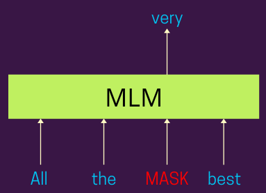

## Table of Contents

## What is a Masked Language Model in machine learning?

A Masked Language Model (MLM) is a type of model used in machine learning, especially in natural language processing. It works by hiding or "masking" some words in a sentence and then trying to predict what those hidden words are. This helps the model learn the context and relationships between words. For example, if you have the sentence "I love to eat pizza and ___," the model would try to guess the missing word based on the surrounding words.

MLMs are often used in models like BERT (Bidirectional Encoder Representations from Transformers). These models look at the words before and after the masked word to make their predictions. This bidirectional approach makes the model very good at understanding the full context of a sentence. By training on lots of text data with masked words, the model gets better at predicting and understanding language, which can be useful for tasks like text generation, translation, and answering questions.

## How does a Masked Language Model work?

A Masked Language Model works by taking a sentence and hiding some of its words. It then tries to guess what the hidden words are by looking at the words that come before and after them. For example, if you have the sentence "I like to eat ___ and drink water," the model will try to fill in the blank. It does this by understanding the context of the whole sentence. This helps the model learn how words relate to each other and how they are used in different situations.

In practice, a Masked Language Model uses a technique called "masking" where a special token, often [MASK], is used to replace the hidden words. The model then processes the sentence with the [MASK] tokens and predicts what word should go in each masked spot. This is done using a [neural network](/wiki/neural-network) that has been trained on a large amount of text data. By repeatedly doing this on many sentences, the model gets better at understanding and predicting language, which can be very useful for tasks like completing sentences, translating languages, or answering questions.

## What is the purpose of masking in language models?

The purpose of masking in language models is to help the model learn how words relate to each other. By hiding some words in a sentence and asking the model to guess what they are, the model gets better at understanding the context of the whole sentence. For example, if the sentence is "I like to eat [MASK] and drink water," the model will try to figure out what word fits in the [MASK] spot by looking at the words around it.

Masking also makes the model more versatile. It can be used for many different tasks, like completing sentences, translating languages, or answering questions. By training on lots of sentences with masked words, the model learns to predict and understand language better. This makes it very useful in real-world applications where understanding the full context of text is important.

## Can you explain the concept of BERT and its relation to Masked Language Models?

BERT, which stands for Bidirectional Encoder Representations from Transformers, is a type of language model that uses the idea of Masked Language Models. BERT works by looking at all the words in a sentence at the same time, both the words that come before and after a certain word. This is different from older models that only looked at the words that came before. In BERT, some words in a sentence are hidden or "masked," and the model tries to guess what these hidden words are. For example, if you have the sentence "I like to eat [MASK] and drink water," BERT will try to figure out what word fits in the [MASK] spot by looking at all the other words in the sentence.

The use of Masked Language Models in BERT helps it understand the full context of a sentence better. By training on lots of sentences with masked words, BERT learns how words relate to each other and how they are used in different situations. This makes BERT very good at tasks like completing sentences, answering questions, and even translating languages. The idea of masking in BERT is what makes it so powerful and useful in understanding and working with human language.

## What are the key differences between Masked Language Models and traditional language models?

Masked Language Models and traditional language models differ mainly in how they process and understand text. Traditional language models, like those used in earlier neural networks, predict the next word in a sequence by looking only at the words that come before it. This means they process text from left to right and do not consider the words that come after the word they are trying to predict. For example, if the sentence is "I like to eat pizza and drink water," a traditional model would predict "drink" based only on "I like to eat pizza and."

In contrast, Masked Language Models, like those used in BERT, take a different approach by hiding or "masking" some words in a sentence and then trying to guess what those hidden words are. They look at the words that come both before and after the masked word, which allows them to understand the full context of the sentence. Using the same example, "I like to eat [MASK] and drink water," a Masked Language Model would predict the word in the [MASK] spot by considering all the other words in the sentence. This bidirectional approach makes Masked Language Models better at understanding and working with language in a more nuanced way.

## How is training data prepared for a Masked Language Model?

To prepare training data for a Masked Language Model, you start with a large collection of text, like [books](/wiki/algo-trading-books), articles, or websites. You then break this text into smaller pieces, usually sentences or short paragraphs. Next, you randomly choose some words in each piece of text to hide or "mask." You replace these words with a special token, often written as [MASK]. For example, if you have the sentence "I like to eat pizza and drink water," you might mask it to become "I like to eat [MASK] and drink water." This process is repeated across all the text in your collection, creating a dataset where some words are hidden.

Once you have your masked dataset, you use it to train the model. During training, the model sees the sentences with the [MASK] tokens and tries to guess what the hidden words are. It does this by looking at the words that come before and after the [MASK] token. The model learns from its guesses, getting better at predicting the right words over time. This process helps the model understand how words relate to each other and how they are used in different contexts. By training on a lot of masked text, the model becomes good at understanding and working with language.

## What are some common applications of Masked Language Models?

Masked Language Models are used in many ways to help with understanding and working with language. One common use is in completing sentences or filling in missing words. For example, if you have a sentence like "I like to eat [MASK] and drink water," a Masked Language Model can guess that the missing word might be "pizza" or "sandwich." This is helpful for things like auto-complete features on your phone or computer, where the device tries to guess what you are going to type next.

Another important use of Masked Language Models is in answering questions. If you ask a model a question like "What is the capital of France?", it can use its understanding of language to find the right answer, which is "Paris." This is useful in search engines or virtual assistants, where you need quick and accurate answers to your questions. Masked Language Models also help with translating languages, making it easier to understand text in different languages by figuring out the context and meaning of words.

## What metrics are used to evaluate the performance of Masked Language Models?

To evaluate how well a Masked Language Model works, people often use a metric called accuracy. This means checking how often the model guesses the right word for the masked spots in a sentence. For example, if the model is given the sentence "I like to eat [MASK] and drink water" and it guesses "pizza" correctly, that counts as a correct guess. Accuracy is a simple way to see if the model is good at understanding the context of words and predicting what should go in the blank spots.

Another important metric is perplexity. Perplexity measures how well the model predicts a sequence of words. A lower perplexity score means the model is better at guessing what comes next in a sentence. If the model has a low perplexity, it means it understands the language better and can make more accurate predictions. Both accuracy and perplexity help people understand how well a Masked Language Model is doing its job of understanding and working with language.

## How do Masked Language Models handle out-of-vocabulary words?

Masked Language Models handle out-of-vocabulary words by using a special token called [UNK] for words they don't know. When the model sees a word it hasn't seen before, it replaces that word with [UNK]. This helps the model keep working even when it comes across new words. For example, if the sentence is "I like to eat [MASK] and drink kombucha," and the model doesn't know "kombucha," it might predict [UNK] for that spot. This way, the model can still try to understand the rest of the sentence and make a guess based on the context.

To get better at handling out-of-vocabulary words, Masked Language Models can be trained on more text data. The more text the model sees, the more words it learns. This means it's less likely to come across words it doesn't know. Also, some models use subword tokenization, which breaks words into smaller parts. This helps the model understand new words by recognizing parts of them that it has seen before. For example, if the model knows "com" and "bucha," it might be able to guess "kombucha" even if it hasn't seen the whole word before.

## What are the challenges faced when scaling Masked Language Models?

Scaling Masked Language Models can be tough because they need a lot of computer power. When you make these models bigger, they need more memory and faster processors to work well. This means you might need special hardware like GPUs or TPUs to train them. Also, the more data you use to train the model, the longer it takes. This can make it hard to keep up with the costs and time needed to make the model better.

Another challenge is making sure the model works well even when it gets bigger. Sometimes, when you scale up a model, it can start to make more mistakes or take longer to learn new things. This is called overfitting, where the model gets too good at the training data but not as good at new data. To fix this, you need to find the right balance between the size of the model and the amount of data you use. This can take a lot of trial and error, which adds to the time and effort needed to scale the model.

## How can Masked Language Models be fine-tuned for specific tasks?

To fine-tune a Masked Language Model for a specific task, you start by taking a pre-trained model and training it more on data that is related to your task. For example, if you want the model to be good at answering questions, you would use a lot of question-answer pairs to train it. This helps the model learn the patterns and language used in your specific task. You do this by adding a new layer on top of the pre-trained model that is designed for your task, like a layer that predicts the answer to a question.

During fine-tuning, you adjust the model's weights to make it better at the new task. This means you are changing the model a little bit to make it more focused on what you want it to do. You might use a smaller learning rate to make these changes slowly and carefully. By doing this, the model can use what it already knows about language to get better at the specific thing you want it to do, like answering questions or translating text.

## What are the latest advancements in Masked Language Model research?

Recent advancements in Masked Language Model research have focused on making these models more efficient and effective. One key development is the use of sparse attention mechanisms, which help the model pay attention to only the most important parts of the text. This makes the model faster and less demanding on computer resources. Another advancement is the use of better pre-training tasks. For example, researchers have started using tasks that involve understanding the relationships between sentences, not just individual words. This helps the model understand the bigger picture and improves its performance on tasks like answering questions or summarizing text.

Another exciting area of research is the development of multilingual Masked Language Models. These models are trained on text from many different languages at the same time. This allows them to understand and work with multiple languages better. For example, a model like mBERT (multilingual BERT) can be used to translate text or answer questions in several languages. Researchers are also working on making these models smaller without losing their effectiveness. This is important because it makes the models easier to use on devices with limited resources, like smartphones. By focusing on these areas, researchers are making Masked Language Models more useful and accessible for everyone.