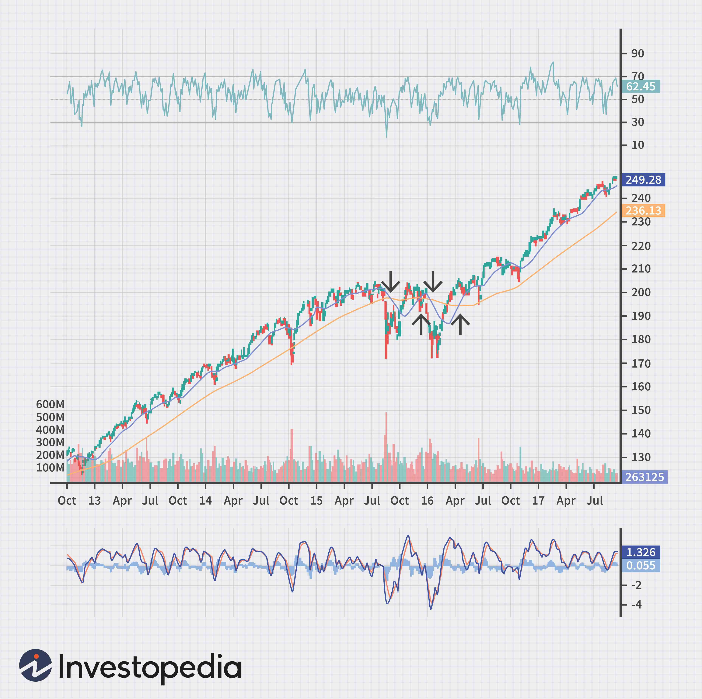

The modern financial market offers a diverse range of tools and techniques tailored for traders aiming to exploit trends and movements within the markets. Among these instruments is the Mass Index, a technical indicator acclaimed for its proficiency in identifying potential trend reversals. Introduced by technical analyst Donald Dorsey in the early 1990s, the Mass Index serves as an analytical tool to scrutinize fluctuations in the price range of a security. Instead of focusing on price changes or momentum, the Mass Index centers on the expansion and contraction of the range between high and low prices over a specific period.

This indicator does not provide directional bias but rather signals possible reversals that necessitate further analysis with additional tools. Its unique approach emphasizes the examination of volatility and how it affects market dynamics, making it a worthwhile component in a trader’s toolkit. This article will examine the Mass Index's essential elements, including how it is calculated, its application in various trading contexts, advantages, limitations, and its integration into algorithmic trading systems.



## Table of Contents

## Understanding the Mass Index

The Mass Index is a technical indicator used primarily to gauge potential trend reversals by examining changes within the trading range of a financial asset. It focuses specifically on the price range between the highest and lowest prices over a set period. Unlike other indicators that provide directional signals, the Mass Index is designed to highlight possible trend reversals without indicating whether the market will move up or down.

The fundamental mechanism behind the Mass Index is its ability to detect expansions and contractions in trading ranges. This is achieved by calculating the difference between the high and low prices over a given timeframe and smoothing these values using an Exponential Moving Average (EMA). The Mass Index becomes particularly insightful when combined with other indicators that can complement its non-directional nature by providing information on the likely direction of a trend change.

Traders often utilize the Mass Index alongside indicators like the Moving Average Convergence Divergence (MACD) or the Relative Strength Index (RSI) to form a more nuanced and comprehensive trading strategy. By doing so, they not only detect potential reversals but also gain insights into the strength and direction of those reversals. Thus, while the Mass Index may not stand alone in offering a complete solution for market analysis, it fits effectively within a broader analytical framework, providing early signals about possible shifts in market dynamics.

## Calculation of the Mass Index

The Mass Index is calculated using a specific methodology that focuses on the price range variability of a financial asset. The primary formula involved is:

$$
\text{Mass Index} = \sum_{i=1}^{25} \left( \frac{\text{EMA}_{9}(\text{High}_i - \text{Low}_i)}{\text{EMA}_{9}(\text{EMA}_{9}(\text{High}_i - \text{Low}_i))} \right)
$$

Where:

- $\text{EMA}_{9}$ stands for the 9-day Exponential Moving Average.
- $\text{High}_i$ and $\text{Low}_i$ denote the high and low prices for a given day $i$.

The process begins by calculating the daily price range difference between the high and low prices for a security. The 9-day EMA is then applied to this difference to smooth out the data and highlight trends more distinctly. Subsequently, a second 9-day EMA is computed on the already smoothed data, which further refines the price action analysis.

Having two successive EMA calculations serves to mitigate the noise present in market data, ultimately producing a clearer indication of market [volatility](/wiki/volatility-trading-strategies) changes. The final Mass Index value is derived by summing these values over a 25-day period. This results in a cumulative indicator that traders watch closely for specific threshold values.

Traders observe when the Mass Index surpasses the level of 27, known as a "bulge", which may presage potential trend reversals. Conversely, a drop below 26.5 might also indicate an imminent shift in trends. This specific aspect of the Mass Index aids traders in anticipating market dynamics, allowing them to prepare for probable changes in market direction.

In essence, the Mass Index's reliance on EMA allows it to smooth the fluctuations and provide a clearer representation of market conditions, thereby serving as a critical component in the toolkit of many financial analysts and traders.

## Using the Mass Index in Algorithmic Trading

Algorithmic trading leverages computer programs to execute trades based on pre-defined criteria, allowing for a systematic approach to managing financial portfolios. The Mass Index is a valuable tool within this framework because it provides insights into market volatility and potential trend reversals. 

The Mass Index operates by examining the relationship between the price range and its exponential moving averages (EMAs). This ability to highlight changes in price volatility makes it an ideal component of algorithmic strategies designed to predict and react to market shifts. To enhance its effectiveness, traders often integrate the Mass Index with other technical indicators like the Moving Average Convergence Divergence (MACD) or the Relative Strength Index (RSI). These additional indicators offer directional cues, complementing the reversal signals provided by the Mass Index and allowing for more informed trading decisions.

When incorporating the Mass Index into [algorithmic trading](/wiki/algorithmic-trading) systems, consider employing the following Python code as a foundational structure. This code calculates the Mass Index and can be integrated into a broader trading strategy:

```python
import pandas as pd

def calculate_ema(data, window):
    return data.ewm(span=window, adjust=False).mean()

def calculate_mass_index(high, low, ema_window=9, period=25):
    hl_range = high - low
    ema1 = calculate_ema(hl_range, ema_window)
    ema2 = calculate_ema(ema1, ema_window)
    mass_index = ema1 / ema2

    mass_index_sum = mass_index.rolling(window=period).sum()
    return mass_index_sum

# Example usage
data = pd.DataFrame({
    'high': [130, 132, 135, 138, 140],  # example high prices
    'low': [128, 129, 134, 136, 138]  # example low prices
})

mass_index_series = calculate_mass_index(data['high'], data['low'])
print(mass_index_series)
```

Adjusting the sensitivity of the Mass Index can be achieved by altering the EMA periods. This customization allows traders to tune the indicator to match different trading strategies and market conditions, providing flexibility in their algorithmic trading systems. For instance, a shorter EMA period might make the Mass Index more responsive to rapid market changes, suitable for high-frequency trading environments. Conversely, a longer EMA period could smooth out fluctuations, making the indicator more appropriate for long-term investment strategies. 

Ultimately, the implementation of the Mass Index in algorithmic trading reflects its adaptability and utility across various trading contexts, enhancing the robustness of trading algorithms.

## Advantages of the Mass Index

The Mass Index is a technical analysis tool valued for its ability to alert traders to potential trend reversals, allowing them to make informed and proactive trading decisions. At its core, the Mass Index provides early warning signals by analyzing the expansion and contraction of a security's price range. This distinct feature allows traders to anticipate shifts in market dynamics before they become evident in price movements alone.

One significant advantage of the Mass Index is its market-neutral nature. Unlike many [momentum](/wiki/momentum)-based indicators which may perform optimally only within specific market conditions such as trending markets, the Mass Index functions effectively in both trending and ranging markets. This balanced approach allows traders to utilize the Mass Index across a broad spectrum of market conditions without the need to frequently adjust their strategies based solely on market trends.

Another strength of the Mass Index lies in its ability to be combined with other technical analysis tools to enhance the robustness of a trading strategy. When used alongside other indicators such as the Moving Average Convergence Divergence (MACD) or the Relative Strength Index (RSI), the Mass Index can provide a more comprehensive overview of market behavior. This integrative approach is particularly useful in complex markets like stocks, [forex](/wiki/forex-system), and commodities, where relying on a singular indicator may not provide sufficiently accurate insights.

Moreover, the Mass Index can be customized to suit various trading strategies by adjusting its sensitivity. Traders can alter the periods of the Exponential Moving Averages (EMA) used in its calculation to either smooth out the indicator for long-term trading approaches or make it more sensitive to short-term fluctuations. This adaptability makes the Mass Index a valuable tool for both long-term investors and short-term traders. 

Overall, the Mass Index adds significant value to technical analysis frameworks, offering a versatile and insightful option for traders aiming to preemptively spot trend reversals while maintaining a robust trading strategy.

## Limitations of the Mass Index

While the Mass Index is a valuable tool for traders aiming to identify potential trend reversals, it has certain limitations that must be acknowledged to use it effectively. One significant limitation is that the Mass Index does not provide directional cues. This means that while it can alert traders to the possibility of a trend reversal, it does not indicate whether the new trend will be bullish or bearish. Consequently, traders often need to rely on additional indicators, such as the Moving Average Convergence Divergence (MACD) or the Relative Strength Index (RSI), to confirm the direction of the potential trend change.

In highly volatile markets, the Mass Index is prone to generating false signals. This can occur because extreme price movements can cause the indicator to trigger a signal even when there is no genuine trend reversal. Therefore, it is crucial for traders to employ careful analytical techniques and possibly combine the Mass Index with other tools to mitigate the risk of making erroneous trading decisions based on these false signals.

Additionally, the Mass Index's reliance on historical price data means its predictions can sometimes be inaccurate, particularly in situations driven by unprecedented market events. Events such as economic crises, geopolitical tensions, or natural disasters can cause market conditions to deviate significantly from historical patterns, thus reducing the efficacy of indicators like the Mass Index that depend on past price fluctuations. Given this dependency, traders should consider incorporating [fundamental analysis](/wiki/fundamental-analysis) and staying informed about macroeconomic developments to complement their technical indicators.

In summary, while the Mass Index can be a powerful component of a trader’s toolkit, awareness of its limitations is essential for effective application. It is most beneficial when used in conjunction with other technical indicators and a comprehensive understanding of market conditions.

## Conclusion

The Mass Index serves as a potent instrument for traders aiming to detect shifts in market dynamics linked to price range fluctuations. This technical indicator excels in highlighting potential trend reversals by examining shifts in the trading range, providing actionable insights into market behavior. Its core utility lies in its ability to signal when the price range is undergoing significant contraction or expansion, which often precedes a reversal in the existing trend.

Despite its robustness, the Mass Index inherently has limitations, most notably its lack of directional signals. This means that while it can alert traders to the likelihood of a forthcoming trend reversal, it does not suggest the direction of the impending move. Consequently, its effectiveness is often maximized when used in conjunction with other technical indicators such as the Moving Average Convergence Divergence (MACD) or the Relative Strength Index (RSI). These complementary tools can provide directional cues, reinforcing the market signals indicated by the Mass Index.

Moreover, the adaptability of the Mass Index across a wide spectrum of trading scenarios enhances its value for financial analysts. Its versatility allows it to function effectively across diverse markets, including stocks, forex, and commodities. By adjusting the sensitivity of its parameters, traders can tailor the Mass Index to different trading environments, further cementing its applicability across varying market conditions.

Ultimately, the optimal application of the Mass Index arises from its integration with other tools of technical analysis. This strategy ensures a comprehensive perspective, enabling traders to make informed and balanced decisions. By incorporating additional indicators to confirm its signals, traders can mitigate the risk of false alarms and enhance the accuracy of their trading strategies. The Mass Index remains an invaluable component of the technical analyst's toolkit, offering insights that are crucial for navigating the complexities of modern financial markets.

## References & Further Reading

[1]: Dorsey, Donald. (1992). "The Mass Index." Technical Analysis of Stocks & Commodities Magazine, June 1992.

[2]: Pring, Martin J. (2014). ["Technical Analysis Explained: The Successful Investor's Guide to Spotting Investment Trends and Turning Points."](https://www.amazon.com/Technical-Analysis-Explained-Fifth-Successful/dp/0071825177) McGraw-Hill Education.

[3]: Kirkpatrick II, Charles D. & Dahlquist, Julie R. (2010). ["Technical Analysis: The Complete Resource for Financial Market Technicians."](https://www.amazon.com/Technical-Analysis-Complete-Financial-Technicians/dp/0134137043) FT Press.

[4]: Achelis, Steven B. (2000). ["Technical Analysis from A to Z."](https://www.mhebooklibrary.com/doi/book/10.1036/9780071380119) McGraw-Hill.

[5]: Murphy, John J. (1999). ["Technical Analysis of the Financial Markets: A Comprehensive Guide to Trading Methods and Applications."](https://archive.org/details/technicalanalysi0000murp) New York Institute of Finance.