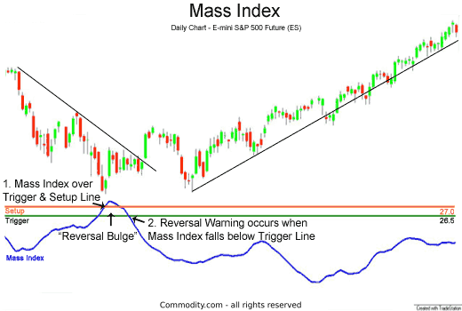

## Table of Contents

## What is the Mass Index in technical analysis?

The Mass Index is a technical analysis tool used to predict trend reversals in the stock market. It was developed by Donald Dorsey in the 1990s. The Mass Index works by measuring the range between high and low prices over a period of time. It focuses on the changes in the trading range to spot potential reversals. When the Mass Index reaches certain levels, it suggests that the market might be about to change direction.

To calculate the Mass Index, you first find the high-low range for each day. Then, you use a 9-day exponential moving average (EMA) of this range. After that, you take a 9-day EMA of the first EMA. The Mass Index is the ratio of the first EMA to the second EMA, summed over 25 periods. If the Mass Index goes above 27 and then drops below 26.5, it is considered a signal that a reversal might be coming. Traders use this signal to decide when to buy or sell, trying to take advantage of the expected change in market direction.

## How is the Mass Index calculated?

To calculate the Mass Index, you start by finding the difference between the highest and lowest price for each day. This gives you the daily high-low range. Next, you calculate a 9-day exponential moving average (EMA) of these daily ranges. An exponential moving average gives more weight to recent data, making it sensitive to new information.

After getting the first 9-day EMA, you calculate another 9-day EMA, but this time it's of the first EMA. This second EMA smooths out the data even more. Finally, you find the ratio of the first EMA to the second EMA and add these ratios up over 25 periods. If this total, the Mass Index, goes above 27 and then falls below 26.5, it suggests that the market might reverse soon.

## What is the significance of the 9-day and 25-day periods in the Mass Index?

The 9-day period used in the Mass Index helps to focus on recent price movements. By using a 9-day exponential moving average (EMA) of the daily high-low range, the Mass Index can quickly pick up changes in how much the price is moving each day. This makes it good at spotting when the market might be getting ready for a big change. The 9-day EMA is used twice in the calculation to smooth out the data even more, making the Mass Index a reliable tool for traders.

The 25-day period is used to add up the ratios of the two 9-day EMAs. This longer period helps to get a broader view of the market's behavior over time. When the total of these ratios, the Mass Index, goes above 27 and then drops below 26.5, it signals that the market might be about to reverse. Using a 25-day period makes sure that the Mass Index is looking at enough data to give a good signal, but not so much that it misses important changes.

## How can the Mass Index help identify potential reversals in the market?

The Mass Index helps spot when the market might change direction by looking at how much the price moves each day. It does this by calculating a special number that shows if the price is moving a lot or a little. When this number, the Mass Index, gets really high and then starts to drop, it could mean the market is about to turn around. Traders watch for the Mass Index to go above 27 and then fall below 26.5 because this often happens right before the market changes direction.

This tool is useful because it focuses on the size of price movements over time. By using a 9-day moving average twice and then adding these up over 25 days, the Mass Index can catch when the market is getting ready for a big shift. When traders see the Mass Index signal a potential reversal, they might decide to buy or sell their stocks to take advantage of the expected change in the market's direction.

## What is considered a bullish or bearish signal using the Mass Index?

A bullish signal using the Mass Index happens when the index goes above 27 and then falls below 26.5. This means the market might be getting ready to go up. Traders see this as a good time to buy stocks because they think the price will start to rise soon.

A bearish signal with the Mass Index is the same pattern but means the opposite. If the Mass Index goes above 27 and then drops below 26.5, it could mean the market is about to go down. Traders might sell their stocks when they see this signal because they think the price will start to fall soon.

## Can you explain the concept of 'range' in the context of the Mass Index?

In the Mass Index, the 'range' means the difference between the highest and lowest price of a stock on a single day. It shows how much the price moved that day. The Mass Index uses this daily range to see if the price is moving a lot or a little over time.

The Mass Index takes the daily range and calculates a special number from it. This number helps traders know when the market might change direction. If the range gets bigger and then smaller in a certain way, the Mass Index can tell traders that it might be time to buy or sell their stocks.

## How does the Mass Index differ from other volatility indicators like the Average True Range (ATR)?

The Mass Index and the Average True Range (ATR) both look at how much prices move, but they do it in different ways. The Mass Index focuses on the difference between the highest and lowest prices each day. It uses this daily range to spot when the market might change direction. It does this by calculating a special number that goes up when the price moves a lot and then falls when it doesn't. If this number goes above 27 and then drops below 26.5, it might mean the market is about to turn around.

The Average True Range (ATR) is simpler. It measures how much the price moves from one day to the next, including any gaps in price. The ATR gives you a number that shows how big the price changes are over a set number of days, usually 14. It doesn't try to predict when the market will change direction like the Mass Index does. Instead, it just tells you how much the price is moving, which can help traders decide how risky a stock might be.

## What are the common pitfalls or misinterpretations when using the Mass Index?

One common pitfall when using the Mass Index is relying on it too much. The Mass Index can give signals that the market might change direction, but it's not always right. If traders only use the Mass Index and don't look at other things like the overall market trend or other indicators, they might make bad trades. It's important to use the Mass Index along with other tools to get a better picture of what might happen next in the market.

Another common misinterpretation is not understanding what the numbers mean. The Mass Index uses a special calculation to come up with its numbers. If traders don't know how it works, they might think the numbers mean something they don't. For example, just because the Mass Index goes above 27 and then below 26.5 doesn't always mean the market will definitely change direction. Traders need to know that the Mass Index is just one tool and it can give false signals sometimes.

## How can the Mass Index be used in conjunction with other technical indicators for better trading decisions?

The Mass Index can be a helpful tool for traders, but it works even better when used with other technical indicators. For example, traders often use the Mass Index with trend indicators like moving averages. If the Mass Index signals a potential reversal and the price is also moving away from a moving average, it can give traders more confidence that a real change in direction might be coming. This way, the Mass Index helps confirm what other indicators are showing, making the trading decision more reliable.

Another way to use the Mass Index with other tools is to combine it with [momentum](/wiki/momentum) indicators like the Relative Strength Index (RSI). The RSI measures how fast the price is moving and can show if a stock is overbought or oversold. If the Mass Index suggests a reversal and the RSI is also showing extreme conditions, this can be a strong signal for traders. By looking at both the Mass Index and the RSI, traders can get a clearer picture of when to buy or sell, helping them make better trading decisions.

## What are some real-world examples where the Mass Index successfully predicted market movements?

In early 2018, the Mass Index was used by traders to predict a major reversal in the stock market. The index went above 27 and then dropped below 26.5 in late January. This signal came right before a big drop in the S&P 500. Traders who saw the Mass Index signal sold their stocks before the market went down, helping them avoid losses.

Another time, in mid-2020, the Mass Index signaled a bullish reversal for a tech stock. The index hit the high of 27 and then fell below 26.5 in June. After this signal, the stock's price started to go up. Traders who bought the stock after seeing the Mass Index signal made good profits as the price kept rising for the next few weeks.

## How can traders adjust the parameters of the Mass Index to suit different market conditions or trading styles?

Traders can change the numbers used in the Mass Index to make it work better for different markets or how they like to trade. Instead of using the usual 9-day and 25-day periods, they might try different numbers. For example, if the market is moving fast, a shorter period like a 5-day EMA might catch changes quicker. If the market is moving slowly, a longer period like a 12-day EMA might be better to see the bigger picture. Traders can also change the 25-day period to something like 20 or 30 days to see if it gives better signals for their trading style.

It's important for traders to test these changes to see if they work better. They can do this by looking at past data to see how the Mass Index would have worked with different numbers. This is called [backtesting](/wiki/backtesting). By trying different settings, traders can find the best way to use the Mass Index for their own trading. This helps them make better decisions and maybe make more money in the market.

## What advanced strategies can be developed using the Mass Index for algorithmic trading?

Traders can use the Mass Index in [algorithmic trading](/wiki/algorithmic-trading) by making computer programs that watch the Mass Index and other indicators. These programs can be set up to buy or sell stocks when the Mass Index goes above 27 and then drops below 26.5. The programs can also look at other things like moving averages or the Relative Strength Index (RSI) at the same time. This helps make sure the signal from the Mass Index is strong and more likely to be right. Traders can change the numbers used in the Mass Index to make it work better for the stocks they are trading or the way the market is moving.

Another advanced strategy is to use the Mass Index with [machine learning](/wiki/machine-learning). Traders can teach a computer to look at past data and see how the Mass Index and other indicators worked together. The computer can learn to find patterns that are hard for people to see. Then, it can use these patterns to decide when to buy or sell stocks. This can help traders make better decisions faster than they could on their own. By using the Mass Index along with smart computer programs, traders can try to make more money in the market.

## How is the Mass Index Calculated?

The Mass Index is calculated using a specific methodology that focuses on the price range variability of a financial asset. The primary formula involved is:

$$
\text{Mass Index} = \sum_{i=1}^{25} \left( \frac{\text{EMA}_{9}(\text{High}_i - \text{Low}_i)}{\text{EMA}_{9}(\text{EMA}_{9}(\text{High}_i - \text{Low}_i))} \right)
$$

Where:

- $\text{EMA}_{9}$ stands for the 9-day Exponential Moving Average.
- $\text{High}_i$ and $\text{Low}_i$ denote the high and low prices for a given day $i$.

The process begins by calculating the daily price range difference between the high and low prices for a security. The 9-day EMA is then applied to this difference to smooth out the data and highlight trends more distinctly. Subsequently, a second 9-day EMA is computed on the already smoothed data, which further refines the price action analysis.

Having two successive EMA calculations serves to mitigate the noise present in market data, ultimately producing a clearer indication of market [volatility](/wiki/volatility-trading-strategies) changes. The final Mass Index value is derived by summing these values over a 25-day period. This results in a cumulative indicator that traders watch closely for specific threshold values.

Traders observe when the Mass Index surpasses the level of 27, known as a "bulge", which may presage potential trend reversals. Conversely, a drop below 26.5 might also indicate an imminent shift in trends. This specific aspect of the Mass Index aids traders in anticipating market dynamics, allowing them to prepare for probable changes in market direction.

In essence, the Mass Index's reliance on EMA allows it to smooth the fluctuations and provide a clearer representation of market conditions, thereby serving as a critical component in the toolkit of many financial analysts and traders.

## References & Further Reading

[1]: Dorsey, Donald. (1992). "The Mass Index." Technical Analysis of Stocks & Commodities Magazine, June 1992.

[2]: Pring, Martin J. (2014). ["Technical Analysis Explained: The Successful Investor's Guide to Spotting Investment Trends and Turning Points."](https://www.amazon.com/Technical-Analysis-Explained-Fifth-Successful/dp/0071825177) McGraw-Hill Education.

[3]: Kirkpatrick II, Charles D. & Dahlquist, Julie R. (2010). ["Technical Analysis: The Complete Resource for Financial Market Technicians."](https://www.amazon.com/Technical-Analysis-Complete-Financial-Technicians/dp/0134137043) FT Press.

[4]: Achelis, Steven B. (2000). ["Technical Analysis from A to Z."](https://www.mhebooklibrary.com/doi/book/10.1036/9780071380119) McGraw-Hill.

[5]: Murphy, John J. (1999). ["Technical Analysis of the Financial Markets: A Comprehensive Guide to Trading Methods and Applications."](https://archive.org/details/technicalanalysi0000murp) New York Institute of Finance.