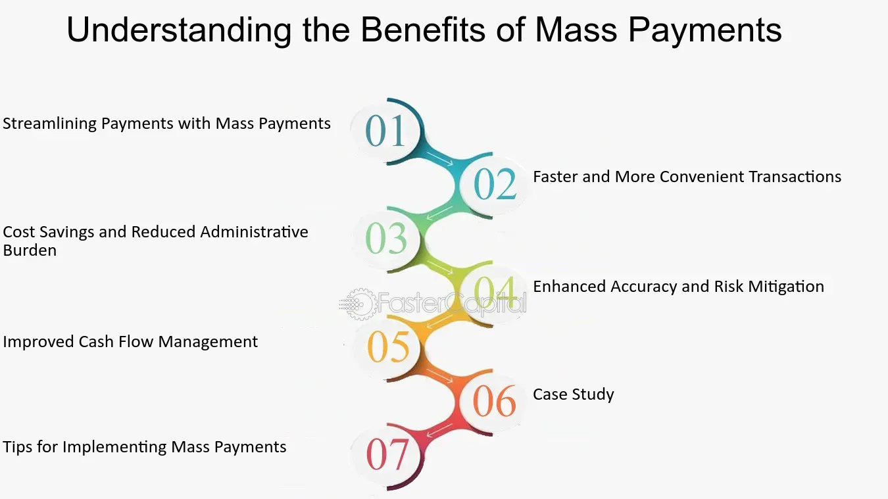

## Table of Contents

## What is a mass payment system?

A mass payment system is a way for businesses or organizations to send money to many people at the same time. It's useful for things like paying freelancers, distributing refunds, or sending out dividends. Instead of sending payments one by one, which can take a lot of time, a mass payment system lets you do it all at once, making the process faster and easier.

These systems usually work through online platforms or software. You can upload a list of people and how much money each person should get. The system then handles the payments automatically, often using methods like bank transfers or digital wallets. This can save a lot of time and reduce errors that might happen when doing payments manually.

## How does a mass payment system work?

A mass payment system lets you send money to many people at the same time. It's like sending out a bunch of payments all at once instead of one by one. You start by uploading a list of people who need to get paid and how much each person should get. This list can be in a file like a spreadsheet. The system then takes this information and processes all the payments automatically.

Once the system has the list, it sends out the money using methods like bank transfers or digital wallets. This makes things faster and easier because you don't have to do each payment by hand. It also helps cut down on mistakes that can happen when you're doing a lot of payments manually. After the payments are sent, you usually get a report that shows all the payments that were made, so you can keep track of everything.

## What are the common uses of mass payment systems?

Mass payment systems are often used by businesses to pay a lot of people at the same time. For example, companies that hire freelancers or contractors use these systems to send payments to all their workers quickly. It's also common for businesses to use mass payment systems to give refunds to many customers at once. This can happen if there's a big sale or if a product needs to be recalled.

Another common use is for organizations that need to distribute money to members or participants. For instance, non-profits might use mass payment systems to send out grants or donations to many people. Also, companies that have shareholders can use these systems to pay dividends to all their investors at the same time. This makes the process much easier and faster than sending out individual payments.

## What are the benefits of using mass payment systems for businesses?

Using mass payment systems can save businesses a lot of time. Instead of sending payments one by one, which can take hours or even days, a business can send out hundreds or thousands of payments all at once. This means less time spent on paperwork and more time to focus on other important tasks. It also helps to make sure that everyone gets paid on time, which can make employees and contractors happier and more loyal.

Another big benefit is that mass payment systems can cut down on mistakes. When payments are done by hand, it's easy to make errors like typing in the wrong amount or sending money to the wrong person. A mass payment system does everything automatically, which means fewer mistakes. Plus, these systems usually come with reports that show all the payments that were made, so businesses can keep good records and check everything easily.

## What are the different types of mass payment systems available?

There are a few different types of mass payment systems that businesses can use. One type is bank-based mass payment systems. These systems work by sending money directly from a business's bank account to the bank accounts of many people at the same time. They are often used for things like paying employees or sending out refunds. Another type is digital wallet-based systems. These systems use apps or online platforms to send money to people's digital wallets, like PayPal or Venmo. They are good for businesses that work with freelancers or need to send money quickly.

Another type of mass payment system is card-based systems. These systems let businesses send money to people's debit or credit cards. This can be useful for businesses that want to give out rewards or bonuses to a lot of people at once. Lastly, there are specialized mass payment platforms. These are software or online services that are made just for sending out a lot of payments. They can handle different payment methods like bank transfers, digital wallets, and cards all in one place. These platforms are often used by big companies or organizations that need to send out payments to a lot of people regularly.

## How do mass payment systems ensure security and compliance?

Mass payment systems use different ways to keep money safe and follow the rules. They use strong security measures like encryption to protect the information about payments. This means that the details of who is getting paid and how much they are getting are kept secret and safe from hackers. They also use things like two-[factor](/wiki/factor-investing) authentication, which means you need more than just a password to get into the system. This makes it harder for someone who shouldn't be there to get in. Plus, these systems keep a close eye on all the payments to spot anything that looks strange or wrong, which helps stop fraud before it happens.

To make sure they follow the rules, mass payment systems have to meet a lot of different laws and rules about sending money. They do this by keeping good records of all the payments they send out. This helps them show that they are doing things the right way if someone asks. They also have to follow rules about things like anti-money laundering and know-your-customer, which means they have to check who they are sending money to and make sure it's not being used for anything bad. By doing all these things, mass payment systems can keep money safe and make sure they are doing everything by the book.

## What are the costs associated with implementing a mass payment system?

Using a mass payment system can have different costs. One big cost is the fee you have to pay to use the system. Different systems might charge different amounts, but usually, you pay a fee for each payment you send out. Sometimes, there are also monthly or yearly fees just to use the system. If you are sending a lot of payments, these fees can add up and become a big part of your costs.

Another cost to think about is the time and money you need to set up the system. You might need to buy new software or change the way you do things to make it work with the mass payment system. You might also need to train your staff on how to use it. All of these things can take time and money. But once it's set up, a mass payment system can save you a lot of time and help you avoid mistakes, which can make it worth the cost in the end.

## How can mass payment systems be integrated with existing business software?

Mass payment systems can be linked with the software a business already uses. This is often done through something called an API, which is like a bridge that lets different software talk to each other. For example, if a business uses a payroll system, it can connect to a mass payment system so that payments can be sent out automatically. This means that when the payroll system figures out how much everyone should get paid, it can send that information right to the mass payment system, which then sends out the money without anyone having to do it by hand.

To make this work, a business might need to work with the people who made the mass payment system and their own software. They might need to set up the connection and make sure everything works the way it should. Sometimes, there might be a cost for setting this up, but it can save a lot of time and reduce mistakes in the long run. Once everything is working together, it makes paying a lot of people at the same time much easier and faster.

## What are the key considerations when choosing a mass payment system provider?

When [picking](/wiki/asset-class-picking) a mass payment system provider, it's important to think about a few things. First, you need to look at the fees. Different providers charge different amounts for sending payments, and some might have extra costs like monthly fees. You want to find a system that fits your budget and doesn't cost too much, especially if you're sending out a lot of payments. Another thing to consider is how easy the system is to use. You want something that your team can learn quickly and that won't cause a lot of headaches. Also, think about what payment methods the system supports. Some systems might only work with bank transfers, while others can also use digital wallets or cards. Make sure the system can handle the ways you need to pay people.

Security and compliance are also big deals. You need to make sure the mass payment system keeps your money and information safe. Look for systems that use strong security measures like encryption and two-factor authentication. It's also important that the system follows all the rules about sending money, like anti-money laundering laws. This helps keep you out of trouble and makes sure everything is done the right way. Finally, think about how well the system can work with the software you already use. If it can connect easily with your payroll or accounting systems, it can save you a lot of time and make things run smoother.

## How do mass payment systems handle international transactions and currency conversions?

Mass payment systems make it easier to send money to people in different countries. They can handle international transactions by working with banks and payment networks all over the world. This means you can send payments to people in many different countries without having to use different systems for each one. The system takes care of sending the money to the right place, so you don't have to worry about it.

When it comes to currency conversions, mass payment systems usually do this automatically. If you need to send money to someone in another country and they use a different currency, the system will change your money into their currency for you. They use the current exchange rates to figure out how much money to send. This makes it simpler for you because you don't have to do the conversion yourself, but you should know that there might be fees for changing the currency.

## What are the future trends and innovations in mass payment systems?

In the future, mass payment systems are likely to become even more advanced and user-friendly. One big trend is the use of [artificial intelligence](/wiki/ai-artificial-intelligence) (AI) and [machine learning](/wiki/machine-learning) to make payments faster and more accurate. These technologies can help spot fraud and make sure payments go to the right people. Another trend is the rise of blockchain technology, which can make payments more secure and transparent. Blockchain can also help with international payments by making them faster and cheaper, as it cuts out the need for many middlemen.

Another important innovation is the growth of real-time payments. More and more mass payment systems are working to send money instantly, no matter where in the world it's going. This can be a big help for businesses that need to pay people quickly. Also, as more people use digital wallets and cryptocurrencies, mass payment systems are starting to support these new ways of sending money. This means businesses can pay people in whatever way is easiest for them, making the whole process smoother and more convenient.

## How can businesses measure the effectiveness of their mass payment system?

Businesses can measure the effectiveness of their mass payment system by looking at how fast they can send out payments. If the system can send money to a lot of people quickly, it's working well. They can also check if the payments are accurate and if there are any mistakes. A good system should have very few errors and make sure everyone gets paid the right amount. Another way to measure effectiveness is by seeing how happy their employees or contractors are with the payment process. If people are getting paid on time and without problems, they will be more satisfied.

Another important measure is the cost of using the system. Businesses should compare the fees they pay for the mass payment system to how much time and money it saves them. If the system cuts down on the time spent on payments and reduces mistakes, it might be worth the cost. Finally, businesses can look at how well the system works with their other software, like payroll or accounting programs. If everything connects smoothly and makes the payment process easier, the mass payment system is likely effective.

## References & Further Reading

[1]: Bergstra, J., Bardenet, R., Bengio, Y., & Kégl, B. (2011). ["Algorithms for Hyper-Parameter Optimization."](https://dl.acm.org/doi/10.5555/2986459.2986743) Advances in Neural Information Processing Systems 24.

[2]: ["Advances in Financial Machine Learning"](https://www.amazon.com/Advances-Financial-Machine-Learning-Marcos/dp/1119482089) by Marcos Lopez de Prado

[3]: ["Evidence-Based Technical Analysis: Applying the Scientific Method and Statistical Inference to Trading Signals"](https://www.amazon.com/Evidence-Based-Technical-Analysis-Scientific-Statistical/dp/0470008741) by David Aronson

[4]: ["Machine Learning for Algorithmic Trading"](https://github.com/stefan-jansen/machine-learning-for-trading) by Stefan Jansen

[5]: ["Quantitative Trading: How to Build Your Own Algorithmic Trading Business"](https://www.amazon.com/Quantitative-Trading-Build-Algorithmic-Business/dp/1119800064) by Ernest P. Chan