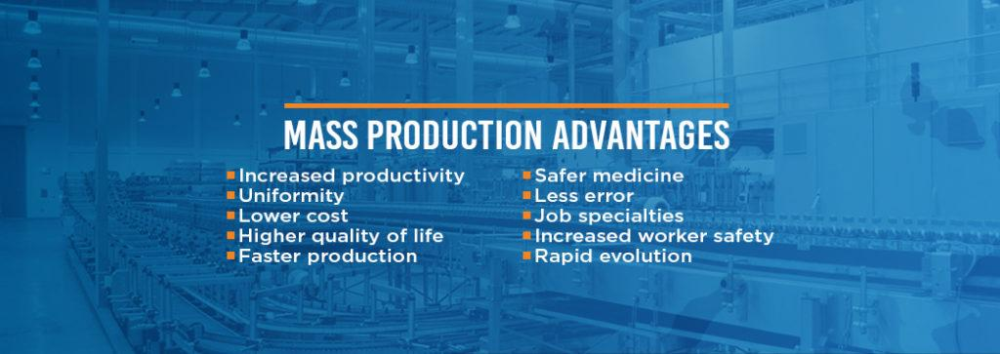

## Table of Contents

## What is mass production?

Mass production is a way of making a lot of the same thing quickly and cheaply. It started in factories during the Industrial Revolution. Instead of people making things one at a time, machines do most of the work. This means that companies can make more products in less time and sell them for less money. A famous example is the assembly line used by Henry Ford to make cars.

In mass production, the work is split into small, simple tasks. Each worker or machine does just one part of the job. This makes the process faster and more efficient. For example, one person might put on the car doors, while another person adds the wheels. By doing this, factories can make thousands of the same product every day. This is why many things we buy, like clothes and electronics, are made this way.

## Can you provide a simple example of mass production?

Imagine a factory that makes pencils. In mass production, the factory uses machines to make lots of pencils quickly. The process starts with big pieces of wood. Machines cut the wood into small pieces, shape them into pencil bodies, and drill a hole down the middle. Then, another machine puts graphite into the hole and glues it in place. After that, a different machine paints the pencils and adds the eraser at the end. This way, the factory can make thousands of pencils every day.

The workers in the factory each have a simple job. One worker might just put the graphite into the pencil bodies, while another worker only paints the pencils. By breaking the job into small tasks, the factory can make pencils faster and cheaper. This is why the pencils you buy at the store are usually made in a factory using mass production.

## What industries commonly use mass production?

Many industries use mass production to make things quickly and cheaply. Some of the most common industries are car manufacturing, electronics, and clothing. Car companies like Ford and Toyota use assembly lines to build thousands of cars every day. Electronics companies make things like smartphones and computers using machines that can put tiny parts together very fast. Clothing companies use machines to cut and sew fabric, making lots of shirts, pants, and other clothes.

Another industry that uses mass production is the food industry. Companies that make packaged foods like cereal, snacks, and drinks use machines to mix, cook, and package their products. This helps them make a lot of food quickly and keep the prices low. Even the toy industry uses mass production. Toy companies make thousands of the same toys, like dolls and action figures, using machines that can mold plastic and put parts together.

## What are the key benefits of mass production for businesses?

Mass production helps businesses make a lot of products quickly. This means they can meet the demand of many customers without waiting too long. When a business can make more products in less time, it can sell them for less money. This makes their products more affordable and helps them sell more. Also, mass production lets businesses use machines to do most of the work, so they don't need as many workers. This saves money on labor costs.

Another big benefit is that mass production makes the quality of products more consistent. When machines do the same task over and over, the products they make are usually very similar. This means that customers know what to expect when they buy something. It also helps businesses keep their customers happy because they can trust that the products will be good every time. Overall, mass production helps businesses save money, sell more products, and keep their customers happy.

## How does mass production affect the cost of goods?

Mass production helps lower the cost of goods by making things faster and using machines instead of people. When a factory can make a lot of the same thing quickly, it doesn't cost as much to make each item. For example, if a factory makes 1,000 pencils in a day, the cost of making each pencil is lower than if it only made 100 pencils. This is because the factory can spread the cost of the machines and materials over more pencils. Also, using machines means the factory doesn't need as many workers, which saves money on salaries.

Lowering the cost of making goods means businesses can sell them for less money. When products are cheaper, more people can afford to buy them. This is good for both the business and the customers. The business can sell more products and make more money, while customers get to buy things at a lower price. So, mass production not only helps businesses save money on making goods, but it also makes those goods more affordable for everyone.

## What are the potential drawbacks of mass production for the environment?

Mass production can harm the environment because it uses a lot of resources. Factories need energy to run machines, and this energy often comes from burning fossil fuels like coal and oil. This releases harmful gases into the air, which can make the air dirty and contribute to climate change. Also, mass production uses a lot of materials, like plastic and metal. These materials come from the earth, and taking them out can damage the land and use up resources that won't come back.

Another problem is that mass production creates a lot of waste. When factories make thousands of the same thing, they often have leftover materials that they throw away. This waste can end up in landfills, where it can pollute the soil and water. Also, some products made through mass production, like plastic toys and packaging, don't break down easily. They can stay in the environment for a long time, causing more pollution. So, while mass production helps make things cheaper and faster, it can also harm the environment in big ways.

## How has mass production impacted employment and labor?

Mass production has changed the way people work. Before mass production, workers made things by hand, one at a time. Now, with mass production, factories use machines to do most of the work. This means fewer people are needed to make things. Some jobs that used to be done by people, like sewing clothes or making cars, are now done by machines. This can make it hard for people to find jobs, especially in places where factories are the main source of work.

On the other hand, mass production has also created new kinds of jobs. While fewer people are needed to make things, more people are needed to run the machines, fix them when they break, and manage the factories. Also, mass production makes things cheaper, so people can buy more things. This can lead to more jobs in other areas, like selling and delivering products. So, while mass production can take away some jobs, it also creates new ones in different areas.

## What role does automation play in mass production?

Automation is a big part of mass production. It means using machines to do jobs that people used to do. In factories, machines can work faster and longer than people. They can do the same thing over and over without getting tired. This helps factories make a lot of things quickly and cheaply. For example, a machine can put parts together on an assembly line much faster than a person can.

Automation also makes things more consistent. When machines do the work, the products they make are usually very similar. This is good for businesses because customers know what to expect when they buy something. But automation can also mean fewer jobs for people. Machines take over jobs that used to be done by workers, like making cars or sewing clothes. This can make it harder for people to find work.

## What are some advanced technologies used in modern mass production?

In modern mass production, one important technology is robotics. Robots can do many jobs that used to be done by people. They can work all day without getting tired and can do tasks very quickly and accurately. For example, robots can weld car parts together or pack products into boxes. This helps factories make things faster and with fewer mistakes. Robots also help keep workers safe by doing dangerous jobs, like working with heavy machinery or handling chemicals.

Another advanced technology is computer numerical control (CNC) machines. These machines use computers to control how they cut, shape, or drill materials. They can make very precise cuts and shapes, which is important for making things like airplane parts or electronic devices. CNC machines can work all the time and make the same thing over and over without changing, which helps keep the quality of products high. This technology saves time and money because it does not need as much human help to work.

3D printing is also becoming more common in mass production. This technology lets factories make complex shapes and parts that would be hard to make with traditional machines. 3D printers build objects layer by layer from materials like plastic or metal. They can be used to make prototypes quickly or to make custom parts for products. This helps businesses make new products faster and with less waste.

## How do companies manage quality control in mass production?

Companies use different ways to make sure the things they make in mass production are good. They use machines and computers to check the products as they are being made. For example, a machine might check if a car part is the right size or if a bottle is filled with the right amount of liquid. People also check the products to make sure they are good. They might look at a sample of products from the factory to see if they meet the company's standards. If something is not right, they can fix it before more bad products are made.

Another way companies keep quality high is by using something called "statistical process control." This means they use math to watch how the machines are working and how the products are turning out. If the numbers show that something is going wrong, they can fix it quickly. This helps them stop bad products from being made. Also, companies often have rules and steps that everyone must follow when making things. This helps make sure that every product is made the same way, so they are all good.

## What are the economic implications of mass production on a global scale?

Mass production has changed the world's economy a lot. It lets companies make things cheaply and quickly, so they can sell them for less money. This means more people around the world can buy things they need, like clothes, cars, and electronics. When people can buy more, it helps the economy grow because they are spending money. Also, mass production has made it easier for companies to sell their products in different countries. This is called global trade, and it helps countries work together and make money from each other.

But mass production also has some problems. It can make it hard for workers in some places to find jobs because machines do a lot of the work. This can be a big problem in countries where factories are the main source of jobs. Also, mass production can be bad for the environment because it uses a lot of energy and makes a lot of waste. This can cost money to clean up and can make it harder for countries to grow their economies in the long run. So, while mass production helps make things cheaper and helps the economy grow, it also creates challenges that countries need to solve.

## Can you discuss any case studies where mass production led to significant changes in an industry?

One famous case study is how Henry Ford changed the car industry with mass production. Before Ford, cars were made one at a time by hand, which took a long time and made them expensive. Ford used an assembly line to make cars faster and cheaper. In his factory, each worker did just one small job, like putting on the wheels or the seats. This made it possible to make a lot of cars quickly. Ford's Model T car became very popular because it was affordable for more people. This changed the car industry and made cars something that many people could own, not just the rich.

Another example is how mass production changed the clothing industry. Before mass production, clothes were made by hand, often by people working at home. This was slow and made clothes expensive. When factories started using machines to cut and sew fabric, they could make a lot of clothes quickly. This made clothes cheaper, so more people could buy them. Companies like Levi Strauss used mass production to make jeans that became popular all over the world. This changed the clothing industry by making clothes more affordable and available to everyone.

## References & Further Reading

[1]: Schwab, K. (2016). ["The Fourth Industrial Revolution."](https://www.weforum.org/about/the-fourth-industrial-revolution-by-klaus-schwab/) Crown Business.

[2]: Kagermann, H., Wahlster, W., & Helbig, J. (2013). ["Recommendations for Implementing the Strategic Initiative INDUSTRIE 4.0."](https://en.acatech.de/publication/recommendations-for-implementing-the-strategic-initiative-industrie-4-0-final-report-of-the-industrie-4-0-working-group/) Report at the Industrie 4.0 Working Group, acatech.

[3]: Lee, J., Bagheri, B., & Kao, H. A. (2015). ["A Cyber-Physical Systems architecture for Industry 4.0-based manufacturing systems."](https://www.sciencedirect.com/science/article/pii/S221384631400025X) Manufacturing Letters, 3, 18-23.

[4]: Martinelli, A., & Filippini, R. (2019). ["The Organizational Impacts of Industry 4.0: Interrelationships and Effects on Operations and Supply Chain Management."](https://www.reumatismo.org/reuma/article/view/reumatismo.2014.786?articlesBySimilarityPage=28) In Industry 4.0: Managing The Digital Transformation.

[5]: Lee, E. A. (2008). ["Cyber Physical Systems: Design Challenges."](https://ieeexplore.ieee.org/document/4519604) 11th IEEE International Symposium on Object-Oriented Real-Time Distributed Computing (ISORC), IEEE.