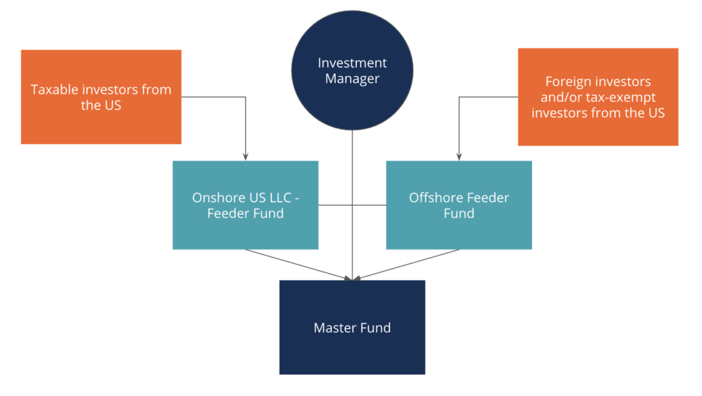

Investment funds serve as essential mechanisms for gathering financial resources with the intent of fostering growth and generating returns. By pooling capital from diverse investors, these funds enable access to a broader range of investments than what might be available to individual investors. This collective approach not only diversifies risk but also leverages the expertise of professional fund managers to optimize investment outcomes.

For both investors and fund managers, understanding the complexities and nuances of different investment fund structures is crucial. These structures impact how funds operate, including the ways in which capital is collected, managed, and distributed. They also influence legal, taxation, and operational efficiencies, directly affecting the overall performance and viability of an investment portfolio.



This article provides an exploration of various investment fund structures, with a particular emphasis on the master-feeder structure—a popular and sophisticated setup, especially within the hedge fund industry. Through this focus, we aim to illuminate how different fund structures align with specific financial strategies, investor profiles, and regulatory environments.

The discussion extends to the advantages and applications of these structures, notably in the field of algorithmic trading. Algorithmic trading, characterized by the use of complex mathematical models and high-frequency data analysis, benefits significantly from the centralized management and flexibility offered by the master-feeder structure. This setup supports seamless execution of trading strategies across multiple markets and jurisdictions, enhancing both the performance and scalability of investment strategies.

By engaging with the material presented here, you will gain a comprehensive understanding of how fund structures, particularly the master-feeder type, can be employed to optimize investment strategies and achieve financial goals. The insight gathered will be valuable for making informed decisions about portfolio management and selecting the appropriate fund structure to meet specific objectives.

## Table of Contents

## Understanding Investment Fund Structures

Investment fund structures serve as the backbone of how investment funds operate, ensuring that capital is effectively collected, managed, and distributed among investors. This organizational framework is crucial for defining the operational dynamics, legal implications, and taxation strategies of the fund.

At the core, investment funds can be broadly classified into several common structures, each serving distinct purposes and offering unique advantages. The primary structures include mutual funds, hedge funds, and private equity funds, among others. Each comes with its set of features, regulatory requirements, and operational mechanics.

Mutual funds are typically open-ended investment funds that pool money from many investors to purchase a diversified portfolio of stocks, bonds, or other securities. They are known for their [liquidity](/wiki/liquidity-risk-premium), allowing investors to buy or sell shares at the fund's net asset value (NAV) at the end of each trading day. Mutual funds are highly regulated, particularly under the Investment Company Act of 1940 in the United States, ensuring investor protection and transparency.

Hedge funds, on the other hand, are less regulated and are designed to achieve high returns through diverse and often aggressive investment strategies. They utilize leverage, short selling, derivatives, and other complex financial instruments, catering primarily to wealthy individuals and institutional investors. The flexibility in investment choices makes hedge funds an attractive option for those seeking higher risks and potentially higher rewards.

Private equity funds invest directly in private companies or engage in buyouts of public companies, leading to their delisting from public stock exchanges. This structure is characterized by its long-term investment horizon and aims at improving the performance of the acquired companies to eventually sell them at a profit. The lack of liquidity is a notable feature, as funds are typically locked in for several years.

Choosing the right fund structure is pivotal for optimizing legal, taxation, and operational efficiencies. The legal implications of each structure define the fund's ability to engage with various investment strategies and financial instruments. This choice also affects tax treatment, both at the fund level and for the investors, thereby influencing the overall returns. Moreover, operational efficiency varies with each structure, determining how smoothly a fund can function in terms of trade execution, management, and compliance with regulatory requirements.

In summary, understanding the nuances of different investment fund structures is essential for fund managers and investors alike. These structures not only dictate the legal and fiscal landscape of the fund but also shape its operational strategy and investor relations.

## The Master-Feeder Structure Explained

A master-feeder structure is a widely used configuration in the [hedge fund](/wiki/hedge-fund-trading-strategies) industry, designed to streamline investment procedures and maximize operational efficiency. At its core, the master-feeder arrangement consolidates investments from multiple 'feeder' funds into a single 'master' fund. This setup allows for centralized investment management while still accommodating diverse groups of investors.

The feeder funds are distinct entities that can be tailored according to various parameters such as jurisdiction, tax considerations, or the type of investor (institutional versus retail). For instance, a hedge fund might have separate feeder funds for U.S. investors and non-U.S. investors, each structured to optimize the tax implications and regulatory compliance particular to their respective investors.

The primary advantage of this structure lies in its ability to merge capital from different feeder funds, enabling the master fund to manage a larger pool of resources. This consolidation simplifies portfolio management as trading and investment decisions can be made collectively at the master fund level, rather than being duplicated across multiple feeder funds. By centralizing investment decisions, the master fund can reduce operational costs and improve strategic coherence.

Furthermore, the master-feeder structure is often optimized for tax efficiency. By utilizing feeder funds in favorable tax jurisdictions, investors can potentially benefit from reduced tax liabilities. This aspect is particularly advantageous for international investors who face varying tax obligations depending on their domicile.

Overall, the master-feeder structure serves not only as a mechanism for efficient fund management but also as a customizable framework that caters to the specific needs of different investor segments. This structure has become a staple in the hedge fund industry due to its ability to enhance both administrative efficiency and tax optimization.

## Advantages of Various Fund Structures

Different fund structures offer investors a range of benefits tailored to specific needs and objectives. Each structure is designed to optimize aspects such as tax efficiency, investor diversification, regulatory compliance, and investment agility.

### Tax Advantages

Investment fund structures can be customized to optimize tax outcomes for investors. For instance, certain fund structures are established in jurisdictions with favorable tax treaties or incentives, which can reduce the tax burden on investors. Additionally, some structures, like the master-feeder arrangement, enable funds to pool investments from different jurisdictions, allowing each feeder fund to take advantage of local tax benefits while centralizing investment management in the master fund. This approach ensures that investors can maximize their after-tax returns.

### Investor Diversification

Structures like mutual funds and exchange-traded funds (ETFs) inherently cater to diversified pools of investors. By pooling investments from numerous participants, these structures enable access to a wider array of assets, which in turn helps in spreading risk. Furthermore, through structures like feeder funds in a master-feeder setup, different categories of investors, such as institutional vs. retail or domestic vs. international, can be catered to efficiently. This capability ensures a broad shareholder base and the ability to attract a diversified investor profile.

### Regulatory Compliance

Different fund structures are subjected to distinct regulatory environments, offering varying levels of oversight and compliance obligations. This can significantly influence an investor's choice, especially when seeking to align with specific legal requirements. For example, hedge funds often operate within environments that offer greater freedom compared to mutual funds, which are typically subject to stringent regulatory frameworks. These variations allow fund managers to select structures that best align with their strategic objectives while adhering to necessary compliance standards.

### Investment Agility

Certain fund structures offer enhanced flexibility in implementing investment strategies. Hedge funds, for example, are known for their ability to employ diverse and sophisticated strategies, including short selling, leverage, and derivatives, due to their loose regulatory restrictions. This agility allows hedge funds to swiftly adapt to market changes and pursue higher returns, unlike more rigid structures such as mutual funds that are bound by stricter investment constraints.

### Master-Feeder Structure for International Strategies

The master-feeder structure is particularly advantageous for firms looking to implement international investment strategies. By operating feeder funds in various countries, this structure allows the central master fund to aggregate capital from around the world efficiently. This setup not only supports tax-efficient global operations but also streamlines regulatory compliance by localizing feeder funds' activities according to regional laws.

In summary, understanding the advantages of various fund structures is crucial for selecting the most appropriate investment vehicle. By considering factors such as tax efficiency, investor diversification, regulatory environment, and investment flexibility, investors and fund managers can strategically choose structures that align with their specific financial goals and regulatory requirements.

## Master-Feeder Structure in Algo Trading

Algorithmic trading, a method that uses automated and pre-programmed trading instructions to execute orders, is fundamentally dependent on systematic and efficient processes. The master-feeder structure is particularly beneficial for this form of trading, offering a combination of flexibility and centralized management that is well-suited for executing complex trading strategies across diverse markets.

The master-feeder structure consists of one or more feeder funds that invest in a single master fund. This enables the unified management of investment capital while allowing for customization in terms of investor requirements and regional regulations. In [algorithmic trading](/wiki/algorithmic-trading), this setup is advantageous for executing strategies consistently across global markets, as the centralized master fund can coordinate trades driven by algorithmic models, ensuring uniformity in execution and risk management.

Python, a favored language in algorithmic trading due to its extensive libraries and ease of use, can be integrated seamlessly within a master-feeder framework. For example, a simple algorithm trading strategy might be designed as follows:

```python
import pandas as pd
import numpy as np

# Sample DataFrame with historical price data
data = pd.DataFrame({
    'price': [100, 102, 101, 105, 107, 110, 108]
})

# Calculate moving average
data['moving_avg'] = data['price'].rolling(window=3).mean()

# Sample trading strategy: Buy when price is above moving average, sell when below
data['signal'] = np.where(data['price'] > data['moving_avg'], 'buy', 'sell')

print(data)
```

This simple script demonstrates the logic behind a moving average strategy in algorithmic trading. Imagine scaling such logic across multiple feeder funds investing in a master fund; this allows for algorithm-driven investment decisions across different asset classes and regions while maintaining centralized oversight.

The master-feeder structure's inherent design facilitates scalability and enhances performance for global hedge funds employing diverse algorithmic models. It allows hedge funds to leverage different algorithms tailored to specific markets or financial instruments, all while benefiting from the operational efficiencies of a centralized trading strategy.

In conclusion, the synergy between algorithmic trading and the master-feeder fund structure enables the execution of sophisticated and scalable investment strategies, proving invaluable for hedge funds looking to optimize their global trading operations.

## Conclusion

Investment fund structures are fundamentally central to the success and efficiency of investment strategies, impacting everything from taxation to operational management. Among these, the master-feeder fund structure stands out due to its unique advantages for global fund management and trading activities. This structure allows for a centralization of capital and strategy, facilitating streamlined operations across diverse jurisdictions and investor classes. The ability to pool investments into a single master fund while maintaining distinct feeder funds provides significant flexibility in managing cross-border investments, enhancing both regulatory compliance and tax efficiency. 

For instance, a master-feeder structure can optimize tax outcomes by strategically placing feeder funds in tax-favorable zones, thereby reducing the tax liability on earnings before consolidation in the master fund. This structure's flexibility in aligning with specific jurisdictional requirements makes it a powerful tool for sophisticated global investment strategies. By leveraging such structures, investors can also attain operational ease, as the centralized investment management inherent to the master-feeder setup simplifies administrative processes and reduces complexity.

Incorporating these structured setups into algorithmic trading frameworks further optimizes performance. The centralized investment capabilities enable seamless execution of complex algorithmic strategies across various markets without the hindrance of fragmented fund management. Such integration offers enhanced performance and scalability, particularly beneficial for hedge funds deploying diverse algorithmic models. 

Ultimately, an in-depth understanding of different investment fund structures empowers investors to tailor their strategies for maximized efficiency and returns. A well-informed selection of fund structures, particularly the master-feeder arrangement, can enhance one's ability to optimize their portfolio's potential, making it an indispensable consideration in today's global financial landscape.

## References & Further Reading

[1]: Mangone, G. M. (2018). ["The Master-Feeder Fund Structure: Legal Aspects and Potential Risks."](https://www.investopedia.com/terms/m/master-feeder-fund.asp) TheStreet.

[2]: Black, F., & Scholes, M. (1973). ["The Pricing of Options and Corporate Liabilities."](https://www.cs.princeton.edu/courses/archive/fall09/cos323/papers/black_scholes73.pdf) The Journal of Political Economy.

[3]: Korn, O. (2017). ["Algorithmic Trading – A Comprehensive Beginner’s Guide."](https://www.investopedia.com/terms/a/algorithmictrading.asp) Investopedia.

[4]: Lerner, J., & Schoar, A. (2004). ["The Illiquidity Puzzle: Theory and Evidence from Private Equity."](https://www.sciencedirect.com/science/article/abs/pii/S0304405X03002034) Journal of Financial Economics.

[5]: ["Hedge Funds: Structure, Strategies, and Performance"](https://academic.oup.com/book/25365) by H. Kent Baker and Greg Filbeck.

[6]: MacKenzie, D. (2006). ["An Engine, Not a Camera: How Financial Models Shape Markets."](https://academic.oup.com/mit-press-scholarship-online/book/20588) MIT Press.