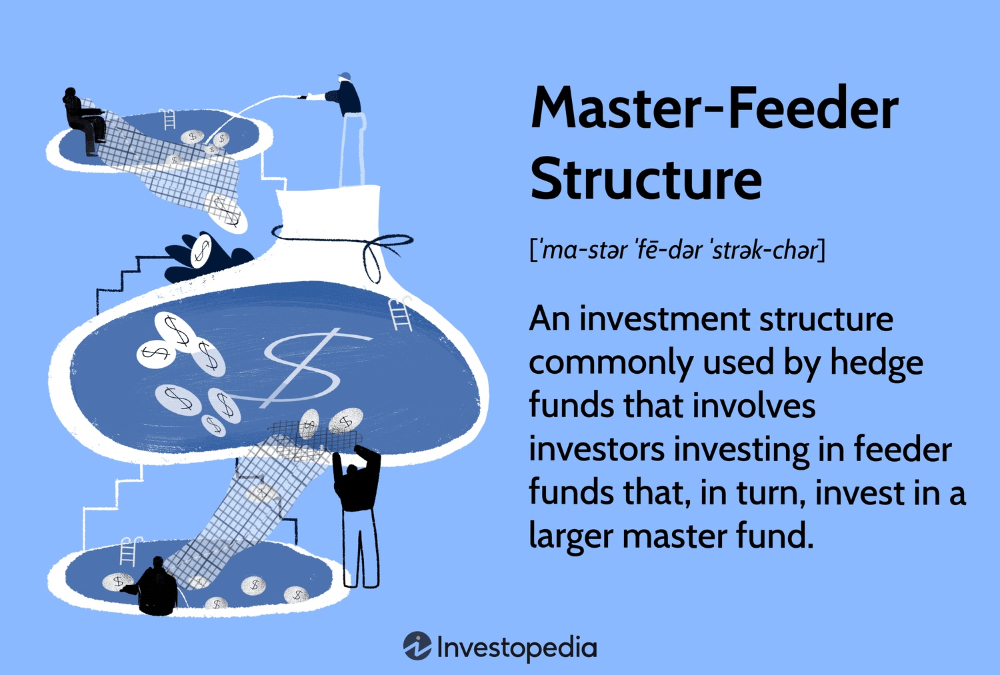

## Table of Contents

## What is a Master Fund?

A Master Fund is a type of investment fund that pools money from different investors to invest in a variety of assets. It is often used in a structure called a master-feeder fund, where smaller funds, called feeder funds, invest their money into the Master Fund. This setup allows investors from different countries or with different tax situations to invest together in the same assets, making it easier and more efficient.

The main advantage of a Master Fund is that it can help reduce costs and increase efficiency. Because all the money is managed in one place, the Master Fund can buy and sell assets in larger amounts, which can lead to better prices and lower trading costs. This can be good for investors because it might mean higher returns. However, like any investment, there are risks, and investors should understand these before putting their money into a Master Fund.

## How does a Master Fund differ from other types of funds?

A Master Fund is different from other funds because it's designed to work with feeder funds. In this setup, smaller funds, or feeder funds, put their money into the Master Fund. This allows investors from different places or with different tax needs to invest together in the same assets. It's like a big pool where everyone can swim together, even if they come from different pools. Other types of funds, like mutual funds or hedge funds, usually don't have this structure. They manage their money directly without needing another fund to pool everything together.

Another way a Master Fund differs is in how it can save money and be more efficient. Because all the money from the feeder funds goes into one big Master Fund, it can buy and sell assets in larger amounts. This can lead to better prices and lower costs for trading. For example, if you're buying a big box of apples, you might get a better price than if you bought them one by one. Other funds might not have as much money to work with, so they might not get these benefits. But remember, even though Master Funds can be more efficient, they still come with risks, just like any other investment.

## What are the main benefits of investing in a Master Fund?

One of the main benefits of investing in a Master Fund is that it can help save money. Because a Master Fund pools money from different feeder funds, it can buy and sell assets in bigger amounts. This is like buying in bulk at a store; you often get a better deal. When a Master Fund buys and sells in large amounts, it can get better prices and lower trading costs. This can mean more money in your pocket because the fund doesn't have to spend as much on buying and selling.

Another benefit is that Master Funds make it easier for people from different places to invest together. Imagine you and your friends want to buy a big toy, but you all live in different countries. A Master Fund is like a big toy box where everyone can put their money in, no matter where they are from. This makes investing simpler and more efficient. Plus, it can help you invest in things you might not be able to on your own because the Master Fund can handle bigger investments.

## Who typically invests in Master Funds?

People who invest in Master Funds often come from different places and have different tax situations. They might be regular people like you and me, or they could be big investors like pension funds or insurance companies. Master Funds are popular because they let everyone pool their money together, no matter where they're from or what their tax needs are.

These funds are also attractive to people who want to invest in bigger things that they might not be able to buy on their own. For example, if you want to invest in a big company or a piece of real estate, a Master Fund can make it possible by combining everyone's money. So, both small and big investors find Master Funds useful because they can help save money on buying and selling and make investing easier and more efficient.

## What are the common structures of Master Funds?

Master Funds usually work with feeder funds in a setup called a master-feeder structure. In this setup, different feeder funds from around the world or with different tax situations put their money into one big Master Fund. This makes it easier for everyone to invest together in the same assets, even if they come from different places. Think of it like a big swimming pool where lots of smaller pools can all join in and swim together.

Another common structure for Master Funds is the fund of funds. In this setup, the Master Fund invests in other funds instead of directly in stocks, bonds, or real estate. This can help spread out the risk because the Master Fund is investing in a bunch of different funds, kind of like putting your eggs in different baskets. This structure is useful for investors who want to diversify their investments without having to pick each one themselves.

Both of these structures help make investing more efficient and can save money on trading costs. But remember, even though Master Funds can be a good way to invest, they still come with risks. It's important to understand these risks before you decide to put your money into a Master Fund.

## How are Master Funds regulated?

Master Funds are regulated by different rules depending on where they are set up. In the United States, the Securities and Exchange Commission (SEC) is the main group that makes sure Master Funds follow the rules. The SEC looks at things like how the fund is managed, how it reports its money, and how it treats its investors. Other countries have their own groups that do similar things, like the Financial Conduct Authority (FCA) in the United Kingdom.

These rules are important because they help keep the Master Fund honest and fair. They make sure the fund tells the truth about how it's doing and how it's using people's money. This helps protect investors so they can feel safe putting their money into the fund. Even though the rules can be different in each country, the main goal is the same: to make sure Master Funds are run in a way that's good for everyone who invests in them.

## What role do feeder funds play in relation to Master Funds?

Feeder funds are like smaller pools of money that flow into a bigger pool called a Master Fund. People from different places or with different tax situations put their money into these feeder funds. Then, all the money from the feeder funds goes into the Master Fund. This makes it easier for everyone to invest together in the same things, even if they come from different countries.

The main job of feeder funds is to collect money from investors and send it to the Master Fund. This setup helps the Master Fund buy and sell things in bigger amounts, which can save money on trading costs. It also makes investing simpler for people because they can join a feeder fund that fits their needs, and the feeder fund takes care of sending their money to the Master Fund.

## What are the tax implications of investing in a Master Fund?

Investing in a Master Fund can have different tax effects depending on where you live and the type of feeder fund you use. If you're in the United States, for example, you might invest in a feeder fund that's set up as a partnership. This means you'll have to pay taxes on your share of the Master Fund's earnings, even if you don't take the money out. The good thing is, you can use any losses from the fund to lower your taxes.

In other countries, the tax rules can be different. Some places might have special feeder funds that help you save on taxes. For example, if you're in a country with high taxes, you might use a feeder fund that's set up in a place with lower taxes. This can help you keep more of your investment earnings. But remember, tax laws can be tricky, so it's a good idea to talk to a tax expert before you invest in a Master Fund.

## How do Master Funds manage risk and exposure?

Master Funds manage risk and exposure by spreading their money across different types of investments. This is called diversification. Instead of putting all their money into one thing, like one company's stock, they invest in many different things, like stocks, bonds, and real estate. This way, if one investment goes down, the whole fund doesn't lose as much money because other investments might still be doing well. It's like not putting all your eggs in one basket.

They also use something called hedging to manage risk. Hedging is like buying insurance for your investments. For example, if a Master Fund thinks the price of a stock might go down, they might buy something that will make money if the stock price does go down. This can help protect the fund's money. Master Funds also keep a close eye on their investments and can change what they're investing in if they think it will help manage risk better. By doing these things, Master Funds try to keep their investors' money as safe as possible while still trying to make it grow.

## What are the performance metrics used to evaluate Master Funds?

When people want to know how well a Master Fund is doing, they look at different numbers called performance metrics. One important number is the return on investment, which shows how much money the fund has made or lost over time. People also look at the fund's [volatility](/wiki/volatility-trading-strategies), which tells them how much the fund's value goes up and down. If a fund's value jumps around a lot, it's considered more risky. Another useful metric is the Sharpe ratio, which measures how much return the fund gets for the risk it takes. A higher Sharpe ratio means the fund is doing a good job of making money without taking too much risk.

Another thing people check is the fund's alpha, which shows how well the fund is doing compared to what you would expect from the market. A positive alpha means the fund is beating the market, while a negative alpha means it's not doing as well. People also look at the beta, which tells them how much the fund moves with the market. A beta of 1 means the fund moves exactly with the market, while a beta higher than 1 means it moves more than the market, and a beta less than 1 means it moves less. By looking at all these numbers, investors can get a good idea of how well a Master Fund is performing and whether it's a good choice for them.

## Can you explain the process of setting up a Master Fund?

Setting up a Master Fund involves a few important steps. First, you need to decide on the structure of the fund. This means figuring out if it will be a master-feeder setup or a fund of funds. Then, you need to pick a place to set up the Master Fund. This is important because different places have different rules and taxes. Once you've chosen a location, you'll need to work with lawyers and other experts to make sure everything is set up correctly according to the local laws. This includes writing a detailed plan, called a prospectus, that explains what the fund will do and how it will work.

After the legal stuff is sorted out, you need to find people to run the fund. This includes hiring a manager who will make decisions about what to invest in, and maybe other people like accountants and lawyers to help with the day-to-day work. You'll also need to set up systems to keep track of the fund's money and investments. Once everything is ready, you can start raising money from investors. They'll put their money into feeder funds, which then go into the Master Fund. It's a big job, but with the right help and planning, you can get a Master Fund up and running.

## What are the advanced strategies used by Master Funds to maximize returns?

Master Funds use a few smart tricks to try and make more money for their investors. One way they do this is by using leverage, which means borrowing money to invest more than they have. It's like using a credit card to buy more stocks or real estate. This can make their returns bigger if the investments do well, but it can also make losses bigger if things go wrong. Another trick is called short selling, where they bet that a stock or other investment will go down in price. If it does, they make money, but if it goes up, they lose money. These strategies can be risky, but Master Funds use them to try and beat the market and make more money.

Another thing Master Funds do is use something called derivatives. These are like special contracts that let them bet on things like stock prices, interest rates, or even the weather, without actually owning the things they're betting on. This can help them make money in different ways and manage risk better. For example, they might use options, which give them the right to buy or sell something at a certain price in the future. This can protect them if the market goes down, or let them make extra money if it goes up. By using these advanced strategies, Master Funds try to find new ways to grow their investors' money, even though it can be tricky and risky.

## References & Further Reading

- Mangone, G. M. (2018). "The Master-Feeder Fund Structure: Legal Aspects and Potential Risks." TheStreet. This article provides a detailed examination of the legal considerations and potential challenges associated with the master-feeder fund structure. It is essential for understanding how to navigate regulatory environments while maximizing operational efficiency.

- Black, F., & Scholes, M. (1973). "The Pricing of Options and Corporate Liabilities." The Journal of Political Economy. This seminal paper introduced the Black-Scholes model, a mathematical model for pricing options. The model is foundational for quantitative finance and is often used in algorithmic trading to assess the value of derivatives.

- Korn, O. (2017). "Algorithmic Trading – A Comprehensive Beginner’s Guide." Investopedia. Korn's guide provides a fundamental overview of algorithmic trading, covering the basics of programming and the implementation of trading algorithms. It is an excellent resource for investors looking to integrate algorithmic strategies within fund structures.

- Lerner, J., & Schoar, A. (2004). "The Illiquidity Puzzle: Theory and Evidence from Private Equity." Journal of Financial Economics. This paper explores the challenges of illiquidity in private equity investments, offering insights that are valuable for understanding the liquidity considerations specific to different fund structures, including hedge funds.

- Hedge Funds: Structure, Strategies, and Performance by H. Kent Baker and Greg Filbeck. This book provides an in-depth analysis of hedge fund structures, including master-feeder setups, and explores various strategies and performance metrics. It serves as a comprehensive guide for practitioners looking to understand the intricacies of hedge fund management and strategy deployment.

