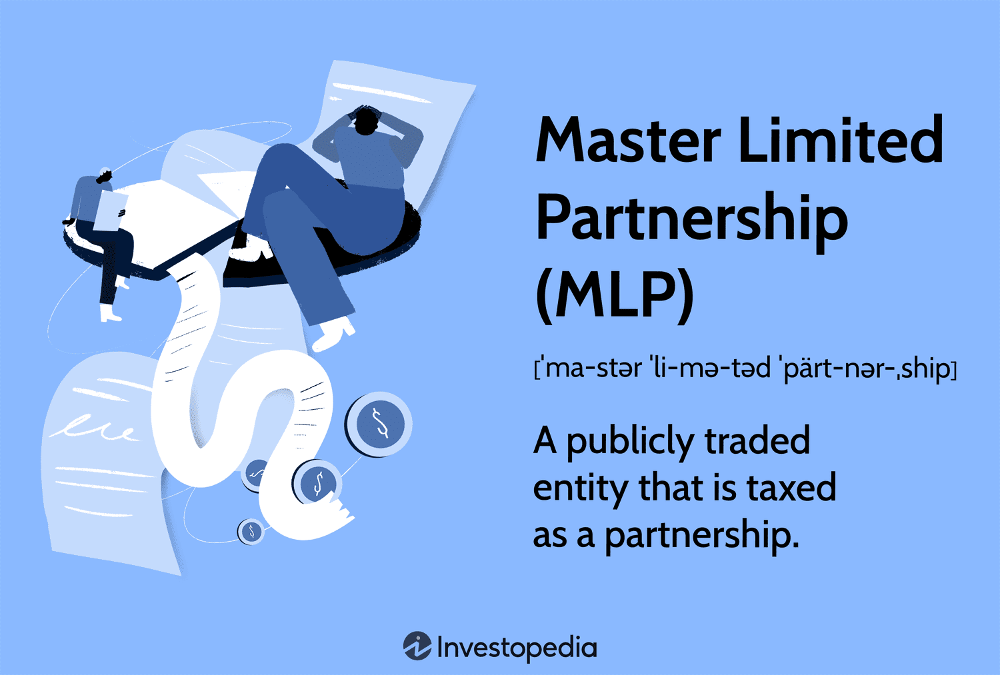

## Table of Contents

## What is a Master Limited Partnership (MLP)?

A Master Limited Partnership (MLP) is a type of business structure that combines the tax benefits of a partnership with the liquidity of a publicly traded company. MLPs are commonly used in industries like energy, where they own and operate assets such as pipelines and storage facilities. Investors in an MLP are called unit holders, and they receive regular distributions of income, similar to dividends from stocks.

One key advantage of MLPs is that they avoid corporate income taxes. Instead, the income is passed directly to the unit holders, who then pay taxes on their share of the MLP's income. This can result in higher yields for investors, making MLPs an attractive option for those seeking income-generating investments. However, MLPs also come with unique risks and complexities, such as potential changes in tax laws and the specific challenges faced by the industries in which they operate.

## How does an MLP differ from a traditional corporation?

An MLP, or Master Limited Partnership, is different from a traditional corporation in how it is set up and taxed. In a traditional corporation, the company itself pays taxes on its profits, and then shareholders pay taxes again on any dividends they receive. This is called double taxation. But with an MLP, the company does not pay taxes on its income. Instead, the income is passed directly to the people who invest in the MLP, called unit holders. They pay taxes on their share of the income, which can lead to higher returns for them.

Another big difference is how MLPs and traditional corporations are structured. A traditional corporation has a board of directors and officers who manage the company, and shareholders have limited say in how things are run. In an MLP, there are general partners who manage the business and limited partners, or unit holders, who invest money but don't have a say in daily operations. MLPs are often used in industries like energy, where they own things like pipelines and storage facilities. This structure can make MLPs attractive for investors looking for regular income, but it also comes with its own set of risks and complexities.

## What are the typical industries in which MLPs operate?

MLPs usually work in industries that need a lot of money to build and run big projects. The most common industry for MLPs is energy, especially oil and gas. They often own and operate pipelines that move oil and gas from where they are produced to where they are used. They might also own storage facilities for these resources. This helps them make money by charging fees for using their pipelines and storage.

Besides energy, MLPs can also be found in other industries that need big investments in infrastructure. For example, some MLPs work in real estate, where they own and manage properties like shopping centers or office buildings. Others might be in the shipping industry, owning and operating ships that transport goods around the world. These industries benefit from the MLP structure because it helps them raise money from investors while offering those investors regular income.

## What are the benefits of investing in an MLP?

One big benefit of investing in an MLP is the chance to get regular income. MLPs often pay out a lot of their earnings to investors, called unit holders, in the form of distributions. These are like dividends but can be higher because MLPs don't pay corporate taxes. Instead, the income goes straight to the unit holders, who then pay taxes on it. This can mean more money in your pocket compared to other investments.

Another benefit is that MLPs can help you spread out your investments. They often work in industries like energy, where they own things like pipelines and storage facilities. By investing in an MLP, you're putting your money into a different kind of business than stocks or bonds. This can help lower the risk in your overall investment plan. Plus, MLPs are traded on public markets, so it's easy to buy and sell them, giving you more flexibility with your money.

## What are the tax implications of investing in an MLP?

When you invest in an MLP, the tax rules are different from other investments. MLPs don't pay taxes on their income. Instead, they pass that income directly to you, the investor. You'll get a special tax form called a Schedule K-1, which shows your share of the MLP's income. You'll need to report this income on your personal tax return and pay taxes on it. This can be a bit more work than dealing with regular stock dividends, but it can also mean more money for you because the income isn't taxed twice.

Another thing to know is that some of the income you get from an MLP might be considered a return of your original investment, called a return of capital. This part isn't taxed right away. Instead, it lowers the amount you paid for your MLP units, which can affect your taxes when you sell them. Also, if you hold MLPs in a retirement account like an IRA, it can get complicated. The income from MLPs might be treated as unrelated business taxable income (UBTI), and if you have too much UBTI, you could owe taxes on it even though it's in a retirement account. So, it's a good idea to talk to a tax advisor to understand how MLPs will affect your taxes.

## How can someone invest in an MLP?

Investing in an MLP is a lot like buying stocks. You can buy MLP units through a regular brokerage account, just like you would buy shares of a company. Many big online brokers let you trade MLPs, so you can do it all from your computer or phone. Just look up the MLP you want, enter how many units you want to buy, and place your order. It's that simple.

But there are other ways to invest in MLPs, too. You can buy shares in a fund that invests in a bunch of different MLPs, like an MLP exchange-traded fund ([ETF](/wiki/etf-trading-strategies)) or a mutual fund. These funds spread your money across many MLPs, which can be less risky than [picking](/wiki/asset-class-picking) just one. Another option is to invest in a company that owns MLPs, called a general partner. This can give you a different kind of investment in the MLP world. No matter which way you choose, it's smart to do your homework first and maybe talk to a financial advisor to make sure it fits with your investment goals.

## What are the risks associated with MLPs?

Investing in MLPs can be risky because they often work in industries like energy, where things can change a lot. For example, if the price of oil goes down, it can hurt the profits of MLPs that own pipelines for oil. This means the value of your investment might go down, too. Also, MLPs can be affected by rules and laws made by the government. If new laws make it harder for MLPs to do business, it could lower their income and the amount they pay out to investors.

Another risk is that MLPs can be complicated when it comes to taxes. You'll get a special tax form called a Schedule K-1, which can be more work to deal with than regular stock dividends. Plus, if you hold MLPs in a retirement account like an IRA, you might have to pay taxes on the income even though it's in a tax-sheltered account. This is called unrelated business taxable income (UBTI). So, it's important to understand the tax rules before you invest in an MLP.

## How do MLPs distribute income to investors?

MLPs distribute income to investors through regular payments called distributions. These are similar to dividends from stocks, but they can be higher because MLPs don't pay corporate taxes. Instead, the income goes directly to the investors, called unit holders. MLPs usually pay out most of their earnings to unit holders, which means you can get a steady stream of income from your investment.

The way MLPs distribute income can be a bit different from other investments. You'll get a tax form called a Schedule K-1 that shows your share of the MLP's income. You'll need to report this income on your personal tax return and pay taxes on it. Sometimes, part of the distribution might be considered a return of your original investment, called a return of capital. This part isn't taxed right away but lowers the amount you paid for your MLP units, which can affect your taxes when you sell them.

## What is the role of a general partner in an MLP?

In an MLP, the general partner is in charge of running the business. They make the big decisions and manage the day-to-day operations. The general partner is like the boss of the MLP and gets a share of the profits for their work. They might also get special payments called incentive distributions if the MLP does really well.

The general partner is different from the limited partners, who are the investors that put money into the MLP but don't help run it. The limited partners, or unit holders, get regular payments from the MLP's income but don't have a say in how the business is managed. This setup lets the general partner focus on growing the business while the limited partners enjoy the income it generates.

## How does the structure of an MLP affect its governance?

In an MLP, the way it's set up changes how it's run. There are two main groups: the general partner and the limited partners. The general partner is like the boss. They make all the big decisions and handle the daily work of the MLP. They get paid for their work and might get extra money if the MLP does well. The limited partners, or unit holders, are the investors. They put money into the MLP but don't get to decide how it's run. They just get regular payments from the MLP's earnings.

This setup means the general partner has a lot of control over the MLP. They can decide what the MLP does and how it does it. The limited partners don't have a say in these decisions, but they do get the benefit of regular income from the MLP. This structure helps the MLP focus on its business while making sure investors get paid, but it also means that if the general partner makes bad choices, the limited partners can't do much about it.

## What are the financial reporting requirements for MLPs?

MLPs have to follow special rules for telling people about their money. They need to send a special tax form called a Schedule K-1 to their investors every year. This form shows how much money the MLP made and how much of that money each investor gets. It's more complicated than the forms you get from regular stocks, so it can take more time to deal with your taxes.

Besides the Schedule K-1, MLPs also have to share regular reports with the public. These reports tell people how the MLP is doing, how much money it's making, and what it's spending money on. This helps investors keep track of their investment and make smart choices. The reports have to follow the rules set by the government, so everyone knows they're getting the right information.

## How have regulatory changes impacted MLPs in recent years?

In recent years, regulatory changes have had a big effect on MLPs. One big change was the Tax Cuts and Jobs Act of 2017. This law changed how MLPs are taxed, especially if they work in industries other than energy. Before, MLPs didn't have to pay corporate taxes no matter what they did. But now, if an MLP works in things like real estate or shipping, it might have to pay corporate taxes. This can make it harder for MLPs in those industries to make money and pay out income to investors.

Another important change has been in the rules about how MLPs can raise money. The Securities and Exchange Commission (SEC) has made new rules to make sure MLPs tell people the truth about their business. These rules can make it more expensive for MLPs to do business because they have to spend more time and money on reports and paperwork. But these rules also help protect investors by making sure they get all the information they need to make smart choices. So, while regulatory changes can make things harder for MLPs, they also help keep the market fair and safe for everyone.

## References & Further Reading

[1]: ["Master Limited Partnerships: MLP Strategy and Governance."](https://www.investopedia.com/terms/m/mlp.asp) Brookings Institution Press.

[2]: National Association of Publicly Traded Partnerships. ["What are MLPs?"](https://www.mlpassociation.org/mlp-101/) MLP Association.

[3]: Palepu, K., & Healy, P. (2008). ["Business Analysis and Valuation: Using Financial Statements"](https://books.google.com/books/about/Business_Analysis_and_Valuation_Using_Fi.html?id=IDT6DwAAQBAJ). Cengage Learning.

[4]: ["High-Frequency Trading: A Practical Guide to Algorithmic Strategies and Trading Systems"](https://www.amazon.com/High-Frequency-Trading-Practical-Algorithmic-Strategies/dp/1118343506) by Irene Aldridge.

[5]: ["The Real Estate Investment Trust Institute's Introduction to Master Limited Partnerships."](https://frostbrowntodd.com/reits-demystified-an-introduction-to-real-estate-investment-trusts/) 

[6]: ["Quantitative Finance for Physicists: An Introduction"](https://www.sciencedirect.com/book/9780120884643/quantitative-finance-for-physicists) by Anatoly B. Schmidt.

[7]: ["Algorithmic Trading: Winning Strategies and Their Rationale"](https://www.wiley.com/en-us/Algorithmic+Trading%3A+Winning+Strategies+and+Their+Rationale-p-9781118460146) by Ernie Chan.