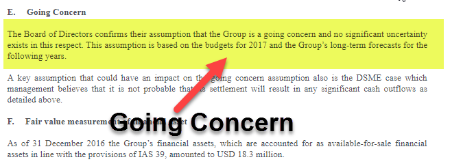

The world of finance offers a vast array of investment opportunities, each characterized by varying levels of risk and return. A keen understanding of financial instruments and their applications is pivotal for investors aiming to maximize returns on their investments. This comprehensive overview explores key investment examples, including master notes and algorithmic trading, which are integral to modern investment strategies.

Master notes and algorithmic trading are sophisticated investment vehicles, each presenting unique benefits and considerations crucial for informed investment decisions. These instruments play a significant role in shaping more strategic investment portfolios, as they cater to differing investor needs ranging from income stability to dynamic trading opportunities.



Traditional financial instruments, such as stocks and bonds, have long served as the cornerstone of investment portfolios. Stocks offer potential capital appreciation and dividend income, while bonds provide reliable income streams through fixed returns. In contrast, modern instruments, like master notes and algorithmic trading, offer innovative ways for investors to diversify risk and enhance returns.

Master notes are high-quality fixed-income securities predominantly used by large-scale investors and institutions, notable for their liquidity and strategic role in portfolio diversification. Conversely, algorithmic trading exemplifies a cutting-edge approach to executing trades using computer algorithms, optimizing for speed and precision. This technological advancement is reshaping investment practices, allowing investors to exploit market inefficiencies and minimize human error.

By examining these financial instruments, investors can gain insights into optimizing their investment strategies. This exploration into master notes and algorithmic trading provides a foundation for integrating a diverse range of securities into an investment portfolio, balancing safety and innovation. As financial markets continue to evolve, understanding and adapting to new investment vehicles will remain essential for achieving long-term financial success.

## Table of Contents

## Understanding Financial Instruments

Financial instruments are assets that can be traded in financial markets. They encompass a wide range of products such as stocks, bonds, exchange-traded funds (ETFs), derivatives, and more. Understanding each financial instrument's distinctive characteristics and risk-return profile is crucial for making informed investment decisions.

Stocks are equity securities representing ownership in a company. Investors in stocks can benefit from potential capital gains when stock prices increase, as well as dividends paid out from the company's profits. The performance of stocks is influenced by factors such as company earnings, broader economic conditions, and market sentiment.

Bonds are debt securities issued by corporations, municipalities, or governments to raise capital. When investors purchase bonds, they lend money to the issuer in exchange for regular interest payments and return of the principal amount at maturity. Bonds are generally considered less risky than stocks and provide fixed income over time. Interest rates and credit ratings significantly affect bond prices and yields.

ETFs combine features of stocks and mutual funds, offering investors diversified exposure to a wide range of asset classes. ETFs trade on stock exchanges, providing [liquidity](/wiki/liquidity-risk-premium) and flexibility for investors to buy or sell shares throughout the trading day. They can track indices, sectors, or commodities and offer advantages such as lower expense ratios and tax efficiency compared to traditional mutual funds.

Derivatives are financial contracts whose value derives from underlying assets, such as stocks, bonds, or commodities. Common derivatives include options and futures. Options grant the right, but not the obligation, to buy or sell an asset at a predetermined price within a specified timeframe. Futures are agreements to buy or sell an asset at a future date and price. Both instruments are used for hedging risks or speculating on price movements.

Commodities refer to physical goods like oil, gold, and agricultural products. They are traded on various exchanges and are vital to diversify investment portfolios due to their low correlation with traditional financial assets. Commodity prices are subject to supply and demand dynamics, geopolitical events, and economic data releases.

Cryptocurrencies are digital or virtual assets secured by cryptography, with Bitcoin and Ethereum being well-known examples. These assets operate on blockchain technology and offer decentralized models for transactions. Despite offering new investment opportunities, cryptocurrencies exhibit high [volatility](/wiki/volatility-trading-strategies) and regulatory challenges, necessitating thorough research before investing.

Each financial instrument provides unique benefits and risks, making it essential for investors to understand how they fit into their investment strategies and financial goals.

## Master Notes: A Financial Instrument Example

Master notes are a form of high-quality fixed-income security primarily utilized by large investors and institutional entities. These financial instruments are particularly prominent due to their specific role within the agricultural sector, as they are issued by the Federal Farm Credit Banks Funding Corporation. This issuance supports the U.S. agricultural sector by providing much-needed capital.

The face value of master notes typically begins at $25 million, which renders them largely inaccessible to the average retail investor. Instead, they are designed to cater to entities with substantial capital reserves, such as investment banks, pension funds, and insurance companies. The significance of master notes lies in their offering of both liquidity and flexible maturity options, making them a valuable tool for managing large investment portfolios.

A distinctive feature of master notes is their fixed coupon rate, which is often indexed to benchmark interest rates like the Federal Funds Rate. This indexing ensures that the return on these investments remains competitive relative to prevailing market interest rates. Consequently, master notes provide a reliable income stream, with adjustments aligned to economic conditions.

The mechanics of master notes are essential to understand, as they represent an integral component of portfolio diversification strategies. By offering a stable income with relative security, these instruments can offset the volatility associated with more speculative investments. For investors with appropriate scale and resources, master notes contribute to a balanced investment strategy, supporting both income generation and risk management objectives.

Understanding the utility and structure of master notes highlights their role among various fixed-income instruments. They serve as a prime example of how targeted financial products support sector-specific needs—such as those in agriculture—while also offering broad applications in achieving diversification across diversified investment portfolios.

 to Algorithmic Trading

Algorithmic trading, often referred to as algo trading, harnesses the power of computer programs to execute trades based on predetermined criteria, eliminating the need for human intervention. This automated form of trading is essential in contemporary financial markets, where speed and accuracy are critical for seizing brief market opportunities and reducing human errors.

A key advantage of [algorithmic trading](/wiki/algorithmic-trading) is its ability to capitalize on market inefficiencies. Algorithms can process vast amounts of data at incredible speeds, allowing for the execution of high-frequency trades. This capability has positioned algorithmic trading as a cornerstone of modern financial strategies, providing traders with a mechanism to conduct numerous transactions within fractions of a second. Moreover, the utilization of algorithms helps in reducing transaction costs significantly by optimizing the timing and execution of trades.

Algorithmic trading also effectively removes emotional biases from the decision-making process. Human traders are often subject to psychological factors such as fear and greed, which can lead to suboptimal trading decisions. In contrast, algorithmic systems operate purely on logic and predefined rules, ensuring systematic and consistent trading approaches. This detachment from emotional influence not only enhances trading performance but also maintains discipline in executing investment strategies.

To make the most of algorithmic trading, traders and financial institutions must invest in robust technological infrastructure capable of supporting rapid data processing and complex calculations. Knowledge of programming languages, particularly Python, is often essential to develop and optimize algorithms. Understanding market dynamics is another prerequisite, as it allows traders to craft models that respond effectively to changing market conditions.

Here is a simple example of a [momentum](/wiki/momentum)-based algorithm using Python:

```python
import pandas as pd
import numpy as np

# Load historical price data
data = pd.read_csv('historical_prices.csv')

# Calculate moving averages
data['Short_MA'] = data['Close'].rolling(window=20).mean()
data['Long_MA'] = data['Close'].rolling(window=50).mean()

# Define trading signal
data['Signal'] = np.where(data['Short_MA'] > data['Long_MA'], 1, 0)
data['Position'] = data['Signal'].diff()

# Print trading signals
print(data[['Close', 'Short_MA', 'Long_MA', 'Signal', 'Position']])
```

In this code, a trading signal is generated based on the intersection of short and long-term moving averages. The algorithm signals to buy when the short-term moving average exceeds the long-term moving average, and to sell when the opposite occurs.

While algorithmic trading offers these significant advantages, it also comes with challenges such as the need for continuous monitoring and adaptation to evolving market environments. Moreover, technical glitches or unexpected market events can impact its effectiveness, requiring comprehensive risk management strategies. By addressing these challenges, traders can fully leverage the potential of algorithmic trading to enhance their investment portfolios.

## Examples of Algorithmic Trading Strategies

Trend-following strategies are algorithmic techniques that capitalize on sustained directional movement in asset prices. These strategies entail algorithms identifying and acting on trends by analyzing historical price data using technical indicators like moving averages and channel breakouts. The core idea is simple: assume that assets that have been going up will continue to do so, and those declining will continue their downward trajectory. For instance, a common trend-following rule is the moving average crossover strategy. This involves buying when a short-term moving average crosses above a long-term moving average and selling when the opposite occurs.

Arbitrage strategies capitalize on price disparities across different markets or instruments. With automation, traders can promptly identify and exploit these discrepancies. For instance, statistical [arbitrage](/wiki/arbitrage) uses historical pricing data to predict future price correlations between related equities or derivatives. This strategy often involves trading a basket of securities and managing it through time to achieve returns even from minor price differences. By deploying algorithms, traders can rapidly process vast datasets to detect and act on fleeting arbitrage opportunities.

Index fund rebalancing strategies involve anticipating the buying and selling pressures exerted by index funds as they adjust their holdings to align with benchmark indices. Algorithmic traders can predict these windows of predictable trading activity and execute trades to exploit these systematic pressures. As indices undergo periodic rebalancing, there are predictable changes in demand for certain stocks, offering traders opportunities for strategic trades.

Mean reversion strategies are based on the principle that asset prices tend to revert to their historical averages over time. Algorithms employ statistical models to identify arenas where prices have deviated significantly from their average levels. When executing this strategy, the trader buys undervalued stocks anticipated to rise back to their average and sells overvalued stocks expected to decrease. Mean reversion is mathematically supported by stochastic models and can be coded efficiently for rapid execution.

Statistical arbitrage, a form of mean reversion, involves creating bets on the convergence of price spreads between different assets, often using a [pair trading](/wiki/pair-trading) strategy. For example, if two historically correlated stocks diverge, the algorithm might buy the underperforming stock while shorting the outperforming one, betting on the convergence of their prices.

The implementation of these algorithmic trading strategies requires comprehensive knowledge of market conditions, expertly crafted algorithms, and high-performance computational resources. Successful deployment involves fine-tuning models based on historical data and continuously adapting to market dynamics to tweak algorithms for maximum efficiency. Developing a system to implement these strategies may involve programming languages like Python, known for its extensive libraries and frameworks for financial analytics. Here's a simple Python code snippet demonstrating a moving average crossover strategy:

```python
import pandas as pd

def moving_average_crossover(data, short_window, long_window):
    signals = pd.DataFrame(index=data.index)
    signals['signal'] = 0.0

    signals['short_mavg'] = data['close'].rolling(window=short_window, min_periods=1, center=False).mean()
    signals['long_mavg'] = data['close'].rolling(window=long_window, min_periods=1, center=False).mean()

    # Create signals
    signals['signal'][short_window:] = np.where(signals['short_mavg'][short_window:] > signals['long_mavg'][short_window:], 1.0, 0.0)

    # Generate trading orders
    signals['positions'] = signals['signal'].diff()

    return signals

# Example usage: assuming 'data' is a pandas DataFrame with a 'close' column
# signals = moving_average_crossover(data, short_window=40, long_window=100)
```

Executing algorithmic trading strategies with rigor requires that traders also manage hardware latency, evaluate trading performance through [backtesting](/wiki/backtesting), and ensure compliance with regulatory standards. This holistic approach is vital for maintaining an edge in the competitive field of algorithmic trading.

## Advantages and Challenges of Algorithmic Trading

Algorithmic trading significantly enhances the precision with which trades are executed, ensuring optimal prices with minimal slippage and latency. This precision is achieved through sophisticated algorithms that analyze market data in real-time and execute trades much faster than human traders. The algorithms can process vast amounts of data to identify trading opportunities, thereby capturing optimal entry and [exit](/wiki/exit-strategy) points in the market.

A key advantage of algorithmic trading is the ability to backtest strategies using historical data. This process involves simulating a trading strategy against past market data to evaluate its effectiveness before applying it in live markets. Backtesting provides valuable insights into a strategy's viability and helps traders understand potential market behaviors, allowing them to refine and optimize their approaches.

Despite the numerous advantages, algorithmic trading presents certain challenges. Latency, or the delay between market data input and trade execution, can affect performance, particularly in high-frequency trading ([HFT](/wiki/high-frequency-trading-strategies)) environments where microseconds make a significant difference. Ensuring low latency requires significant technological investment and infrastructure.

Regulatory compliance is another critical challenge. Traders must ensure their algorithms adhere to regulatory requirements, which can vary significantly across different regions and exchanges. Additionally, algorithmic trading systems are highly dependent on technology. Technical failures, such as system crashes or connectivity issues, can disrupt trading processes, potentially leading to significant financial losses.

Unexpected market events, often referred to as black swan events, can also impact algorithmic trading strategies. These events, which are rare and unpredictable, can cause market conditions to deviate significantly from historical patterns, rendering some algorithms ineffective.

Successfully implementing an algorithmic trading strategy involves balancing these advantages with thorough risk management and constant refinement. Developing robust algorithms that can adapt to changing market dynamics, incorporate real-time risk assessments, and adjust automatically to different market conditions is essential. Continuous monitoring and updating of algorithms to account for new data, market changes, and regulatory updates are necessary for maintaining a competitive edge in the market.

## Integrating Master Notes and Algo Trading in Investment Portfolios

Diversification is a fundamental concept in investment strategy, emphasizing the importance of spreading investments across various financial instruments to manage risk effectively. By incorporating a range of assets, investors can optimize portfolio returns while minimizing exposure to volatility in any single asset class. Master notes and algorithmic trading represent two distinct strategies that can be harmoniously integrated into a diversified portfolio to achieve a balanced investment approach.

Master notes are fixed-income securities issued by entities such as the Federal Farm Credit Banks Funding Corporation, primarily aimed at large institutional investors. With their stable and predictable income stream, these high-quality securities provide a foundation of stability and safety within a portfolio. Their fixed returns can offset the risks associated with more volatile investments, serving as an anchor during turbulent market conditions.

Algorithmic trading, on the other hand, injects dynamism and potential for high returns into an investment portfolio. By leveraging computer algorithms to execute trades based on preset criteria, algorithmic trading can capitalize on market inefficiencies, often through high-frequency trading. The real-time adaptability and speed of algo trading complement the security provided by fixed-income assets such as master notes.

The integration of master notes and algorithmic trading offers a comprehensive approach to portfolio management. Investors can benefit from the steady income of master notes while taking advantage of the potential for rapid gains and market responsiveness that algorithmic trading provides. This balanced strategy can enhance overall portfolio performance by combining the low-risk nature of master notes with the high-risk, high-reward profile of algorithmic trading.

Investors must carefully assess their risk tolerance and investment objectives to determine the appropriate mix of financial instruments for their portfolios. Higher risk tolerance and a long-term investment horizon might justify a greater allocation to algorithmic trading. In contrast, a need for consistent income and lower volatility may necessitate a heavier allocation to master notes.

Continuous monitoring and adaptation to evolving market conditions are essential in maintaining portfolio alignment with financial goals. Regular reviews ensure that the portfolio remains diversified appropriately and that the balance between fixed-income stability and algorithmic dynamism aligns with the investor's risk appetite and market outlook. By actively managing and recalibrating their investment strategies, investors can navigate the complex financial landscape and strive to achieve their long-term investment objectives.

## Conclusion

The financial landscape presents investors with a diverse array of opportunities through numerous investment vehicles, ranging from traditional securities to innovative algorithmic trading methods. Among these, master notes and algorithmic trading strategies stand out for their potential to enhance portfolio performance significantly. Understanding the distinct characteristics and practical applications of each financial instrument is paramount for investors aiming to achieve financial success. This knowledge empowers investors to make informed decisions, tailoring their portfolios to meet their specific financial objectives and risk tolerance.

To navigate the complex world of finance effectively, continual education and adaptation to evolving market conditions are essential. Financial markets are inherently dynamic, influenced by myriad factors including technological advancements, regulatory changes, and global economic shifts. Staying informed about these changes and understanding their implications are crucial for maintaining a competitive edge in investment practices.

As financial markets continue to evolve, the integration of diverse investment strategies will remain a cornerstone for achieving long-term investment goals. A well-diversified portfolio that combines the stability of fixed-income instruments like master notes with the forward-thinking approach of algorithmic trading can offer a balanced strategy, harnessing the strengths of each to mitigate risks and bolster returns. This strategic approach not only optimizes portfolio resilience but also positions investors to capitalize on emerging opportunities in the ever-changing financial landscape.

## References & Further Reading

[1]: Bergstra, J., Bardenet, R., Bengio, Y., & Kégl, B. (2011). ["Algorithms for Hyper-Parameter Optimization."](https://dl.acm.org/doi/10.5555/2986459.2986743) Advances in Neural Information Processing Systems 24.

[2]: Lopez de Prado, M. (2018). ["Advances in Financial Machine Learning"](https://www.amazon.com/Advances-Financial-Machine-Learning-Marcos/dp/1119482089). Wiley.

[3]: Aronson, D. R. (2006). ["Evidence-Based Technical Analysis: Applying the Scientific Method and Statistical Inference to Trading Signals"](https://www.amazon.com/Evidence-Based-Technical-Analysis-Scientific-Statistical/dp/0470008741). Wiley.

[4]: Jansen, S. (2020). ["Machine Learning for Algorithmic Trading"](https://github.com/stefan-jansen/machine-learning-for-trading). Packt Publishing.

[5]: Chan, E. P. (2008). ["Quantitative Trading: How to Build Your Own Algorithmic Trading Business"](https://github.com/ftvision/quant_trading_echan_book). Wiley.