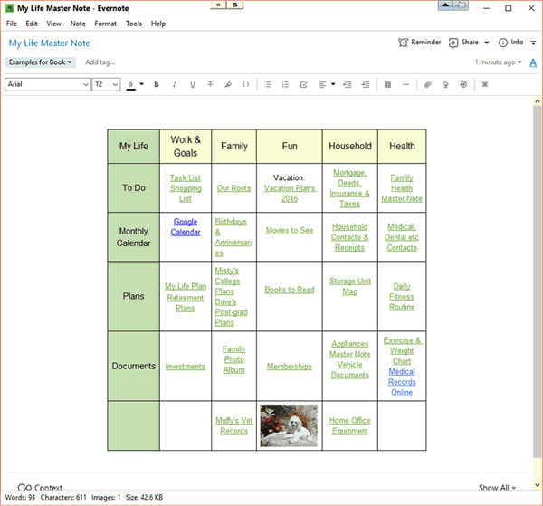

## Table of Contents

## What are Master Notes?

Master Notes are detailed summaries or notes that students or professionals create to help them study or understand a subject better. They are usually made after going through a lot of material like books, lectures, or articles. The idea is to put all the important information in one place, so it's easier to review and remember.

These notes are very useful because they help people focus on the main points without getting lost in too many details. For example, a student might use Master Notes to prepare for a big exam, where they need to remember a lot of information quickly. By having everything organized in Master Notes, it saves time and makes studying more effective.

## Why are Master Notes important for studying?

Master Notes are important for studying because they help you organize all the important information in one place. When you make Master Notes, you go through all your materials like books, lectures, and articles, and pick out the main points. This way, you don't have to go back and forth between different sources when you're trying to study. It saves you a lot of time and makes it easier to understand the subject.

Another reason Master Notes are helpful is that they make it easier to remember things. When you write down the key ideas and facts in your own words, it helps you understand them better. Plus, having everything in one place means you can review it quickly before a test or exam. This can make a big difference in how well you do in your studies.

## How do Master Notes differ from regular notes?

Master Notes are different from regular notes because they are much more detailed and complete. Regular notes are usually taken during a class or while reading a book, and they might just have the main points or things you need to remember right away. But Master Notes are made after you have looked at a lot of different sources. They put all the important information together in one place, so you can see the big picture of the subject.

Another way Master Notes are different is that they help you understand the subject better. When you make Master Notes, you have to think about how all the pieces of information fit together. This can help you see connections and patterns that you might miss with regular notes. Also, because Master Notes are so complete, they are really useful for studying for big tests or exams. You can go over everything you need to know without having to look through a bunch of different notebooks or papers.

## What are the basic components of Master Notes?

Master Notes have a few basic parts that make them useful. First, they include the main ideas from all the materials you've looked at. This means you'll find summaries of important topics, key facts, and definitions. These are the things you need to know well to understand the subject. Master Notes also have examples and explanations that help make the main ideas clearer. This way, you can see how the ideas work in real life or in different situations.

Another part of Master Notes is the organization. They are set up in a way that makes it easy to find information quickly. This might mean using headings, subheadings, and even color-coding to show different sections or types of information. Master Notes often have a table of contents or an index, so you can jump right to the part you need. This organization helps you study more efficiently because you don't waste time looking for things.

Lastly, Master Notes often include connections between different pieces of information. They show how different topics relate to each other, which can help you understand the subject better. This might be done through diagrams, charts, or just by explaining how one idea leads to another. By seeing these connections, you can remember the information more easily and see the big picture of the subject.

## Can you provide a simple example of Master Notes for a beginner?

Imagine you're learning about the solar system. Your Master Notes would start with a big heading that says "The Solar System." Under that, you'd have sections like "Planets," "Moons," and "The Sun." In the "Planets" section, you'd write short descriptions of each planet, like how Jupiter is the biggest and has a big red spot. You'd also add that Mars is red and called the "Red Planet." For the "Moons" section, you'd list the moons of each planet, like how Earth has one moon and Saturn has many. The "The Sun" section would explain that the sun is a star at the center of the solar system and gives us light and heat.

To make your Master Notes easy to use, you'd use different colors or underlines to show what's important. For example, you might underline the names of the planets and use a different color for the moons. You'd also add some pictures or diagrams to help you remember things better, like a picture of the solar system with all the planets in order. At the end of your Master Notes, you could have a little summary that says things like "The solar system has eight planets: Mercury, Venus, Earth, Mars, Jupiter, Saturn, Uranus, and Neptune." This way, you can quickly go over the main points before a test.

## How can Master Notes be adapted for different subjects?

Master Notes can be adapted for different subjects by focusing on the key elements that are important for each subject. For example, if you're studying history, your Master Notes might include timelines, important events, and key figures. You would organize your notes by time periods or by themes, like "World War II" or "The Renaissance." You would also include short summaries of each event or person, and maybe even some maps or pictures to help you remember things better. This way, you can see how everything fits together and understand the big picture of history.

For a subject like math, Master Notes would look different. You would focus on formulas, theorems, and examples of how to solve problems. You might organize your notes by topic, like "Algebra" or "Geometry," and include step-by-step solutions to different types of problems. It's also helpful to have practice problems and their answers in your Master Notes, so you can test yourself and see if you understand the material. By having all this information in one place, you can study more effectively and do better on math tests.

## What techniques can enhance the effectiveness of Master Notes?

One way to make Master Notes more effective is by using different ways to show information. You can use colors, underlines, and bold text to highlight important points. This makes it easier to see what's most important when you're studying. You can also add pictures, diagrams, and charts to help you understand and remember things better. For example, a diagram can show how different ideas connect, and a chart can help you compare things side by side. By using these different ways to show information, you can make your Master Notes more interesting and easier to use.

Another technique is to keep your Master Notes organized and easy to find things in. You can do this by using headings and subheadings to break your notes into smaller sections. A table of contents or an index at the beginning of your notes can help you jump to the part you need quickly. It's also a good idea to review and update your Master Notes regularly. As you learn more, you can add new information or change things that aren't clear. By keeping your Master Notes up to date and organized, you can study more efficiently and do better in your classes.

## How do you organize Master Notes for long-term retention?

To organize Master Notes for long-term retention, you need to make them easy to use and understand. Start by breaking your notes into clear sections with headings and subheadings. This way, you can quickly find what you need. Use a table of contents or an index at the beginning to help you jump to the right part. Also, use colors, underlines, and bold text to highlight the most important information. This makes it easier to see what you need to remember. Adding pictures, diagrams, and charts can also help because they show information in a different way that's easier to remember.

Another important thing is to review and update your Master Notes regularly. As you learn more, you can add new information or change things that aren't clear. This keeps your notes up to date and helps you remember things better. Try to go over your Master Notes often, not just before a test. This way, the information stays fresh in your mind. By keeping your Master Notes organized and reviewing them regularly, you can remember the information for a long time and do well in your studies.

## What are some advanced formatting techniques for Master Notes?

One advanced formatting technique for Master Notes is using mind maps. A mind map is a diagram that shows ideas and how they connect to each other. You can start with a big idea in the middle and draw lines to smaller ideas around it. This helps you see the big picture and understand how different parts of the subject fit together. It's also a good way to remember things because it uses pictures and colors, which can make learning more fun and easier.

Another technique is using flashcards within your Master Notes. You can make flashcards for important facts, definitions, or formulas and keep them with your notes. This way, you can test yourself and see what you need to study more. Flashcards are great for quick reviews and can help you remember things better over time. By adding them to your Master Notes, you can have everything you need in one place and study more effectively.

A third technique is using digital tools to make your Master Notes interactive. You can use apps or software that let you add links, videos, and audio to your notes. This can make your notes more interesting and help you understand things better. For example, you can link to a video that explains a concept or add an audio [clip](/wiki/clip) of a lecture. By using these digital tools, you can make your Master Notes more useful and keep them up to date easily.

## How can digital tools be integrated into the creation of Master Notes?

Digital tools can make creating Master Notes easier and more fun. You can use apps like Evernote or OneNote to write your notes and add pictures, videos, and links. These apps let you organize your notes into different sections and folders, so it's easy to find what you need. You can also use tools like Google Docs to work on your Master Notes with friends or classmates. This way, you can share ideas and help each other understand the subject better. Plus, digital tools let you update your notes quickly, so they stay fresh and useful.

Another way to use digital tools is by making your Master Notes interactive. You can add links to websites or videos that explain things in more detail. For example, if you're studying science, you can link to a video that shows an experiment. You can also use apps like Quizlet to make flashcards right in your Master Notes. This way, you can test yourself and see what you need to study more. By using digital tools, you can make your Master Notes more interesting and help yourself remember things better.

## What are some case studies or examples of Master Notes used by experts in their fields?

A famous example of Master Notes used by an expert is from the physicist Richard Feynman. He was known for his Feynman Notes, which he used to understand and teach complex physics concepts. Feynman would break down big ideas into simple parts and draw diagrams to show how things worked. He used different colors and symbols to make his notes easy to read and remember. His Master Notes helped him win a Nobel Prize and became a model for students and other scientists to learn from.

Another example comes from the world of business, where Warren Buffett, a successful investor, uses detailed notes to keep track of his investments and ideas. Buffett's Master Notes include summaries of company reports, market trends, and his own thoughts on different businesses. He organizes his notes by company and sector, making it easy to find information quickly. By regularly updating his notes, Buffett can make smart decisions and has become one of the richest people in the world. His approach shows how Master Notes can help in making important choices and achieving success in a field.

## How can Master Notes be used to prepare for complex examinations or professional certifications?

Master Notes are very helpful for preparing for complex exams or professional certifications. They let you put all the important information in one place. When you make Master Notes, you go through all your [books](/wiki/algo-trading-books), lectures, and other materials and pick out the main points. This way, you don't have to go back and forth between different sources when you're studying. It saves you time and makes it easier to understand the subject. For example, if you're studying for a medical certification, your Master Notes could have summaries of different diseases, treatments, and important facts. By having everything organized, you can focus on learning and not on finding the information.

Another way Master Notes help is by making it easier to remember things. When you write down the key ideas and facts in your own words, it helps you understand them better. Plus, having everything in one place means you can review it quickly before a test or exam. This can make a big difference in how well you do. For example, if you're preparing for a law exam, your Master Notes could include case summaries, legal principles, and practice questions. By regularly going over your Master Notes, you can keep the information fresh in your mind and feel more confident on exam day.

## References & Further Reading

[1]: Bergstra, J., Bardenet, R., Bengio, Y., & Kégl, B. (2011). ["Algorithms for Hyper-Parameter Optimization."](https://dl.acm.org/doi/10.5555/2986459.2986743) Advances in Neural Information Processing Systems 24.

[2]: Lopez de Prado, M. (2018). ["Advances in Financial Machine Learning"](https://www.amazon.com/Advances-Financial-Machine-Learning-Marcos/dp/1119482089). Wiley.

[3]: Aronson, D. R. (2006). ["Evidence-Based Technical Analysis: Applying the Scientific Method and Statistical Inference to Trading Signals"](https://www.amazon.com/Evidence-Based-Technical-Analysis-Scientific-Statistical/dp/0470008741). Wiley.

[4]: Jansen, S. (2020). ["Machine Learning for Algorithmic Trading"](https://github.com/stefan-jansen/machine-learning-for-trading). Packt Publishing.

[5]: Chan, E. P. (2008). ["Quantitative Trading: How to Build Your Own Algorithmic Trading Business"](https://github.com/ftvision/quant_trading_echan_book). Wiley.