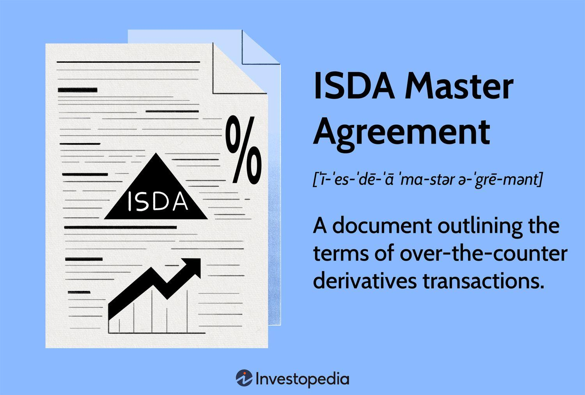

## Table of Contents

## What is a Master Swap Agreement?

A Master Swap Agreement is a contract between two parties that outlines the terms for entering into swap transactions. Swaps are financial instruments where two parties agree to exchange cash flows or other financial obligations over a set period. The agreement acts like a framework that helps both parties understand their rights and responsibilities when they decide to do these swaps. It's commonly used in financial markets, especially by banks and big companies, to manage risks related to interest rates, currencies, or commodities.

The main benefit of a Master Swap Agreement is that it saves time and effort. Instead of negotiating the terms of each swap from scratch, the parties can use the master agreement as a starting point. This makes it easier to do multiple swaps quickly and efficiently. The agreement usually includes details like how payments will be made, what happens if one party can't meet their obligations, and how disputes will be resolved. By having these terms set out in advance, both parties can feel more secure when they enter into swap transactions.

## What are the key components of a Master Swap Agreement?

A Master Swap Agreement has several important parts that help make sure both parties know what they're getting into. One key part is the definitions section, which explains all the important words and terms used in the agreement. This helps avoid confusion and makes sure everyone is on the same page. Another important part is the payment terms, which say how and when money will be exchanged between the parties. This includes details like the calculation of payments, the dates when payments are due, and what happens if someone doesn't pay on time.

Another crucial component is the events of default and termination section. This part outlines what happens if one party can't meet their obligations, like if they go bankrupt or fail to make payments. It explains the steps both parties need to take to end the agreement and settle any remaining payments. The agreement also includes a dispute resolution section, which lays out how any disagreements will be handled, whether through negotiation, mediation, or going to court. By covering these key areas, the Master Swap Agreement provides a clear framework for managing swap transactions and helps both parties feel more secure.

## How does a Master Swap Agreement function in financial markets?

A Master Swap Agreement helps people in financial markets manage their money risks. It's like a big rule book that two parties agree on before they start swapping things like interest rates or currencies. This agreement makes it easier for them to do these swaps without having to make a new deal every time. It saves time and makes things clearer because everyone knows the rules from the start. For example, if a bank wants to swap its variable [interest rate](/wiki/interest-rate-trading-strategies) for a fixed one with another bank, they can use the Master Swap Agreement to make sure they both understand how the swap will work.

The agreement covers important stuff like how payments will be made, what happens if someone can't pay, and how to solve any disagreements. This helps keep things smooth and fair. In the financial world, where money moves fast and things can change quickly, having a clear set of rules is really helpful. It lets banks and big companies do lots of swaps without worrying too much about the small details each time. So, the Master Swap Agreement is a key tool that makes managing financial risks easier and more reliable.

## What is the historical origin of the Master Swap Agreement?

The Master Swap Agreement started to become important in the 1980s. Back then, financial markets were getting more complicated, and people wanted a better way to manage risks with swaps. The International Swaps and Derivatives Association (ISDA) saw this need and created the first Master Swap Agreement in 1985. This agreement helped make things simpler and safer for everyone involved in swaps.

Since then, the Master Swap Agreement has been updated a few times to keep up with changes in the financial world. The ISDA keeps working on it to make sure it covers new types of swaps and deals with new risks. Today, it's a key tool that banks and big companies use all over the world to manage their financial risks in a clear and reliable way.

## Who are the typical parties involved in a Master Swap Agreement?

The typical parties involved in a Master Swap Agreement are usually big financial institutions like banks, and large companies that deal with a lot of money. Banks often use these agreements to manage their risks from loans and investments. For example, a bank might want to swap its variable interest rate for a fixed one to make its income more predictable. Big companies, especially those that do business in different countries, also use Master Swap Agreements. They might want to swap currencies to protect themselves from changes in exchange rates.

Sometimes, other types of organizations can be involved too, like investment funds or government agencies. These groups might use swaps to manage their money more effectively. For instance, an investment fund might use a swap to hedge against changes in commodity prices. No matter who the parties are, the Master Swap Agreement helps them work together smoothly by setting clear rules and expectations for their swap transactions.

## What are the benefits of using a Master Swap Agreement?

Using a Master Swap Agreement makes things easier and safer for everyone involved. It's like a big rule book that two parties agree on before they start swapping things like interest rates or currencies. This agreement saves time because they don't have to make a new deal every time they want to do a swap. Instead, they can use the same rules over and over again. This makes the process quicker and less confusing because everyone knows what to expect from the start.

Another big benefit is that the Master Swap Agreement helps manage risks better. It clearly says what happens if someone can't pay or if there's a problem with the swap. This makes both parties feel more secure because they know how to handle any issues that come up. By having these rules in place, banks and big companies can focus on their main business without worrying too much about the small details of each swap.

## What are the potential risks associated with Master Swap Agreements?

Even though Master Swap Agreements help manage risks, they can still have some problems. One big risk is that if one party can't pay, it can cause big problems for the other party. This is called counterparty risk. If a bank or company goes bankrupt, the other side might not get the money they were supposed to get from the swap. This can lead to big losses and financial trouble.

Another risk is that the value of the swap might change a lot over time. This is called market risk. For example, if interest rates or currency values change a lot, the swap might not be as good a deal as it was at the start. This can make it hard for the parties to predict their future money situation. It's important for everyone involved to keep an eye on these risks and have plans to deal with them if they happen.

## How have Master Swap Agreements evolved over time?

Master Swap Agreements have changed a lot since they first started in the 1980s. Back then, the International Swaps and Derivatives Association (ISDA) made the first agreement to help people manage their money risks better. As financial markets got more complicated, the agreement needed to keep up. Over the years, the ISDA updated the Master Swap Agreement to include new types of swaps and to deal with new risks that came up. These updates made the agreement more useful and safer for everyone using it.

Today, Master Swap Agreements are used all over the world by banks and big companies. They help these groups manage their money more effectively and protect themselves from changes in interest rates, currencies, and other financial stuff. The agreement has become a key tool that makes it easier for people to do lots of swaps without having to make new deals every time. By keeping the agreement up to date, the ISDA makes sure it can handle the new challenges that come up in the fast-changing world of finance.

## What are the differences between various types of Master Swap Agreements?

Master Swap Agreements come in different types, mainly because they need to fit different kinds of swaps and the needs of the people using them. The most common type is the ISDA Master Agreement, which is used a lot in financial markets. It's like a big rule book that helps banks and big companies do swaps for things like interest rates or currencies. Another type is the bespoke Master Swap Agreement, which is made just for one specific deal. This type is used when the standard ISDA agreement doesn't fit the special needs of the swap, so the parties make their own rules.

These different types of agreements have some key differences. The ISDA Master Agreement is very detailed and covers a lot of different situations, so it's good for doing many swaps over time. It's like a one-size-fits-most solution. On the other hand, a bespoke agreement is more like a custom-made suit. It's made just for one deal, so it can be more flexible and fit the exact needs of the parties involved. But, it takes more time and effort to make because it's not a standard agreement. Both types help manage risks, but they do it in different ways depending on what the parties need.

## How do regulatory frameworks impact Master Swap Agreements?

Regulatory frameworks have a big impact on Master Swap Agreements. They set rules that everyone has to follow when they do swaps. For example, after the financial crisis in 2008, new rules were made to make swaps safer. These rules say things like how much money people need to have to do swaps, how they need to report their swaps to the government, and how they need to handle risks. These rules help make sure that swaps are done in a way that doesn't cause big problems for the economy.

Because of these rules, the way Master Swap Agreements are written and used has changed. Now, the agreements have to include things like how to report swaps and how to make sure there's enough money to cover risks. This makes the agreements more complicated, but it also makes them safer. Banks and big companies have to follow these rules to keep doing swaps, so they work closely with regulators to make sure their agreements meet all the requirements. This helps keep the financial markets stable and protects everyone involved in swaps.

## What are some notable case studies or examples of Master Swap Agreements in practice?

One well-known example of a Master Swap Agreement in action is the case of Lehman Brothers during the 2008 financial crisis. Lehman Brothers had many swap agreements with other banks and companies. When Lehman Brothers went bankrupt, it caused big problems for the other parties involved in the swaps. This showed how important it is to have clear rules in the Master Swap Agreement about what happens if one party can't pay. It also led to new rules being made to make swaps safer and more transparent.

Another example is how big companies like Ford use Master Swap Agreements to manage their money risks. Ford might use swaps to protect itself from changes in interest rates or currency values. By having a Master Swap Agreement with a bank, Ford can do these swaps quickly and easily without having to make a new deal every time. This helps Ford focus on making cars while the bank helps manage the financial risks. It shows how these agreements can be very useful for big companies in managing their money effectively.

## What future trends might influence the development of Master Swap Agreements?

In the future, technology will likely have a big impact on Master Swap Agreements. As more and more financial deals happen online, the agreements might need to include rules about how to use technology safely. For example, blockchain and smart contracts could make swaps faster and more secure. These technologies can automatically check if everyone is following the rules and make payments happen without any delays. This could make Master Swap Agreements easier to use and less risky for everyone involved.

Also, new rules from governments might change how Master Swap Agreements are written and used. After big financial problems like the 2008 crisis, regulators keep making new rules to keep the financial markets safe. These rules could focus on things like making sure there's enough money to cover risks or making it easier to see what swaps are happening. As these rules change, the agreements will need to change too, to make sure they still work well for banks and big companies. Keeping up with these trends will help make Master Swap Agreements even more useful and reliable in the future.

## References & Further Reading

[1]: Stulz, R. M. (1996). ["Rethinking risk management."](https://onlinelibrary.wiley.com/doi/abs/10.1111/j.1745-6622.1996.tb00295.x) Harvard Business Review.

[2]: Hull, J. C. (2015). ["Options, Futures, and Other Derivatives"](https://www.amazon.com/Options-Futures-Other-Derivatives-Global/dp/1292410655) (9th ed.). Pearson.

[3]: Chance, D. M., & Brooks, R. (2015). ["An Introduction to Derivatives and Risk Management"](https://books.google.com/books/about/Introduction_to_Derivatives_and_Risk_Man.html?id=b8PgBQAAQBAJ) (9th ed.). Cengage Learning.

[4]: ISDA. (2003). ["ISDA Master Agreement (2002): A Comprehensive Guide."](https://www.isda.org/traditional-protocol/2002-isda-master-agreement-protocol/) International Swaps and Derivatives Association.

[5]: Lopez de Prado, M. (2018). ["Advances in Financial Machine Learning"](https://www.amazon.com/Advances-Financial-Machine-Learning-Marcos/dp/1119482089) Wiley.

[6]: Jarrow, R. A., & Turnbull, S. M. (1999). ["Derivative Securities"](https://archive.org/details/derivativesecuri0000jarr) Cengage Learning.

[7]: Pirrong, C. (1999). ["The Economics of Clearing in Derivatives Markets: Netting, Asymmetric Information, and the Sharing of Default Risks through a Central Counterparty"](https://www.bauer.uh.edu/spirrong/clearing_organization.pdf) Journal of Financial Intermediation.