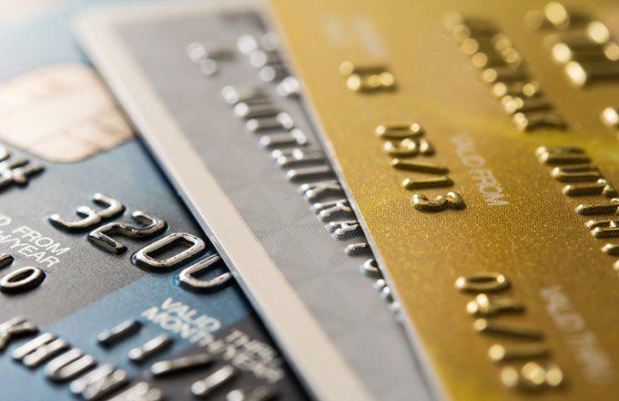

The world of payment processing is complex, involving a multitude of players who ensure transactions are completed efficiently and securely. A pivotal entity in this ecosystem is the payment processing acquirer, an institution that serves as the intermediary between merchants and card networks. Mastercard, a leading global payment processor, plays a critical role as an acquirer, facilitating transactions through secure and robust partnerships with merchants worldwide.

Mastercard's function as an acquirer goes beyond simply transmitting payment information. It ensures that transactions are carried out smoothly by managing the communication between the merchant's bank, the cardholder's bank, and the card network. This intricate process involves multiple layers of security and compliance measures, crucial for maintaining the integrity of financial transactions.

One of the ways Mastercard enhances its processing capabilities is through the integration of algorithmic trading into its payment ecosystem. Algorithmic trading, primarily known for its applications in financial markets, involves using algorithms to execute trades at optimal conditions. In payment processing, these algorithms can optimize transaction routing, ensuring that payments are processed through the fastest and most cost-effective channels, thereby improving transaction speed and efficiency.

Acquirers like Mastercard hold significant importance in the financial landscape. They provide the necessary infrastructure and support for merchants to accept various payment methods, including credit and debit cards. This not only aids in the expansion of electronic payments but also drives economic growth by enabling businesses to tap into broader consumer markets.

Mastercard's strategic collaborations, security protocols, and technological advancements position it as a leader in the payment processing industry. By understanding its role and contributions, businesses can better appreciate the intricate mechanisms that underpin secure and efficient financial transactions, while also recognizing the potential of emerging technologies like algorithmic trading to transform this vital sector.

## Table of Contents

## Understanding Payment Processing Acquirers

Payment processing acquirers play a crucial role in the financial ecosystem, acting as intermediaries between merchants and financial institutions. Acquirers facilitate electronic payment transactions by processing credit and debit card payments, ensuring that funds are transferred securely and efficiently from a customer's account to a merchant's account. They provide the necessary infrastructure for merchants to accept card payments, thus enabling seamless commerce across various platforms.

**Mastercard as an Acquirer**

Mastercard operates as a payment processing acquirer by providing the technology and infrastructure needed to facilitate transactions between merchants and card-issuing banks. It ensures smooth transaction flows by authorizing transactions, guaranteeing fund transfers, and managing the communication between all parties involved. Mastercard's acquiring services enable merchants to accept a wide range of cards, providing flexibility and security to both merchants and consumers. By partnering with financial institutions worldwide, Mastercard strengthens its acquiring capabilities and expands its reach in the global market, offering expansive support to merchants across diverse regions.

**Differentiation Between Acquirers, ISOs, and Aggregators**

The payment processing landscape involves distinct entities, including acquirers, Independent Sales Organizations (ISOs), and aggregators, each serving specific functions. 

- **Acquirers**: As mentioned, acquirers manage the transaction flow and settle funds in the merchant's account. They hold the primary relationship with the merchant and bear responsibility for the transaction's security and compliance with regulations.

- **Independent Sales Organizations (ISOs)**: These entities market the acquiring services provided by acquirers. ISOs operate as intermediaries that bring merchants and acquirers together, offering a range of payment solutions to meet merchants' needs without directly handling the transaction settlement.

- **Aggregators**: Aggregators, often referred to as payment facilitators, bundle multiple merchants under a single master account. This model allows small businesses to process transactions without the need for an individual merchant account, providing a simpler and often more cost-effective solution for small to medium-sized enterprises.

**Key Services Offered by Acquirers**

Acquirers offer a suite of essential services to merchants, which include:

- **Merchant Account Management**: Acquirers set up and manage merchant accounts, facilitating credit card acceptance and ensuring that payment processes adhere to industry regulations and standards.

- **Transaction Settlement**: This involves transferring funds from the customer's bank to the merchant's account, ensuring the merchant receives payment for goods or services rendered.

- **Fraud Management**: Acquirers implement security protocols to detect and prevent fraudulent activities, safeguarding both merchants and consumers from potential risks.

- **Compliance and Reporting**: Acquirers ensure that transactions comply with the Payment Card Industry Data Security Standard (PCI DSS) and other relevant regulations. They provide detailed transaction reporting, allowing merchants to track their sales and analyze their business performance effectively.

Through these services, acquirers such as Mastercard not only facilitate transactions but also enhance the overall efficiency and security of the payment processing ecosystem, supporting the dynamic needs of merchants in today's digital economy.

## Mastercard's Role as an Acquirer

Mastercard, as a prominent payment processing acquirer, plays a crucial role in facilitating global financial transactions. With a network spanning over 210 countries and territories, Mastercard has established partnerships with numerous financial institutions, enhancing its ability to offer comprehensive acquiring services. These partnerships enable Mastercard to provide merchants with the tools and platforms necessary to process card payments efficiently and securely.

A key component of Mastercard's strategy as an acquirer is ensuring transaction security and compliance with regulatory standards. Security in payment transactions is vital, and Mastercard employs several measures to protect sensitive information. One significant standard in this context is the Payment Card Industry Data Security Standard (PCI DSS). Compliance with PCI DSS is crucial for safeguarding cardholder data during transactions. Mastercard actively works with merchants and financial institutions to ensure adherence to PCI compliance, thereby minimizing the risk of data breaches and fraud.

Mastercard's efforts in transaction security also include implementing tokenization and encryption technologies. These technologies replace sensitive card information with a unique identifier or 'token' during transactions, making it more challenging for unauthorized individuals to access actual card data.

In terms of fees and charges, Mastercard's acquiring services involve several components. Merchants engaging with Mastercard's acquiring services typically encounter interchange fees, assessment fees, and processor fees. Interchange fees are set by Mastercard and are essentially the cost paid by merchants' banks to cardholders' banks for each transaction processed. Assessment fees are charged by Mastercard to cover network maintenance and operation costs, calculated as a percentage of the transaction [volume](/wiki/volume-trading-strategy).

The understanding of these fees is vital for merchants as they impact the overall cost of accepting card payments. Mastercard strives to maintain a transparent fee structure, providing merchants with clarity on the cost implications associated with its acquiring services.

Mastercard's role as an acquirer is integral to the seamless processing of transactions globally. Through strategic partnerships, a strong emphasis on security and compliance, and a transparent fee structure, Mastercard supports merchants in managing their payment processes effectively while ensuring the safety and security of their customers' information.

## The Intersection of Algo Trading and Acquiring Services

Algorithmic trading, also known as algo trading, involves the use of computer algorithms to execute financial transactions at high speeds and volumes. These algorithms are designed to make decisions on trading activities based on pre-defined criteria, such as timing, price, or quantity, often without human intervention. Algo trading has gained significance in the financial sector due to its ability to process vast amounts of data swiftly and make real-time assessments that drive trading decisions.

In the context of payment processing, [algorithmic trading](/wiki/algorithmic-trading) can play a crucial role in optimizing transaction routing. Transaction routing refers to the process of selecting the most efficient path to complete a financial transaction, which may involve several intermediaries such as banks, payment gateways, and acquirers. By leveraging advanced algorithms, payment processors like Mastercard can enhance the efficiency of transaction routing by minimizing latency, reducing costs, and improving the overall speed of payment settlements.

One potential challenge in integrating algorithmic trading with Mastercard’s services lies in ensuring system compatibility and security. As algorithmic trading entails handling a multitude of transactions at high speeds, it requires robust IT infrastructure and vigilant security protocols to prevent fraud and cyberattacks. On the other hand, the opportunity lies in adopting adaptive algorithms that can learn and evolve from transactional data, further refining the decision-making process for optimal routing and other payment processing activities.

Several companies have successfully integrated algorithmic trading into payment systems, illustrating both the feasibility and benefits of this approach. For example, Stripe, a leading payment processing company, employs sophisticated algorithms to enhance its fraud detection system, reducing the likelihood of fraudulent transactions. Similarly, PayPal uses algorithms to authenticate hundreds of transactions per second, optimizing both user experience and security.

These case studies underscore the potential of algorithmic trading to transform payment processing through increased speed, reduced costs, and enhanced security. By adopting and integrating sophisticated algorithms, acquirers like Mastercard can position themselves at the forefront of technological innovation, delivering more efficient and reliable services to businesses and consumers alike.

## Technological Advancements and Future Trends

Technological advancements, particularly in [artificial intelligence](/wiki/ai-artificial-intelligence) (AI) and [machine learning](/wiki/machine-learning), are reshaping the landscape of payment processing. These technologies enhance transaction security, improve fraud detection, and optimize payment routing. Machine learning algorithms analyze transaction data to identify patterns indicative of fraudulent activity, allowing for real-time prevention measures. AI-driven systems enable predictive analytics, providing insights into consumer behavior and enabling personalized payment experiences.

Digital transformation in the financial industry is characterized by the integration of innovative technologies that streamline operations and improve user experience. Contactless payments, mobile wallets, and biometric authentication are examples of innovations that enhance convenience and security. The shift towards digital-first banking is driven by consumer demand for seamless and efficient payment options.

As a leading acquirer, Mastercard is poised to evolve by incorporating emerging technologies into its services. The integration of AI and machine learning can enhance Mastercard's transaction processing capabilities, reducing latency and increasing reliability. Additionally, these technologies support Mastercard's compliance with evolving regulatory standards by ensuring robust security protocols.

Cryptocurrencies and blockchain technology present opportunities to redefine traditional payment processing. Blockchain's decentralized nature offers enhanced transparency and security, characteristics that could revolutionize cross-border transactions. Cryptocurrencies, by reducing dependency on fiat currency conversions, enable faster and more cost-effective payments. However, widespread adoption faces challenges, including regulatory concerns and market [volatility](/wiki/volatility-trading-strategies).

In conclusion, the financial industry's future is intricately linked to technological advancements. Mastercard and other acquirers are likely to harness AI, machine learning, and blockchain to improve efficiency and foster innovation. Stakeholders in the payment ecosystem must remain adaptable to leverage these technologies, ensuring their relevance in a rapidly evolving market.

## Conclusion

In summary, Mastercard stands as a pivotal acquirer in the payment processing industry, leveraging its extensive global network and partnerships with financial institutions. Its role as an acquirer goes beyond merely facilitating transactions; it ensures transaction security and regulatory compliance, thereby building trust among merchants and consumers alike. Mastercard's dedication to PCI compliance and the safe handling of transactions underscores its commitment to maintaining high standards in financial operations.

Algorithmic trading presents promising opportunities to enhance transaction efficiency within Mastercard's payment processing ecosystem. By optimizing transaction routing and reducing latency, algorithmic trading can significantly improve payment processing speed and accuracy. This integration aligns with the broader trend of technological advancements in the financial sector, promising more agile and efficient payment solutions.

As the financial landscape continuously evolves, businesses must remain informed and adaptable to technological changes. Innovations such as AI, machine learning, and blockchain technology have the potential to transform traditional payment processing methods radically. By embracing these advancements, Mastercard and other acquirers can stay competitive and meet the growing demands of modern consumers and businesses. Ultimately, staying informed and flexible will be key for all stakeholders to thrive in the ever-evolving world of payment processing.

## References & Further Reading

[1]: MasterCard. (2020). ["Acquirer: Your Guide to the Acquiring Process."](https://www.corbincustomworks.com/products/bundledkits-defender) MasterCard Business.

[2]: Lopez de Prado, M. (2018). ["Advances in Financial Machine Learning."](https://www.amazon.com/Advances-Financial-Machine-Learning-Marcos/dp/1119482089) Wiley.

[3]: ["PCI Security Standards Council. Payment Card Industry Data Security Standard (PCI DSS)."](https://www.pcisecuritystandards.org/) PCI Security Standards.

[4]: Jansen, S. (2020). ["Machine Learning for Algorithmic Trading."](https://github.com/stefan-jansen/machine-learning-for-trading) Packt Publishing.

[5]: Aronson, D. R. (2006). ["Evidence-Based Technical Analysis: Applying the Scientific Method and Statistical Inference to Trading Signals."](https://www.amazon.com/Evidence-Based-Technical-Analysis-Scientific-Statistical/dp/0470008741) Wiley.