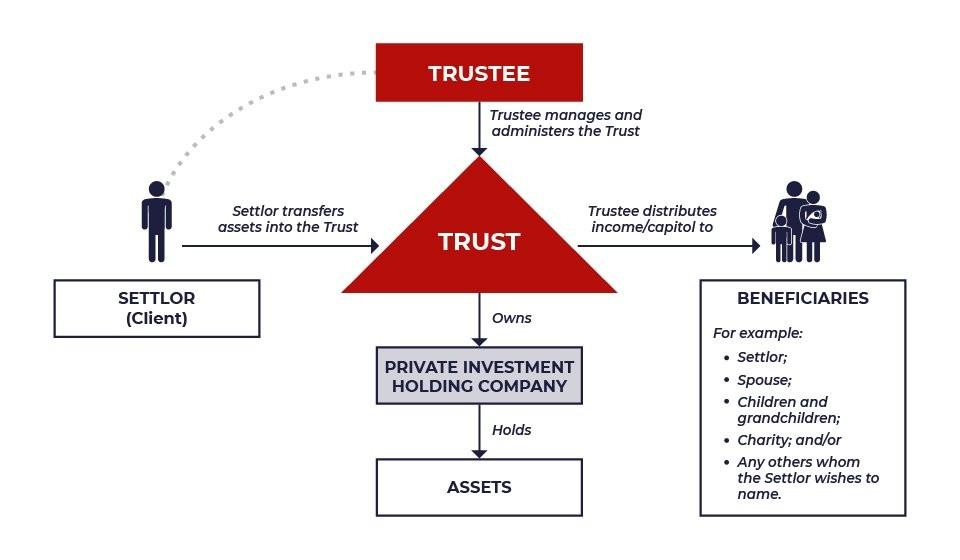

## Table of Contents

## What is a Master's Trust?

A Master's Trust is a type of financial arrangement often used in pension funds or employee benefit plans. It is a way for a company to manage and invest money for the benefit of its employees. The company puts money into the trust, and then a trustee manages the money according to the rules set out in the trust agreement. This helps keep the money safe and ensures it is used for the right purposes, like providing pensions or other benefits to employees when they retire.

The main advantage of a Master's Trust is that it allows for professional management of the funds. Instead of each employee having to manage their own investments, a professional trustee handles everything. This can lead to better investment decisions and potentially higher returns. It also simplifies things for the company, as they can focus on their business while the trustee takes care of the financial details. Overall, a Master's Trust helps both the company and its employees by providing a structured and secure way to manage retirement funds.

## How does a Master's Trust function?

A Master's Trust works by pooling money from a company into a special account called a trust. The company puts money into this trust for the benefit of its employees, usually for things like pensions or retirement plans. A trustee, who is a professional money manager, is in charge of the trust. The trustee's job is to follow the rules set out in the trust agreement and make smart choices about how to invest the money. This helps make sure the money grows over time and is safe for when employees need it.

The main advantage of a Master's Trust is that it takes the burden off the company and the employees. Instead of each employee having to figure out how to invest their own money, the trustee does it for everyone. This can lead to better investment choices and higher returns because the trustee is an expert. It also makes things easier for the company because they don't have to worry about managing the money themselves. They can focus on running their business while the trustee handles the financial side of things.

## What are the primary benefits of using a Master's Trust?

One big benefit of using a Master's Trust is that it helps keep the money safe and well-managed. A professional trustee takes care of the money and makes sure it's invested wisely. This means the money can grow over time, which is good for employees when they retire. It also takes away the worry for the company because they don't have to manage the money themselves. They can trust that a professional is handling everything according to the rules.

Another benefit is that it makes things simpler for everyone. Instead of each employee having to figure out how to invest their own money, the trustee does it for all of them. This can lead to better investment choices because the trustee knows a lot about money and investing. It also means the company doesn't have to spend time and resources on managing the funds. They can focus on their business while the trustee takes care of the financial details.

## Who typically uses a Master's Trust?

A Master's Trust is mostly used by companies that want to take care of their employees' retirement money. These companies put money into the trust to help their workers save for the future. This is common in big businesses that have a lot of employees and need a good way to manage their pension plans.

The trust is also helpful for the employees because it means they don't have to worry about investing their own money. A professional trustee manages everything for them, so they can focus on their jobs. This setup works well for both the company and the employees, making it easier to plan for retirement.

## What are the legal requirements for establishing a Master's Trust?

Setting up a Master's Trust involves following certain legal rules to make sure everything is done right. A company needs to create a trust agreement that spells out how the money will be managed and used. This agreement must be clear about who the trustee is and what they are allowed to do with the money. The company also has to make sure the trust follows all the laws about pensions and employee benefits, which can be different depending on where the company is located.

Once the trust is set up, the company needs to keep good records and report to the right government agencies. This helps make sure the trust is working the way it should and that the employees' money is safe. The trustee also has to follow strict rules about how they invest the money and report on what they are doing. This way, everyone knows the money is being taken care of properly and used for the right reasons.

## How does a Master's Trust differ from other types of trusts?

A Master's Trust is different from other types of trusts because it is mainly used for managing pension funds or employee benefits. In a Master's Trust, a company puts money into the trust for its employees' retirement. A professional trustee then manages this money according to the rules set out in the trust agreement. This is different from other trusts, like a family trust, which might be used to pass on money or property to family members. A family trust is more about personal wealth and inheritance, while a Master's Trust focuses on employee benefits and pensions.

Another way a Master's Trust differs is in how it is managed and regulated. In a Master's Trust, the trustee has to follow strict rules about how they invest the money and report on their actions. This is to make sure the employees' retirement funds are safe and used correctly. Other trusts, like a charitable trust, might have different rules and focus on supporting a cause or organization. A charitable trust is managed to benefit the public or a specific group, not just the employees of a company. So, while all trusts have some things in common, like having a trustee and a trust agreement, the purpose and rules can be very different depending on the type of trust.

## What are the common mechanisms involved in managing a Master's Trust?

Managing a Master's Trust involves several key mechanisms to make sure the money is handled well. The first is setting up a trust agreement. This is a document that explains how the money should be managed and used. It names a professional trustee who will take care of the money. The trustee's job is to follow the rules in the agreement and invest the money wisely. They also need to keep good records and report on what they are doing. This helps make sure the money is safe and used the right way.

Another important mechanism is following the laws and rules about pensions and employee benefits. These laws can be different depending on where the company is located. The company and the trustee need to make sure they are doing everything correctly. This includes reporting to the right government agencies and making sure the trust is working as it should. By following these mechanisms, a Master's Trust can help take care of employees' retirement money in a safe and organized way.

## Can a Master's Trust be used for estate planning?

A Master's Trust is mainly used for managing pension funds and employee benefits, not for estate planning. It helps companies take care of their employees' retirement money. The company puts money into the trust, and a professional trustee manages it to make sure it grows over time. This setup is focused on helping employees save for the future, not on passing on wealth to family members or others after someone dies.

However, if a person wants to plan for what happens to their money and property after they pass away, they would typically use a different kind of trust, like a family trust or a testamentary trust. These trusts are designed to help with estate planning by making sure a person's wishes are followed after they are gone. They can be set up to pass on money or property to family members, charities, or other people or groups. So, while a Master's Trust is great for managing employee benefits, it's not the right tool for estate planning.

## What are the tax implications of a Master's Trust?

A Master's Trust can have certain tax benefits for both the company and its employees. For the company, contributions to the trust can often be deducted from their taxable income. This means they can lower their tax bill by putting money into the trust for their employees' retirement. For employees, the money they receive from the trust when they retire is usually taxed as income. But, since this money is meant for retirement, employees might be in a lower tax bracket at that time, which could mean they pay less tax on it than they would if they got the money while still working.

There are also rules about how the money in the trust is invested and taxed. The trustee has to follow these rules to make sure the trust stays in line with the law. Any earnings from investments in the trust, like interest or dividends, might be taxed within the trust itself. But, these taxes can be different depending on where the company is located and the specific rules of the trust. It's important for the company and the trustee to understand these tax rules and plan accordingly to make the most of the tax benefits while keeping everything legal.

## How can one modify or terminate a Master's Trust?

To change or end a Master's Trust, the company and the trustee need to follow the rules in the trust agreement. If the company wants to make changes, they usually need to talk to the trustee and maybe even get approval from the employees or a government agency. The trust agreement should say how changes can be made, like if a vote is needed or if the trustee has to agree. It's important to do everything the right way so the trust stays legal and works well for everyone.

If the company decides to end the Master's Trust, they have to follow the steps in the trust agreement too. This might mean giving employees their money or moving it to another kind of retirement plan. The company and the trustee need to make sure all the money is handled correctly and that everyone knows what's happening. Ending a trust can be tricky, so it's a good idea to get help from a lawyer to make sure everything is done right and follows the law.

## What are some advanced strategies for optimizing a Master's Trust?

One advanced strategy for optimizing a Master's Trust is to use a diversified investment approach. This means the trustee should spread the money across different types of investments, like stocks, bonds, and real estate. By doing this, the trust can lower the risk of losing money if one type of investment does badly. The trustee can also look for investments that match the goals of the trust, like ones that grow over time or give regular income. This can help make sure the money in the trust grows well and is there for employees when they retire.

Another strategy is to regularly review and adjust the trust's investment plan. The trustee should keep an eye on how the investments are doing and make changes if needed. This might mean selling some investments and buying others, or changing how much money is put into different types of investments. By staying on top of things, the trustee can take advantage of good opportunities and avoid problems. This helps keep the trust strong and working well for the employees over the long term.

## What case studies or examples illustrate the effective use of a Master's Trust?

One example of a Master's Trust working well is a big company called ABC Corporation. They set up a Master's Trust to manage their employees' pension money. A professional trustee was in charge of the trust and made smart choices about where to invest the money. Over time, the investments grew a lot, and when employees retired, they had more money than they expected. This made the employees happy and helped ABC Corporation keep their workers for a long time because they knew their retirement was taken care of.

Another case study is XYZ Inc., a company that used a Master's Trust to simplify managing their employee benefits. Before, the company had a hard time keeping track of everyone's retirement money and making sure it was invested well. But after setting up the Master's Trust, a trustee took over and did a great job. The trustee followed all the rules and made sure the money was safe and growing. This saved XYZ Inc. a lot of time and money, and their employees felt more secure about their future.

## References & Further Reading

[1]: Bergstra, J., Bardenet, R., Bengio, Y., & Kégl, B. (2011). ["Algorithms for Hyper-Parameter Optimization."](https://dl.acm.org/doi/10.5555/2986459.2986743) Advances in Neural Information Processing Systems 24.

[2]: ["Advances in Financial Machine Learning"](https://www.amazon.com/Advances-Financial-Machine-Learning-Marcos/dp/1119482089) by Marcos Lopez de Prado

[3]: ["Evidence-Based Technical Analysis: Applying the Scientific Method and Statistical Inference to Trading Signals"](https://www.amazon.com/Evidence-Based-Technical-Analysis-Scientific-Statistical/dp/0470008741) by David Aronson

[4]: ["Machine Learning for Algorithmic Trading"](https://github.com/stefan-jansen/machine-learning-for-trading) by Stefan Jansen

[5]: ["Quantitative Trading: How to Build Your Own Algorithmic Trading Business"](https://www.amazon.com/Quantitative-Trading-Build-Algorithmic-Business/dp/1119800064) by Ernest P. Chan