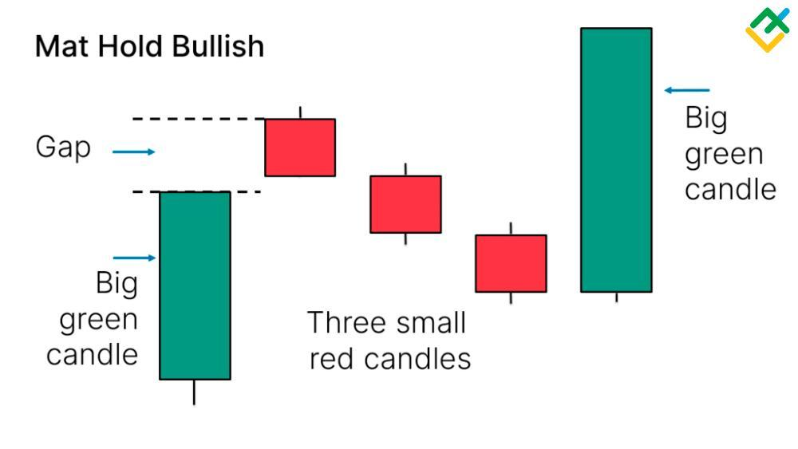

## Table of Contents

## What is the Mat Hold Pattern in technical analysis?

The Mat Hold Pattern is a type of candlestick pattern used in technical analysis to predict the continuation of an uptrend. It looks like a bullish trend that takes a small break before continuing upwards. The pattern starts with a long bullish candle, followed by a small bearish candle that gaps down a bit. This small bearish candle represents the "rest" or "consolidation" period. After this, there are usually one or two more small candles, which can be either bullish or bearish, but they stay within the range of the first bearish candle.

After these smaller candles, the pattern ends with another long bullish candle that gaps up from the previous candles and closes above the high of the first bullish candle. This final bullish candle confirms that the uptrend is likely to continue. Traders often use the Mat Hold Pattern to make decisions about buying stocks, as it suggests that any minor pullbacks in the price are just temporary and the overall trend will keep going up.

## How does the Mat Hold Pattern form on a price chart?

The Mat Hold Pattern starts with a big green candle on a price chart. This green candle shows that the price went up a lot in one day. After this big green candle, there's a small red candle that gaps down a bit. This small red candle means the price dropped a little but not too much. It's like the price is taking a small break.

After the small red candle, you might see one or two more small candles. These candles can be either green or red, but they stay within the range of the first red candle. They show that the price is still taking a little break, but it's not moving much. Finally, a big green candle appears that gaps up from the previous candles and closes higher than the top of the first big green candle. This last big green candle tells us that the price is ready to keep going up, and the break is over.

## What are the key components that make up the Mat Hold Pattern?

The Mat Hold Pattern starts with a big green candle on the price chart. This candle shows that the price went up a lot in one day. After this big green candle, there's a small red candle that gaps down a bit. This small red candle means the price dropped a little but not too much. It's like the price is taking a small break.

After the small red candle, you might see one or two more small candles. These candles can be either green or red, but they stay within the range of the first red candle. They show that the price is still taking a little break, but it's not moving much. Finally, a big green candle appears that gaps up from the previous candles and closes higher than the top of the first big green candle. This last big green candle tells us that the price is ready to keep going up, and the break is over.

## Can you explain the difference between a bullish and bearish Mat Hold Pattern?

The Mat Hold Pattern is usually a bullish pattern, which means it shows that the price of something, like a stock, is going to keep going up. It starts with a big green candle that shows a strong increase in price. Then, there's a small red candle that gaps down a bit, showing a small drop in price. After this, you might see one or two more small candles that stay within the range of the first red candle. These small candles show that the price is taking a little break. Finally, a big green candle appears that gaps up and closes higher than the top of the first big green candle, showing that the price is ready to keep going up.

There isn't really a bearish version of the Mat Hold Pattern. The Mat Hold Pattern is all about showing that an uptrend is going to continue after a small break. If you see a pattern that looks like the opposite of the Mat Hold Pattern, it would be different and wouldn't be called a Mat Hold Pattern. A pattern that looks like the opposite would start with a big red candle, followed by a small green candle that gaps up a bit, then one or two more small candles, and finally a big red candle that gaps down and closes lower than the bottom of the first big red candle. But this would be a different pattern and not a Mat Hold Pattern.

## What does the Mat Hold Pattern indicate about market sentiment?

The Mat Hold Pattern shows that people are feeling good about the market. It starts with a big green candle, which means the price went up a lot. Then, there's a small red candle that gaps down a bit, showing a little drop in price. This small drop doesn't mean people are worried, though. It's just a short break. After this, there might be one or two more small candles, but they don't move the price much. They show that the market is just resting a bit before it keeps going up.

Finally, a big green candle appears that gaps up and closes higher than the top of the first big green candle. This last candle tells us that the market sentiment is still strong and that the price is ready to keep going up. The Mat Hold Pattern shows that even though there was a small break, the overall feeling in the market is positive, and people expect the price to keep rising.

## How reliable is the Mat Hold Pattern in predicting future price movements?

The Mat Hold Pattern is considered pretty good at predicting that the price will keep going up. It's like a signal that tells traders, "Hey, even though the price took a little break, it's going to keep going up soon." When you see this pattern, it means the market is still feeling positive and that the small drop in price was just a short pause. Traders often use this pattern to decide when to buy stocks because it suggests that the price will continue to rise after the break.

However, no pattern is perfect. Sometimes, the Mat Hold Pattern can be wrong, and the price might not go up after all. It's important to look at other things too, like what the overall market is doing or if there are any big news events coming up that could change things. So, while the Mat Hold Pattern is helpful, it's best to use it along with other signs and not rely on it alone to make decisions about buying or selling.

## What are the common entry and exit points when trading based on the Mat Hold Pattern?

When trading based on the Mat Hold Pattern, a common entry point is right after the final big green candle appears. This candle gaps up and closes higher than the top of the first big green candle, showing that the price is ready to keep going up. Traders often buy at this point because it's a strong sign that the uptrend will continue. They might set their entry order just above the high of the final big green candle to make sure the pattern is confirmed before they buy.

For the exit point, traders usually look to sell when the price reaches a certain target or if the price starts to go down a lot. A common target is to aim for a price that's about as far above the final big green candle as the first big green candle was tall. This is called measuring the pattern's height and adding it to the top of the final big green candle. If the price starts to go down a lot instead of going up, traders might decide to sell to cut their losses. They could set a stop-loss order just below the low of the small red candle or one of the smaller candles in the middle of the pattern to protect their money if things don't go as planned.

## How does the Mat Hold Pattern compare to other continuation patterns like the Rising Three Methods?

The Mat Hold Pattern and the Rising Three Methods are both bullish continuation patterns, meaning they show that the price will likely keep going up after a small break. The Mat Hold Pattern starts with a big green candle, followed by a small red candle that gaps down a bit. Then, there might be one or two more small candles that don't move the price much. Finally, another big green candle appears that gaps up and closes higher than the first big green candle. This pattern tells traders that the price took a short break but is ready to keep rising. On the other hand, the Rising Three Methods also starts with a big green candle. After this, there are usually three small red candles that stay within the range of the first big green candle. The pattern ends with another big green candle that closes higher than the first one. This pattern shows that the price took a longer but still small break before continuing to go up.

While both patterns suggest that the price will continue to rise, they have some differences. The Mat Hold Pattern has a small red candle that gaps down, which can make some traders a bit nervous, but it's followed by a strong green candle that confirms the uptrend. The Rising Three Methods, however, has three small red candles that stay within the range of the first big green candle, showing a more controlled and steady pause in the uptrend. Traders might feel more confident with the Rising Three Methods because it shows a longer but still controlled break. Both patterns are useful for traders, but they might choose one over the other based on how they feel about the small breaks in the price.

## What are the best practices for confirming a Mat Hold Pattern?

To confirm a Mat Hold Pattern, it's important to look at the whole picture of the market. Start by checking if the pattern fits all the parts we talked about: a big green candle, a small red candle that gaps down a bit, one or two more small candles that don't move much, and then another big green candle that gaps up and closes higher than the first big green candle. Make sure these parts are clear and that the last big green candle really does show that the price is ready to keep going up.

It's also a good idea to use other signs to make sure the Mat Hold Pattern is right. Look at things like the overall trend of the market, other technical indicators like moving averages or the RSI (Relative Strength Index), and any news or events that might affect the price. If everything else also points to the price going up, then you can feel more sure about the Mat Hold Pattern. Remember, no pattern is perfect, so always think about other things too before making a decision.

## Can the Mat Hold Pattern be effectively used in conjunction with other technical indicators?

Yes, the Mat Hold Pattern can be effectively used with other technical indicators to make better trading decisions. When you see the Mat Hold Pattern, it's a good idea to check other signs too. For example, if the moving averages are also pointing up, it adds more proof that the price might keep going up. The Relative Strength Index (RSI) can help too. If the RSI is not too high and still shows room for the price to go up, it can make you feel more sure about the Mat Hold Pattern.

Another good thing to do is to look at the overall trend of the market. If the market is in a strong uptrend and the Mat Hold Pattern shows up, it's a stronger sign that the price will keep going up. Also, keep an eye on any big news or events that might affect the price. If everything else lines up with the Mat Hold Pattern, you can be more confident in your trading choices. Using the Mat Hold Pattern with other indicators helps you see the whole picture and make smarter decisions.

## How does volume play a role in validating the Mat Hold Pattern?

Volume is important when looking at the Mat Hold Pattern. It helps you know if the pattern is strong or not. When the first big green candle appears, you want to see a lot of volume. This means many people are buying, and it shows the start of the pattern is strong. During the small red candle and the smaller candles that come after, the volume should be lower. This tells you that not many people are trading during the little break, which is normal for the Mat Hold Pattern.

When the final big green candle shows up, you want to see the volume go up again. This means more people are buying, and it confirms that the price is ready to keep going up. If the volume is low on the final big green candle, the pattern might not be as strong, and the price might not go up as expected. So, checking the volume during each part of the Mat Hold Pattern helps you feel more sure about whether the price will keep rising.

## What are some advanced strategies for trading the Mat Hold Pattern in volatile markets?

In volatile markets, trading the Mat Hold Pattern can be tricky, but there are some advanced strategies that can help. One strategy is to use the Mat Hold Pattern along with other technical indicators like the Bollinger Bands or the Average True Range (ATR) to better understand the market's volatility. For example, if the price breaks out of the Bollinger Bands during the final big green candle of the Mat Hold Pattern, it might be a stronger sign that the price will keep going up. Also, if the ATR shows high volatility, you might want to set wider stop-loss orders to give the trade more room to move without getting stopped out too early.

Another strategy is to look at the volume more closely during volatile times. In a volatile market, you might see bigger swings in volume, so it's important to check if the volume on the first and final big green candles is much higher than on the smaller candles in between. This can give you more confidence that the Mat Hold Pattern is strong. You might also want to use a trailing stop-loss, which moves up as the price goes up, to protect your profits if the market suddenly turns down. By combining these strategies, you can trade the Mat Hold Pattern more effectively even when the market is moving a lot.

## What is Risk Management When Trading Mat Hold Patterns?

Effective risk management is a fundamental aspect of trading that ensures long-term profitability, particularly when trading Mat Hold patterns. Traders must carefully consider their position size and leverage when deploying trades based on this pattern to manage potential risks and protect against significant losses. 

Determining the appropriate position size is crucial. Traders can use a risk-per-trade formula to calculate this. For example, a trader willing to risk 1% of their total capital on a trade could use the following formula to determine the position size:

$$
\text{Position Size} = \frac{\text{Capital} \times \text{Risk per Trade (\%)}}{\text{Stop Loss Distance (e.g., pips or price units)}}
$$

This formula helps ensure that the risk on any single trade remains within the pre-determined risk threshold.

Furthermore, leveraging should be approached with caution. High leverage can amplify both potential gains and potential losses, leading to rapid account drawdowns if not managed properly. Traders should evaluate their risk tolerance and market conditions when determining the level of leverage to apply in Mat Hold pattern trades.

Implementing stop-loss levels is another critical strategy. A stop-loss order automatically closes a position when the price reaches a certain level, thereby capping the potential loss on a trade. For Mat Hold patterns, a logical placement for stop-loss orders would be slightly beyond the high or low of the initial large candlestick, depending on whether the pattern is bullish or bearish.

Trailing stops can also be employed to protect gains as the market moves in a favorable direction. A trailing stop adjusts the stop-loss level according to market movements, ensuring that traders lock in profits while allowing for the potential of further gains. This dynamic strategy can be particularly effective in trend continuation patterns like the Mat Hold.

In conclusion, risk management in trading Mat Hold patterns involves determining the correct position size and leverage, alongside implementing prudent stop-loss and trailing stop strategies. By balancing these elements, traders can mitigate the impact of adverse market movements and enhance the probability of long-term profitability.

## References & Further Reading

[1]: Bergstra, J., Bardenet, R., Bengio, Y., & Kégl, B. (2011). ["Algorithms for Hyper-Parameter Optimization."](https://dl.acm.org/doi/10.5555/2986459.2986743) Advances in Neural Information Processing Systems 24.

[2]: ["Advances in Financial Machine Learning"](https://www.amazon.com/Advances-Financial-Machine-Learning-Marcos/dp/1119482089) by Marcos Lopez de Prado

[3]: ["Evidence-Based Technical Analysis: Applying the Scientific Method and Statistical Inference to Trading Signals"](https://www.amazon.com/Evidence-Based-Technical-Analysis-Scientific-Statistical/dp/0470008741) by David Aronson

[4]: ["Machine Learning for Algorithmic Trading"](https://github.com/stefan-jansen/machine-learning-for-trading) by Stefan Jansen

[5]: ["Quantitative Trading: How to Build Your Own Algorithmic Trading Business"](https://github.com/LucindaYa/quant-resources/blob/master/Quantitative%20Trading%20How%20to%20Build%20Your%20Own%20Algorithmic%20Trading%20Business.pdf) by Ernest P. Chan