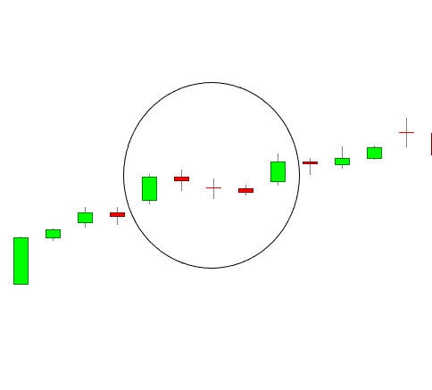

In stock trading, technical analysis serves as a crucial tool for traders who seek to interpret market data and forecast future price movements. Among the numerous patterns employed in technical analysis, the Mat Hold pattern stands out as a continuation formation, signaling the persistence of ongoing trends. This pattern is characterized by a specific sequence of candlesticks that collectively suggest the strengthening of the prevailing trend, whether bullish or bearish.

Technical analysis, when combined with the precision of algorithmic trading, enables traders to capitalize efficiently on these patterns. Algorithmic trading leverages sophisticated algorithms to scan vast amounts of market data, identify patterns like the Mat Hold, and execute trades with minimal delay. This integration facilitates a more systematic and data-driven approach to trading, minimizing human error and maximizing the potential for profit.



This article focuses on the specifics of the Mat Hold pattern, exploring its distinctive features and the methodologies used to identify it. It also examines the vital role of algorithmic trading in enhancing the accuracy and efficiency of utilizing this pattern. By understanding the intricacies of the Mat Hold pattern, traders can better harness its potential to achieve trading success in various market conditions.

## Table of Contents

## Understanding the Mat Hold Pattern

The Mat Hold pattern is a distinctive and relatively rare candlestick configuration, recognized for indicating a continuation of the current market trend. This pattern is discerned through a series of specific candlesticks orchestrated in a sequence that suggests ongoing market momentum. Initially, the pattern commences with a large candlestick, which signifies a robust movement in the direction of the prevailing trend. This is followed by a price gap that further underscores the trend's strength and confirms the directional bias.

Subsequently, the pattern is characterized by the emergence of three smaller corrective candles. These candles typically consolidate within the high and low range of the initial large candle, which signifies a brief pause or retracement within the overarching trend. Despite their smaller size, these corrective candles are crucial as they indicate the market's attempt to temporarily correct or pull back before resuming in the direction of the primary trend.

The final component of the Mat Hold pattern is another large candle, resuming in the initial direction of the trend, thus affirming the pattern's continuation signal. This concluding large candle is critical as it marks the resolution of the brief consolidation phase, often prompting traders to anticipate further price movement.

Uniquely versatile, the Mat Hold pattern can manifest in both bullish and bearish forms, contingent upon the trend. In a bullish trend, the initial large candlestick and the concluding large candlestick of the formation will be bullish, encapsulating a brief consolidation that signifies the market's readiness to continue upward. Conversely, in a bearish trend, the pattern shapes similarly but with bearish candlesticks, suggesting further downward [momentum](/wiki/momentum) after the consolidation phase.

The Mat Hold pattern serves as an invaluable tool for traders seeking to harness ongoing trends, whether they are trading manually or employing algorithmic strategies. Its identification on candlestick charts requires meticulous observation of the specific sequence and relationship between the candlesticks involved, providing insights into potential future price movements based on past market behavior.

## Identifying Mat Hold Patterns in Candlestick Charts

To effectively identify the Mat Hold pattern, traders take a structured approach by recognizing specific candlestick sequences while factoring in the overarching market trends. The Mat Hold pattern is characterized by an initial large candle in the direction of the predominant trend, followed by a gap and three smaller candles that maintain their range within the initial candle. This setup concludes with another large candle continuing in the trend's direction.

To assist in spotting the Mat Hold pattern accurately, traders often employ technical indicators and charting tools. Moving averages can provide context about the general trend direction, offering a backdrop against which the Mat Hold pattern can form. For instance, a Mat Hold pattern appearing above an upward-sloping moving average can act as a reinforcement of a bullish trend. Conversely, trend lines drawn over a series of price points help traders visualize the path of least resistance for the market, aiding in the identification of continuations exemplified by the Mat Hold pattern.

Additionally, the advent of [algorithmic trading](/wiki/algorithmic-trading) has substantially streamlined the identification process for the Mat Hold pattern. Utilizing algorithms enables traders to scan extensive datasets quickly and efficiently, identifying potential instances of this pattern across diverse time frames and trading markets. Algorithms can be programmed to detect the precise sequence and features of Mat Hold patterns, analyzing each candle's open, high, low, and close prices to confirm the formation's validity. 

Below is an example of a basic Python script that uses a library such as `pandas` and `numpy` to calculate moving averages, aiding the identification of potential Mat Hold patterns:

```python
import pandas as pd
import numpy as np

def calculate_moving_average(prices, window):
    return prices.rolling(window=window).mean()

def identify_mat_hold(data):
    patterns = []
    for i in range(len(data) - 4):
        if is_large_candle(data['Open'][i], data['Close'][i]):
            if data['Close'][i+1] < data['Close'][i] and is_small_candle(data['Open'][i+2], data['Close'][i+2]):
                if is_small_candle(data['Open'][i+3], data['Close'][i+3]) and is_large_candle(data['Open'][i+4], data['Close'][i+4]):
                    patterns.append(i)
    return patterns

def is_large_candle(open_price, close_price):
    return abs(close_price - open_price) > some_threshold

def is_small_candle(open_price, close_price):
    return abs(close_price - open_price) < smaller_threshold

# Example dataframe with OHLC data
df = pd.DataFrame({
    'Open': [...],
    'High': [...],
    'Low': [...],
    'Close': [...]
})

# Calculate moving averages
df['MA'] = calculate_moving_average(df['Close'], window=20)

# Identify potential Mat Hold patterns
mat_hold_patterns = identify_mat_hold(df)
```

In combining technical analysis tools and algorithmic capabilities, traders enhance their efficiency in locating and acting upon Mat Hold patterns, optimizing their strategy for both accuracy and speed.

## The Role of Algo Trading in Leveraging Mat Hold Patterns

Algorithmic trading provides a significant advantage in identifying and exploiting trading opportunities such as Mat Hold patterns. By leveraging automated systems, traders can create algorithms that efficiently scan and process vast amounts of market data across various time frames and markets, thereby enhancing their ability to detect these rare candlestick formations promptly and accurately.

Algorithms can be programmed to recognize the specific characteristics of the Mat Hold pattern, which involves a unique sequence of candlestick shapes and positions. This automation allows traders to explore multiple markets simultaneously, identifying potential trading opportunities without the limitations of human observation. The key is to encode a precise logical structure within the algorithm that captures the pattern's defining features, such as:

1. Identifying an initial large candle followed by a gap.
2. Recognizing three smaller corrective candles contained within the initial candle's range.
3. Detecting a concluding large candle that aligns with the original trend direction.

In practice, an algorithm programmed to identify a bullish Mat Hold pattern might include conditions like:

```python
def is_bullish_mat_hold(candles):
    if len(candles) < 5:
        return False
    big_candle = candles[0]
    if big_candle.close <= big_candle.open:
        return False
    gap_detected = candles[1].open > big_candle.close
    small_candles = all(
        c.close < big_candle.close and c.open > big_candle.open for c in candles[1:4]
    )
    final_candle = candles[4]
    trend_confirmation = final_candle.close > final_candle.open
    return gap_detected and small_candles and trend_confirmation
```

This approach minimizes human error, which is prevalent in manual chart analysis, and ensures rapid decision-making. Algorithms execute trades with speed and precision unattainable by manual methods, adapting instantaneously to minor market fluctuations. This capability is especially beneficial in high-frequency trading environments where reaction time is critical.

Moreover, algorithmic trading supports [backtesting](/wiki/backtesting) strategies by applying historical data to evaluate the Mat Hold pattern's effectiveness and reliability over various periods and conditions. This assessment allows traders to refine their strategies and optimize their algorithms further.

The integration of algorithmic trading in identifying Mat Hold patterns enhances traders' ability to respond to market signals quickly and effectively, thereby maximizing potential profitability while reducing reliance on subjective judgment. This combination of technology and financial insight fosters a systematic approach to trading that capitalizes on structured market conditions.

## Strategies for Trading Mat Hold Patterns

Mat Hold patterns, when effectively traded, can form a core component of a profitable trading strategy in trending markets. This requires a systematic approach that combines pattern recognition, confirmation with additional technical indicators, and rigorous risk management.

**Confirm the Pattern with Volume and Other Indicators:** The pattern's validity can be strengthened by confirming its occurrence with volume analysis and other technical indicators. Ideally, the breakout candle following the consolidated corrective candles should be accompanied by an increase in volume, signaling strong market sentiment in the direction of the trend. Indicators such as the Moving Average Convergence Divergence (MACD) or the Relative Strength Index (RSI) can provide further confirmation by reflecting the momentum and potential overbought/oversold conditions, respectively.

**Setting Precise Entry and Exit Points:** Timing entries and exits with precision is crucial when trading Mat Hold patterns. An entry position can be established once the breakout candle confirms the continuation of the trend. For bullish patterns, entering a position slightly above the high of the bullish breakout candle can be an effective strategy. Conversely, in bearish patterns, entering just below the low of the breakdown candle is advisable. Exit points should be determined based on the trader's profit target, which can be set using techniques such as previous significant price levels or Fibonacci extensions.

**Utilizing Stop-Loss Orders:** To protect against adverse movements and manage risk, stop-loss orders are essential. For a bullish Mat Hold pattern, placing a stop-loss below the low of the breakout candle or the last corrective candle can provide a safety net. In a bearish situation, stop-loss orders are typically placed above the high of the breakout or the last corrective candle. The stop-loss level must be set considering the volatility of the asset and the trader's risk tolerance.

**Incorporating Cut-Loss Methods and Profit Targets:** Implementing cut-loss methods and defining profit targets are important elements in enhancing the efficacy of Mat Hold trading strategies. Trailing stop orders, which adjust as the market moves in favor of the trade, can be used to lock in profits while allowing for further gains if the trend continues. Trading algorithms can be utilized to automate these processes, ensuring consistency and reducing emotional bias.

By adhering to these strategies, traders can leverage the Mat Hold pattern to capitalize on ongoing market trends effectively. This disciplined approach, coupled with robust risk management, can help navigate the complexities of trading and achieve consistent profitability.

## Risk Management When Trading Mat Hold Patterns

Effective risk management is a fundamental aspect of trading that ensures long-term profitability, particularly when trading Mat Hold patterns. Traders must carefully consider their position size and leverage when deploying trades based on this pattern to manage potential risks and protect against significant losses. 

Determining the appropriate position size is crucial. Traders can use a risk-per-trade formula to calculate this. For example, a trader willing to risk 1% of their total capital on a trade could use the following formula to determine the position size:

$$
\text{Position Size} = \frac{\text{Capital} \times \text{Risk per Trade (\%)}}{\text{Stop Loss Distance (e.g., pips or price units)}}
$$

This formula helps ensure that the risk on any single trade remains within the pre-determined risk threshold.

Furthermore, leveraging should be approached with caution. High leverage can amplify both potential gains and potential losses, leading to rapid account drawdowns if not managed properly. Traders should evaluate their risk tolerance and market conditions when determining the level of leverage to apply in Mat Hold pattern trades.

Implementing stop-loss levels is another critical strategy. A stop-loss order automatically closes a position when the price reaches a certain level, thereby capping the potential loss on a trade. For Mat Hold patterns, a logical placement for stop-loss orders would be slightly beyond the high or low of the initial large candlestick, depending on whether the pattern is bullish or bearish.

Trailing stops can also be employed to protect gains as the market moves in a favorable direction. A trailing stop adjusts the stop-loss level according to market movements, ensuring that traders lock in profits while allowing for the potential of further gains. This dynamic strategy can be particularly effective in trend continuation patterns like the Mat Hold.

In conclusion, risk management in trading Mat Hold patterns involves determining the correct position size and leverage, alongside implementing prudent stop-loss and trailing stop strategies. By balancing these elements, traders can mitigate the impact of adverse market movements and enhance the probability of long-term profitability.

## Real-Life Examples of Successful Trades using Mat Hold Patterns

Implementing Mat Hold patterns in trading has proven effective across various markets, especially in stocks and [forex](/wiki/forex-system). Analyzing these occurrences can provide valuable insights into their practical application.

One notable example in the stock market involved a tech stock experiencing a strong uptrend. Traders identified a Mat Hold pattern following a significant bullish candlestick. This was followed by a gap up and three smaller corrective candles. The final large bullish candle validated the continuation of the trend. Algorithmically executed trades, calibrated to recognize this pattern, allowed traders to enter just before the close of the corrective phase, resulting in an impressive return as the stock continued to climb.

In the forex market, forex pairs like the EUR/USD have displayed Mat Hold patterns. For instance, during a bullish phase in the pair's movement, the emergence of a Mat Hold pattern indicated by a gap and corrective candles staying within the initial large bullish candle's range presented an opportunity. Traders who placed long positions based on this pattern capitalized on the subsequent upward momentum, achieving considerable profits.

The significance of these examples lies in their demonstration of the Mat Hold pattern's reliability when embedded within strong trends. Traders often enhance their chances of success by confirming the pattern with additional indicators such as Relative Strength Index (RSI) or Fibonacci retracement levels to gauge overbought or oversold conditions.

Algorithmic trading systems play a pivotal role in these scenarios by scanning vast arrays of market data to detect potential Mat Hold patterns efficiently. These systems can be programmed in Python to identify the characteristic sequence of candles, triggering alerts or executing trades upon pattern confirmation. Here is a simple example of Python code for detecting a basic form of the Mat Hold pattern:

```python
def identify_mat_hold(candlesticks):
    if len(candlesticks) < 5:
        return False

    first, second, third, fourth, fifth = candlesticks[-5:]

    if (first['bullish'] and 
        second['open'] > first['close'] and
        third['close'] > second['open'] > second['close'] and
        fourth['close'] > third['open'] > third['close'] and
        fifth['close'] > first['close'] > fourth['close']):
        return True

    return False

candlestick_data = [{'open': 100, 'close': 110, 'bullish': True},  # first
                    {'open': 111, 'close': 108},                  # second
                    {'open': 109, 'close': 107},                  # third
                    {'open': 108, 'close': 106},                  # fourth
                    {'open': 106, 'close': 115}]                  # fifth

print(identify_mat_hold(candlestick_data))
```

This script checks for typical bullish Mat Hold characteristics, demonstrating how algorithms identify profitable trade setups. These real-life examples confirm that exploiting Mat Hold patterns, particularly within algorithmic frameworks, can be highly lucrative and an essential part of a trader's toolkit.

## Conclusion: Harnessing Mat Hold Patterns for Profitable Trading

Understanding and utilizing the Mat Hold pattern in algorithmic trading provides traders with valuable opportunities to achieve consistent success in the stock market. This candlestick pattern signals the persistence of trends, serving as an essential tool for technical analysis. By integrating these insights with advanced algorithmic trading techniques, traders can not only identify Mat Hold patterns more efficiently but also implement strategic trades that benefit from the continuation of the trend.

Combining technical analysis with algorithmic trading enhances the efficacy of detecting Mat Hold patterns. Technical indicators such as moving averages and trend lines help confirm the presence of these patterns, while algorithmic systems can process vast amounts of market data to pinpoint trading signals accurately. This synthesis empowers traders to execute trades rapidly, reducing the likelihood of human error and enhancing decision-making processes.

Robust risk management is a fundamental component of leveraging Mat Hold patterns for trading. By determining appropriate position sizes and leverage, traders can mitigate potential losses associated with unforeseen market changes. Implementing stop-loss orders and trailing stops serves as critical protective measures, allowing traders to safeguard their capital while pursuing profitable opportunities.

Continuous learning and adaptation are imperative for traders seeking to maximize the utility of Mat Hold patterns in algorithmic trading environments. As market dynamics evolve, staying informed of the latest developments and trends ensures that trading strategies remain relevant and effective. Embracing a mindset of constant improvement enables traders to refine their approaches, ultimately leading to sustainable trading success.

In conclusion, the Mat Hold pattern is a powerful tool within the trader's arsenal when combined with algorithmic trading and solid risk management strategies. By understanding and effectively applying this pattern, traders can consistently capitalize on ongoing market trends, adapting as necessary to maintain a competitive edge in the ever-changing financial landscape.

## References & Further Reading

[1]: Bergstra, J., Bardenet, R., Bengio, Y., & Kégl, B. (2011). ["Algorithms for Hyper-Parameter Optimization."](https://dl.acm.org/doi/10.5555/2986459.2986743) Advances in Neural Information Processing Systems 24.

[2]: ["Advances in Financial Machine Learning"](https://www.amazon.com/Advances-Financial-Machine-Learning-Marcos/dp/1119482089) by Marcos Lopez de Prado

[3]: ["Evidence-Based Technical Analysis: Applying the Scientific Method and Statistical Inference to Trading Signals"](https://www.amazon.com/Evidence-Based-Technical-Analysis-Scientific-Statistical/dp/0470008741) by David Aronson

[4]: ["Machine Learning for Algorithmic Trading"](https://github.com/stefan-jansen/machine-learning-for-trading) by Stefan Jansen

[5]: ["Quantitative Trading: How to Build Your Own Algorithmic Trading Business"](https://github.com/LucindaYa/quant-resources/blob/master/Quantitative%20Trading%20How%20to%20Build%20Your%20Own%20Algorithmic%20Trading%20Business.pdf) by Ernest P. Chan