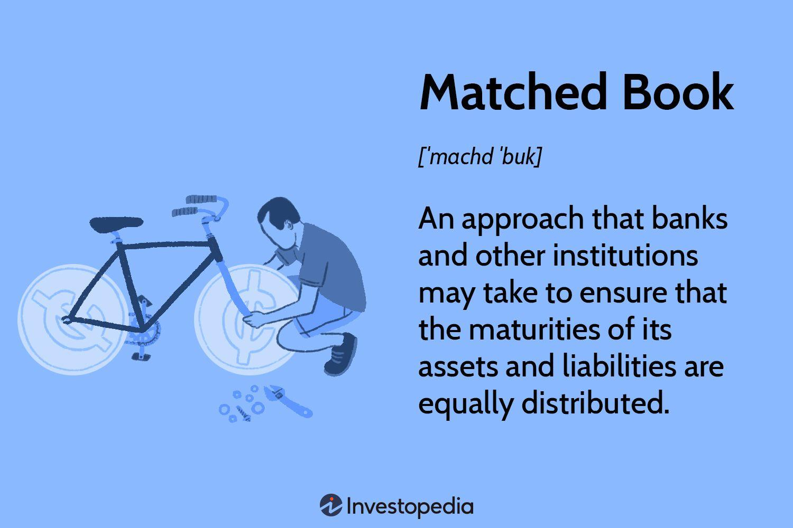

The landscape of financial trading has experienced a profound transformation, primarily driven by technological advancements that have redefined the way market transactions are executed. Among the innovations leading this evolution are matched book investments and algorithmic trading. These two elements have become central to optimizing trade execution strategies within the financial sector.

Matched book investments involve a meticulous balance between assets and liabilities, ensuring equal maturities and values. This approach, commonly employed by financial institutions, is instrumental in managing liquidity and mitigating interest rate risks. It underscores the concept of asset/liability management or cash matching, aiming to harmonize the cash inflows and outflows to maintain financial stability.



On the other hand, algorithmic trading utilizes sophisticated computer programs to automate the trading process based on pre-defined strategies. This technology significantly enhances market operations by allowing trades to be executed at optimal prices with extraordinary speed and efficiency. Algo trading is particularly advantageous for handling large volumes of transactions with minimal market impact, thereby increasing overall market liquidity and reducing transaction costs.

This article examines the significance of matched book investments in finance and emphasizes how algorithmic trading can elevate trading outcomes. By focusing on these innovative strategies, we explore their implementation in the modern financial landscape, coupled with insights from industry experts who have witnessed these advancements in action in the practical world.

## Table of Contents

## What is a Matched Book?

A matched book refers to a financial strategy employed by institutions such as banks to maintain equilibrium between their assets and liabilities. This is achieved by aligning the maturities and values of both sides of the balance sheet. Such matching is crucial for managing liquidity and minimizing interest rate risks. By ensuring that the inflows from assets are appropriately timed and correspond to the outflows for liabilities, financial institutions can safeguard against liquidity shortfalls and interest rate fluctuations.

In practical terms, if a bank holds a bond with a maturity of five years, it strives to have a liability of similar maturity to counterbalance the risk of interest rate changes that could affect the bond's value over time. This approach is primarily used to stabilize cash flow and protect the institution from market volatility. A perfectly matched book ensures that the net interest income remains unaffected by rate shifts, thus maintaining the institution's profitability and financial health.

The matched book approach is a core aspect of asset/liability management, also known as cash matching. It enables institutions to predict their cash flow needs accurately and fulfill them without incurring additional costs from borrowing or liquidating assets prematurely. This method not only enhances an institution's internal financial management but also positions it advantageously against external economic shifts, fostering a robust financial stability framework.

## The Role of Algo Trading in Finance

Algorithmic trading, commonly referred to as algo trading, utilizes computer programs to facilitate the automatic execution of trades according to pre-defined strategies. This approach leverages computational power to make decisions with speed and precision, which are unmatched by human traders.

One of the primary benefits of [algorithmic trading](/wiki/algorithmic-trading) is its ability to enhance the efficiency of market operations. By using complex mathematical models and algorithms, these systems can analyze vast datasets in real-time to identify the best possible entry or [exit](/wiki/exit-strategy) points for trades. This enables algo trading systems to execute transactions at optimal prices, thereby maximizing profitability or minimizing costs associated with trading.

The efficiency gained through algorithmic trading is particularly evident in the management of large transaction volumes. Traditional trading methods can disrupt market equilibrium when handling substantial orders due to latency and the manual nature of trade execution. In contrast, algorithmic trading systems can divide large orders into smaller, more manageable segments and execute them incrementally without alerting the market to the order's total size. This mitigates the risks of market impact and ensures minimal price slippage, preserving the integrity and stability of market prices.

Furthermore, algorithmic trading provides a high level of consistency and discipline in trading strategies. By removing human emotions and bias from the equation, algo trading adheres strictly to the defined strategy. This helps avoid the impulsive decisions that often lead to suboptimal results in manual trading.

Algorithmic strategies are also equipped to operate continuously, monitoring markets around the clock. This constant vigilance allows the system to promptly respond to changes in market conditions, ensuring compliance with pre-set parameters.

To illustrate, consider an algorithm designed to execute a mean-reversion strategy, a popular technique in trading. Such an algorithm would monitor stock prices to detect deviations from their historical averages and execute buy or sell orders to capitalize on the anticipated correction. In Python, a simplistic version of this strategy might involve:

```python
import numpy as np
import pandas as pd

# Example data as a time series
prices = pd.Series([100, 102, 101, 105, 107, 104, 103])

# Calculate rolling mean and standard deviation
rolling_mean = prices.rolling(window=3).mean()
rolling_std = prices.rolling(window=3).std()

# Buy/sell signals
signals = (prices - rolling_mean) / rolling_std

buy_signals = signals[signals < -1]
sell_signals = signals[signals > 1]

print("Buy signals:\n", buy_signals)
print("Sell signals:\n", sell_signals)
```

In this example, buy signals are generated when prices are significantly below the rolling mean, and sell signals occur when prices rise above it. While this simplified snippet doesn't encompass the complexity of actual trading algorithms, it encapsulates the basic mechanism by which algo trading can operate efficiently and effectively.

Overall, algo trading's precision, speed, and ability to process high volumes of transactions without market disruption make it an invaluable asset for modern financial markets, ensuring that trades are executed in the most optimal manner over time.

## Integrating Matched Book Investments with Algo Trading

The integration of matched book investments with algorithmic trading represents a synergy between traditional risk management strategies and cutting-edge technological advancements. By leveraging the precision and speed inherent to algorithmic trading, matched book strategies can achieve superior transaction execution. This approach minimizes risk exposure and enhances [liquidity](/wiki/liquidity-risk-premium) management.

Algorithmic trading enables quick analysis and execution of trades based on pre-defined strategies programmed into its algorithms. In the context of matched book investments, this means that assets and liabilities can be dynamically realigned to maintain balance, thus reducing potential mismatches in yields or maturities. The use of advanced algorithms allows for automatic adjustments to the matched book positions, significantly mitigating the risk of financial exposure and ensuring that liquidity remains optimal.

For instance, consider an algorithm designed to detect disparities between the current market rates and the rates at which an institution has positioned its assets and liabilities. In a Python implementation, such an algorithm could be structured as follows:

```python
def adjust_positions(current_positions, market_rates, threshold=0.01):
    for asset, liability in current_positions.items():
        rate_difference = market_rates[asset] - liability['rate']
        if abs(rate_difference) > threshold:
            adjust_amount = rate_difference * liability['amount']
            print(f"Adjusting {asset}: {adjust_amount}")
            # Code to execute trade based on calculated adjust_amount
```

This code snippet illustrates a basic strategy for identifying and correcting imbalances in a matched book. The algorithm checks the difference between market rates and booked liabilities and suggests adjustments when differences exceed a specified threshold.

Additionally, the adaptability of algorithmic trading to evolving market conditions further enhances matched book strategies. Algorithms can be programmed to incorporate large-scale data analysis and [machine learning](/wiki/machine-learning) techniques, allowing them to recognize patterns that might suggest future market movements. This proactive approach not only optimizes transaction efficiencies but also fortifies the institution’s asset-liability management against unexpected market volatilities.

Overall, integrating matched book investments with algorithmic trading significantly strengthens the financial institution’s ability to manage risks and liquidity. This seamless blend of traditional financial management techniques with modern algorithms paves the way for more resilient and efficient financial operations.

## Benefits of Using Matched Book Strategies

Matched book strategies offer significant benefits to financial institutions by providing a balanced approach to managing assets and liabilities. This balance effectively reduces financial risk, primarily because it aligns cash inflows with cash outflows. By ensuring that assets and liabilities of equal values and similar maturities are paired, institutions can protect themselves against unsystematic [interest rate](/wiki/interest-rate-trading-strategies) fluctuations and liquidity crises.

The primary advantage of a matched book is the mitigation of interest rate risk. This is achieved by synchronizing the timing of cash flows to ensure that changes in interest rates have a minimal impact on the net interest income of the institution. As interest rates rise and fall, the matching of maturities on assets and liabilities means that both the costs and revenues from these financial instruments shift simultaneously, preserving financial stability. For instance, if a bank holds an asset that is set to mature in five years, it can simultaneously hold a liability with the same maturity date. This synchronization prevents discrepancies that could arise from rate changes affecting assets and liabilities unequally.

Matched book strategies also enhance liquidity management. By ensuring that cash inflows from matured assets coincide with cash outflows needed to meet liabilities, financial institutions maintain a stable flow of funds. This alignment ensures that banks and similar entities can reliably meet their own financial obligations, such as settling customer deposits or loan disbursements, without strain. The ability to predict and manage cash flows allows these institutions to function smoothly even during times of financial stress or market [volatility](/wiki/volatility-trading-strategies).

Another significant benefit of using matched book strategies is the smoothing effect they provide against market interest rate volatility. With the rising uncertainties in global financial markets, interest rates are subject to fluctuations that can create volatility in financial performance. A matched book strategy provides a buffer against such rapid changes by ensuring that any variation in interest rates is counterbalanced between assets and liabilities, maintaining a steady net interest margin.

In summary, matched book strategies significantly enhance risk management through balanced asset and liability management, ensuring institutions can gracefully navigate fluctuating interest rates while maintaining liquidity. These strategies provide foundational stability that is essential for the long-term financial health of any institution engaged in managing large sums of capital and complex portfolios.

## Real-Life Applications and Case Studies

Financial institutions have increasingly adopted matched book strategies, leveraging technology to streamline trade execution processes and optimize their financial operations. The practical implementation of these strategies, especially when integrated with algorithmic trading, has resulted in significant enhancements in transaction efficiency and compliance.

One prominent case study involves a global investment bank that implemented a matched book strategy to manage its extensive bond portfolio. By aligning the maturities and values of assets and liabilities, the bank was able to significantly reduce its exposure to interest rate fluctuations. The integration of algorithmic trading facilitated swift execution of trades at favorable prices, thereby minimizing transaction costs. This approach not only improved the bank's liquidity management but also ensured adherence to regulatory requirements by providing a transparent and automated audit trail.

Another example is a pension fund that used matched book investments to secure its long-term liabilities. By employing sophisticated algorithms, the fund dynamically adjusted its asset and liability positions to maintain a balanced book, even in the face of volatile market conditions. This proactive risk management strategy allowed the fund to lower its transaction expenses and improve regulatory compliance by ensuring its investments consistently aligned with its long-term obligations.

These real-life applications highlight how technological advancements, particularly algorithmic trading, have revolutionized traditional financial strategies like matched book investments. Through automation and precision, financial institutions can achieve greater efficiency, cost-effectiveness, and compliance, while effectively managing risk.

## Challenges and Considerations

Implementing matched book strategies in conjunction with algorithmic trading presents numerous advantages, but it also involves significant challenges and considerations. A critical aspect of this approach is the extensive financial modeling and analysis required to ensure that assets and liabilities are accurately balanced with matching maturities and values. This demands a detailed understanding of both current and projected market conditions, as well as the ability to model various financial scenarios to predict potential outcomes. Financial institutions must leverage sophisticated tools and techniques, such as stochastic modeling and Monte Carlo simulations, to develop and test these models.

An ongoing challenge in this domain is the necessity to continuously update algorithms. Financial markets are inherently dynamic, with constantly fluctuating conditions influenced by a myriad of factors, including economic indicators, geopolitical events, and market sentiment. As a result, algorithms that govern trading strategies need regular adjustments to maintain effectiveness. This requires a robust framework for data analysis and machine learning, allowing algorithms to evolve and adapt in real-time. Here is an example of a simple Python script using machine learning to update an algorithmic trading strategy based on historical price data:

```python
import numpy as np
from sklearn.model_selection import train_test_split
from sklearn.ensemble import RandomForestRegressor
import pandas as pd

# Load historical price data
data = pd.read_csv('historical_prices.csv')
X = data[['feature1', 'feature2', 'feature3']]  # features influencing price
y = data['target']  # target variable, e.g., future price

# Split data into training and test sets
X_train, X_test, y_train, y_test = train_test_split(X, y, test_size=0.2, random_state=42)

# Train a Random Forest model
model = RandomForestRegressor(n_estimators=100, random_state=42)
model.fit(X_train, y_train)

# Predict on new data
predictions = model.predict(X_test)
```

Beyond financial modeling and algorithm updates, operational costs present another significant challenge. The resources required for developing, implementing, and maintaining advanced trading systems can be substantial. Firms must invest in not only the software and hardware infrastructure but also the talent capable of managing these complex systems. Skilled professionals in quantitative analysis, data science, and financial engineering are needed, often leading to increased personnel expenses.

Data security is another critical consideration. As financial transactions increasingly rely on electronic systems and extensive data collection, the risk of data breaches and cyber-attacks grows. Protecting sensitive information related to trading strategies, client details, and financial positions requires robust cybersecurity measures. This involves implementing stringent access controls, regular security audits, encryption protocols, and ongoing threat monitoring to guard against potential vulnerabilities.

In conclusion, while the integration of matched book strategies with algorithmic trading is highly beneficial, institutions must navigate these challenges carefully. The success of such initiatives relies on the continuous refinement of financial models, strategic algorithm updates, prudent management of operational costs, and unwavering commitment to data security.

## Future Outlook on Matched Book and Algo Trading

The trend towards automation in financial markets underscores the growing importance of algorithmic strategies. As technology continues to evolve, future developments in algorithmic trading may involve more sophisticated algorithms capable of self-learning and dynamic adjustment to market conditions. These advancements, powered by [artificial intelligence](/wiki/ai-artificial-intelligence) (AI) and machine learning (ML), could enable algorithms to analyze vast datasets in real-time, identifying patterns and making informed trading decisions with minimal human intervention. This evolution points to the potential for adaptive algorithms that refine themselves continuously, adapting to ever-changing market dynamics. 

Matched book strategies, which balance assets and liabilities to mitigate financial risk, will remain an essential part of financial risk management. The integration of self-learning algorithms into matched book strategies could enhance their effectiveness by optimizing asset-liability matching and improving liquidity management. For instance, AI-driven algorithms might dynamically adjust the composition of the matched book to mitigate risks associated with interest rate fluctuations or liquidity shortages. 

Moreover, as regulatory landscapes become more complex, the adaptability of these algorithms could offer financial institutions a competitive edge in compliance and risk management. Automated systems capable of understanding and reacting to regulatory changes in real-time could significantly reduce the costs and risks associated with non-compliance.

In conclusion, the convergence of algorithmic trading and matched book strategies indicates an exciting future for financial markets. As these systems become more sophisticated, they promise not only increased efficiency but also enhanced resilience in handling the complexities of modern financial markets.

## Conclusion

Matched book investments, when combined with algorithmic trading, form a formidable strategy for navigating the complex landscape of modern financial management. This synergy between traditional risk management tactics and cutting-edge technology effectively addresses the demands of increasingly volatile and intricate markets. By ensuring that assets and liabilities are balanced with complementary maturities and values, matched book investments inherently reduce financial exposure and improve liquidity management. This lays a stable groundwork upon which algorithmic trading can operate.

Algorithmic trading introduces efficiency and precision by executing trades based on predetermined strategies at optimal prices, minimizing human error and strategic delays. The integration of algorithmic mechanisms with matched book strategies enables financial institutions to react swiftly to market fluctuations, maintaining equilibrium in their finances. This combination provides a buffer against sudden interest rate changes, thus sustaining institutional financial health amidst market volatility.

Furthermore, the use of algorithms in monitoring and adjusting matched book positions ensures ongoing appropriateness of asset-liability management. Financial institutions that continue to leverage these technological advancements stand to benefit greatly by ensuring their operations are not only stable but also strategically fortified against unforeseen financial disruptions. By adopting these combined approaches, organizations can enhance risk management protocols and achieve heightened operational efficiency, safeguarding their interests in the unpredictable environment of global finance.

## References & Further Reading

[1]: Marcello Minenna. (2003). ["The Control of the Matched Book in Interest Rate Swaps."](https://en.everybodywiki.com/Marcello_Minenna) SAGE Publications.

[2]: Hasbrouck, J. (2007). ["Empirical Market Microstructure: The Institutions, Economics, and Econometrics of Securities Trading."](https://academic.oup.com/book/52241) Oxford University Press.

[3]: Aldridge, I. (2013). ["High-Frequency Trading: A Practical Guide to Algorithmic Strategies and Trading Systems."](https://www.amazon.com/High-Frequency-Trading-Practical-Algorithmic-Strategies/dp/1118343506) Wiley Finance.

[4]: De Prado, M. L. (2018). ["Advances in Financial Machine Learning."](https://www.amazon.com/Advances-Financial-Machine-Learning-Marcos/dp/1119482089) Wiley.

[5]: Rauser, A. and Wille, G. (2009). ["Liquidity Risk: Managing Funding and Asset Risk."](https://link.springer.com/book/10.1057/9780230508118) Wiley.

[6]: Chan, E. (2009). ["Quantitative Trading: How to Build Your Own Algorithmic Trading Business."](https://github.com/ftvision/quant_trading_echan_book) Wiley Trading.