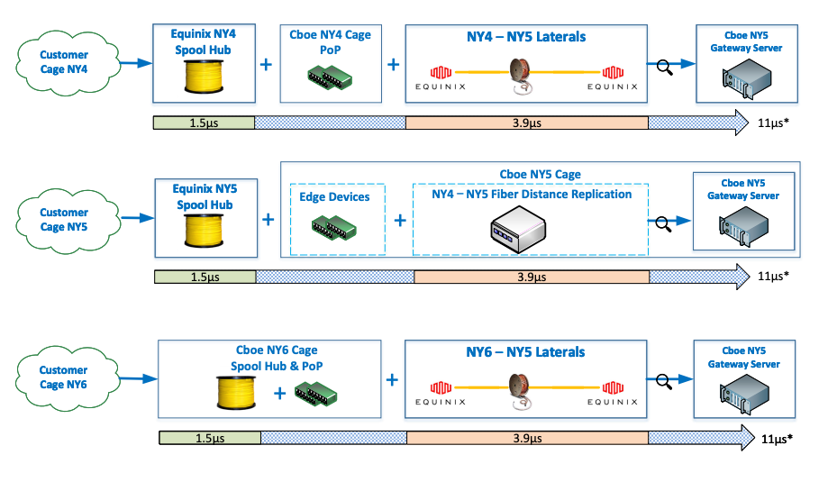

## Table of Contents

## What is a matching engine?

A matching engine is a computer system that helps bring together buyers and sellers in a market. It looks at the orders people want to make and tries to find the best matches so that trades can happen quickly and fairly. For example, in a stock market, if someone wants to buy a certain stock at a specific price, the matching engine will find someone who wants to sell that stock at that price or a lower one.

This system is very important because it makes sure that trading is done in an organized way. It follows rules to decide which orders get matched first, often giving priority to the orders that came in earlier or are at better prices. By doing this, the matching engine helps keep the market running smoothly and helps people trust that their trades will be handled fairly.

## How does a matching engine work in basic terms?

A matching engine is like a smart helper that works in places where people buy and sell things, like a stock market. When someone wants to buy something, they tell the matching engine what they want and how much they are willing to pay. At the same time, sellers tell the matching engine what they want to sell and the lowest price they will accept. The matching engine looks at all these requests and tries to find a buyer and a seller who want the same thing and can agree on a price.

Once the matching engine finds a good match, it makes the trade happen. It follows simple rules to decide who gets to trade first, usually choosing the orders that came in earlier or have the best prices. This way, everyone feels that the trading is fair and everyone gets a chance to buy or sell. The matching engine keeps the market running smoothly by making sure trades happen quickly and correctly.

## What are the key components of a matching engine?

The main parts of a matching engine are the [order book](/wiki/order-book-trading-strategies), the matching algorithm, and the trade execution system. The order book is like a list that keeps track of all the buy and sell orders people want to make. It shows what everyone wants to buy or sell and at what prices. The matching algorithm is like a smart rulebook that looks at the order book and decides which orders can be matched together. It tries to find the best matches so that people can buy and sell what they want at good prices.

The trade execution system is what makes the trades happen once the matching algorithm finds a good match. It takes the information from the matching algorithm and makes sure the trade goes through correctly. This part is important because it makes sure that when people agree to buy or sell, the trade actually happens. Together, these parts help the matching engine work smoothly, making sure that the market stays fair and efficient for everyone.

## What are the different types of matching algorithms used in engines?

Matching engines use different types of matching algorithms to find the best matches for buy and sell orders. One common type is the **price-time priority algorithm**. This algorithm looks at the price first, trying to match the highest buy order with the lowest sell order. If there are many orders at the same price, it uses the time the order was placed to decide which one goes first. This way, it makes sure that people who are willing to pay more or sell for less get their trades done first, and if prices are the same, the earliest orders get priority.

Another type is the **pro-rata algorithm**. This one is a bit different because it shares the available quantity among multiple orders at the same price. Instead of giving all of the quantity to one order, it splits it up based on how much each person wants to buy or sell. This can be fairer for everyone because it gives a chance to more people to get what they want, especially when there are a lot of orders at the same price.

Some matching engines also use a **fifo (first-in-first-out) algorithm**, which is very simple. It just looks at the time the orders came in and matches them in that order, without caring much about the price. This can be good for markets where speed is more important than getting the best price. Each of these algorithms has its own way of making sure trades happen in a way that is fair and efficient for the market.

## How do matching engines handle high-frequency trading?

Matching engines have to work very fast to handle high-frequency trading. High-frequency trading means that people are buying and selling things very quickly, often using computers to make decisions in just a few seconds or even less. The matching engine needs to be able to look at all these fast orders and match them together without slowing down. It uses special technology and very fast computers to make sure it can keep up with all the orders coming in.

To handle high-frequency trading, matching engines often use special algorithms that can process orders very quickly. These algorithms are designed to make decisions fast and match orders in a way that keeps the market fair. The matching engine also has to be able to handle a lot of orders at the same time without getting confused or making mistakes. This way, even when there are a lot of people trading very quickly, the matching engine can still make sure that everyone's trades happen correctly and on time.

## What are the common challenges faced when implementing a matching engine?

Implementing a matching engine can be tricky because it needs to handle a lot of orders very quickly. One big challenge is making sure the engine can process all these orders without slowing down or making mistakes. This is especially hard when there is high-frequency trading, where people are buying and selling things very fast. The matching engine has to use fast computers and smart algorithms to keep up with all the orders coming in. If it can't handle the speed, it might cause delays or errors, which can make people lose trust in the market.

Another challenge is making sure the matching engine is fair to everyone. It has to follow rules to decide which orders get matched first, like giving priority to orders that came in earlier or have better prices. But if the rules are not clear or if the engine makes mistakes, some people might feel like they are not being treated fairly. This can lead to problems in the market and make people less willing to trade. So, it's important for the matching engine to be both fast and fair, which can be hard to achieve.

## How can one optimize the performance of a matching engine?

To make a matching engine work better, you need to use fast computers and smart software. The matching engine has to look at a lot of orders very quickly, so using powerful computers can help it keep up with all the buying and selling. Also, the software that runs the matching engine should be written in a way that makes it fast and efficient. This means using special programming tricks and algorithms that can handle a lot of orders without slowing down. By making the hardware and software as fast as possible, the matching engine can process orders more quickly and handle more trades without any problems.

Another way to improve the matching engine is to make sure it uses the right rules for matching orders. The rules should be clear and fair, so everyone feels like they are being treated the same. This can help the engine work more smoothly because people will trust it more and be more willing to trade. Also, the matching engine should be able to handle a lot of orders at the same time without getting confused. This means it needs to be designed to manage high volumes of trades efficiently. By focusing on both speed and fairness, the matching engine can perform better and help the market run more smoothly.

## What are the security considerations for a matching engine?

Keeping a matching engine safe is very important. It needs to make sure that no one can cheat or steal information. The matching engine should use strong passwords and other ways to check who is using it. It should also use special codes to keep the information safe while it is being sent around. This way, even if someone tries to sneak in, they won't be able to see or change the orders.

Another big part of keeping the matching engine safe is making sure it can keep working even if something goes wrong. If the matching engine stops, it can cause big problems for the market. So, it needs to have backup plans, like extra computers that can take over if the main ones break. It should also be able to keep going even if there is a lot of trading happening at once. By having these safety measures in place, the matching engine can stay secure and keep the market running smoothly.

## How do matching engines comply with regulatory requirements?

Matching engines have to follow rules set by the government and other groups to make sure trading is fair and safe. They do this by keeping good records of all the trades that happen. This means they write down who bought and sold what, when it happened, and at what price. By keeping these records, the matching engine can show that it is following the rules and that everything is being done the right way. They also have to make sure that everyone gets treated the same and that no one can cheat or do anything wrong.

Another way matching engines follow the rules is by letting people see what is happening in the market. They share information about the prices and how many trades are happening, so everyone can see if things are fair. This helps people trust the market more because they can check that everything is being done correctly. Matching engines also work with the people who make the rules to make sure they are always up to date with any new laws or changes. This way, they can keep the market running smoothly and safely for everyone.

## What advanced features can be added to a matching engine to enhance its functionality?

To make a matching engine even better, you can add features like real-time analytics. This means the engine can look at what is happening in the market right now and give people useful information. For example, it can show them which stocks are being bought and sold a lot, or which prices are changing quickly. This helps traders make smarter choices about when to buy or sell. Another cool feature is [machine learning](/wiki/machine-learning), which lets the engine learn from past trades and get better at matching orders over time. It can find patterns in how people trade and use that to make the matching process faster and more accurate.

Another advanced feature is support for different types of orders. Basic matching engines might only handle simple buy and sell orders, but more advanced ones can deal with more complex orders too. For example, they can handle orders that only go through if certain conditions are met, like if the price of a stock reaches a certain level. This gives traders more flexibility and helps them manage their risks better. Also, adding features for better risk management can make the matching engine safer. It can watch for any strange trading patterns that might be signs of cheating and stop them before they cause problems. By adding these features, the matching engine can do a lot more to help keep the market fair and efficient.

## How do you test and validate a matching engine before deployment?

Before a matching engine is used in the real market, it needs to be tested a lot to make sure it works right. People do this by running tests that check if the engine can handle a lot of orders at the same time without slowing down or making mistakes. They also test it with different kinds of orders to see if it can match them correctly. This is important because the matching engine needs to be fast and fair for everyone who uses it. They use special computer programs to run these tests over and over again, trying to find any problems that need to be fixed.

Another way to test a matching engine is by using simulations. This means they create a pretend market where they can see how the engine would work in different situations. They might make the market very busy or very quiet to see if the engine can handle it. They also check if the engine follows all the rules and keeps good records of the trades. By doing these tests and simulations, they can make sure the matching engine is ready to be used in the real market. This helps keep the market safe and fair for everyone.

## What are the future trends and developments expected in matching engine technology?

In the future, matching engines are expected to become even faster and smarter. People are working on using new technologies like [artificial intelligence](/wiki/ai-artificial-intelligence) and machine learning to make matching engines better at handling lots of orders quickly. These technologies can help the engine learn from past trades and find the best matches faster. Also, as more trading happens online and around the world, matching engines will need to be able to work well with different kinds of markets and handle different types of orders. This means they will need to be more flexible and able to adapt to new situations.

Another trend is making matching engines more secure and reliable. With more trading happening online, there is a bigger risk of hacking and other problems. So, people are working on new ways to keep matching engines safe and make sure they can keep working even if something goes wrong. They are also looking at ways to make the engines more transparent, so everyone can see what is happening and trust that the market is fair. By focusing on these areas, matching engines can keep up with the changing world of trading and help make the market work better for everyone.

## References & Further Reading

[1]: ["Advances in Financial Machine Learning"](https://www.amazon.com/Advances-Financial-Machine-Learning-Marcos/dp/1119482089) by Marcos Lopez de Prado

[2]: ["Machine Learning for Algorithmic Trading"](https://github.com/PacktPublishing/Machine-Learning-for-Algorithmic-Trading-Second-Edition) by Stefan Jansen

[3]: Aitken, M., Almeida, N., & Harris, F. H. deB. (2011). ["High Frequency Trading — Assessing the Impact on Market Efficiency and Integrity."](https://researchers.mq.edu.au/en/publications/high-frequency-trading-assessing-the-impact-on-market-efficiency-) Journal of Trading, 6(3), 86-95.

[4]: Cartea, Á., Jaimungal, S., & Penalva, J. (2015). ["Algorithmic and High-Frequency Trading"](https://assets.cambridge.org/97811070/91146/frontmatter/9781107091146_frontmatter.pdf) by Álvaro Cartea, Sébastien Jaimungal, and José Penalva

[5]: Aldridge, I. (2013). ["High-Frequency Trading: A Practical Guide to Algorithmic Strategies and Trading Systems"](https://www.wiley.com/en-us/High+Frequency+Trading%3A+A+Practical+Guide+to+Algorithmic+Strategies+and+Trading+Systems-p-9780470579770) by Irene Aldridge