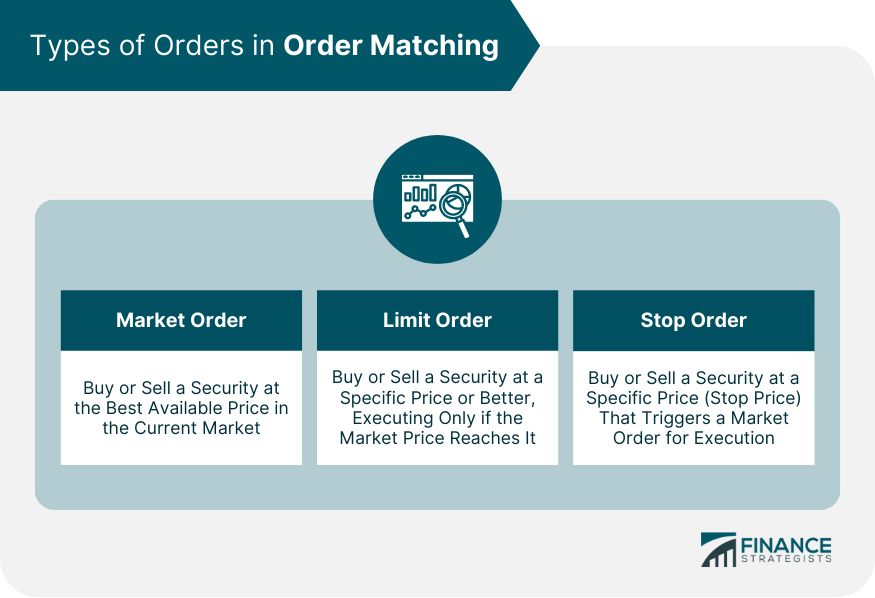

## Table of Contents

## What is a matching order in trading?

A matching order in trading is when a buy order and a sell order for the same thing, like a stock or a commodity, come together and agree on a price. This happens on a trading platform where people want to buy and sell things. When someone wants to buy at a certain price and someone else wants to sell at that same price, their orders match, and the trade happens.

This process is important because it helps make sure that trades happen quickly and fairly. The trading platform looks at all the orders and tries to match them as best as it can. When orders match, it means both the buyer and the seller are happy with the price, and the trade can go through smoothly.

## Why are matching orders important in financial markets?

Matching orders are important in financial markets because they help make sure that buying and selling happens smoothly and fairly. When someone wants to buy something at a certain price, and someone else wants to sell it at that same price, their orders match. This means the trade can happen right away, and both people are happy with the price. Without matching orders, it would be harder for people to trade things quickly and easily.

Also, matching orders help keep the market organized. They make sure that trades are done in a clear and open way, so everyone can see what is happening. This helps build trust in the market because people know that the prices they see are real and that their trades will happen fairly. In the end, matching orders help the market work better for everyone involved.

## What are the basic principles behind order matching?

The basic principles behind order matching are about finding a fair price where both the buyer and the seller agree. When someone wants to buy something, like a stock, they put in a buy order with the price they are willing to pay. At the same time, someone who wants to sell the same stock puts in a sell order with the price they want. The trading system looks at all these orders and tries to find a match where the buy price and the sell price are the same or close enough. This way, the trade can happen, and both people are happy with the deal.

Another important principle is the order of priority. When there are many buy and sell orders, the system needs to decide which ones to match first. Usually, the system follows a rule called "first come, first served," so the orders that came in first get matched first. Sometimes, the system also looks at the price, giving priority to the highest buy orders and the lowest sell orders. This helps make sure that the market stays fair and that people who are willing to pay more or accept less get their trades done quickly.

## How does a typical order matching system work?

A typical order matching system works by taking in buy and sell orders from people who want to trade things like stocks or commodities. When someone wants to buy, they put in a buy order with the price they are willing to pay. At the same time, someone who wants to sell puts in a sell order with the price they want. The system looks at all these orders and tries to find a match where the buy price and the sell price are the same or close enough. When it finds a match, the trade happens right away, and both the buyer and the seller are happy with the price.

The system also follows rules about which orders to match first. Usually, it goes by the rule of "first come, first served," so the orders that came in first get matched first. Sometimes, it also looks at the price, giving priority to the highest buy orders and the lowest sell orders. This helps make sure the market stays fair and that people who are willing to pay more or accept less get their trades done quickly. By following these rules, the order matching system helps make trading smooth and fair for everyone.

## What are the different types of orders that can be matched?

There are different types of orders that can be matched in a trading system. The most common ones are market orders and limit orders. A market order is when someone wants to buy or sell something right away at the best available price. For example, if you want to buy a stock and you put in a market order, the system will match your order with the lowest sell price available. A limit order is when someone wants to buy or sell at a specific price or better. So, if you put in a limit order to buy a stock at $50, your order will only be matched if someone is willing to sell at $50 or less.

Another type of order is a stop order, which is used to limit losses or protect profits. A stop order becomes a market order once the stock reaches a certain price. For example, if you own a stock and you put in a stop order to sell at $40, your order will turn into a market order and be matched as soon as the stock price hits $40 or lower. There are also stop-limit orders, which combine the features of a stop order and a limit order. With a stop-limit order, once the stock reaches the stop price, it turns into a limit order instead of a market order. So, if you set a stop-limit order to sell at $40 with a limit of $39, your order will only be matched if the stock price is between $40 and $39.

## Can you explain the role of a matching engine in trading platforms?

A matching engine is like the heart of a trading platform. It's the part that makes sure all the buy and sell orders come together correctly. When someone wants to buy something at a certain price, and someone else wants to sell it at that price, the matching engine finds these orders and makes the trade happen. It's really important because it helps keep the market fair and makes sure that trades happen quickly.

The matching engine follows some simple rules to decide which orders to match first. Usually, it goes by the rule of "first come, first served," so the orders that came in first get matched first. Sometimes, it also looks at the price, giving priority to the highest buy orders and the lowest sell orders. By following these rules, the matching engine helps make trading smooth and fair for everyone. Without it, it would be much harder for people to buy and sell things quickly and easily.

## What are some common matching algorithms used in stock exchanges?

One common matching algorithm used in stock exchanges is the Pro-Rata algorithm. This method tries to be fair by splitting up big orders among many smaller ones. If there's a big buy order and a lot of small sell orders at the same price, the Pro-Rata algorithm will give a piece of the big order to each small sell order. This way, everyone gets a chance to sell some of their stock, even if they can't sell all of it at once.

Another common algorithm is the Price/Time Priority algorithm. This one is simple but effective. It matches orders based on two things: price and time. If there are a lot of buy and sell orders, the system looks at the price first. The highest buy orders and the lowest sell orders get matched first. If there are still orders left at the same price, the system then looks at the time the orders came in. The ones that came in first get matched before the ones that came in later. This helps keep things fair and organized.

## How do priority rules affect the matching of orders?

Priority rules are really important for how orders get matched in trading. They help decide which orders get to be matched first when there are a lot of people wanting to buy and sell at the same time. The most common rule is "first come, first served." This means that if two people want to buy at the same price, the one who put in their order first gets matched first. This rule helps keep things fair because everyone knows that if they put in their order quickly, they have a better chance of getting their trade done.

Another important rule is about price. If there are a lot of buy and sell orders, the system looks at the price first. The highest buy orders and the lowest sell orders get matched first. This makes sense because it means that people who are willing to pay more or accept less get their trades done quickly. By using these priority rules, the trading system can make sure that orders are matched in a way that is fair and helps the market work smoothly.

## What are the differences between continuous and call auction matching mechanisms?

Continuous matching is when buy and sell orders are matched all the time, as soon as they come in. Imagine you want to buy a stock, and you put in your order. If someone else wants to sell that stock at the price you're willing to pay, your orders get matched right away. This happens all day long, so trades can happen quickly. It's like a busy marketplace where people are always buying and selling things.

Call auction matching is different. It happens at certain times of the day, like at the start or end of trading. All the buy and sell orders are collected during a specific time, and then they are all matched at once. This is like having a big event where everyone comes together at the same time to trade. It can help set a fair price because all the orders are considered together, but it means you have to wait until the auction time to see if your trade will happen.

## How do matching orders impact market liquidity and price discovery?

Matching orders help make the market more liquid. Liquidity means how easy it is to buy or sell something without changing its price too much. When buy and sell orders are matched quickly and fairly, more people feel happy to trade. They know their orders will be filled at good prices, so they are more likely to put in more orders. This means there are always lots of orders in the market, making it easier for everyone to trade. More trading means the market stays active and liquid.

Matching orders also help with price discovery. Price discovery is how the market figures out what something is worth. When lots of people are buying and selling, their orders show what prices they think are fair. The matching engine looks at all these orders and finds the best price where buyers and sellers agree. This helps set a fair price for everyone. When the market is good at matching orders, it can find the right price faster and more accurately, making the whole market work better.

## What are some real-world examples of order matching in major stock exchanges?

In the New York Stock Exchange (NYSE), order matching happens all the time during the trading day. When someone wants to buy a stock, they put in a buy order with a price they are willing to pay. At the same time, someone else might want to sell that same stock and put in a sell order with a price they want. The NYSE's system looks at all these orders and tries to match them. If the buy price and the sell price are the same, the trade happens right away. This helps keep the market busy and makes sure people can buy and sell stocks quickly and fairly.

The NASDAQ also uses order matching to help people trade stocks. It uses a system called the NASDAQ Market Center, which matches buy and sell orders all day long. Just like the NYSE, if someone puts in a buy order and someone else puts in a sell order at the same price, the NASDAQ system matches them. This helps keep the market liquid, meaning it's easy for people to buy and sell stocks without big price changes. Both the NYSE and NASDAQ use these matching systems to make sure trading happens smoothly and that everyone gets a fair chance to trade.

## What advanced strategies can traders use to optimize order matching?

Traders can use a strategy called "order slicing" to optimize order matching. This means they break up their big orders into smaller pieces. Instead of putting in one big order to buy a lot of stock, they put in many small orders at different prices. This can help them get a better average price because their orders might match with different sell orders at different prices. It also helps them not to move the market too much with a big order all at once. By using order slicing, traders can be more sneaky and get better deals.

Another strategy is using "iceberg orders." This is when a trader puts in a big order but only shows a small part of it to the market. The rest of the order stays hidden, like the part of an iceberg under water. This can help the trader buy or sell a lot without scaring other people in the market. If other traders see a big order, they might change their prices, but with an iceberg order, only a little bit shows up at a time. This way, the trader can match their orders without making big waves in the market.

## What Core Algorithms Are Used?

The core algorithms used in matching orders within financial markets are the First-In-First-Out (FIFO) and Pro-Rata algorithms, each of which serves distinct purposes aligned with the needs of different trading environments. These two algorithms are pivotal in determining the efficiency and fairness of trade execution.

**First-In-First-Out (FIFO):** This is one of the most straightforward and widely used algorithms. FIFO matches orders based on the time of arrival, ensuring that earlier orders are prioritized. This method is especially beneficial for maintaining a sequence where the earliest orders at a given price level are filled first. The system is designed to uphold the dual principles of time and price priority, ensuring a fair trading environment by reducing the chances of queue-jumping. Math-wise, FIFO can be demonstrated with a simple queue, where elements are processed in the order they arrive:

```python
from collections import deque

def fifo_matching(order_queue):
    while order_queue:
        order = order_queue.popleft()  # Process the first order in the queue
        execute_trade(order)  # A placeholder function to execute the trade

# Example queue with orders
orders = deque(['Order1', 'Order2', 'Order3'])
fifo_matching(orders)
```

**Pro-Rata:** This algorithm is designed to allocate trades proportionally based on the size of orders when there are multiple at the same price level. Pro-Rata is particularly useful in environments where liquidity or order size is prioritized over the order of arrival. It effectively distributes large matching orders across available opposite orders to ensure market depth and liquidity are maintained. For instance, if there are multiple buy orders totaling 1,000 shares and a sell order of 500 shares, each buy order receives a proportion of the sell order according to its size. In formulaic terms, the allocation can be represented as:

$$
\text{Allocated\_Shares} = \frac{\text{Order\_Size}}{\text{Total\_Matching\_Size}} \times \text{Available\_Shares}
$$

Here is a simple representation in Python:

```python
def pro_rata_matching(buy_orders, available_shares):
    total_buy_size = sum(order['size'] for order in buy_orders)
    for order in buy_orders:
        order['allocated'] = (order['size'] / total_buy_size) * available_shares

# Example list of buy orders
buy_orders = [{'id': 'Buy1', 'size': 300}, {'id': 'Buy2', 'size': 200}]
available_shares = 500
pro_rata_matching(buy_orders, available_shares)
```

**Deployment Across Markets:** The choice between FIFO and Pro-Rata, or possibly a hybrid approach, depends on market-specific requirements regarding speed, fairness, and liquidity. Markets with high-frequency trading often lean towards FIFO due to its straightforward implementation and commitment to time priority. Conversely, markets needing to distribute large block trades equitably among participants might prefer Pro-Rata. Additionally, the deployment of either method considers system processing capabilities, frequency of trades, and the marketplace's overarching trading ethos. Each algorithm thus plays a pivotal role in ensuring the smooth functioning of financial exchanges under their respective operational climates.

## References & Further Reading

[1]: Bergstra, J., Bardenet, R., Bengio, Y., & Kégl, B. (2011). ["Algorithms for Hyper-Parameter Optimization."](https://dl.acm.org/doi/10.5555/2986459.2986743) Advances in Neural Information Processing Systems 24.

[2]: ["Advances in Financial Machine Learning"](https://www.amazon.com/Advances-Financial-Machine-Learning-Marcos/dp/1119482089) by Marcos Lopez de Prado

[3]: ["Evidence-Based Technical Analysis: Applying the Scientific Method and Statistical Inference to Trading Signals"](https://www.amazon.com/Evidence-Based-Technical-Analysis-Scientific-Statistical/dp/0470008741) by David Aronson

[4]: ["Machine Learning for Algorithmic Trading"](https://github.com/stefan-jansen/machine-learning-for-trading) by Stefan Jansen

[5]: ["Quantitative Trading: How to Build Your Own Algorithmic Trading Business"](https://www.amazon.com/Quantitative-Trading-Build-Algorithmic-Business/dp/1119800064) by Ernest P. Chan