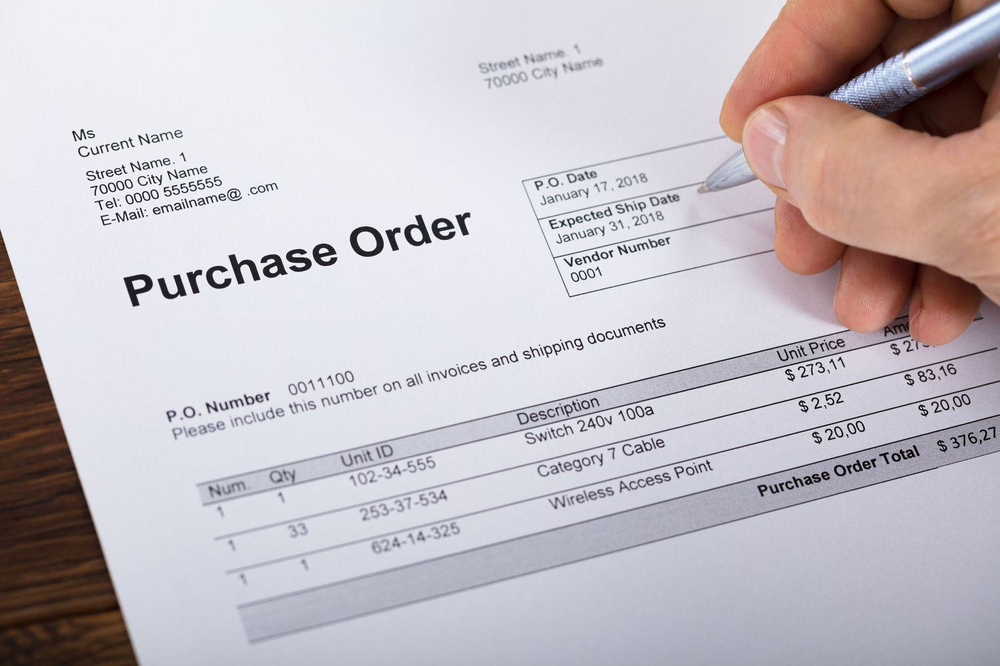

This article explores the pivotal role of matching orders in modern financial markets, emphasizing their central function in ensuring the smooth operation of securities exchanges. Matching orders refers to the process of pairing buy and sell orders with equivalent prices and quantities, thereby facilitating trade execution. This function is crucial for maintaining market efficiency, allowing for swift and accurate transactions that are essential for both liquidity and price discovery.

Traditionally, trade executions involved significant human intervention, where market makers manually matched buy and sell orders. However, advancements in technology and the advent of algorithmic trading have revolutionized this process. Algorithmic trading employs sophisticated algorithms to automatically match orders at high speeds, thereby enhancing the speed and fairness of executions. These algorithms take into account various factors such as the order size, timing, and prevailing market conditions, thereby reducing the likelihood of human error and ensuring a more streamlined trading experience.



Understanding the mechanics of order matching can offer insights and potential benefits to both casual investors and professional traders. For casual investors, knowledge of how matching orders work can inform better investment decisions, particularly regarding the timing and pricing of trades. Professional traders, on the other hand, can leverage this understanding to optimize their trading strategies, potentially leading to improved margins and reduced risks.

This article will provide a comprehensive overview of the mechanisms and underlying algorithms involved in order matching, as well as the challenges and regulatory frameworks that govern these processes. By assimilating this information, stakeholders in financial markets—be they regulators, institutional investors, or retail traders—can better appreciate and navigate the complexities of trade execution and order matching in today's fast-paced trading environments.

## Table of Contents

## Understanding Matching Orders

Matching orders are a fundamental component in the efficient functioning of securities exchanges. This mechanism involves the process of pairing buy and sell orders, aligning them by prices and quantities to facilitate trade execution. Upon successfully matching these orders, a trade transaction occurs, thereby maintaining market fluidity and stability.

One of the critical developments in financial markets is the transition from manual to automated systems for order matching. This shift has significantly enhanced efficiency by reducing the time it takes to match orders and execute trades. Automated systems rely on sophisticated algorithms and high-speed computing to handle the high volume and frequency of trades seen in today's markets. As a result, the need for human intervention in the order matching process has been virtually eliminated, leading to faster, more accurate trade executions.

The core function of a matching engine, the software driving automated order matching, is to ensure that orders are matched as per the rules of the exchange, which often prioritize based on factors such as price, time, and size of the order. A typical matching process can be described through a sequence of functions that take submitted orders, store them in an [order book](/wiki/order-book-trading-strategies), and execute trades when matching conditions are met. The continuous matching process ensures that market participants can buy or sell securities at market prices efficiently, supporting both [liquidity](/wiki/liquidity-risk-premium) and price discovery.

Automation in order matching also contributes to the minimization of errors and reduction in operational costs associated with manual trading systems. Overall, the automation of matching orders stands as a testament to how technological advancements have transformed traditional markets into fast-paced, dynamic environments, characterized by high efficiency and enhanced stability.

## Core Algorithms Used

The core algorithms used in matching orders within financial markets are the First-In-First-Out (FIFO) and Pro-Rata algorithms, each of which serves distinct purposes aligned with the needs of different trading environments. These two algorithms are pivotal in determining the efficiency and fairness of trade execution.

**First-In-First-Out (FIFO):** This is one of the most straightforward and widely used algorithms. FIFO matches orders based on the time of arrival, ensuring that earlier orders are prioritized. This method is especially beneficial for maintaining a sequence where the earliest orders at a given price level are filled first. The system is designed to uphold the dual principles of time and price priority, ensuring a fair trading environment by reducing the chances of queue-jumping. Math-wise, FIFO can be demonstrated with a simple queue, where elements are processed in the order they arrive:

```python
from collections import deque

def fifo_matching(order_queue):
    while order_queue:
        order = order_queue.popleft()  # Process the first order in the queue
        execute_trade(order)  # A placeholder function to execute the trade

# Example queue with orders
orders = deque(['Order1', 'Order2', 'Order3'])
fifo_matching(orders)
```

**Pro-Rata:** This algorithm is designed to allocate trades proportionally based on the size of orders when there are multiple at the same price level. Pro-Rata is particularly useful in environments where liquidity or order size is prioritized over the order of arrival. It effectively distributes large matching orders across available opposite orders to ensure market depth and liquidity are maintained. For instance, if there are multiple buy orders totaling 1,000 shares and a sell order of 500 shares, each buy order receives a proportion of the sell order according to its size. In formulaic terms, the allocation can be represented as:

$$
\text{Allocated\_Shares} = \frac{\text{Order\_Size}}{\text{Total\_Matching\_Size}} \times \text{Available\_Shares}
$$

Here is a simple representation in Python:

```python
def pro_rata_matching(buy_orders, available_shares):
    total_buy_size = sum(order['size'] for order in buy_orders)
    for order in buy_orders:
        order['allocated'] = (order['size'] / total_buy_size) * available_shares

# Example list of buy orders
buy_orders = [{'id': 'Buy1', 'size': 300}, {'id': 'Buy2', 'size': 200}]
available_shares = 500
pro_rata_matching(buy_orders, available_shares)
```

**Deployment Across Markets:** The choice between FIFO and Pro-Rata, or possibly a hybrid approach, depends on market-specific requirements regarding speed, fairness, and liquidity. Markets with high-frequency trading often lean towards FIFO due to its straightforward implementation and commitment to time priority. Conversely, markets needing to distribute large block trades equitably among participants might prefer Pro-Rata. Additionally, the deployment of either method considers system processing capabilities, frequency of trades, and the marketplace's overarching trading ethos. Each algorithm thus plays a pivotal role in ensuring the smooth functioning of financial exchanges under their respective operational climates.

## Real-World Application of Matching Orders

Matching orders play a crucial role in high-frequency trading ([HFT](/wiki/high-frequency-trading-strategies)) and institutional trading by ensuring that buy and sell orders are efficiently paired, thereby facilitating seamless transactions. In high-frequency trading, where the success of trading strategies relies heavily on speed and precision, matching orders enable traders to execute trades within microseconds. Such rapid executions are critical during market fluctuations or significant news events, especially in dynamic sectors like energy, where stock prices can fluctuate rapidly based on news about energy policies, geopolitical events, or natural disasters.

For example, an energy company releasing quarterly earnings can lead to a sudden spike in trading [volume](/wiki/volume-trading-strategy). In response, matching engines work tirelessly to process the flood of incoming buy and sell orders, ensuring that trades are executed at the best possible price. This high turnover requires robust systems capable of handling vast quantities of data swiftly and accurately, a task well-suited to modern, automated matching algorithms.

The efficiency of matching engines also supports the trading needs of institutional investors who may deal with large block trades that are complex and require more nuanced execution strategies. These investors rely on the ability of matching systems to break down substantial orders into smaller trades to be efficiently matched with corresponding orders in the marketplace. As a result, these systems maintain market fluidity and ensure that large trades do not disproportionately impact market prices.

Matching orders played a critical role during events like the COVID-19 pandemic when markets experienced extreme [volatility](/wiki/volatility-trading-strategies). In such periods, the ability of matching engines to process high volumes of trades without significant delays was instrumental in maintaining market stability. Despite the challenges posed by sudden spikes in trading activity, these systems successfully executed a vast number of trades, underpinning the overall resilience of financial markets.

In conclusion, matching orders are vital to the functioning of contemporary trading environments, as they facilitate effective trading strategies and enhance market efficiency and liquidity even under conditions of elevated trade volumes and volatility.

## Advantages of Matching Orders

Matching orders are an integral mechanism in modern financial markets, offering numerous advantages that significantly enhance market operations. One of the primary advantages is the improvement of market liquidity. By efficiently pairing buy and sell orders, matching systems ensure that market participants can transact without substantial delays, thereby sustaining continuous market activity. This fluidity is particularly beneficial in volatile markets where the ability to quickly execute trades is crucial. 

The use of algorithmic matching minimizes slippage, which is the difference between the expected price of a trade and the actual executed price. By rapidly matching orders based on predetermined algorithms, market participants are more likely to achieve favorable prices. For instance, algorithmic matching can reduce the likelihood of price shifts that commonly occur in manual trading due to slower execution times. Consequently, this fosters better price discovery, where the prices accurately reflect available information and intrinsic asset values.

Perhaps one of the most significant benefits of order matching is the elimination of manual intervention. This reduction in human involvement drastically mitigates the risk of errors that can occur in manual processes. Additionally, the mechanization of order matching minimizes opportunities for market manipulation, such as front running or insider trading, promoting a fairer trading environment.

As a result, the integration of algorithmic matching systems within trading platforms ensures a more transparent and equitable market atmosphere. With the continuous evolution of these systems, traders and investors can expect enhanced efficiency and reliability in executing trades, thus reinforcing confidence in market integrity.

## Challenges and Risks

Automated order matching systems, while providing remarkable efficiency in modern financial markets, are not without their challenges and risks. A primary concern is the potential for market manipulation through strategies such as spoofing. Spoofing involves placing large orders with the intent to cancel before execution, thereby misleading other traders about supply and demand [1]. This can distort price movements and undermine market fairness, posing significant risks to investors who rely on the integrity of trading information.

Technical failures represent another significant risk, particularly within high-frequency trading (HFT) environments. Systems supporting automated order matching operate at extreme speeds, processing thousands of transactions within milliseconds. Any technical glitch, whether it be software bugs, network issues, or hardware malfunctions, can result in substantial losses or disruptions to market operations. For instance, the 2012 Knight Capital incident, where a trading algorithm malfunction led to a $440 million loss in about 45 minutes, highlights the potentially catastrophic impact of technical failures [2].

Regulatory oversight plays a crucial role in mitigating these risks, ensuring the integrity and fairness of financial markets. Regulatory bodies, such as the U.S. Securities and Exchange Commission (SEC) and the European Securities and Markets Authority (ESMA), enforce strict rules about market behavior and system reliability. These regulations require that trading platforms implement robust risk management protocols, conduct regular audits, and maintain transparent operations to prevent systemic failures and manipulative practices [3].

In conclusion, while automated order matching systems significantly enhance trading efficiency and market liquidity, they also present challenges that necessitate vigilant oversight and continuous technological advancements to safeguard market integrity.

References:

1. U.S. Commodity Futures Trading Commission and Securities and Exchange Commission, "Evaluation of the Strategic Planning for Spoofing," [Online]. Available: https://www.cftc.gov/.

2. Markets Media, “Knight Capital’s Trading Glitch: Lessons Learned,” [Online]. Available: https://www.marketsmedia.com/knight-capitals-trading-glitch-lessons-learned/.

3. Securities and Exchange Commission, “SEC Rule 15c3-5 Risk Management Controls for Brokers or Dealers with Market Access,” [Online]. Available: https://www.sec.gov.

## Regulatory Aspects

Financial regulators, notably the United States Securities and Exchange Commission (SEC) and the European Securities and Markets Authority (ESMA), play a crucial role in overseeing order matching systems to curtail market abuse and maintain the integrity of financial markets. These regulatory bodies enforce stringent rules designed to ensure that order matching does not lead to unfair practices such as front running or market manipulation.

A key aspect of these regulatory frameworks is the implementation of state-of-the-art technology in monitoring and auditing trading activities. Advanced surveillance systems are deployed to detect irregular trading patterns that may indicate fraudulent activities like spoofing or layering. The use of real-time data analytics and pattern recognition algorithms enables regulators to quickly identify and respond to suspicious trading behaviors.

Regular audits and compliance checks are integral to this regulatory oversight. Exchanges and trading platforms are required to maintain detailed records of transactions and order book data, which are periodically reviewed by regulators to ensure adherence to prescribed legal and ethical standards. These audits aim to verify the accuracy and completeness of the trading records and assess whether the platforms have adequate controls in place to prevent market abuse.

Transparency and fairness are central objectives in the current regulatory frameworks governing order matching. Regulators mandate that trading platforms provide equal access to market information for all participants, thereby reducing information asymmetry. This is intended to foster a competitive trading environment where no single market participant has an undue advantage over others.

Moreover, regulations stipulate that order matching algorithms be designed in a way that prioritizes equitable treatment of all orders, typically by adhering to principles like best execution. This involves ensuring that orders are matched and executed at prices that are favorable and justifiable under current market conditions.

Overall, the regulatory frameworks established by bodies like the SEC and ESMA aim to safeguard trust in financial markets by maintaining robust controls over order matching systems. By enhancing transparency, fairness, and integrity in trading, these regulations contribute to the overall efficiency and reliability of financial markets.

## Impact of Matching Orders on Market Liquidity

Matching systems play a critical role in enhancing market liquidity by facilitating efficient trade execution, which is essential for robust market operations. These systems help reduce bid-ask spreads, making it easier for market participants to buy or sell securities at favorable prices. A narrower bid-ask spread indicates a smaller difference between the highest price a buyer is willing to pay for an asset and the lowest price a seller is willing to accept. This reduction in spread is vital for fostering price discovery, allowing traders to better determine the fair market value of securities. Consequently, matching systems are integral in maintaining a vibrant and active trading environment where liquidity is abundant and transaction costs are minimized.

The efficient operations of matching orders are crucial for smoother trade execution, particularly in volatile markets where rapid price changes are common. By ensuring timely and accurate pairing of buy and sell orders, matching systems expedite the transaction process, thus preventing slippage—where the executed price differs from the expected price due to market movement. This efficiency not only safeguards market participants against undesirable execution outcomes but also promotes confidence in the market mechanism itself.

However, while matching systems offer significant benefits, inefficiencies can emerge that adversely affect market liquidity. For example, if a matching system experiences technical glitches or delays, it can lead to wider bid-ask spreads. This scenario heightens transaction costs and may deter trading activity, as market participants become unsure about the ability to execute trades effectively. Such inefficiencies can result in slippage, where orders are executed at less optimal prices, further diminishing market liquidity.

To illustrate these points, consider the impact of an [algorithmic trading](/wiki/algorithmic-trading) malfunction during periods of high market activity. A delay in order processing or a backlog in the system can expand spreads, as the execution risk increases due to uncertainty about the timing of order fulfillment. This environment can discourage market makers from quoting prices, thus thinning liquidity and exacerbating market volatility.

In summary, while matching systems significantly contribute to market liquidity by optimizing trade execution and supporting price discovery, maintaining their efficiency is paramount to ensuring they do not inadvertently cause liquidity constraints. Continuous technological advancements and diligent system monitoring are essential to mitigate the risks of inefficiency and uphold the integrity of the trading environment.

## Technological Innovations in Order Matching

Technological innovations have significantly altered the landscape of order matching in financial markets. High-frequency trading (HFT) is one of the most profound advancements, characterized by its ability to execute a large number of trades at extremely high speeds. This practice relies on sophisticated algorithms and cutting-edge infrastructure to achieve minimal latency, enabling traders to capitalize on minute price discrepancies within fractions of a second. The result is not only enhanced market liquidity but also a dynamic environment where pricing discrepancies are rapidly resolved.

Artificial Intelligence (AI) and [machine learning](/wiki/machine-learning) further contribute to the modernization of order matching systems. These technologies enhance the accuracy and reliability of trading strategies by analyzing vast datasets to identify patterns and predict market movements. Machine learning algorithms, for example, can optimize order execution by continuously learning and adapting to changing market conditions, thereby improving decision-making processes and reducing the likelihood of errors.

Python code showcases how machine learning can be applied to such tasks. Here is a simplified example of how one might use a machine learning model to predict and match orders:

```python
from sklearn.model_selection import train_test_split
from sklearn.ensemble import RandomForestClassifier
import pandas as pd

# Load historical trading data
data = pd.read_csv('trading_data.csv')

# Preprocess data: features and target
X = data.drop('matched_order', axis=1) # Features
y = data['matched_order'] # Target variable (1 if order matched, 0 otherwise)

# Split the data for training and testing
X_train, X_test, y_train, y_test = train_test_split(X, y, test_size=0.2, random_state=42)

# Train a Random Forest Classifier
model = RandomForestClassifier(n_estimators=100, random_state=42)
model.fit(X_train, y_train)

# Evaluate the model
accuracy = model.score(X_test, y_test)
print(f"Model accuracy: {accuracy:.2f}")
```

Blockchain technology offers new opportunities for secure and efficient order matching. By providing a decentralized ledger, blockchain ensures transparency and immutability in the matching process, which mitigates risks such as fraud and unauthorized alterations. This technology is particularly promising for enhancing the security and integrity of order matching operations, while also improving auditability and compliance with regulatory standards.

These technological advancements collectively elevate market operation standards, ensuring greater speed, accuracy, and reliability in order matching. As technology continues to evolve, these innovations will undoubtedly lead to more sophisticated and robust systems, further optimizing the efficiency and fairness of financial market operations.

## Conclusion

Matching orders remain a cornerstone of effective financial market operations, central to the seamless functioning of modern trading systems. They ensure that buy and sell orders are paired accurately, promoting fair, efficient, and transparent trade execution. This process not only enhances market liquidity but also minimizes transaction costs and ensures price discovery is accurate and reflective of market conditions. The precision and speed achieved through modern algorithmic trading and automated order matching have significantly reduced the need for human intervention, thereby mitigating the risk of bias or error.

As financial markets continue to evolve, the importance of matching orders will only intensify. Technological advancements such as high-frequency trading algorithms, [artificial intelligence](/wiki/ai-artificial-intelligence), and machine learning are increasingly being integrated into trading systems. These technologies promise improvements in order matching speed, accuracy, and reliability, thereby setting higher standards for market operations.

Moreover, emerging technologies like blockchain offer potential disruptions that could further enhance order matching processes by establishing more secure and efficient trading environments. Concurrently, the role of regulatory enhancements cannot be overlooked. Regulatory bodies are continually reviewing and updating frameworks to ensure that trading practices remain fair, transparent, and resilient against potential abuses such as spoofing and technical failures.

In conclusion, the strategic integration of advanced technologies and robust regulatory measures will be pivotal in optimizing the impact of matching orders in financial markets, ensuring they continue to support the vital attributes of fairness, efficiency, and transparency in trade execution.

## References & Further Reading

[1]: Bergstra, J., Bardenet, R., Bengio, Y., & Kégl, B. (2011). ["Algorithms for Hyper-Parameter Optimization."](https://dl.acm.org/doi/10.5555/2986459.2986743) Advances in Neural Information Processing Systems 24.

[2]: ["Advances in Financial Machine Learning"](https://www.amazon.com/Advances-Financial-Machine-Learning-Marcos/dp/1119482089) by Marcos Lopez de Prado

[3]: ["Evidence-Based Technical Analysis: Applying the Scientific Method and Statistical Inference to Trading Signals"](https://www.amazon.com/Evidence-Based-Technical-Analysis-Scientific-Statistical/dp/0470008741) by David Aronson

[4]: ["Machine Learning for Algorithmic Trading"](https://github.com/stefan-jansen/machine-learning-for-trading) by Stefan Jansen

[5]: ["Quantitative Trading: How to Build Your Own Algorithmic Trading Business"](https://www.amazon.com/Quantitative-Trading-Build-Algorithmic-Business/dp/1119800064) by Ernest P. Chan