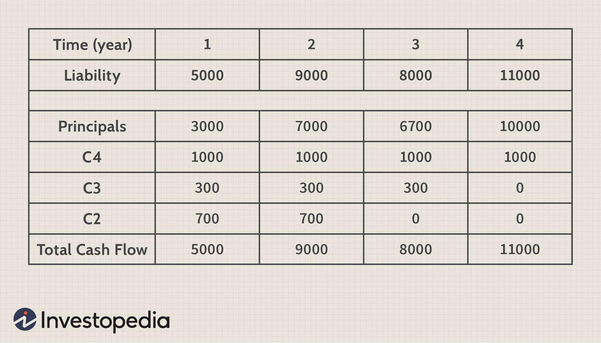

In the modern world of finance, technological advancements have significantly reshaped how investors approach portfolio management. Among these innovations, algorithmic trading stands out as a transformative force. It employs computers to execute trades at extraordinary speeds based on predefined criteria. This capability allows for precision and responsiveness that manual trading methods cannot match, presenting investors with opportunities for enhanced execution quality and reduced trading costs.

Within this evolving landscape, integrating investment strategy matching with financial planning is crucial for optimizing gains. Investment strategy matching focuses on aligning investment choices with specific financial obligations, ensuring that investment returns are synchronized with future liabilities. When combined with algorithmic trading, this approach provides an automated and efficient way of meeting financial goals while mitigating risks related to market volatility and human error.



This article aims to present a unified approach that combines investment strategy matching, financial planning, and algorithmic trading, illustrating how they interconnect to enhance investment outcomes. By exploring each component and understanding their synergy, investors can gain insights into creating a robust and dynamic investment strategy. By the conclusion, it will be evident why aligning one's investment strategies with algorithmic capabilities and thorough financial planning is imperative for achieving both stability and growth in today's volatile financial markets.

## Table of Contents

## Understanding Investment Strategy Matching

Investment strategy matching involves the coordination of investment decisions to ensure that portfolio returns align with specific financial liabilities. The primary objective of this strategy is to meet financial obligations as they come due, thus enhancing financial stability.

Central to investment strategy matching is cash flow matching, which involves timing the returns from investments to coincide with liability payouts. This allows investors to structure their portfolios so that income from investments is available precisely when required to cover financial commitments. For example, if an investor knows that they have a liability due in five years, they might invest in a bond that matures at that time, ensuring the proceeds are available to meet the obligation.

This concept is closely related to a dedication strategy, which focuses on achieving future financial needs by constructing a portfolio specifically designed to meet predetermined liabilities. Unlike traditional asset allocation, which focuses on investment returns, dedication strategies prioritize meeting financial commitments.

Investment strategy matching also involves customizing each investment according to the investor's risk profile and cash flow requirements. By tailoring investments, an investor can ensure that their portfolio is not only capable of covering future liabilities but does so with a level of risk that aligns with their tolerance. For example, an investor with a low-risk tolerance may focus on secure, low-yield bonds to ensure the reliability of cash flows.

By adopting investment strategy matching, the risks associated with inconsistent cash flows can be minimized, leading to greater financial stability. Rather than relying on potentially volatile market returns to meet financial needs, investors can design a portfolio that consistently meets their obligations. This strategic approach enables investors to navigate unforeseen economic fluctuations confidently, knowing their key liabilities will be covered.

## Financial Planning as a Pillar of Strategy

Successful investing requires comprehensive financial planning as its foundation. This process involves a strategic evaluation of one's financial situation, employing techniques such as budgeting, risk assessment, and the formulation of long-term financial goals. By meticulously assessing income, expenditures, and potential risks, financial planning provides a solid roadmap. This roadmap acts as a guiding tool, ensuring that both personal and organizational financial objectives are met over time.

Budgeting involves creating a detailed plan that allocates financial resources to various expenses and savings. It is critical for identifying surplus funds that can be channeled into investments, thereby fostering wealth accumulation. Equally important is risk assessment, which evaluates potential financial risks and formulates strategies to mitigate them. This includes understanding market [volatility](/wiki/volatility-trading-strategies), economic factors, and personal circumstances that could impact one's financial situation.

Long-term financial goals are central to financial planning. These goals may include saving for retirement, purchasing a home, or funding education, and they provide targets that influence investment strategies. Aligning these goals with investment strategy matching ensures that liabilities, such as future debts or obligations, are covered. This synchronization is crucial for maintaining financial stability and achieving desired outcomes.

Retirement funds and pension plans epitomize the necessity of integrating financial planning into investment strategies. These funds require precise planning to ensure they meet future benefit requirements. By analyzing projected expenses and income streams, individuals can adjust their savings and investments to ensure sufficient coverage of future needs.

The effectiveness of financial planning is also evident in its ability to track progress and make necessary adjustments over time. Regular reviews of financial performance against set objectives enable individuals to make informed decisions. This dynamic approach accommodates changes in financial conditions or personal circumstances, ensuring that investment strategies remain aligned with long-term goals.

In conclusion, financial planning is an essential pillar of investment strategy. By employing detailed budgeting, thorough risk assessments, and clearly defined goals, individuals and organizations can establish a stable financial foundation. This foundation is vital for making informed investment decisions that cater to future liabilities, ultimately leading to financial security and growth.

## The Role of Algo Trading in Modern Finance

Algorithmic trading, commonly referred to as algo trading, is a method of executing orders using automated and pre-programmed trading instructions to account for variables such as time, price, and [volume](/wiki/volume-trading-strategy). Rooted in sophisticated algorithms, this technology enables traders to make rapid decisions based on vast and complex data sets, identifying profitable market opportunities with precision and speed. 

One of the striking advantages of [algorithmic trading](/wiki/algorithmic-trading) is its ability to analyze extensive data in record time. This rapid analysis is crucial for capitalizing on short-lived market trends that human traders might overlook or react to too slowly. For instance, algo trading strategies such as [trend following](/wiki/trend-following), mean reversion, and statistical [arbitrage](/wiki/arbitrage) are implemented to exploit pricing inefficiencies or capture price movements.

1. **Trend Following:** This strategy focuses on algorithms that identify and trade along the direction of market trends. When a particular asset's price is moving in a sustained direction, an algorithm set for trend following might enter a position and exit once the trend reverses.

2. **Mean Reversion:** This presupposes that asset prices will revert to their historical averages. Algorithms programmed for mean reversion will act on the judgment that overvalued or undervalued assets will return to their average value.

3. **Statistical Arbitrage:** This involves executing a set of numerous small trades to exploit the small pricing discrepancies between asset pairs. Algorithms adeptly recognize these small mispricings and capitalize on them quickly.

A key benefit of algo trading is the enhancement of efficiency and the minimization of human error. Since algorithms can execute trades without the emotional biases that often plague human traders, they reduce the chance of impulsive decisions affecting trading performance. Additionally, high-frequency trading ([HFT](/wiki/high-frequency-trading-strategies)) is an important subset of algo trading, characterized by high-speed order execution. With the capability to perform thousands of trades in mere milliseconds, HFT leverages minuscule profit margins across numerous transactions to achieve substantial cumulative gains. 

Beyond speed and efficiency, algo trading is scalable and offers the ability to rigorously test trading strategies. Backtesting enables traders to simulate how a strategy would have performed using historical data, helping refine approaches before they are applied in live markets. This method of testing strategic efficacy serves as a crucial step in risk management and strategy development.

In summary, the role of algorithmic trading in modern finance is transformative, providing traders with tools that offer unprecedented speed, precision, and analytical capability. By leveraging automated algorithms, investors can achieve more efficient market engagement while minimizing human errors and emotional biases.

## Integrating Investment Strategy with Algo Trading

Integrating investment strategy with algorithmic trading can significantly enhance the precision and efficiency of investment decisions. Algorithmic approaches facilitate strategy matching by offering precise alignment of cash flows with financial liabilities, which is essential in fulfilling future obligations. Algorithms can analyze vast amounts of market data in real time, ensuring that the investment strategies remain current and relevant.

Algorithmic trading platforms provide critical real-time data access, which is vital for maintaining the accuracy of strategy matching. This allows investors to monitor market trends and adjust investment strategies as soon as new information becomes available, ensuring timely responses to market changes. Furthermore, these platforms enable automated rebalancing of investment portfolios to keep them aligned with pre-determined financial plans. For example, a dynamic approach can be implemented where the portfolio rebalances whenever its asset allocation drifts by a certain percentage. This can be achieved through Python code as follows:

```python
def rebalance_portfolio(portfolio, target_allocation):
    for asset, target_percent in target_allocation.items():
        total_value = sum(portfolio.values())
        current_value = portfolio.get(asset, 0)
        current_percent = current_value / total_value

        if abs(current_percent - target_percent) > 0.01:  # Rebalance if drift is more than 1%
            rebalance_amount = total_value * (target_percent - current_percent)
            portfolio[asset] += rebalance_amount
    return portfolio
```

The use of algorithmic trading also enhances risk management. Adequate risk management settings within these platforms can mitigate risks associated with market volatility. Algorithms can be programmed to include stop-loss orders, trailing stops, and other risk control measures, which automatically trigger buy or sell orders when certain market conditions are met. This reduces human error and emotions involved in trading decisions, which are common pitfalls in manual trading strategies.

Moreover, algorithmic trading allows [backtesting](/wiki/backtesting) of strategies against historical data, further refining their effectiveness before deploying them in live markets. This enables the identification and correction of potential weaknesses in a strategy, ensuring that the algorithm remains robust across various market conditions.

In summary, the integration of investment strategies with algorithmic trading not only enhances precision in matching cash flows with liabilities but also ensures consistent alignment with financial plans through real-time data and automated rebalancing. Advanced risk management settings further enable the mitigation of market volatility impacts, making this integration a powerful tool for optimized investing.

## Common Pitfalls and How to Avoid Them

Over-optimizing algorithms to historical data, commonly known as overfitting, is a significant pitfall in algorithmic trading. Overfitting occurs when an algorithm is excessively tailored to past data, capturing noise rather than meaningful patterns, which leads to poor performance on new, unseen data. To combat overfitting, it is crucial to use robust cross-validation techniques and ensure that trading models are based on sound financial principles rather than opportunistic patterns.

Another critical issue in algorithmic trading is the oversight of transaction costs and slippage. While algorithms may indicate profitable trades on paper, ignoring the cost of executing these trades can erode potential profits. Transaction costs include broker fees, taxes, and other expenses incurred during trading, while slippage refers to the difference between the expected price of a trade and the actual price. To mitigate these effects, it's essential to model these costs realistically during the backtesting phase and to adjust your strategies accordingly.

Lack of diversification also represents a substantial risk. When a portfolio is heavily weighted towards a small number of strategies or asset classes, the risk of significant losses during market downturns increases. Maintaining a diversified strategy spreads risk across various assets and market conditions, reducing the impact of any single adverse event. Regular performance reviews and strategic adjustments ensure that the investment portfolio remains aligned with market conditions and personal financial goals.

Backtesting is a valuable tool in testing algorithmic strategies, but it must be applied judiciously. While backtesting offers insight into how a strategy might have performed historically, it's crucial to remember that past performance is not indicative of future results. To ensure meaningful backtesting, utilize walk-forward testing, which evaluates strategies over multiple, consecutive periods, mimicking the real-world application of trading algorithms. Moreover, incorporating realistic assumptions about transaction cost and slippage into backtests will provide a more accurate reflection of potential performance.

The ever-evolving nature of financial markets necessitates staying informed about technological advancements and market changes. Algorithmic strategies that once yielded success can become obsolete as trading landscapes shift. Consequently, continuous education and adaptation are key to sustaining long-term success in algorithmic trading. By regularly refining algorithms and strategies to incorporate new data and insights, investors can maintain a competitive edge in dynamic markets.

In summary, avoiding these common pitfalls requires a disciplined approach, combining robust risk management, realistic modeling, continuous learning, and strategic diversification. By doing so, investors can harness the power of algorithmic trading while minimizing potential drawbacks.

## The Future of Investment Strategy and Algo Trading

As technology progresses, the integration of financial planning with algorithmic trading is likely to become even more pronounced. Emerging technologies, particularly [machine learning](/wiki/machine-learning) and [artificial intelligence](/wiki/ai-artificial-intelligence) (AI), are set to revolutionize the personalization of investment strategies. Machine learning algorithms can analyze patterns and trends in financial data, enabling more precise and tailored investment decisions that cater to individual investor profiles.

The emphasis will increasingly shift towards developing seamless user interfaces, which will empower traders to deploy complex algorithms with minimal effort. This will democratize access to sophisticated trading tools, allowing both institutional and retail investors to benefit from advanced algorithmic strategies without needing extensive technical expertise.

Regulatory frameworks will continue to evolve, influencing investment practices and promoting ethical considerations in trading. Governments and regulatory bodies are likely to introduce rules to ensure transparency, fairness, and accountability in algorithmic trading. These changes will encourage the development and adoption of ethical AI models, which could prevent manipulative practices and enhance market integrity.

Moreover, algorithmic trading presents opportunities for greater diversification, driving reduced risk and increased efficiency in investment portfolios. By leveraging algorithms, investors can explore a broader spectrum of asset classes and markets, optimizing risk-adjusted returns. As computational power and data accessibility improve, these algorithms will also become more sophisticated, enabling quicker adaptation to shifting market conditions.

This transformative landscape points towards a future where investment strategy and algorithmic trading converge to provide strategic advantages. By harnessing the full potential of technological advancements, investors can navigate financial markets with agility, striving for sustainability and growth.

## Conclusion

Investment strategy matching, financial planning, and algorithmic trading form a powerful trio for modern investing. These components, when effectively integrated, offer a comprehensive approach to maximizing investment outcomes. By ensuring that investment strategies are closely aligned with financial objectives and executed with algorithmic precision, investors can secure greater stability and growth, even in volatile markets.

Understanding the synergy between these elements is crucial. Investment strategy matching ensures that investment returns are synchronized with liabilities, reducing the risk of cash flow mismatches. This alignment is further enhanced by comprehensive financial planning, which provides a roadmap for achieving long-term financial objectives while considering potential liabilities. Algorithmic trading then adds another layer of sophistication by enabling automated, precise, and data-driven trading decisions that can adapt quickly to market changes.

The key to success in employing these strategies is the ability to align financial goals with automated solutions while remaining flexible. This adaptability allows investors to respond to shifting financial landscapes and emerging technological trends. By embracing technology alongside sound financial principles, investors position themselves to achieve both short-term stability and long-term growth.

As the financial landscape continues to evolve, staying informed and agile is essential. Continuous education and adaptation are pivotal in leveraging the combined power of investment strategy matching, financial planning, and algorithmic trading. By doing so, investors can effectively navigate the complexities of the modern market, capturing opportunities while mitigating risks. This approach not only enhances investment outcomes but also ensures a resilient financial strategy capable of withstanding market fluctuations.

## Frequently Asked Questions (FAQ)

### What is the main advantage of matching investment strategies with liabilities?

The main advantage of matching investment strategies with liabilities lies in risk reduction and financial stability. This approach aligns investment returns with future financial obligations, thereby ensuring that liabilities are met as they arise. This is particularly beneficial for institutional investors like pension funds and insurance companies, which need to fulfill specific payout schedules. By ensuring that cash flows from investments are timed to coincide with liability payments, this strategy minimizes [liquidity](/wiki/liquidity-risk-premium) risks and avoids forced asset sales during market downturns.

### How does financial planning support investment strategy?

Financial planning plays a critical role in supporting investment strategy by providing a structured framework for setting and achieving financial goals. It involves an assessment of current financial status, identification of future cash flow needs, and formulation of a plan to bridge the gap between the two. Through comprehensive budgeting, risk assessment, and goal setting, financial planning ensures that investment strategies are realistic and aligned with long-term objectives. It further aids in measuring performance and making adjustments, ensuring that investment strategies remain relevant as financial circumstances change.

### What are some examples of algo trading platforms?

Algorithmic trading platforms offer tools and technologies for automating the trading process. Popular platforms include MetaTrader 4 and 5, which provide a robust environment for developing and executing trading algorithms. [Interactive Brokers](/wiki/interactive-brokers-api)' Trader Workstation is another option that offers API access for custom algorithm development. Other platforms like QuantConnect and Alpaca offer cloud-based environments with powerful backtesting capabilities, allowing traders to develop, test, and deploy their algorithms without the need for extensive computational resources. These platforms cater to a wide range of traders, from novices to experienced quants, enabling efficient and strategic market participation.

### What should investors be cautious of when using algorithmic trading?

Investors should be cautious of overfitting their algorithms to historical data, which can lead to poor performance in live markets. Another risk involves underestimating transaction costs, such as slippage and commissions, which can erode potential profits. There is also the risk of technological failures, such as server outages, which can disrupt trading. Diversifying algorithms and regularly reviewing their performance can mitigate some risks. Additionally, maintaining robust systems for monitoring and controlling algorithmic activities is essential to avoid unintended trading outcomes.

### How can one ensure their algorithmic trading is aligned with their financial goals?

To align algorithmic trading with financial goals, investors should start by clearly defining their financial objectives and risk tolerance. This involves integrating financial planning with algorithm development to ensure that each trade supports overall financial targets. Regular backtesting of strategies against historical data, considering both market conditions and transaction costs, is crucial for strategy optimization. Investors should also periodically review their algorithms to ensure they adapt to changing market conditions and personal financial goals. Employing a diversified approach and seeking ongoing education on market trends and technologies can further enhance alignment with long-term financial aspirations.

## References & Further Reading

[1]: Bergstra, J., Bardenet, R., Bengio, Y., & Kégl, B. (2011). ["Algorithms for Hyper-Parameter Optimization."](https://dl.acm.org/doi/10.5555/2986459.2986743) Advances in Neural Information Processing Systems 24.

[2]: ["Advances in Financial Machine Learning"](https://www.amazon.com/Advances-Financial-Machine-Learning-Marcos/dp/1119482089) by Marcos Lopez de Prado

[3]: ["Evidence-Based Technical Analysis: Applying the Scientific Method and Statistical Inference to Trading Signals"](https://www.amazon.com/Evidence-Based-Technical-Analysis-Scientific-Statistical/dp/0470008741) by David Aronson

[4]: ["Machine Learning for Algorithmic Trading"](https://github.com/stefan-jansen/machine-learning-for-trading) by Stefan Jansen

[5]: ["Quantitative Trading: How to Build Your Own Algorithmic Trading Business"](https://github.com/LucindaYa/quant-resources/blob/master/Quantitative%20Trading%20How%20to%20Build%20Your%20Own%20Algorithmic%20Trading%20Business.pdf) by Ernest P. Chan