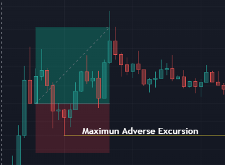

## Table of Contents

## What is a Material Adverse Effect (MAE)?

A Material Adverse Effect (MAE) is a term used in business contracts, especially in mergers and acquisitions. It means a big negative change that can affect a company's value or operations. When companies make deals, they include an MAE clause to protect themselves. If something really bad happens to one company before the deal is done, the other company can back out of the deal without penalty.

MAE clauses are tricky because what counts as a "material" change can be hard to define. Usually, it has to be a very serious issue, like a major lawsuit or a big drop in profits. Small problems or changes that affect the whole industry usually don't count as an MAE. Because of this, there are often disagreements about whether an MAE has actually happened, and these disputes can end up in court.

## How is Material Adverse Effect defined in legal contracts?

In legal contracts, a Material Adverse Effect (MAE) is defined as a significant negative change that impacts a company's business, financial condition, or operations. This definition is usually included in the contract to protect the buyer or the party making the investment. The exact wording can vary, but it generally states that if an MAE happens before the deal is completed, the other party can walk away from the agreement without facing penalties.

The definition of an MAE in contracts often includes specific examples of what might count as a material change, like a major lawsuit, a big drop in profits, or a significant regulatory change. However, the contract also usually lists exceptions, such as general economic downturns or industry-wide issues, which are not considered MAEs. This helps to clarify what kinds of events can trigger the MAE clause and helps prevent disagreements, though disputes can still arise over whether a specific event qualifies as an MAE.

## Why is MAE important for investors and companies?

MAE is important for investors and companies because it helps protect them when they make big deals. Imagine you're buying a company, and right before you finish the deal, something really bad happens to that company. An MAE clause lets you walk away from the deal without losing money or facing penalties. This is like having a safety net that keeps you safe if something goes wrong.

For companies selling or merging, an MAE clause can also be helpful. It makes sure everyone knows the rules and what can make the deal fall apart. This can make the whole process smoother and more predictable. Even though what counts as an MAE can be hard to agree on, having it in the contract gives both sides a clear way to handle big problems that might come up.

## Can you give examples of events that might trigger an MAE?

Events that might trigger a Material Adverse Effect (MAE) are usually big and serious. For example, if a company loses a huge lawsuit that costs them a lot of money, that could be an MAE. Another example is if a company's main factory burns down and they can't make their products anymore. These kinds of events can hurt the company's value a lot and might make the other side want to back out of the deal.

There are also other events that could count as an MAE. If a company's profits drop a lot because of something specific to them, like losing a major customer, that could be an MAE. But if the whole industry is struggling because of a general economic downturn, that usually wouldn't count as an MAE. The key is that the event has to be really bad and specific to the company, not just a normal business risk.

## How does an MAE clause affect stock market performance?

An MAE clause can affect stock market performance because it adds a layer of safety to big business deals. When investors know that a deal has an MAE clause, they might feel more secure. If something really bad happens to one of the companies before the deal is done, the other company can back out. This can help keep the stock prices stable because investors know there's a way to protect their money if things go wrong.

But if people start to think that an MAE might happen, it can make stock prices go down. For example, if there's news about a big lawsuit or a factory burning down, investors might worry that the deal will fall apart. This worry can lead to selling stocks, which makes the price drop. So, while an MAE clause can help protect investors, the fear of an MAE can also cause stock prices to go up and down.

## What are the differences between MAE and other risk factors in stock market analysis?

A Material Adverse Effect (MAE) is different from other risk factors in stock market analysis because it's about big, specific problems that can make a business deal fall apart. Other risk factors, like market risk or [interest rate](/wiki/interest-rate-trading-strategies) risk, are more general and affect lots of companies at the same time. An MAE is special because it's tied to a contract and can let one side back out of a deal if something really bad happens to the other side.

Other risk factors in stock market analysis, like company-specific risks, are things like bad management or losing a big customer. These risks can hurt a company's stock price, but they don't usually let someone back out of a deal like an MAE does. An MAE is more about protecting a deal from falling apart because of a big, unexpected problem, while other risk factors are more about understanding what might make a stock go up or down over time.

## How can investors identify a potential MAE in a company's financial statements?

Investors can spot a potential Material Adverse Effect (MAE) by looking closely at a company's financial statements. They should check for big changes in the company's profits, like a sudden drop that's much worse than usual. Also, they should look for any signs of big legal problems or losses that the company talks about in its notes. If a company says it's dealing with a huge lawsuit or has lost a lot of money because of something unexpected, that could be a warning sign of an MAE.

Another way to find a potential MAE is to see if the company is having trouble making its products or services. For example, if a factory burns down or if there's a major problem with the supply chain, this could be a big deal. Investors should also pay attention to what the company says about its future. If the company sounds worried about its future because of something specific to them, not just general industry problems, that could mean an MAE is on the way. By keeping an eye on these things, investors can be more prepared for what might happen next.

## What historical cases demonstrate the impact of MAE on stock prices?

One famous case that shows how an MAE can affect stock prices is the deal between Akorn, Inc. and Fresenius Kabi AG back in 2018. Fresenius wanted to buy Akorn, but before they could finish the deal, they found out that Akorn's profits were dropping a lot. Fresenius used the MAE clause in their contract to back out of the deal. When this happened, Akorn's stock price fell a lot because investors got worried about the company's future without the deal.

Another example is when Hexion Specialty Chemicals tried to buy Huntsman Corporation in 2008. Hexion backed out of the deal saying that Huntsman had a Material Adverse Effect because its financial situation got worse. This led to a big court case, and while they were fighting in court, Huntsman's stock price went up and down a lot. Investors were unsure about what would happen next, which made the stock price unstable until the court finally decided that Hexion had to go through with the deal.

## How do companies disclose potential MAE in their public filings?

Companies have to tell investors about things that might hurt their business a lot. They do this in their public filings, like the annual report or the 10-K form they send to the Securities and Exchange Commission (SEC). If there's something big that could cause a Material Adverse Effect (MAE), like a huge lawsuit or a factory burning down, the company will write about it in the "Risk Factors" section. They'll explain what happened and how it might affect the company's money and operations.

Sometimes, companies also talk about potential MAEs in other parts of their filings, like the "Management's Discussion and Analysis" section. Here, they might go into more detail about how a big problem is affecting their business right now and what they're doing about it. By being open about these big risks, companies help investors understand what's going on and make better choices about buying or selling the company's stock.

## What are the challenges in proving an MAE in legal disputes?

Proving a Material Adverse Effect (MAE) in legal disputes can be really tough because what counts as an MAE is not always clear. The contract might say what an MAE is, but it's hard to agree if something that happened fits that definition. Both sides might have different ideas about how bad the problem is and if it's bad enough to be called an MAE. Courts look at things like how long the problem will last, how much it hurts the company's money, and if it's something that was expected or not.

Another challenge is showing that the problem is specific to the company and not just something that's affecting the whole industry or economy. If a company's profits drop because everyone in their industry is struggling, that usually doesn't count as an MAE. But if the drop is because of something that only happened to that one company, like a big lawsuit, then it might be an MAE. Lawyers have to dig into a lot of details to prove this, which can make the legal fight long and complicated.

## How do market analysts use MAE as an indicator for stock market trends?

Market analysts look at Material Adverse Effect (MAE) clauses to understand how safe big business deals are. If a company is part of a deal with an MAE clause, analysts know there's a way for the other company to back out if something really bad happens. This makes them feel more secure about the deal, and they might think the stock prices will stay stable because the deal is protected. But if there's news that an MAE might happen, like a big lawsuit or a factory burning down, analysts might worry. This worry can make them predict that stock prices will go down because investors might sell their stocks.

Analysts also use MAE to spot big problems that could change how a company does in the future. If they see a company's financial statements showing a big drop in profits or talking about a huge legal issue, they might think an MAE is coming. This can help them predict how the stock market will react. If an MAE happens and a deal falls apart, the stock price of the company with the problem might drop a lot. By keeping an eye on these things, analysts can give better advice to investors about what stocks to buy or sell.

## What advanced statistical methods can be used to predict the likelihood of an MAE affecting stock market performance?

To predict how likely a Material Adverse Effect (MAE) will affect stock market performance, analysts can use advanced statistical methods like regression analysis. This method helps them see how different events, like a big lawsuit or a drop in profits, might change a company's stock price. They can look at past data to find patterns and use these patterns to guess what might happen in the future. For example, if a company's stock always goes down after a big legal problem, regression analysis can help predict how much the stock might drop if another big legal issue comes up.

Another method is time series analysis, which looks at how stock prices change over time. Analysts can use this to spot trends and see if there are any signs that an MAE is coming. For instance, if a company's stock starts to go down before news of a big problem comes out, time series analysis can help predict how much more the stock might fall. By using these advanced methods, analysts can give better advice to investors about what might happen to a company's stock if an MAE happens.

## References & Further Reading

[1]: Bergstra, J., Bardenet, R., Bengio, Y., & Kégl, B. (2011). ["Algorithms for Hyper-Parameter Optimization."](https://dl.acm.org/doi/10.5555/2986459.2986743) Advances in Neural Information Processing Systems 24.

[2]: ["Advances in Financial Machine Learning"](https://www.amazon.com/Advances-Financial-Machine-Learning-Marcos/dp/1119482089) by Marcos Lopez de Prado

[3]: ["Evidence-Based Technical Analysis: Applying the Scientific Method and Statistical Inference to Trading Signals"](https://www.semanticscholar.org/paper/Evidence-Based-Technical-Analysis%3A-Applying-the-and-Aronson/3b33df8737f1772e9e14d66a08c9696f140a2ee1) by David Aronson

[4]: ["Machine Learning for Algorithmic Trading"](https://github.com/PacktPublishing/Machine-Learning-for-Algorithmic-Trading-Second-Edition) by Stefan Jansen

[5]: ["Quantitative Trading: How to Build Your Own Algorithmic Trading Business"](https://books.google.com/books/about/Quantitative_Trading.html?id=j70yEAAAQBAJ) by Ernest P. Chan