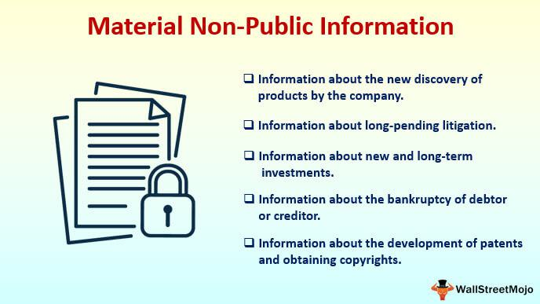

In the financial industry, the management and dissemination of information play a critical role in maintaining market integrity and investor confidence. A significant focus within this domain is the handling of Material Nonpublic Information (MNPI). MNPI refers to any information that could influence an investor's decision to buy or sell securities and has not yet been made public. The improper use of such information can lead to insider trading, where individuals or entities trade a company's stock or other securities based on confidential data, potentially leading to unfair market advantages and undermining trust in financial markets.

Insider trading based on MNPI poses a threat to market fairness and transparency, as it enables informed insiders to capitalize on knowledge unavailable to average investors. This practice is illegal and subject to stringent regulations aimed at protecting the equitable participation of all market actors. The intersection of MNPI and insider trading has far-reaching implications, with regulatory bodies like the Securities and Exchange Commission (SEC) actively monitoring and prosecuting violations to uphold market integrity.



In recent years, the rise of algorithmic trading has added a layer of complexity to the regulatory and ethical landscape surrounding MNPI. Algorithmic trading involves using computer algorithms to execute trades at speeds and volumes unattainable by human traders. While this technological advancement has increased market liquidity and efficiency, it also presents regulatory challenges, particularly if algorithms are designed to exploit MNPI. The rapid and often opaque nature of these transactions makes it difficult for regulators to detect and prevent potential abuses of confidential information.

Securities regulations are continually evolving to address the challenges posed by technological advancements in trading. The convergence of MNPI, insider trading, and algorithmic trading underscores the necessity for robust regulatory frameworks that can adapt to the dynamic nature of financial markets. Ensuring compliance and protecting market integrity requires a balance between fostering innovation in trading technologies and maintaining ethical standards that prevent misconduct.

## Table of Contents

## Understanding Material Nonpublic Information (MNPI)

Material Nonpublic Information (MNPI) refers to any data, details, or information related to a company or its securities that is not available to the general public and could significantly impact an investor's decision to buy, sell, or hold the company's securities. The critical aspect of MNPI is that it is both material and nonpublic.

### Definition and Explanation

**Material Information** is characterized by its potential to influence the market price or value of a company’s securities. This information is deemed material if there is a substantial likelihood that a reasonable investor would consider it important when making investment decisions. Information is considered material if its disclosure would likely alter the total mix of information available in the market. 

**Nonpublic Information** implies that the information has not been disseminated or made available to the public in any official capacity. It remains within the confines of individuals or entities that possess the exclusive right or opportunity to utilize or share it.

### The Importance of MNPI in Financial Markets

The role of MNPI in financial markets is crucial as it forms the basis for fair trading principles that underpin market integrity. The disclosure of information must be controlled to prevent unfair trading advantages among participants, ensuring an equitable playing field. Access to MNPI creates the risk of insider trading, which can undermine investor confidence and the operational efficiency of financial markets. Institutions and regulatory bodies, such as the Securities and Exchange Commission (SEC) in the United States, enforce strict regulations to protect against the misuse of MNPI, emphasizing transparency and reliability in reporting material changes.

### Examples of Material Nonpublic Information

Examples of what constitutes MNPI include but are not limited to:

1. **Earnings Announcements**: Information about unpublished financial results or forecasts which could significantly change investors' perception of the company's financial health.

2. **Mergers and Acquisitions**: Details of potential mergers, acquisitions, or buyout offers that have not been announced publicly.

3. **New Product Launches**: Information on products under development, significant breakthroughs, or new technology that hasn't been disclosed to the public.

4. **Litigation Information**: Information pertaining to pending court actions or regulatory investigations that could materially impact a company's finances or operations.

5. **Changes in Corporate Structure**: Plans for significant restructuring, changes in management, or alterations in company strategy not yet communicated publicly. 

By understanding and identifying MNPI, regulatory bodies can better position themselves to detect and deter insider trading. Careful management and surveillance of MNPI are essential for maintaining a fair and orderly market.

## What Constitutes Insider Trading?

Insider trading refers to buying or selling a publicly-traded company's stock based on material nonpublic information (MNPI) about the company. This practice is regulated in most jurisdictions to ensure a level playing field within financial markets. The legality of an insider trading activity hinges on several factors, primarily related to the source and use of MNPI.

**Definitions and Legal Perspectives on Insider Trading**

Insider trading is broadly defined as any transaction in a company's securities by someone who has access to information that is not publicly available and could impact a company's stock price. Legal perspectives on insider trading differ across jurisdictions, but most agree on a fundamental principle: it is illegal to trade on information that has not been disclosed to the general public and which could influence investment decisions significantly.

The United States Securities and Exchange Commission (SEC) defines insider trading as not only deliberate trading by corporate insiders—such as officers, directors, or employees—who possess MNPI, but also by individuals outside the company, if the information is divulged in breach of a fiduciary duty or other trust relationship for a personal benefit.

**Distinguishing Legal from Illegal Insider Trading Activities**

Legal insider trading occurs when corporate insiders—such as executives, directors, and employees—buy or sell stock in their own companies while disclosing these trades to the SEC. These transactions are reported to the SEC via forms 3, 4, and 5 and typically happen as part of a pattern of trading defined by pre-set trading plans under SEC Rule 10b5-1.

Illegal insider trading, however, occurs when individuals act on MNPI in violation of a duty of trust or confidence, breaching a fiduciary responsibility. For instance, if a corporate employee learns of an upcoming merger from unauthorized sources and quickly purchases shares in the company before the news becomes public, this would generally constitute illegal insider trading. The involvement of MNPI in such trades is a key distinguishing [factor](/wiki/factor-investing) between legal and illegal activities.

**The Role of Nonpublic Material Information in Insider Trading Cases**

MNPI includes any information not available to the public that could influence an investor's decision to buy or sell securities. Examples of MNPI are earnings reports before they are publicly released, information about acquisitions or mergers, and changes in leadership. The importance of MNPI in insider trading cases is significant, as its availability to only select individuals creates an unfair advantage, undermining the principles of equity and transparency in the securities markets.

When MNPI is used for trading, regulators must determine whether there was a breach of duty or trust. This is often complicated by the subtlety of how MNPI is communicated or misused. Key cases such as the conviction of Raj Rajaratnam, founder of the Galleon Group, underscore how careful examination of communications and actions can unveil misuse of MNPI, securing significant legal sanctions for those involved.

Overall, the incorporation of MNPI into trading decisions represents not just an ethical issue but a legal boundary that delineates fair participation from exploitation within financial markets.

## Securities Regulations Governing Insider Trading

The regulation of insider trading is a crucial aspect of maintaining fair and efficient financial markets. Among the key regulatory bodies governing insider trading is the U.S. Securities and Exchange Commission (SEC). The SEC's primary function is to protect investors, maintain market integrity, and facilitate capital formation, which it does through a comprehensive set of rules and regulations regarding the use of material nonpublic information (MNPI).

### Key Regulations Enforced by the SEC

The SEC enforces several critical regulations to curb insider trading, with the cornerstone being Rule 10b-5, promulgated under the Securities Exchange Act of 1934. This rule prohibits any act or omission resulting in fraud or deceit in connection with the purchase or sale of any security. Specifically, Rule 10b-5, combined with Section 10(b) of the same act, forms the legal foundation for prosecuting insider trading cases.

Another significant legal provision is Section 16 of the Securities Exchange Act, which mandates that company insiders—such as officers, directors, and shareholders owning more than 10% of a class of equity securities—must report their trades to the SEC. This requirement aims to ensure transparency and prevent conflicts of interest.

### Legal Framework Incorporating MNPI

The legal framework surrounding insider trading primarily revolves around the misuse of MNPI. The courts have established that trading based on nonpublic, material information violates the fiduciary duty owed to the shareholders of the company. This principle was reinforced in the landmark case "Chiarella v. United States" (1980), where the Supreme Court held that a duty to disclose or abstain from trading arises from a relationship of trust and confidence between parties to a transaction.

In addition, the "misappropriation theory" presents another framework for liability, as highlighted in "United States v. O'Hagan" (1997). This theory posits that a person commits fraud when they misappropriate confidential information for securities trading purposes, violating a duty owed to the source of the information.

### Significant Insider Trading Incidents and Legal Outcomes

A prominent insider trading case is that of Raj Rajaratnam, founder of the Galleon Group [hedge fund](/wiki/hedge-fund-trading-strategies). In 2009, Rajaratnam was charged with utilizing MNPI obtained from insiders at publicly traded companies. The case was notable for involving wiretaps, a tool more commonly used in organized crime investigations. Rajaratnam's conviction in 2011 led to an 11-year prison sentence, highlighting the severe repercussions of insider trading.

Another notable case is that of Martha Stewart, indicted in 2003 for securities fraud and obstruction of justice related to the sale of ImClone Systems stock. Stewart's sale shortly before an adverse public announcement raised suspicion of improper use of MNPI. She was eventually found guilty of conspiracy and making false statements, which led to a prison sentence and bolstered the public's awareness of insider trading laws.

These cases underscore the legal consequences and the SEC's role in enforcing securities laws to uphold market fairness. The dynamic regulatory landscape demands that companies and individuals remain vigilant to comply with insider trading laws and prevent the unauthorized use of MNPI.

## Algorithmic Trading and Its Relation to MNPI

Algorithmic trading, a technological advancement in financial markets, involves using computer algorithms to execute trades at high speeds and volumes that would be impossible for human traders. This form of trading has become prevalent due to its ability to maximize efficiency and minimize human error. Algorithms can analyze vast amounts of market data and execute orders based on predefined criteria, often within milliseconds.

The interaction of [algorithmic trading](/wiki/algorithmic-trading) with material nonpublic information (MNPI) presents significant risks and challenges. MNPI, which refers to sensitive information not yet available to the public and that could influence an investor's decision to buy, sell, or hold securities, plays a critical role in the legality and ethics of trading. If algorithms are used to trade on MNPI, it raises concerns about unfair advantages, as these algorithms can potentially react on this insider knowledge quicker than any human trader could. The exploitation of such information can lead to market manipulation and insider trading, undermining the integrity of financial markets.

Regulatory bodies face substantial challenges in monitoring algorithmic trading for potential misuse of MNPI. Given the speed and [volume](/wiki/volume-trading-strategy) of trades executed by algorithms, traditional surveillance methods may be inadequate. Regulatory frameworks, like those enforced by the Securities and Exchange Commission (SEC), must adapt to technological advancements to effectively oversee algorithmic trading activities. This requires sophisticated tools that can analyze patterns and anomalies in trading behavior that suggest the use of MNPI. Moreover, creating real-time monitoring systems that incorporate [machine learning](/wiki/machine-learning) and [artificial intelligence](/wiki/ai-artificial-intelligence) is crucial for detecting potentially illicit activities as they happen.

For instance, algorithms that are designed to evaluate streams of financial data might exploit discrepancies between expected and actual market conditions, potentially using MNPI without explicit instructions from their designers. As such, establishing clear guidelines and heavy penalties for the proven misuse of MNPI is necessary to deter unethical practices.

In summary, while algorithmic trading offers significant benefits to modern financial markets through enhanced efficiency and [liquidity](/wiki/liquidity-risk-premium), it also presents new challenges for regulatory bodies aiming to prevent abuse of MNPI. Addressing these challenges is essential to maintaining fair and transparent markets.

## Compliance and Risk Management Strategies

Compliance in the financial trading industry is crucial to maintaining the integrity and stability of financial markets. Compliance ensures that firms adhere to laws, regulations, and ethical standards, mitigating risks associated with financial crimes, such as insider trading. The risks of non-compliance include reputational damage, financial penalties, and legal consequences. Therefore, companies must implement robust compliance strategies to manage the risk of misuse of material nonpublic information (MNPI).

One effective strategy is establishing a comprehensive compliance program that includes internal policies and procedures designed to prevent the misuse of MNPI. This involves clearly defining what constitutes MNPI, training employees to recognize and handle such information appropriately, and setting strict reporting and disclosure procedures. An effective compliance program also requires regular audits and monitoring to ensure adherence to set policies.

In the technology-driven landscape of financial trading, companies can harness technological solutions to detect potential insider trading and the misuse of MNPI. These solutions often incorporate sophisticated software tools equipped with real-time data analysis and monitoring capabilities. Such tools can analyze trading patterns and flag anomalies that may indicate insider trading activities. Here is a simple example of how algorithmic tools could be programmed to detect unusual trading patterns in Python:

```python
import pandas as pd

# Assume we have a DataFrame 'trades' with buy/sell data
trades = pd.DataFrame({
    'time': ['2021-01-01 10:00', '2021-01-01 10:01', '2021-01-01 10:02'],
    'trade_value': [5000, 7000, 10000]
})

# Set a threshold for unusual trade value
threshold = 8000

# Identify trades that exceed the threshold
unusual_trades = trades[trades['trade_value'] > threshold]

print("Unusual Trades Detected:")
print(unusual_trades)
```

In this code snippet, the program evaluates each trade and flags those that exceed an unusual trade value threshold, allowing compliance teams to investigate these trades further.

Furthermore, companies may implement machine learning models that continuously adapt to new trading data to detect patterns indicative of non-compliant behavior. These models can be trained on historical data to recognize insider trading characteristics, providing an additional layer of oversight.

Lastly, an effective whistleblower program can encourage employees to report suspicious activities without fear of retribution, thus serving as an additional line of defense against insider trading. Engaging with external consultants and legal advisors to stay updated on the latest regulatory changes and technological advancements can enhance the effectiveness of these compliance strategies. 

By integrating these preventive measures and using advanced detection technologies, companies can better safeguard against the misuse of MNPI, protect their reputation, and comply with regulatory demands.

## Conclusion

The examination of material nonpublic information (MNPI) and its implications for insider trading highlights the complexities and importance of regulatory oversight in the financial sector. MNPI serves as a critical factor that influences market integrity, affecting decisions on buying or selling securities. The integration of algorithmic trading within financial markets introduces additional layers of complexity, necessitating careful scrutiny.

Key takeaways from this discussion underscore the necessity for robust regulatory frameworks to maintain fairness and transparency in financial markets. Regulatory bodies like the Securities and Exchange Commission (SEC) play a pivotal role in monitoring and enforcing laws designed to prevent the misuse of MNPI, ensuring that market participants adhere to legal and ethical standards.

Looking towards the future, the challenge lies in striking a balance between fostering innovation in trading technologies and upholding stringent ethical standards. As algorithmic trading continues to evolve, regulators must adapt to the possibilities of these technologies being used to exploit nonpublic information. This requires continuous development of advanced compliance systems and the deployment of technological solutions capable of detecting and mitigating potential risks associated with insider trading.

In conclusion, the financial industry must persist in its efforts to cultivate an environment where innovation and ethical compliance coexist. This approach will safeguard trust in financial markets and promote sustainable growth. The ongoing evolution of trading technologies demands continuous vigilance and adaptation from regulatory bodies, firms, and individuals, ensuring that progress does not come at the cost of market integrity.

## FAQs

### What is considered material nonpublic information?

Material nonpublic information (MNPI) refers to any information pertaining to a company or its securities that has not been made available to the public and could influence an investor's decision to buy or sell those securities. Information is considered material if there is a substantial likelihood that a reasonable investor would consider it important in making an investment decision. Examples include, but are not limited to, earnings reports, mergers and acquisitions, business contracts, changes in management, or significant shifts in company strategy before they are officially announced.

### Is all insider trading illegal?

Not all insider trading is illegal. Legal insider trading occurs when corporate insiders—such as officers, directors, and employees—buy or sell stock in their own companies but report their transactions to the appropriate authorities. Illegal insider trading involves the buying or selling of a security, in breach of a fiduciary duty or other relationship of trust and confidence, while in possession of material nonpublic information about the security. The distinction lies in the transparency and fairness of the trade, ensuring that no party has an unfair advantage over others in the market.

### How can companies protect themselves from MNPI misuse?

Companies can protect themselves from the misuse of MNPI through several strategies:

1. **Establishing Robust Compliance Programs**: Develop and enforce policies that strictly limit access to and dissemination of MNPI.

2. **Employee Training**: Regularly train employees on what constitutes MNPI and the legal and ethical ways to handle it.

3. **Information Barriers ("Chinese Walls")**: Implement information barriers within the organization to prevent the flow of MNPI between departments that need to be isolated from each other (e.g., investment banking and research).

4. **Monitoring and Surveillance Systems**: Utilize advanced technological solutions to detect suspicious trading patterns that might indicate insider trading.

### What role does the SEC play in regulating insider trading?

The U.S. Securities and Exchange Commission (SEC) is primarily responsible for regulating and enforcing laws against insider trading in the United States. The SEC investigates and prosecutes violations of securities laws, utilizing various legal statutes such as the Securities Exchange Act of 1934. It aims to maintain fair, orderly, and efficient markets and protect investors from unfair trading practices. By imposing penalties on unlawful insider trading, the SEC deters potential violators and promotes investor confidence in capital markets.

### How does algorithmic trading complicate the landscape of insider trading regulation?

Algorithmic trading, which involves using computer programs to execute trades at high speeds, poses significant challenges in regulating insider trading. Algorithms can exploit vast datasets and movements in stock prices, potentially discern patterns or signals associated with MNPI without direct human involvement. This complexity demands sophisticated oversight systems to detect illicit trading activity that might involve insider information. Regulators must keep pace with technological advancements to ensure that markets remain fair and free of manipulation, highlighting the need for ongoing innovation in regulatory approaches and technologies.

## References & Further Reading

[1]: "Insider Trading: Law and Regulation" by E. Merrick Dodd Jr. - Explores the intricate legal framework surrounding insider trading and its regulatory environment. 

[2]: MacKinlay, A. Craig. (1997). ["Event Studies in Economics and Finance."](https://www.jstor.org/stable/2729691) Journal of Economic Literature, 35(1), 13-39. - Discusses the impact of significant events on stock prices, relevant to understanding MNPI.

[3]: Malkiel, Burton G. (2020). "A Random Walk Down Wall Street: The Time-Tested Strategy for Successful Investing" - Provides a thorough overview of different investments and addresses market efficiencies.

[4]: Kroll, Robin. (2014). ["Securities and Market Regulation."](https://www.kroll.com/en/insights/publications/financial-compliance-regulation/markets-in-financial-instruments-directive-ii-mifid-ii) - Serves as a guide to understanding current securities regulations, including those surrounding MNPI and insider trading.

[5]: Hasbrouck, Joel. (2007). "Empirical Market Microstructure: The Institutions, Economics, and Econometrics of Securities Trading" - Provides insights into the mechanics and structure of securities markets, relevant for understanding algorithmic trading.

[6]: U.S. Securities and Exchange Commission. ["Insider Trading: A U.S. Perspective."](https://www.sec.gov/news/speech/speecharchive/1998/spch221.htm) - An overview of insider trading laws, compliance, and enforcement provided by the U.S. regulatory body.