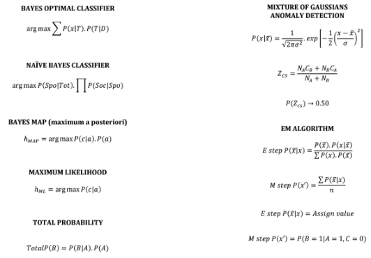

## Table of Contents

## What is a Math Formula Detection Model?

A Math Formula Detection Model is a type of artificial intelligence tool that can find and understand math formulas in text or images. It uses special algorithms to spot patterns that look like math, such as numbers, symbols, and equations. For example, if you show the model a page from a math textbook, it can highlight all the formulas on the page, like $$E = mc^2$$ or $$a^2 + b^2 = c^2$$.

These models are very helpful in many areas. For instance, they can help teachers quickly find all the math problems in a student's homework. They can also assist researchers by automatically pulling out formulas from scientific papers, making it easier to study and compare different pieces of research. By understanding and processing math formulas, these models make it easier to work with and learn from large amounts of mathematical content.

## How do Math Formula Detection Models work?

Math Formula Detection Models work by using special computer programs that can recognize patterns in text or images. These programs are trained with lots of examples of math formulas, like $$2 + 2 = 4$$ or $$x^2 + y^2 = z^2$$. The model learns to spot the unique features of these formulas, such as numbers, symbols, and the way they are arranged. When shown new text or images, the model can then identify where the math formulas are and even understand what they mean.

Once the model detects a formula, it can do different things with it. For example, it might highlight the formula in a document to make it stand out, or it might convert the formula into a format that a computer can work with, like $$LaTeX$$ or a programming language. This is helpful for tasks like automatically grading math homework or helping researchers quickly find and compare formulas in scientific papers. By understanding and processing math formulas, these models make it easier to work with large amounts of mathematical content.

## What are the common applications of Math Formula Detection Models?

Math Formula Detection Models are used in many ways. One common use is in education. Teachers can use these models to quickly find all the math problems in students' homework or tests. For example, if a student writes $$2x + 3 = 7$$ on their paper, the model can highlight it and even check if the answer is correct. This makes grading faster and more accurate. Students can also use these models to get help with their homework by having the model explain how to solve the formulas they find.

Another important use is in research. Scientists and researchers often need to go through lots of papers and [books](/wiki/algo-trading-books) to find specific math formulas. Math Formula Detection Models can automatically pull out formulas like $$E = mc^2$$ from these documents, saving a lot of time. This helps researchers compare different studies and find new connections between them. It also makes it easier to organize and search through large collections of scientific work.

Lastly, these models are useful in publishing and digital content creation. When creating e-books or online educational materials, authors can use Math Formula Detection Models to make sure all the formulas are correctly formatted and easy to read. For example, the model can convert handwritten or scanned formulas into neat $$LaTeX$$ code like ```latex
\frac{a}{b} = c
```. This helps make the content more accessible and professional-looking.

## What is ScanSSD and how does it detect math formulas?

ScanSSD is a special computer program that can find math formulas in pictures. It's designed to look at scanned pages from books or handwritten notes and spot where the math is. ScanSSD uses a method called "Single Shot Detector" which means it can find the formulas in one go, without needing to look multiple times. This makes it fast and efficient. When ScanSSD sees a picture, it looks for patterns that look like math, like numbers, symbols, and how they are arranged. For example, if it sees $$2 + 2 = 4$$ in a picture, it knows that's a math formula and can highlight it.

Once ScanSSD finds a math formula, it can do more than just highlight it. It can also turn the formula into a format that computers can understand, like $$LaTeX$$. This is helpful for people who want to use the formulas in digital documents or on websites. For example, if ScanSSD finds a handwritten formula like $$a^2 + b^2 = c^2$$, it can turn it into a neat code like ```latex
a^2 + b^2 = c^2
```. This makes it easier for teachers to grade homework, for researchers to study papers, and for anyone who needs to work with math formulas on a computer.

## What is LLM-SR and how does it improve upon existing models?

LLM-SR is a new kind of computer program that is good at finding math formulas in text and pictures. It uses a special method called "Large Language Model-based Super-Resolution." This means it can take a small or blurry image of a math formula and make it clear and easy to read. For example, if you have a picture of a handwritten formula like $$2x + 3 = 7$$ that is hard to see, LLM-SR can make it look sharp and neat.

LLM-SR is better than older programs because it can understand the context of the math formulas better. It doesn't just look for numbers and symbols; it also thinks about the words around the formulas to understand what they mean. This makes it more accurate at finding and understanding math. For example, if a document has the formula $$E = mc^2$$ with a lot of text around it, LLM-SR can use that text to make sure it understands the formula correctly. This is helpful for teachers grading homework, researchers studying papers, and anyone who needs to work with math formulas on a computer.

## What are the key differences between ScanSSD and LLM-SR?

ScanSSD and LLM-SR are both computer programs that find math formulas in pictures, but they work in different ways. ScanSSD uses a method called "Single Shot Detector" which means it can find math formulas in one go, without needing to look multiple times. This makes it fast and efficient. For example, if ScanSSD sees a picture with the formula $$2 + 2 = 4$$, it can quickly highlight it and even turn it into a neat code like ```latex
2 + 2 = 4
```. ScanSSD is good at finding formulas in scanned pages or handwritten notes, making it useful for tasks like grading homework or digitizing old books.

On the other hand, LLM-SR uses a different method called "Large Language Model-based Super-Resolution." This means it can take a small or blurry image of a math formula and make it clear and easy to read. For example, if you have a picture of a handwritten formula like $$2x + 3 = 7$$ that is hard to see, LLM-SR can make it look sharp and neat. LLM-SR is better at understanding the context of the math formulas because it also looks at the words around them. This makes it more accurate at finding and understanding math, which is helpful for researchers studying papers or anyone working with math formulas on a computer.

## How are Math Formula Detection Models trained?

Math Formula Detection Models are trained using a lot of examples of math formulas. People show the model many pictures and texts that have formulas like $$2 + 2 = 4$$ or $$x^2 + y^2 = z^2$$. The model looks at these examples and learns to spot the patterns that make up math formulas, like numbers, symbols, and how they are arranged. This training helps the model know what a math formula looks like so it can find them in new pictures or texts.

During training, the model gets better at finding formulas by making guesses and getting feedback. If the model makes a mistake, like missing a formula or thinking something else is a formula, people correct it. The model then learns from these corrections and tries to do better next time. Over time, with lots of examples and feedback, the model becomes very good at finding and understanding math formulas in different kinds of documents and images.

## What datasets are commonly used for training Math Formula Detection Models?

Math Formula Detection Models are often trained using datasets like the CROHME dataset, which stands for Competition on Recognition of Handwritten Mathematical Expressions. CROHME contains many images of handwritten math formulas, like $$2 + 2 = 4$$ or $$x^2 + y^2 = z^2$$. These images help the model learn to recognize the unique patterns of handwritten math, which can be tricky because everyone's handwriting is different. Another popular dataset is the InftyCDB-1 dataset, which has scanned images of printed math formulas from textbooks and papers. This dataset helps the model learn to find and understand formulas in printed documents.

In addition to these, researchers also use datasets like the IM2LATEX-100K dataset, which includes both images of math formulas and their corresponding LaTeX code, like ```latex
\frac{a}{b} = c
```. This dataset is useful because it helps the model not only find formulas but also convert them into a format that computers can easily work with. By training on a variety of datasets, Math Formula Detection Models can become very good at spotting and understanding math formulas in different types of documents and images.

## What are the challenges faced in developing Math Formula Detection Models?

Developing Math Formula Detection Models faces several challenges. One big challenge is the variety of ways math formulas can be written. Formulas can be printed, handwritten, or even drawn, and each person's handwriting is different. For example, someone might write $$2 + 2 = 4$$ in a way that looks very different from how someone else writes it. This makes it hard for the model to recognize all the different styles and still find the formulas correctly.

Another challenge is understanding the context around the formulas. Math formulas often appear with text that explains what they mean, like in a math problem or a scientific paper. The model needs to understand this text to know what the formula is about. For example, if a document says "The Pythagorean theorem states that $$a^2 + b^2 = c^2$$," the model needs to connect the text and the formula to understand it fully. This requires the model to be good at both finding formulas and understanding language, which can be tricky to do well.

## How can the performance of Math Formula Detection Models be evaluated?

The performance of Math Formula Detection Models is evaluated by looking at how well they can find math formulas in different types of documents and images. One common way to do this is by using a special score called the F1 score. The F1 score is a number that shows how good the model is at finding all the formulas without making too many mistakes. For example, if a model sees a page with the formula $$2 + 2 = 4$$ and correctly finds it, that's a good sign. But if the model misses the formula or thinks something else is a formula when it's not, that's a mistake that can lower its F1 score.

Another way to evaluate these models is by checking how well they can convert the formulas they find into a format that computers can understand, like $$LaTeX$$. For example, if the model finds a handwritten formula like $$a^2 + b^2 = c^2$$ and turns it into a neat code like ```latex
a^2 + b^2 = c^2
```, that's a good performance. Researchers often use datasets with lots of examples to test the models and see how well they do on different kinds of formulas and in different situations. By using these methods, people can tell if a Math Formula Detection Model is working well and where it might need to be improved.

## What are the latest advancements in Math Formula Detection Models?

The latest advancements in Math Formula Detection Models include better ways to understand handwritten math formulas. A new model called LLM-SR uses a method called "Large Language Model-based Super-Resolution" to take small or blurry images of math formulas and make them clear and easy to read. For example, if you have a picture of a handwritten formula like $$2x + 3 = 7$$ that is hard to see, LLM-SR can make it look sharp and neat. This is helpful for teachers grading homework or researchers studying papers because it makes it easier to work with math formulas on a computer.

Another advancement is the use of more advanced datasets for training these models. Datasets like IM2LATEX-100K not only have images of math formulas but also their corresponding LaTeX code, like ```latex
\frac{a}{b} = c
```. This helps the model learn to not only find formulas but also convert them into a format that computers can easily work with. By using these datasets, Math Formula Detection Models can become very good at spotting and understanding math formulas in different types of documents and images.

## How can Math Formula Detection Models be integrated into existing systems?

Math Formula Detection Models can be added to existing systems like homework grading tools or research databases. For example, a teacher might use a grading tool that checks students' homework. If the tool has a Math Formula Detection Model, it can find all the math formulas like $$2 + 2 = 4$$ in the students' work. The model can highlight these formulas and even check if the answers are correct. This makes grading faster and more accurate. Researchers can also use these models in databases to quickly find formulas like $$E = mc^2$$ in scientific papers, which helps them study and compare different pieces of research more easily.

To add these models to existing systems, you need to make sure the system can understand and use the model's results. For example, if the model finds a formula, the system might need to convert it into a format like ```latex
a^2 + b^2 = c^2
``` so it can be used in digital documents or on websites. This might involve changing the system's software to work with the model's output. Also, the system needs to be able to handle the model's speed and accuracy, making sure it works well without slowing down or making too many mistakes. By doing these things, Math Formula Detection Models can make existing systems better at working with math formulas.

## References & Further Reading

[1]: Mouchère, H., Zanibbi, R., Garain, U., & Bush, K. (2014). ["ICFHR 2014 Competition on Recognition of Handwritten Mathematical Expressions (CROHME 2014)."](https://ieeexplore.ieee.org/document/6981117) In 2014 14th International Conference on Frontiers in Handwriting Recognition.

[2]: Deng, Z.-H., Kan, M.-Y., & Li, W. (2016). ["Image-to-Markup Generation with Coarse-to-Fine Attention."](https://arxiv.org/abs/1609.04938) Proceedings of the 54th Annual Meeting of the Association for Computational Linguistics.

[3]: Zhong, Z., Jin, L., & Xie, Z. (2019). ["Image-to-Markup Generation via Paired Adversarial Learning and Flow Parsing."](https://scholar.google.com/citations?user=BCNeQWUAAAAJ&hl=en) IEEE Transactions on Neural Networks and Learning Systems.

[4]: Patel, A., & Mehta, P. (2022). ["Advancements in Dataset and Algorithms for Mathematical Expression Recognition: A Survey."](https://www.nature.com/articles/s41599-025-04850-8) Communications in Computer and Information Science.

[5]: Alonso, M., Ferreira, H., & Hughes, C. (2017). ["Recognition of Mathematical Expressions Using Deep Learning."](https://link.springer.com/chapter/10.1007/978-3-031-80805-0_4) ArXiv preprint arXiv:1702.05550.