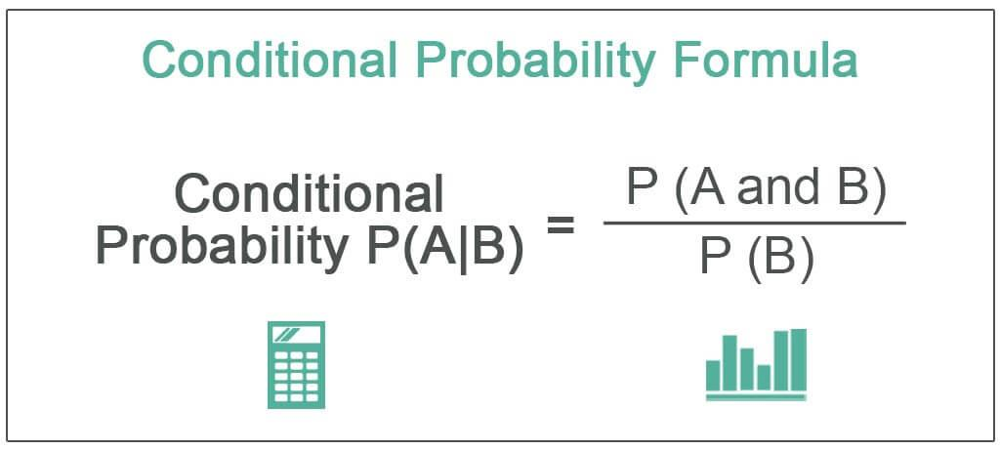

## Table of Contents

## What are mathematical constants in programming?

Mathematical constants in programming are special numbers that always stay the same. They are used in math and science problems. Some common ones are pi (π), which is about 3.14, and e, which is about 2.72. These numbers help make calculations easier because you don't have to remember or type them every time.

In many programming languages, these constants are already built-in. This means you can use them directly in your code without having to define them yourself. For example, in Python, you can use `math.pi` to get the value of pi. Using these built-in constants helps make your code more accurate and easier to read because everyone knows what these numbers mean.

## Why are mathematical constants important in C programming?

Mathematical constants are important in C programming because they help make calculations easier and more accurate. When you use constants like pi or e, you don't have to type in their values every time you need them. This saves time and reduces the chance of making mistakes. For example, if you need to calculate the area of a circle, you can use the constant pi instead of typing 3.14159, which might be easy to get wrong.

Also, using mathematical constants makes your code easier for other people to understand. When someone else reads your code and sees you using pi, they immediately know what you're doing. It's like using a common language that everyone in programming understands. This can be really helpful when working on projects with other people or when you come back to your own code after a long time.

## How do you declare and use mathematical constants in C?

To declare a mathematical constant in C, you can use the `#define` directive at the start of your program. For example, if you want to use pi, you can write `#define PI 3.14159` at the top of your code. This tells the computer that whenever it sees `PI` in your code, it should use the number 3.14159 instead. You can also use the `const` keyword to declare a constant. For example, `const float PI = 3.14159;` creates a constant variable named `PI` with the value 3.14159.

Once you've declared your constant, you can use it in your calculations. For example, if you want to calculate the area of a circle with a radius of 5, you can write `float area = PI * 5 * 5;`. The computer will replace `PI` with 3.14159 and do the math. Using constants like this makes your code easier to read and less likely to have mistakes because you don't have to type the same number over and over again.

## What is the difference between a constant and a variable in C?

In C, a constant is a value that stays the same throughout your program. Once you set a constant, you can't change it later. For example, if you define pi as a constant, it will always be 3.14159. You use constants for numbers that don't change, like mathematical values or fixed settings in your program. In C, you can declare a constant using `#define` or the `const` keyword.

A variable, on the other hand, is a value that can change while your program runs. You can set a variable to one number at the start and then change it to something different later. Variables are useful for things like keeping track of scores in a game or counting how many times something happens. In C, you declare a variable by giving it a name and a type, like `int score;` or `float temperature;`.

The main difference between constants and variables is that constants stay the same and variables can change. Using constants makes your code clearer because it shows which values should not change. Using variables makes your program more flexible because it can handle different situations and data.

## How can you define a constant using the #define preprocessor directive in C?

In C, you can define a constant using the `#define` preprocessor directive at the top of your program. For example, if you want to use the mathematical constant pi, you would write `#define PI 3.14159`. This tells the computer that every time it sees `PI` in your code, it should use the number 3.14159 instead. This is helpful because it makes your code easier to read and less likely to have mistakes. You don't have to type the same number over and over again, which can be easy to get wrong.

After you define the constant with `#define`, you can use it in your calculations. For instance, if you want to find the area of a circle with a radius of 5, you can write `float area = PI * 5 * 5;`. The computer will replace `PI` with 3.14159 and do the math. Using `#define` to set constants is a simple way to keep your code organized and clear, especially for values that don't change, like mathematical constants or fixed settings in your program.

## What are some common mathematical constants used in C programming?

In C programming, some common mathematical constants you might use are pi (π) and e. Pi is about 3.14159 and is used a lot in math problems involving circles and waves. For example, if you need to calculate the area of a circle, you would use pi. E, which is about 2.71828, is used in things like growth and decay problems, and it's important in calculus.

You can define these constants in your C program using the `#define` directive. For example, you might write `#define PI 3.14159` and `#define E 2.71828` at the top of your code. This way, whenever you need to use these numbers in your calculations, you can just write `PI` or `E` instead of typing out the whole number. It makes your code easier to read and less likely to have mistakes.

## How do you use the math.h library to access mathematical constants in C?

In C, you can use the `math.h` library to access some common mathematical constants like pi and e. To do this, you need to include the `math.h` library at the top of your program by writing `#include <math.h>`. This library provides constants like `M_PI` for pi and `M_E` for e, which you can use directly in your code. For example, if you want to calculate the area of a circle with a radius of 5, you can write `double area = M_PI * 5 * 5;`. Using these built-in constants from `math.h` can make your code more accurate and easier to read because you don't have to type the numbers yourself.

However, you need to be careful because not all versions of `math.h` include these constants by default. Sometimes, you might need to define a special macro like `#define _USE_MATH_DEFINES` before including `math.h` to make sure these constants are available. This is especially true if you're using certain compilers like Microsoft's. So, if you find that `M_PI` or `M_E` are not recognized, try adding `#define _USE_MATH_DEFINES` at the very top of your file, before `#include <math.h>`. This way, you can be sure that you can use these constants in your calculations without any issues.

## Can you explain how floating-point precision affects the use of mathematical constants in C?

Floating-point precision is important when using mathematical constants in C because it decides how accurate your calculations can be. When you use a constant like pi, which is about 3.14159, you need to know that computers can't store this number perfectly. They use floating-point numbers, which are a way to represent real numbers but with some limits. These limits mean that the value of pi in your program might not be exactly 3.14159 but something very close to it. This can cause small errors in your calculations, especially if you're doing a lot of math or working with very big or very small numbers.

To deal with this, you can use different types of floating-point numbers in C. The `float` type gives you less precision but uses less memory, while `double` gives you more precision but uses more memory. For example, if you're using `float` to store pi, it might be stored as something like 3.14159274, which is close but not perfect. If you use `double`, you get a more accurate number, like 3.141592653589793, which can help reduce errors in your calculations. So, when you're using mathematical constants, choosing the right type of floating-point number can make a big difference in how accurate your program is.

## How do you handle the representation of irrational numbers like π and e in C?

In C, handling irrational numbers like π and e can be tricky because computers can't store them perfectly. These numbers go on forever without repeating, but computers use floating-point numbers, which have limits. So, when you use π or e in your program, you're actually using a close guess, not the exact number. For example, π might be stored as 3.14159274 if you use a `float`, or as 3.141592653589793 if you use a `double`. These are close to the real value of π, but not exactly the same.

To make your calculations as accurate as possible, you can use the `double` type instead of `float` because it gives you more precision. You can also use the `math.h` library, which has constants like `M_PI` for π and `M_E` for e. These constants are already set to be as accurate as possible within the limits of the computer's floating-point system. Just remember, even with these tools, your numbers won't be perfect, but they'll be good enough for most calculations.

## What are the best practices for using mathematical constants in performance-critical applications?

In performance-critical applications, it's important to use mathematical constants in a way that helps your program run fast and accurately. One good practice is to use the right type of number for your constants. For example, if you need a lot of precision, use `double` instead of `float`. This can help make your calculations more accurate, but remember that `double` uses more memory and might make your program a bit slower. Another good practice is to use constants from the `math.h` library, like `M_PI` for pi and `M_E` for e. These are already set to be as accurate as possible, so you don't have to worry about getting the numbers wrong.

It's also a good idea to define your constants at the top of your program using `#define` or `const`. This makes your code easier to read and change if you need to. If you're using `#define`, make sure to use it at the very beginning of your file so the computer knows about your constants before it starts reading the rest of your code. In performance-critical applications, every little bit of speed counts, so try to avoid doing the same calculations over and over. If you need to use a constant in a calculation many times, do the calculation once and store the result in a variable. This can help your program run faster.

## How can you implement your own mathematical constants with high precision in C?

To implement your own mathematical constants with high precision in C, you can use the `long double` data type. This type gives you more precision than `double`, so it's better for storing numbers like pi or e that go on forever. At the top of your program, you can define these constants using the `#define` directive or the `const` keyword. For example, you might write `#define PI 3.14159265358979323846` or `const long double PI = 3.14159265358979323846;`. This way, you make sure that your constants are as accurate as you need them to be.

Once you have defined your constants, you can use them in your calculations just like you would use any other number. For example, if you need to calculate the area of a circle with a radius of 5, you can write `long double area = PI * 5 * 5;`. Using `long double` and defining your constants carefully can help make your calculations more accurate, especially in applications where small differences matter a lot. Just remember that even with `long double`, you're still using a close guess of the real number, but it's a very good guess.

## What are the potential pitfalls and limitations when using mathematical constants in C programming?

When using mathematical constants in C programming, one big problem is that computers can't store numbers like pi or e perfectly. These numbers go on forever without repeating, but computers use floating-point numbers, which have limits. This means that the value of pi in your program might not be exactly 3.14159 but something very close to it. This can cause small errors in your calculations, especially if you're doing a lot of math or working with very big or very small numbers. To deal with this, you can use different types of floating-point numbers like `float`, `double`, or `long double`, but even the most precise type won't give you the exact value of an irrational number.

Another issue is that not all versions of the `math.h` library include constants like `M_PI` or `M_E` by default. Sometimes, you might need to define a special macro like `#define _USE_MATH_DEFINES` before including `math.h` to make sure these constants are available. This can be tricky, especially if you're using different compilers or working on different systems. Also, if you define your own constants using `#define` or `const`, you need to be careful about where you put them in your code. If you put them in the wrong place, the computer might not recognize them when it needs to, which can cause errors.

## How can you calculate financial metrics using Pi? A practical example.

To illustrate the application of Pi in financial metrics within a C++ environment, consider the scenario of calculating the periodic rate of return on an investment. The periodic rate of return is vital for understanding the cyclical trends in financial data, and Pi plays a crucial role in determining the periodic components of these returns.

### Sample C++ Program

Below is a simple C++ program that calculates the compounded annual growth rate (CAGR), a common financial metric, using Pi for a sinusoidal adjustment [factor](/wiki/factor-investing) which could represent market seasonality or cyclical effects.

```cpp
#include <iostream>
#include <cmath>

#define PI 3.14159265358979323846

// Function to calculate CAGR with a sinusoidal adjustment
double calculateCAGR(double initial_value, double final_value, int periods) {
    // Basic CAGR formula
    double cagr = pow((final_value / initial_value), (1.0 / periods)) - 1;

    // Sinusoidal adjustment using Pi for market seasonality
    double adjustment_factor = std::sin(PI * periods / 12);  // Example for a yearly cycle
    double adjusted_cagr = cagr * (1 + adjustment_factor * 0.1);  // Adjust by 10% of the sinusoidal value

    return adjusted_cagr;
}

int main() {
    double initial_value = 1000.0;
    double final_value = 1500.0;
    int periods = 3;

    double adjustedCAGR = calculateCAGR(initial_value, final_value, periods);

    std::cout << "Adjusted CAGR considering market seasonality: " << adjustedCAGR * 100 << "%" << std::endl;
    return 0;
}
```

### Implementation Explanation

1. **Define Pi**: The program begins by defining Pi using the `#define` preprocessor directive. This ensures high precision in calculations involving trigonometric functions, where Pi is integral.

2. **Calculating CAGR**: The basic formula for CAGR is adjusted by incorporating a sinusoidal function that uses Pi to simulate periodic financial cycles, such as monthly seasonality in a yearly analysis.

$$
\text{CAGR} = \left(\frac{\text{final\_value}}{\text{initial\_value}}\right)^{\frac{1}{\text{periods}}} - 1
$$

3. **Sinusoidal Adjustment**: The adjustment utilizes the sine function scaled by Pi to simulate periodic changes in the market, relevant for cyclic trend analysis. The adjustment factor adds a percentage of the sinusoidal fluctuation to the CAGR.

### Analysis of Output

The program outputs an adjusted CAGR considering market seasonality, helpful for strategic investment decisions. The sinusoidal adjustment reflects real-world financial patterns, enhancing prediction accuracy for periodic returns.

### Optimization for Computational Efficiency

- **Preprocessor Directive**: Using `#define` for constants like Pi avoids recalculating Pi, optimizing performance.
- **Use of Standard Libraries**: Functions from `<cmath>` enhance computational efficiency through optimized operations.
- **Simplicity and Clarity**: The compact code structure minimizes processing requirements, ensuring fast execution even for large datasets.

### Conclusion

Incorporating Pi into financial metrics calculation enhances the capability to model cyclical trends effectively. In quantitative finance, such precision and realism in algorithms are essential for competitive trading tactics. By using mathematical constants, traders can leverage sophisticated models that better simulate market behaviors, translating to potentially increased returns in algorithmic trading strategies.

## References & Further Reading

[1]: ["Pi: A Source Book"](https://link.springer.com/book/10.1007/978-1-4757-4217-6) by J. Lennart Berggren, Jonathan Borwein, & Peter Borwein

[2]: Black, F., & Scholes, M. (1973). ["The Pricing of Options and Corporate Liabilities."](https://www.cs.princeton.edu/courses/archive/fall09/cos323/papers/black_scholes73.pdf) Journal of Political Economy, 81(3), 637-654.

[3]: ["Numerical Methods in Finance and Economics: A MATLAB-Based Introduction"](https://www.mathworks.com/academia/books/numerical-methods-in-finance-and-economics-brandimarte.html) by Paolo Brandimarte

[4]: The C++ Standard Library: A Tutorial and Reference. Available at: [Amazon](https://www.amazon.com/Standard-Library-Tutorial-Reference-2nd/dp/0321623215)

[5]: ["C++ For Quantitative Finance"](https://www.quantstart.com/cpp-for-quantitative-finance-ebook/) by Erik Bauer

[6]: Glasserman, P. (2003). ["Monte Carlo Methods in Financial Engineering."](https://link.springer.com/book/10.1007/978-0-387-21617-1) Springer.