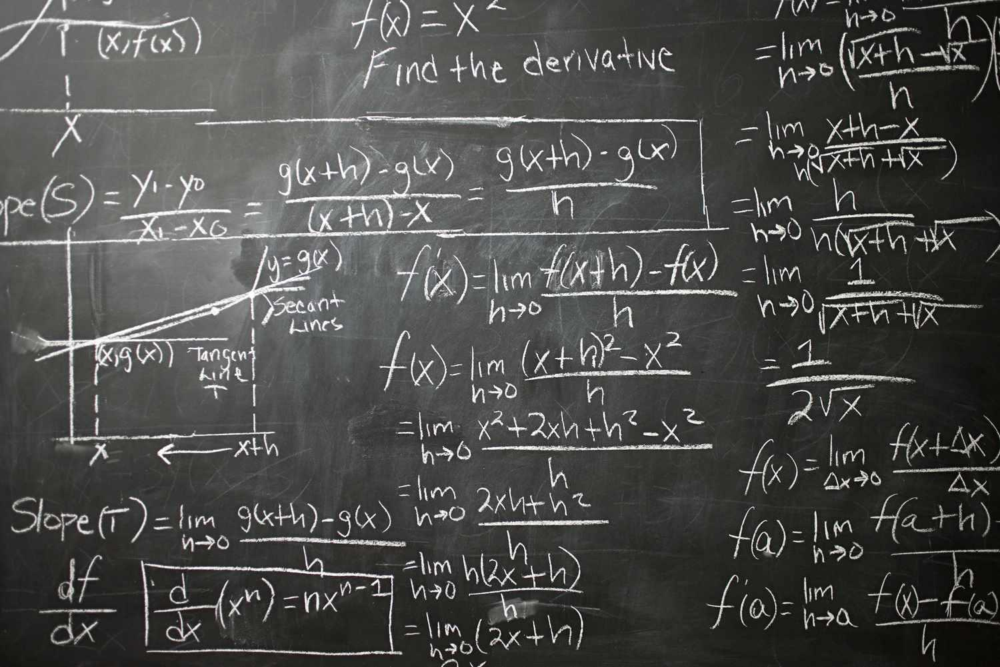

## Table of Contents

## What is mathematical economics?

Mathematical economics is a way to use math to understand and study economic ideas. It helps economists make models, which are like simplified pictures of how the economy works. These models use numbers and equations to show things like how much people want to buy something, how much it costs to make, and how prices change. By using math, economists can make predictions and test their ideas more easily.

In mathematical economics, you often see things like graphs, formulas, and numbers. For example, economists might use a graph to show how the price of a product affects how much people want to buy it. They use equations to describe how different parts of the economy, like businesses and consumers, interact with each other. This helps them understand big ideas like supply and demand, and how changes in one part of the economy can affect other parts.

## How does mathematical economics differ from traditional economics?

Mathematical economics and traditional economics both study how economies work, but they use different tools. Traditional economics often relies on words and descriptions to explain economic ideas. Economists might write long explanations about how people make choices, how markets work, and how governments affect the economy. They use stories and examples to help people understand these ideas. Traditional economics is good at giving a broad picture of the economy and can be easier for people who are not used to math to understand.

On the other hand, mathematical economics uses numbers, equations, and graphs to describe the same economic ideas. This approach makes it easier to be precise and to test theories. For example, instead of just saying that when prices go up, people buy less, mathematical economists can use an equation to show exactly how much less people will buy. This makes it easier to predict what will happen in the economy and to see how different parts of the economy are connected. While it can be more challenging to understand without a good grasp of math, it allows for more detailed and accurate analysis.

## What are some common mathematical tools used in economic analysis?

In economic analysis, one of the most common mathematical tools is algebra. Economists use algebra to create equations that show how different economic variables, like price and quantity, relate to each other. For example, they might use an equation to show how the price of a product affects how much of it people want to buy. Algebra helps economists solve these equations and find out what will happen if certain things change, like if the price goes up or down.

Another important tool is calculus. Calculus helps economists understand how things change over time. For instance, they might use calculus to figure out how fast prices are changing or how quickly a company's profits are growing. Calculus can also help economists find the best or most efficient way to do something, like how a business should set its prices to make the most profit.

Economists also use [statistics](/wiki/bayesian-statistics) a lot. Statistics helps them make sense of big sets of data, like information about how much people earn or how many people are unemployed. With statistics, economists can see patterns in the data, make predictions about the future, and test if their ideas about the economy are right. This is really helpful for understanding what is happening in the economy and what might happen next.

## Can you provide examples of how mathematical models are applied in economics?

One common example of a mathematical model in economics is the supply and demand model. This model uses simple equations and graphs to show how the price of a product affects how much of it people want to buy (demand) and how much producers are willing to sell (supply). The model shows that when the price is high, people will buy less, but producers will want to sell more. When the price is low, people will buy more, but producers will want to sell less. The point where the supply and demand curves meet is called the equilibrium price, where the amount people want to buy equals the amount producers want to sell. This model helps economists predict how changes in price or other factors, like taxes or technology, will affect the market.

Another example is the production function model, which helps economists understand how businesses turn inputs like labor and capital into outputs like goods and services. This model uses an equation to show how much output a business can produce with different amounts of inputs. For example, if a factory hires more workers or buys more machines, the production function can show how much more it can produce. Economists use this model to study how businesses can become more efficient and how changes in technology or the cost of inputs can affect the economy. By understanding the production function, economists can make better predictions about economic growth and productivity.

## What are the benefits of using mathematical models in economic theory?

Using mathematical models in economic theory helps economists be more precise and clear. Instead of just talking about ideas, they can use numbers and equations to show exactly how different parts of the economy work together. For example, a model can show how a change in interest rates might affect how much people spend or how much businesses invest. This makes it easier to predict what will happen in the economy and to test if economic theories are right. When economists use math, they can also see small changes that might be hard to notice with just words.

Another big benefit is that mathematical models help economists find the best solutions to problems. By using equations and calculus, they can figure out the most efficient way to do things, like how a business should set its prices to make the most profit or how a government should spend its money to help the economy grow. These models can also show how different parts of the economy are connected, so economists can see how a change in one place might affect other places. This helps them make better decisions and understand the economy better.

## How do mathematical models help in predicting economic trends?

Mathematical models help economists predict economic trends by turning complex ideas into numbers and equations. These models can show how things like prices, interest rates, and employment might change in the future. For example, if economists want to predict how a change in interest rates might affect spending, they can use a model to see how people's behavior might change. By putting in different numbers, they can see what might happen if interest rates go up or down. This helps them make better guesses about what will happen in the economy.

Another way mathematical models help is by letting economists test their ideas. They can use real data to see if their models match what is actually happening in the economy. If the model works well, it can give them more confidence in their predictions. For instance, if a model correctly predicted past economic trends, economists might trust it more to predict future trends. This testing helps them refine their models and make them more accurate over time, which leads to better predictions about things like inflation, unemployment, and economic growth.

## What are some criticisms of mathematical economics?

Some people think that mathematical economics can make things too simple. The economy is very complicated, with lots of different people and businesses all doing different things. When economists use math to make models, they have to leave out some of this complexity. This can make the models less accurate because they don't show the whole picture. For example, a model might not be able to show how people's feelings or unexpected events can affect the economy. Critics say that by focusing too much on math, economists might miss important things that don't fit neatly into equations.

Another criticism is that mathematical economics can be hard to understand for people who aren't good at math. Economic ideas are important for everyone, not just economists. If these ideas are explained using lots of complicated equations and graphs, it can be hard for regular people to understand them. This can make it harder for people to take part in discussions about economic policies. Critics argue that economists should try to explain things in simpler ways so that more people can understand and be involved in economic decisions.

## How do critics argue that mathematical models oversimplify economic realities?

Critics say that mathematical models in economics can make things too simple. The economy is really complicated, with lots of different people and businesses all doing different things. When economists use math to make models, they have to leave out some of this complexity. This means the models might not show everything that's going on. For example, a model might not be able to show how people's feelings or unexpected events can affect the economy. Critics worry that by focusing too much on math, economists might miss important things that don't fit neatly into equations.

Another point critics make is that these models can be too focused on numbers and not enough on the real world. They say that the economy is not just about numbers; it's about people, their behaviors, and how they interact. Sometimes, important things like trust, culture, or sudden changes in the world can't be easily put into a math equation. Critics argue that by trying to fit everything into a model, economists might miss these important factors and end up with predictions that don't match what really happens.

## What are the limitations of mathematical models in capturing human behavior?

Mathematical models in economics often struggle to capture human behavior because people don't always act in predictable ways. These models are based on numbers and equations, but human behavior can be influenced by feelings, beliefs, and sudden changes that are hard to put into math. For example, people might suddenly start buying less of a product because of a rumor or a change in public opinion, which a model might not predict.

Another limitation is that mathematical models usually assume that people always make rational choices. But in real life, people can make decisions based on emotions or incomplete information. They might choose to buy something because it makes them feel good, even if it's not the best financial decision. This kind of behavior can throw off the predictions of a model that expects everyone to act logically all the time.

## How have mathematical economics influenced economic policy-making?

Mathematical economics has helped shape economic policy-making by giving policymakers a way to predict what might happen if they make certain choices. When governments want to change things like taxes or interest rates, they can use mathematical models to see how these changes might affect the economy. For example, a model might show that raising taxes could slow down spending and hurt economic growth. This helps policymakers make better decisions because they can see the possible outcomes before they act.

However, mathematical economics also has its limits. Sometimes, the models can be too simple and might not show the whole picture. Real life is more complicated than what can be put into equations, and things like people's feelings or unexpected events can change how the economy works. Policymakers need to remember this and not rely only on the models. They should also listen to other experts and consider other ways of understanding the economy to make the best decisions.

## What are some advanced mathematical techniques used in modern economic research?

In modern economic research, one advanced technique that economists use is called econometrics. Econometrics combines statistics and economic theory to help economists understand data better. They use it to test if their ideas about the economy are right. For example, they might use econometrics to see if a change in interest rates really does affect how much people spend. This helps them make better predictions about the economy and understand how different parts of it are connected.

Another technique is called dynamic stochastic general equilibrium (DSGE) modeling. This sounds complicated, but it's just a way to make models that can show how the economy changes over time and deals with uncertainty. DSGE models can help economists see how things like shocks to the economy, like a sudden drop in spending, might affect things in the long run. By using these models, economists can better understand how the economy works and make more accurate predictions about what might happen in the future.

## How can the field of mathematical economics evolve to address its criticisms?

The field of mathematical economics can evolve to address its criticisms by trying to include more of the real world in its models. Right now, models can be too simple and leave out important things like people's feelings or unexpected events. Economists could work on making their models more detailed and flexible so they can show more of what's really going on in the economy. This might mean using new kinds of math or working with other fields like psychology to understand how people make decisions. By doing this, economists can make their models more accurate and useful for understanding the economy.

Another way to improve mathematical economics is by making it easier for everyone to understand. Right now, the math can be hard for people who aren't experts. Economists could try to explain their ideas in simpler ways, using fewer equations and more stories or examples. This would help more people understand economic ideas and be part of discussions about economic policies. By making their work more accessible, economists can make sure that everyone can benefit from their research and help shape the future of the economy.

## What is the Role of Mathematical Economics?

Mathematical economics utilizes mathematical symbols and models to elucidate complex economic concepts. By providing a structured framework, mathematics allows economists to express theoretical propositions in precise terms, thereby enhancing clarity and facilitating exact inferences and predictions. This precision is crucial, as it transforms abstract economic ideas into testable models, making empirical analysis both viable and robust.

The employment of mathematical tools such as algebra, calculus, and differential equations is central to this process. These tools enable the formulation of mathematical representations of economic phenomena, allowing for the derivation of impactful solutions to intricate economic problems. For instance, differential calculus is often used to determine the maxima or minima of functions, which can represent costs, revenues, or profit in economic models. For example, the use of calculus in deriving the elasticity of demand involves calculating the percentage change in quantity demanded resulting from a percentage change in price, often expressed as:

$$
E_d = \frac{\partial Q / Q}{\partial P / P} = \frac{P}{Q} \times \frac{\partial Q}{\partial P}
$$

where $E_d$ is the price elasticity of demand, $Q$ represents quantity, $P$ denotes price, and $\partial$ indicates a partial derivative. This calculation illustrates how mathematical techniques can provide insights into consumer behavior and market dynamics.

Furthermore, algebraic models are frequently utilized to describe relationships between variables, such as supply and demand equilibrium, where:

$$
Q_s = Q_d
$$

Here, $Q_s$ and $Q_d$ represent the quantity supplied and quantity demanded, respectively, and solving this equation can help determine equilibrium prices and quantities. The application of linear algebra can also solve systems of equations that commonly arise in market analyses, optimizing resource allocation and pricing strategies.

The utility of mathematics in economics extends beyond static analyses, embracing dynamic systems to evaluate the impact of economic policies over time. Economists employ time series models to forecast future economic trends by examining past patterns and applying statistical techniques to improve the reliability of these forecasts.

Overall, mathematical economics empowers economists to convert theoretical economic insights into quantifiable evidence, driving informed policy decisions and strategic planning. This approach continues to evolve, leveraging new mathematical methodologies and computational advances to tackle increasingly complex economic challenges.

## What are Econometric Methods in Economic Modeling?

Econometrics is a crucial component of economic modeling, integrating economic theory with quantitative techniques to develop models that enhance our understanding of economic phenomena and improve forecasting accuracy. At its core, econometrics utilizes statistical methods to convert qualitative economic statements into quantitative data, which is essential for conducting empirical research and testing hypotheses within economic theory.

One of the primary functions of econometrics is to build models that can explain relationships between different economic variables. These models are often described using mathematical equations that connect dependent and independent variables. For example, a simple linear regression model can be expressed mathematically as:

$$
Y = \alpha + \beta X + \epsilon
$$

where $Y$ is the dependent variable, $X$ is the independent variable, $\alpha$ is the intercept, $\beta$ represents the slope of the relationship, and $\epsilon$ is the error term.

This transformation from qualitative to quantitative assessments allows for the rigorous testing of economic theories and provides a basis for making predictions. Econometric models, like the Ordinary Least Squares (OLS) method, are extensively used to estimate the parameters of such relationships by minimizing the sum of the squares of the differences between observed and predicted values.

Moreover, econometrics aids in solving optimization problems that are critical for policymakers. By utilizing data-driven models, policymakers can make informed decisions that consider multiple variables and potential outcomes, thereby increasing the reliability of economic policies. For instance, in macroeconomic policy, econometric models could help in determining the impact of changes in interest rates on inflation and employment levels, guiding more effective monetary policies.

Recent advancements in computing power and the proliferation of big data have significantly enhanced the capabilities of econometric analysis. Modern computational techniques allow for the handling of vast datasets and complex models that were previously infeasible. Machine learning algorithms, for example, are being integrated with traditional econometric methods to improve predictive accuracy and uncover non-linear patterns in economic data.

Python has become one of the most popular programming languages for performing econometric analysis, mainly due to its powerful libraries such as NumPy, pandas, and statsmodels. Here is a basic example of how Python can be used to perform a linear regression analysis:

```python
import pandas as pd
import statsmodels.api as sm

# Sample data
data = {'X': [1, 2, 3, 4, 5], 'Y': [2, 3, 5, 7, 11]}
df = pd.DataFrame(data)

# Define the independent and dependent variables
X = df['X']
Y = df['Y']

# Add a constant to the independent variable
X = sm.add_constant(X)

# Fit the regression model
model = sm.OLS(Y, X).fit()

# Get the summary of the regression
print(model.summary())
```

This code demonstrates how econometric modeling can be implemented in Python, offering researchers and analysts an efficient way to execute complex computations and derive actionable insights from economic data.

In summary, econometric methods play a pivotal role in translating the complexities of economic theory into actionable insights through the application of statistical techniques. As technology evolves, the potential for these methods to influence economic decision-making and policy continues to grow, promising more accurate and nuanced analysis.

## References & Further Reading

[1]: Bergstra, J., Bardenet, R., Bengio, Y., & Kégl, B. (2011). ["Algorithms for Hyper-Parameter Optimization."](https://dl.acm.org/doi/10.5555/2986459.2986743) Advances in Neural Information Processing Systems 24.

[2]: ["Advances in Financial Machine Learning"](https://www.amazon.com/Advances-Financial-Machine-Learning-Marcos/dp/1119482089) by Marcos Lopez de Prado

[3]: ["Evidence-Based Technical Analysis: Applying the Scientific Method and Statistical Inference to Trading Signals"](https://www.amazon.com/Evidence-Based-Technical-Analysis-Scientific-Statistical/dp/0470008741) by David Aronson

[4]: ["Machine Learning for Algorithmic Trading"](https://github.com/PacktPublishing/Machine-Learning-for-Algorithmic-Trading-Second-Edition) by Stefan Jansen

[5]: ["Quantitative Trading: How to Build Your Own Algorithmic Trading Business"](https://books.google.com/books/about/Quantitative_Trading.html?id=j70yEAAAQBAJ) by Ernest P. Chan