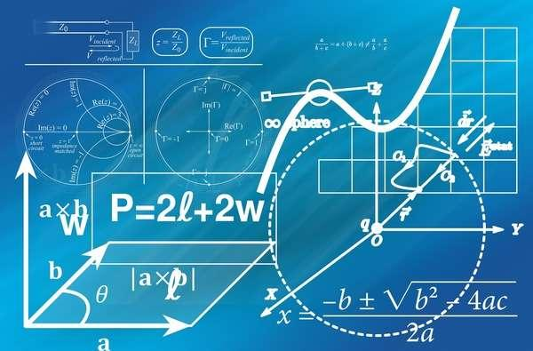

## Table of Contents

## What basic mathematical concepts are essential for understanding microeconomics?

To understand microeconomics, you need to know some basic math concepts. These include simple algebra, which helps you solve equations and understand how different economic variables relate to each other. For example, you might use algebra to find out how changes in price affect the quantity of a product that people want to buy. Another important concept is graphing, which allows you to visualize economic relationships, like supply and demand curves. These graphs help you see how prices and quantities interact in a market.

In addition to algebra and graphing, you should be familiar with basic calculus. Calculus helps you understand rates of change, which is useful for analyzing how quickly things like costs or revenues are changing as production levels increase or decrease. While you don't need to be an expert in calculus, knowing the basics can help you grasp more advanced economic theories. Finally, understanding simple statistics can be helpful. Statistics allow you to analyze data and make predictions about economic behavior, like how likely consumers are to buy a product at different prices. Together, these math skills provide a strong foundation for studying microeconomics.

## How can one use algebra to solve simple microeconomic problems?

Algebra is a powerful tool for solving simple microeconomic problems because it helps you find unknown values and understand how different economic factors relate to each other. For example, imagine you want to know how many units of a product a company should produce to maximize its profit. You can use an equation where profit equals total revenue minus total cost. If you know the revenue and cost functions, you can set up an equation and solve for the quantity that gives the highest profit. This involves basic algebraic manipulation, like isolating the variable you want to find.

Another common use of algebra in microeconomics is to solve for equilibrium in a market. The equilibrium is the point where supply equals demand, and you can find it by setting the supply equation equal to the demand equation. For instance, if the demand for a product is given by the equation Qd = 100 - 2P (where Qd is quantity demanded and P is price), and the supply is given by Qs = 20 + 3P (where Qs is quantity supplied), you can set Qd equal to Qs and solve for P. This gives you the equilibrium price, which you can then use to find the equilibrium quantity. Algebra makes it possible to solve these equations and find the balance point in the market.

## What role do graphs and functions play in microeconomic analysis?

Graphs and functions are really important in microeconomics because they help us see how different things are connected. For example, when we talk about supply and demand, we can draw a graph to show how the price of something changes the amount people want to buy or sell. The demand curve shows that when prices go down, people usually want to buy more, and the supply curve shows that when prices go up, sellers want to sell more. By looking at these graphs, we can find the point where supply and demand meet, which is called the equilibrium. This point tells us the price and quantity that the market will settle on.

Functions help us describe these relationships in a more detailed way. A function is just a math rule that shows how one thing depends on another. In microeconomics, we use functions to show things like how costs change as a company makes more products, or how much money a company makes from selling different amounts of a product. For example, we might have a cost function that tells us the total cost depends on the number of units produced. By using these functions, we can do calculations and make predictions about what will happen if certain things change, like if the price of raw materials goes up or if the company decides to produce more. Graphs and functions together give us a clear picture of the economy and help us make better decisions.

## How are derivatives used in microeconomics to analyze consumer and producer behavior?

In microeconomics, derivatives help us understand how small changes in one thing affect another. For example, when looking at consumer behavior, we use derivatives to see how a little change in the price of a product changes how much people want to buy it. This is called the price elasticity of demand. If the derivative of the demand function is big, it means that even a small change in price can make a big difference in how much people buy. This helps businesses decide if they should raise or lower prices to sell more.

Derivatives are also important for analyzing producer behavior, especially when it comes to figuring out the best amount to produce. Companies want to make as much profit as possible, so they use derivatives to find the point where the extra money they make from selling one more unit (marginal revenue) equals the extra cost of making that unit (marginal cost). This is called the profit maximization point. By using derivatives, producers can see how costs and revenues change as they produce more or less, helping them decide the best production level.

## What is the importance of elasticity in microeconomics, and how is it calculated?

Elasticity is super important in microeconomics because it tells us how much people change their buying habits when prices change. If a product has high elasticity, it means that people are very sensitive to price changes. For example, if the price of a certain brand of soda goes up a little bit, people might stop buying it and switch to a cheaper brand. On the other hand, if a product has low elasticity, people will keep buying it even if the price goes up. This is often the case with things like medicine or gasoline, where people need them no matter what.

To calculate elasticity, we use a simple formula. For price elasticity of demand, it's the percentage change in the quantity demanded divided by the percentage change in price. If the price of a product goes up by 10% and the quantity people want to buy goes down by 20%, then the elasticity would be 20% divided by 10%, which equals 2. This means the product is elastic because the percentage change in quantity demanded is bigger than the percentage change in price. Understanding elasticity helps businesses and economists make better decisions about pricing and production.

## How can linear programming be applied to optimize resource allocation in microeconomics?

Linear programming is a way to figure out the best way to use resources in microeconomics. Imagine a company that makes different products, like cars and trucks. They have limited resources, like money, time, and materials. Linear programming helps them decide how many cars and trucks to make so they can make the most profit. It does this by setting up equations that show how much of each resource is needed for each product and what the profit will be. Then, it finds the best combination of products to make, given the limits on resources.

For example, let's say a factory can make cars and trucks, but they only have so much steel and so many hours of labor each day. They want to use all their steel and labor in the best way to make the most money. With linear programming, they can set up equations to show how much steel and labor it takes to make one car or one truck, and how much profit they make from each. The program then solves these equations to find the best number of cars and trucks to make, making sure they don't use more steel or labor than they have. This helps the company use their resources in the smartest way possible.

## What are the key elements of game theory, and how are they used in microeconomic models?

Game theory is a way to study how people make decisions when they have to think about what others might do. In microeconomics, it's used to understand things like competition between companies or how people might behave in a market. The key elements of game theory are players, strategies, payoffs, and rules. Players are the people or companies making decisions. Strategies are the different choices they can make, like setting a high price or a low price. Payoffs are what they get based on their choices and the choices of others, like profit or loss. Rules set the limits on what players can do and how the game works.

In microeconomic models, game theory helps us see how businesses might act in different situations. For example, if two companies are selling similar products, game theory can show what happens if one company lowers its prices. Will the other company do the same, or will they keep their prices high? By looking at the strategies and payoffs, economists can predict what might happen and help companies make better decisions. Game theory also helps explain things like why companies might work together or why they might try to trick each other. It's a powerful tool for understanding the complex choices people make in the economy.

## How do economists use integral calculus to analyze economic surplus and welfare?

Economists use integral calculus to figure out how much total benefit people get from buying and selling things. This is called economic surplus, which is made up of consumer surplus and producer surplus. Consumer surplus is the difference between what people are willing to pay for something and what they actually pay. Producer surplus is the difference between the price sellers get and the lowest price they would be willing to sell at. By using integrals, economists can add up all these little differences over a range of prices and quantities to find the total surplus. This helps them see how well the market is working and how changes, like a new tax, might affect people's well-being.

Integral calculus also helps economists measure economic welfare, which is about how well off people are overall. They use integrals to calculate things like the total utility, or happiness, that people get from consuming goods and services. By looking at how utility changes as people consume more or less, economists can figure out the best way to distribute resources to make everyone as happy as possible. This is important for making policy decisions, like deciding how much to tax or spend on public services. Using integrals, economists can see the big picture of how different choices affect everyone's well-being, helping them make better decisions for society.

## What advanced statistical methods are useful for empirical microeconomic research?

In empirical microeconomic research, advanced statistical methods help economists understand how people make choices and how markets work. One important method is regression analysis, which lets researchers see how different things, like income or prices, affect what people do. For example, they might use regression to figure out how a change in the minimum wage affects how many hours people work. Another useful method is panel data analysis, which looks at data from the same people or companies over time. This helps economists see how things change and understand why. They might use it to see how a new law affects a company's profits year after year.

Another advanced method is instrumental variables (IV) analysis, which helps solve a common problem in economics called endogeneity. This happens when the thing you're trying to measure is affected by other things that are hard to see. IV analysis uses other variables that are related to what you're studying but not directly affected by it, to get a clearer picture. For example, economists might use the distance to a store as an instrument to study how store location affects shopping behavior. Lastly, there's structural modeling, which builds detailed models of how people make choices. These models help economists predict what might happen if things change, like if a new tax is introduced. By using these advanced methods, economists can get a better understanding of the economy and make more accurate predictions.

## How can differential equations be utilized to model dynamic economic processes in microeconomics?

Differential equations are really helpful for understanding how things change over time in microeconomics. Imagine you want to know how the amount of money people save changes as they get older or how a company's profits grow or shrink over time. Differential equations let you set up a math rule that shows how one thing, like savings, depends on another thing, like time. By solving these equations, you can predict what will happen in the future. For example, if you know how fast people are saving money now, you can use a differential equation to figure out how much they will have saved in the future.

These equations are also great for looking at how prices and quantities in a market change over time. If you want to understand how the price of a product goes up or down, you can use a differential equation to show how the price changes based on things like how much people want to buy it and how much is available to sell. This helps economists see how markets move and adjust. By using differential equations, they can make better guesses about what will happen next and help businesses and policymakers make smarter choices about things like setting prices or making new rules.

## What are the applications of optimization techniques in microeconomic theory?

In microeconomic theory, optimization techniques help us figure out the best way to do things. For example, companies want to make as much profit as they can. They use optimization to decide how much to produce and what price to charge. By setting up equations that show how costs and revenues change with different choices, they can find the best combination that gives them the highest profit. This is really important for making smart business decisions and understanding how markets work.

Optimization is also used to look at how people make choices. Economists use it to study how people decide to spend their money or time. For example, they might use optimization to see how people balance work and leisure to be as happy as possible. By setting up models that show how different choices affect happiness or utility, economists can predict what people will do and how they will react to things like changes in prices or taxes. This helps them understand consumer behavior and make better policies.

## How do advanced matrix algebra and vector calculus enhance the analysis of general equilibrium models in microeconomics?

Advanced matrix algebra and vector calculus make it easier to study general equilibrium models in microeconomics. These models look at how different parts of the economy, like prices and quantities of many goods, all work together. Matrix algebra helps by letting economists organize all the information into neat tables called matrices. This makes it easier to see how changes in one part of the economy, like the price of one good, affect other parts, like how much of another good people want to buy. By using matrices, economists can solve big systems of equations all at once, which is really helpful for understanding how everything in the economy fits together.

Vector calculus is also important because it helps economists understand how things change over time and space in the economy. For example, it can show how prices and quantities move together in a market. By using vectors, which are like arrows that show direction and size, economists can see how different economic forces are pushing and pulling on each other. This helps them predict what will happen in the future and how different parts of the economy will react to changes. Together, matrix algebra and vector calculus give economists powerful tools to understand and predict how the whole economy works.

## What are the Economic Theories that Serve as Prerequisites for Algo Trading?

Algorithmic trading, a highly technical and analytical domain, significantly benefits from an understanding of economic theories, many of which are deeply rooted in microeconomics. One of the foundational concepts in microeconomics that applies directly to [algorithmic trading](/wiki/algorithmic-trading) is the principle of supply and demand. This principle governs market behavior and sets the equilibrium price, which is the price point at which the quantity supplied equals the quantity demanded. Understanding this interaction is essential, as it influences decision-making processes in trading algorithms.

Market equilibrium, another core concept, represents the state in which market supply and demand balance each other, and as a result, prices become stable. In a practical sense, if a price is above equilibrium, there will be a surplus driving prices down. Conversely, if a price is below, a shortage will drive prices up. This dynamic can be modeled and integrated into trading algorithms to predict price movements and identify potential trading opportunities.

The concept of price theory, which focuses on how prices are determined in a market, is also crucial. Price movements can be influenced by factors such as production costs, consumer preferences, and market competition. An algorithm that understands price elasticity—how much the quantity demanded of a good responds to a change in price—can better anticipate price changes and optimize trading decisions.

Mathematics is instrumental in applying these economic principles within algorithmic trading. By utilizing mathematical frameworks, traders can construct models that simulate market behaviors based on these theories. For instance, simple linear equations can model supply and demand:

$$
Q_d = a - bP
$$

$$
Q_s = c + dP
$$

where $Q_d$ and $Q_s$ represent the quantity demanded and supplied, respectively, $P$ is the price, and $a, b, c,$ and $d$ are constants. Finding market equilibrium involves setting $Q_d = Q_s$ and solving for $P$, which can be embedded in algorithmic trading software to automate trading decisions based on market conditions.

Incorporating these economic theories into algorithmic trading systems allows for the development of robust strategies that can navigate the complexities of financial markets. By understanding and applying these principles, traders can enhance both the efficiency and effectiveness of their trading operations, ultimately seeking to minimize risk and maximize returns.

## References & Further Reading

[1]: Stachurski, J. (2009). ["Economic Dynamics: Theory and Computation."](https://johnstachurski.net/edtc) MIT Press.

[2]: Sundaram, R. K. (1996). ["A First Course in Optimization Theory."](https://archive.org/details/firstcourseinopt0000sund) Cambridge University Press.

[3]: Hull, J. C. (2012). ["Options, Futures, and Other Derivatives."](https://www.semanticscholar.org/paper/Options%2C-Futures%2C-and-Other-Derivatives-Hull/89bdee500c8623864fc9eb7a471546aa713acc44) Pearson Education.

[4]: Varian, H. R. (1992). ["Microeconomic Analysis."](https://archive.org/details/microeconomicana00vari_0) W. W. Norton & Company.

[5]: Gujarati, D. N., & Porter, D. C. (2008). ["Basic Econometrics."](https://books.google.com/books/about/Basic_Econometrics.html?id=6l1CPgAACAAJ) McGraw-Hill Education.

[6]: Markowitz, H. (1952). ["Portfolio Selection."](https://onlinelibrary.wiley.com/doi/abs/10.1111/j.1540-6261.1952.tb01525.x) Journal of Finance, 7(1), 77-91.

[7]: Grinold, R. C., & Kahn, R. N. (2000). ["Active Portfolio Management: A Quantitative Approach for Producing Superior Returns and Controlling Risk."](https://www.amazon.com/Active-Portfolio-Management-Quantitative-Controlling/dp/0070248826) McGraw-Hill Education.

[8]: Campbell, J. Y., Lo, A. W., & MacKinlay, A. C. (1997). ["The Econometrics of Financial Markets."](https://www.researchgate.net/publication/23775223_The_Econometrics_of_Financial_Market) Princeton University Press.