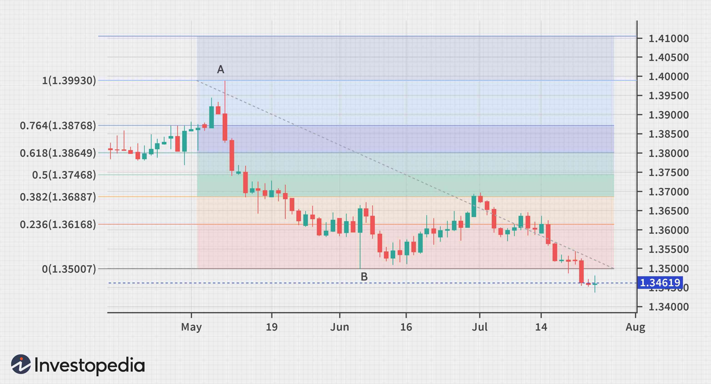

Algorithmic trading has significantly transformed financial markets, employing computer programs to execute trades at remarkable speeds based on predefined criteria. This technological advancement allows for the execution of trades that factor in a wide range of market data, thereby improving the efficiency and accuracy of financial transactions. At the core of algorithmic trading lies mathematical trading, which employs quantitative techniques to develop sophisticated strategies. These strategies are grounded in mathematical principles, encompassing various models and algorithms, which analyze historical data and identify potential trading opportunities.

Mathematical trading forms the backbone of algorithmic strategies, utilizing extensive mathematical tools such as statistics, probability theory, and linear algebra. These methodologies are essential for understanding and predicting market behavior, enabling traders to spot trends and anomalies in market data. For instance, statistical models can evaluate mean reversion—the tendency of a stock price to return to its average value over time—or identify irregularities in price patterns. Such insights are crucial for traders aiming to exploit market inefficiencies to their advantage.



This article aims to explore the integration of mathematical principles within algorithmic trading, spotlighting key concepts and their practical applications in optimizing trading efficiency and profitability. The significance of mathematical models, such as moving averages and momentum indicators, will be examined in the context of identifying favorable trading conditions and executing trades with precision.

By comprehending these mathematical approaches, traders and investors are better positioned to enhance their Automated trading capabilities. This understanding provides a competitive edge, facilitating more informed decision-making and improved market performance. As automated trading continues to evolve, the role of mathematical principles will become increasingly important, offering traders and investors the tools necessary for navigating the complexities of modern financial markets.

## Table of Contents

## The Role of Mathematics in Algorithmic Trading

Mathematics provides a crucial backbone for algorithmic trading, enabling the development of sophisticated algorithms that analyze market patterns and predict future movements. Key mathematical concepts integral to this process include statistics, probability theory, and linear algebra. These fields empower traders to interpret market fluctuations and devise strategies that capitalize on inefficiencies within the marketplace.

Statistics is fundamental in analyzing market data, providing tools such as mean reversion and moving averages that are widely employed to identify trading opportunities. Mean reversion, a concept rooted in statistical theory, posits that asset prices and returns eventually move back towards their historical mean over time. This concept can be formulated as:

$$

X_t = \mu + \theta(X_{t-1} - \mu) + \epsilon_t 
$$

where $X_t$ is the price at time $t$, $\mu$ is the long-term mean, $\theta$ is the speed of reversion, and $\epsilon_t$ is the error term. Such statistical models assist traders in identifying pricing anomalies and timing the market efficiently.

Probability theory underpins the assessment of risk and uncertainty in trading strategies. It facilitates the modeling of price distributions and the calculation of the likelihood of various market scenarios, thereby aiding in risk management. Traders often use probabilistic models to simulate market outcomes and to calculate metrics like Value at Risk (VaR), which provides a quantified estimate of the potential loss in portfolio value over a defined period for a given confidence interval.

Linear algebra is another cornerstone, instrumental in constructing models that handle large datasets typical of financial markets. It aids in operations such as portfolio optimization, wherein one seeks to maximize returns for a given level of risk or minimize risk for a given level of expected return. A basic portfolio optimization problem can be framed as:

$$
\min \frac{1}{2} \mathbf{w}^T \Sigma \mathbf{w} - \mathbf{r}^T \mathbf{w}
$$

subject to $\mathbf{w}^T \mathbf{1} = 1$, where $\mathbf{w}$ is the weight vector of assets, $\Sigma$ is the covariance matrix of returns, and $\mathbf{r}$ is the expected return vector. Solutions to these linear equations determine the allocation of assets that balance risk and return efficiently.

Moreover, mathematical models are indispensable for [backtesting](/wiki/backtesting) strategies against historical data, ensuring their robustness and profitability before implementation in live trading. Backtesting involves applying a trading strategy to historical market data to assess how it would have performed. This process relies heavily on mathematical computations to simulate past conditions, evaluate strategy returns, and refine model parameters for optimal results.

In summary, mathematical principles are woven into the fabric of [algorithmic trading](/wiki/algorithmic-trading), providing the analytical tools necessary to decode the complexities of financial markets. By leveraging [statistics](/wiki/bayesian-statistics), probability theory, and linear algebra, traders can craft strategies that not only fathom market dynamics but also optimize trading efficiency and profitability.

## Mathematical Models and Techniques in Algorithmic Trading

Algorithmic trading leverages mathematical models to enhance decision-making processes and efficiency. These models integrate quantitative techniques to identify and exploit market opportunities systematically. Among the prominent mathematical models applied in algorithmic trading are trend-following strategies, [arbitrage](/wiki/arbitrage) models, and mathematical optimization.

Trend-following strategies are designed to capture market trends, using tools such as moving averages and [momentum](/wiki/momentum) indicators. The concept behind these strategies is predicated on the idea that asset prices, once trending, are likely to continue moving in the same direction. A simple moving average (SMA) is the arithmetic mean of a given set of prices over a specific number of periods. It is formulated as:

$$
\text{SMA} = \frac{P_1 + P_2 + \ldots + P_n}{n}
$$

where $P$ represents the asset prices over $n$ periods. The use of SMAs helps traders identify bullish or bearish trends, and by combining multiple SMAs (like short-term and long-term averages), they can generate signals to buy or sell.

Arbitrage models are vital in situations where there are price discrepancies between different markets or instruments. These models help traders achieve risk-free profits by simultaneously purchasing and selling equivalent securities. For instance, if a stock is cheaper on one exchange compared to another, a trader can buy the stock on the cheaper exchange and sell it on the more expensive one. Successful arbitrage trading requires rapid execution and low transaction costs, making it ideally suited to algorithmic approaches.

Mathematical optimization plays a crucial role in portfolio construction and management. It involves using algorithms to allocate assets in a way that maximizes returns for a given risk level or minimizes risk for a target return. The optimization process can be expressed using:

$$
\max_{\mathbf{w}} \left( \mathbf{w}^T \mathbf{\mu} - \frac{\lambda}{2} \mathbf{w}^T \Sigma \mathbf{w} \right)
$$

where $\mathbf{w}$ is a vector of asset weights in the portfolio, $\mathbf{\mu}$ represents expected returns, $\Sigma$ is the covariance matrix of asset returns, and $\lambda$ is the risk aversion parameter. Solutions to this optimization problem, such as the Efficient Frontier, guide traders in selecting portfolios that offer the best possible levels of expected return for varying degrees of risk.

The use of these mathematical models enables the automation of trading decisions, significantly enhancing execution speed and accuracy. Automation reduces the emotional and psychological barriers often associated with trading, allowing systems to react to market changes in milliseconds. By applying rigorous mathematical frameworks, algorithmic trading systems can systematically analyze large volumes of data, leading to more informed and efficient trading strategies.

## Applications and Benefits of Mathematical Trading

Mathematical trading provides significant enhancements to market operations, particularly in areas such as [liquidity](/wiki/liquidity-risk-premium) and trade execution. By utilizing complex algorithms, trades can be performed at optimal prices with minimal human intervention, thus ensuring a more liquid market. This liquidity arises from the ability of algorithms to quickly match buy and sell orders, reducing the spread between bid and ask prices, which is a crucial measure of market efficiency.

One of the critical advantages of mathematical trading is the reduction in transaction costs. With mathematical algorithms, trades can be executed more precisely and efficiently, thereby minimizing slippage and other costs associated with manual trading. These algorithms are designed to optimize the execution process, leading to improved execution quality and cost-effectiveness. An example of a common technique includes the use of [statistical arbitrage](/wiki/statistical-arbitrage), where algorithms identify pricing inefficiencies between related securities, executing simultaneous buy and sell orders to capture theoretical profit margins.

Moreover, the systematic nature of mathematical trading helps in eliminating human biases and emotional decision-making, which can adversely impact trading performance. Algorithms operate based on predefined rules and parameters, ensuring consistent and disciplined trading actions. This objectivity is crucial, particularly in volatile markets where emotional reactions can lead to suboptimal decision-making.

The inclusion of real-time data analysis within mathematical trading models further amplifies their utility. By analyzing market data as it becomes available, these models can promptly adjust trading strategies to reflect new information or changing market conditions. Techniques such as moving averages, Bollinger Bands, and other technical indicators can be implemented to generate entry and [exit](/wiki/exit-strategy) signals, allowing traders to seize new opportunities quickly.

Mathematical trading also facilitates high-frequency trading ([HFT](/wiki/high-frequency-trading-strategies)), where execution speeds reach sub-millisecond levels. High-frequency trading relies heavily on mathematical algorithms to capitalize on tiny inefficiencies in the market that exist for fractions of a second. This ability to execute a large number of orders at rapid speeds is not achievable without sophisticated mathematical models that ensure precise timing and execution.

In conclusion, mathematical trading offers a series of benefits that contribute to a more effective and competitive trading strategy. By leveraging mathematical frameworks, market participants can achieve superior liquidity, lower transaction costs, mitigate emotional influence, and capture high-frequency trading opportunities, ultimately leading to more efficient market operations.

## Challenges and Future of Mathematical Trading in Algorithms

Mathematical trading, while advantageous, encounters several challenges that can impede its effectiveness. One of the primary concerns is the heavy reliance on technology. Algorithmic trading systems depend on high-speed internet connections, robust software, and powerful computing resources to function efficiently. Any technological failure or lag can lead to significant losses, as these systems are designed to execute high-frequency trades in milliseconds. Moreover, the risk of model overfitting is a pertinent issue. Overfitting occurs when a model is excessively complex, capturing noise rather than the underlying data patterns. This can lead to poor predictive performance on new, unseen data, as the model fails to generalize beyond the historical data on which it was trained.

Market anomalies, such as black swan events, pose another significant challenge. Black swan events refer to rare and unpredictable occurrences that can have severe consequences on the financial markets. Such events can disrupt algorithmic systems, leading to unexpected losses as these models may not be equipped to handle sudden market shifts. For instance, the 2008 financial crisis and the COVID-19 pandemic exemplify events that prompted unforeseen market reactions.

Despite these challenges, advancements in technology and data analytics continually enhance mathematical trading strategies. The advent of [machine learning](/wiki/machine-learning) and [artificial intelligence](/wiki/ai-artificial-intelligence) (AI) offers promising avenues for refining predictive models and trading algorithms. Machine learning techniques, such as [deep learning](/wiki/deep-learning), enable the analysis of vast datasets to identify intricate patterns that traditional models might overlook. Here is a simple example of a Python script using a machine learning model (e.g., using Scikit-Learn) to predict stock prices based on historical data:

```python
from sklearn.ensemble import RandomForestRegressor
import numpy as np

# Example historical data: features (e.g., opening price, volume) and target (closing price)
X = np.array([[100, 2000], [102, 2100], [104, 2200]])
y = np.array([101, 103, 105])

# Create and train the model
model = RandomForestRegressor(n_estimators=100)
model.fit(X, y)

# Predict future closing price
future_data = np.array([[106, 2300]])
predicted_price = model.predict(future_data)
print("Predicted Closing Price:", predicted_price[0])
```

Ongoing research and development in mathematical trading also offer exciting opportunities for future market efficiencies and innovations. Researchers are exploring ways to integrate quantum computing and blockchain technology into trading systems to further enhance security, speed, and accuracy. Quantum computing, for instance, has the potential to solve complex optimization problems much faster than classical computers, thereby boosting the efficacy of algorithmic trading strategies.

The continuous evolution and integration of new technologies in mathematical trading signify a promising future. These innovations are expected to improve risk management, enhance the precision of trading algorithms, and facilitate more efficient market operations. As algorithmic trading systems become more sophisticated, they are likely to provide traders with a more robust framework for navigating the complexities of the financial markets.

## Conclusion

Mathematical trading has fundamentally reshaped the way financial markets operate by embedding algorithmic precision into trading practices. By leveraging mathematical algorithms, traders are enabled to execute trades that are not only more efficient but also more cost-effective and systematic. This systematic approach minimizes human error and allows for executing complex trade decisions at speeds unattainable by human traders alone, often making use of real-time data streams and advanced computational techniques.

Understanding and applying mathematical principles in trading is crucial for gaining a competitive edge in today's technology-driven environment. These principles—ranging from statistical analysis and probability theory to advanced optimization techniques—provide the tools necessary for developing robust trading strategies. For instance, employing stochastic calculus can help in modeling the erratic behavior of asset prices, while linear regression and other statistical methods are used to identify and analyze trends, enabling traders to better anticipate market movements.

As the industry continues to evolve, exploring and integrating advanced mathematical techniques will become even more essential for maximizing trading performance and opportunities. The rapid advancement of machine learning and artificial intelligence offers new avenues for refining predictive models. Integrating these technologies could lead to the development of more adaptive and highly accurate trading algorithms.

Investors and traders are encouraged to embrace mathematical trading to fully harness its potential. In this increasingly automated marketplace, traditional trading approaches are becoming obsolete as algorithms dominate trade execution. By adopting mathematical trading methods, market participants not only enhance their operating efficiency but also position themselves favorably to capitalize on market opportunities driven by data and analytics. As technology progresses, those who invest in understanding and applying these mathematical techniques will likely stand at the forefront of innovation and profitability in financial markets.

## References & Further Reading

[1]: ["Advances in Financial Machine Learning"](https://www.amazon.com/Advances-Financial-Machine-Learning-Marcos/dp/1119482089) by Marcos Lopez de Prado

[2]: ["Quantitative Trading: How to Build Your Own Algorithmic Trading Business"](https://books.google.com/books/about/Quantitative_Trading.html?id=j70yEAAAQBAJ) by Ernest P. Chan

[3]: ["Machine Learning for Algorithmic Trading"](https://github.com/stefan-jansen/machine-learning-for-trading) by Stefan Jansen

[4]: ["Algorithmic Trading: Winning Strategies and Their Rationale"](https://books.google.com/books/about/Algorithmic_Trading.html?id=CIwCTVqEj4oC) by Ernie Chan

[5]: Fama, E. F., & French, K. R. (1992). ["The Cross-Section of Expected Stock Returns."](https://www.jstor.org/stable/2329112) Journal of Finance, 47(2), 427-465.

[6]: Tsay, R. S. (2010). ["Analysis of Financial Time Series"](https://onlinelibrary.wiley.com/doi/book/10.1002/9780470644560). Wiley.

[7]: Lo, A. W. (2009). ["The Econometrics of Financial Markets"](https://www.semanticscholar.org/paper/THE-ECONOMETRICS-OF-FINANCIAL-MARKETS-Campbell-Lo/6924fa669cb30c223b5d0148cbacd17f77b57a0f). Princeton University Press.