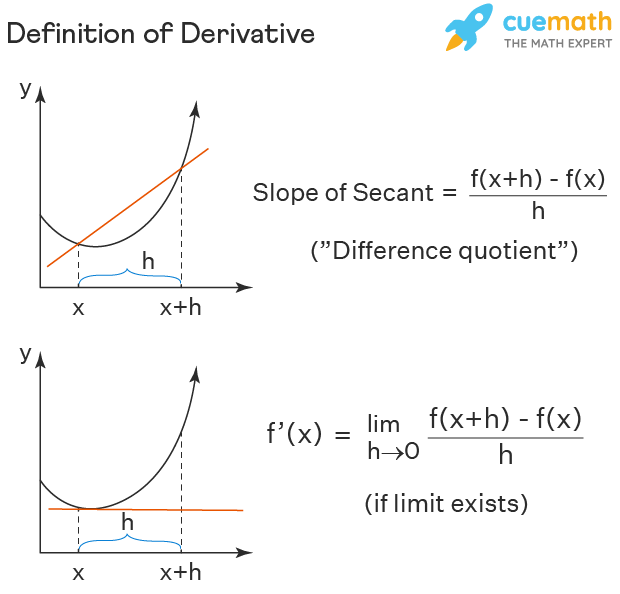

## Table of Contents

## What is a derivative in mathematics?

A derivative in mathematics is a way to show how a function changes as its input changes. Think of it like the slope of a line on a graph. If you have a function that represents how far a car has traveled over time, the derivative of that function will tell you the car's speed at any point in time. It's like measuring how steep the road is at different points.

To find a derivative, you use a process called differentiation. This process involves following certain rules to figure out how the output of a function changes when you change the input just a tiny bit. For example, if you have a simple function like f(x) = x^2, the derivative of this function is f'(x) = 2x. This means that for every small change in x, the function's output changes by about 2x times that small change. 

Derivatives are very useful in many areas of math and science. They help us understand rates of change, which is important in fields like physics, engineering, and economics. For instance, in physics, derivatives can help you understand how fast something is moving or how quickly it's accelerating. In economics, they can help predict how changes in one factor, like price, might affect another factor, like demand.

## How is the derivative of a function defined?

The derivative of a function is a way to measure how the function changes when its input changes a little bit. Imagine you're walking up a hill and you want to know how steep it is at a certain point. The derivative at that point tells you the steepness, or the slope of the hill right there. In math terms, if you have a function f(x), the derivative, written as f'(x), tells you the rate at which f(x) is changing at any point x.

To find the derivative, you use a concept called the limit. You look at how the function changes over smaller and smaller intervals, getting closer and closer to the point you're interested in. For example, if you want to find the derivative of f(x) at a point x, you look at the difference in the function's value between x and a nearby point, say x + h, and then divide that difference by h. As h gets smaller and smaller, approaching zero, the result of this calculation gets closer to the true derivative at x. This process is called differentiation.

## What is the difference between the average rate of change and the instantaneous rate of change?

The average rate of change of a function over an interval tells you how much the function changes, on average, between two points. It's like looking at how much your height has changed over the last year and dividing it by the number of months. If you grew 6 inches in a year, the average rate of change of your height over that year would be half an inch per month. To find the average rate of change, you take the difference in the function's value at the end and start of the interval, and then divide by the length of the interval.

The instantaneous rate of change, on the other hand, is what the derivative of a function tells you. It's like checking your speedometer while driving to see your speed at that exact moment. It tells you how fast the function is changing at a single point, not over an interval. To find it, you use the concept of a limit, looking at smaller and smaller intervals around the point until you get the exact rate of change right at that point. So, while the average rate of change gives you a broad overview, the instantaneous rate of change gives you the precise rate at a specific moment.

## Can you explain the concept of the limit as it relates to derivatives?

The limit is a super important idea in math that helps us figure out derivatives. Imagine you're trying to find out how fast a car is going at a certain moment. You could look at its speed over a short time, like a few seconds, but to get the exact speed at that exact moment, you need to look at shorter and shorter times. The limit is like zooming in on that moment, making the time shorter and shorter until it's almost zero. In math, when we take the limit, we're looking at what happens as the time or distance gets closer and closer to zero, without actually reaching zero.

This idea of the limit is what lets us find the derivative of a function. If you have a function, say f(x), and you want to know how it's changing at a certain point, you look at how the function changes over smaller and smaller intervals around that point. You do this by calculating the difference in the function's value over that interval and then dividing by the length of the interval. As the interval gets smaller and smaller, the result of this calculation gets closer and closer to the true rate of change at that point. That's the derivative, and it's all thanks to the concept of the limit.

## What are the basic rules for finding derivatives, such as the power rule, product rule, and quotient rule?

The power rule is a simple way to find the derivative of a function that's raised to a power. If you have a function like f(x) = x^n, where n is any number, the derivative is f'(x) = n * x^(n-1). It's like saying if you have a box that's getting bigger, and you want to know how fast it's growing, you just take the power it's raised to, multiply it by the box, and then lower the power by one. So, if f(x) = x^3, the derivative is f'(x) = 3 * x^2.

The product rule is used when you have two functions multiplied together, like f(x) = u(x) * v(x). To find the derivative, you take the derivative of the first function, u'(x), and multiply it by the second function, v(x). Then, you add the first function, u(x), multiplied by the derivative of the second function, v'(x). So, the rule is f'(x) = u'(x) * v(x) + u(x) * v'(x). It's like if you have two things growing at different rates, and you want to know how fast their product is growing, you need to consider both rates.

The quotient rule is for when you have one function divided by another, like f(x) = u(x) / v(x). The derivative of this is a bit trickier. You take the derivative of the top function, u'(x), and multiply it by the bottom function, v(x). Then, you subtract the top function, u(x), multiplied by the derivative of the bottom function, v'(x). Finally, you divide all of that by the bottom function squared, v(x)^2. So, the rule is f'(x) = [u'(x) * v(x) - u(x) * v'(x)] / v(x)^2. It's like figuring out how fast something is changing when it's being divided by something else that's also changing.

## How do you find the derivative of a function using the definition of a derivative?

To find the derivative of a function using the definition of a derivative, you need to understand what the derivative actually means. Imagine you have a function, let's call it f(x). The derivative of this function, written as f'(x), tells you how fast the function is changing at any point x. To find this, you look at how the function changes over a very small interval around x. You do this by taking the difference in the function's value between x and a nearby point, say x + h, and then dividing that difference by h. This gives you the average rate of change over the interval from x to x + h.

Now, to get the exact rate of change at x, you need to make h smaller and smaller, getting closer to zero without actually reaching it. This is where the concept of a limit comes in. You take the limit of the average rate of change as h approaches zero. Mathematically, this is written as f'(x) = lim(h→0) [f(x + h) - f(x)] / h. By doing this, you find the instantaneous rate of change of the function at x, which is the derivative. This process, though it might sound complicated, is the fundamental way to understand and calculate derivatives directly from the function itself.

## What is the geometric interpretation of the derivative?

The derivative of a function gives us a way to understand how the function changes at any point by looking at its graph. Imagine you're looking at a graph of a function, which is like a picture of a road or a hill. The derivative at any point on this graph tells you the slope of the road or the steepness of the hill right at that spot. If the derivative is positive, the road is going uphill; if it's negative, it's going downhill. And if the derivative is zero, you're at a flat spot, like the top of a hill or the bottom of a valley.

This slope, or the derivative, is what we call the tangent line to the curve at that point. Think of the tangent line as a straight line that just touches the curve at one point without crossing it. The slope of this tangent line is the same as the derivative of the function at that point. So, by looking at the tangent line, you can see how the function is changing right at that moment. This helps us understand things like how fast something is moving or how quickly it's changing direction, just by looking at the graph of the function.

## How do derivatives apply to real-world problems, such as in physics or economics?

In physics, derivatives help us understand how things move and change. Imagine you're watching a car drive down the road. The position of the car over time is like a function, and the derivative of that function tells you the car's speed at any moment. If you take the derivative of the speed, you get the acceleration, which tells you how quickly the car is speeding up or slowing down. This is super useful for figuring out things like how long it takes for a ball to hit the ground when you drop it, or how much force you need to push something to make it move at a certain speed. Derivatives make it possible to predict and control the movement of objects in the real world.

In economics, derivatives help us understand how different factors affect each other. Think about the price of a product and how it might change the demand for that product. If you have a function that shows how demand changes with price, the derivative of that function tells you how sensitive demand is to price changes. This is called the elasticity of demand. Economists use this to figure out the best price to set for a product to maximize profits. Derivatives also help in understanding how changes in one economic [factor](/wiki/factor-investing), like interest rates, might affect other factors, like investment or savings. By using derivatives, economists can make better predictions and decisions about the economy.

## What is the second derivative and what does it tell us about the function?

The second derivative is like the derivative of the derivative. If you think of the first derivative as telling you how fast a car is going at any moment, the second derivative tells you how quickly the car's speed is changing, or its acceleration. So, if you have a function f(x), the first derivative is f'(x), and the second derivative is f''(x). You find it by taking the derivative of f'(x). It's a way to see how the rate of change of the function is changing.

The second derivative gives us important information about the shape of the function's graph. If the second derivative is positive at a point, it means the function is curving upwards at that spot, like the bottom of a bowl. We call this a concave up shape. If the second derivative is negative, the function is curving downwards, like the top of a hill, which we call concave down. When the second derivative is zero, it might mean the function has a point where it stops curving one way and starts curving the other way, like at the top of a hill or the bottom of a valley. This helps us understand things like where a car might be speeding up or slowing down, or where a business's profits might be increasing or decreasing at a faster rate.

## Can you discuss higher-order derivatives and their significance?

Higher-order derivatives are just like the second derivative, but you keep taking the derivative over and over again. If the first derivative tells you how fast something is changing, and the second derivative tells you how the speed of that change is changing, then higher-order derivatives tell you about even more detailed changes. For example, the third derivative of a function tells you how the acceleration is changing, which is called the jerk. It's like if you're driving a car and you suddenly hit the brakes; the jerk is how quickly you feel the change in acceleration.

These higher-order derivatives are important in many fields. In physics, they help scientists understand the motion of objects in a very detailed way. For instance, engineers might use the third derivative to design smoother rides on roller coasters, making sure the changes in acceleration are not too sudden. In economics, higher-order derivatives can help predict how quickly economic factors like interest rates or inflation are changing, which can be crucial for making financial decisions. By looking at these higher-order derivatives, we can get a deeper understanding of how things change over time and make better predictions and plans.

## What are implicit differentiation and its applications?

Implicit differentiation is a way to find the derivative of a function when it's not written in the usual way, where y is directly equal to some expression of x. Imagine you have an equation like x^2 + y^2 = 1, which describes a circle. In this case, y isn't written as a simple function of x, like y = f(x). Instead, y and x are mixed together. To find how y changes with x, you treat y as a function of x and take the derivative of both sides of the equation with respect to x. When you do this, you use the chain rule for y terms, writing them as (dy/dx). So, if you have 2y in your equation, its derivative becomes 2(dy/dx). This method lets you find dy/dx without solving for y first.

Implicit differentiation is really useful in many situations. For example, in physics, you might have equations that describe how different variables are related, like the pressure and [volume](/wiki/volume-trading-strategy) of a gas. These equations often can't be easily rearranged to solve for one variable in terms of the others, so implicit differentiation helps you find how one variable changes with another. It's also used in economics to understand how different economic factors interact with each other, even when their relationships are complex. By using implicit differentiation, you can explore these relationships without having to solve the equations explicitly, making it easier to analyze and predict changes in real-world systems.

## How do you use derivatives to find maxima and minima of a function?

To find the maxima and minima of a function, you use derivatives to see where the function stops increasing or decreasing. Imagine you're riding a roller coaster. The highest points are the maxima, and the lowest points are the minima. To find these points on a function, you first take the derivative of the function. The derivative tells you the slope of the function at any point. When the slope is zero, it means you're at a point where the function might have a maximum or a minimum. These points are called critical points. So, you set the derivative equal to zero and solve for x to find these critical points.

Once you have the critical points, you need to figure out if they are maxima, minima, or neither. You do this by looking at the second derivative of the function. The second derivative tells you how the slope is changing. If the second derivative at a critical point is positive, the function is curving upwards, which means you have a minimum. If it's negative, the function is curving downwards, meaning you have a maximum. If the second derivative is zero, you need to do a bit more work, like looking at the values of the function around the critical point to decide if it's a maximum, minimum, or a point where the function is flat but not a peak or valley. This way, derivatives help you find the highest and lowest points on a function's graph.

## How can one understand calculus in trading?

Calculus, specifically through its study of derivatives, offers essential tools for analyzing changes in stock prices within the context of trading. The derivative of a function provides critical insight into the rate of change, a concept that is particularly relevant in understanding dynamic market conditions.

In mathematical terms, the derivative of a function $f(x)$ at a point $x$ is represented as $f'(x)$, defined by the limit:

$$
f'(x) = \lim_{{h \to 0}} \frac{{f(x+h) - f(x)}}{h}
$$

This formula calculates the instantaneous rate of change of $f(x)$ with respect to $x$. In trading, this translates to understanding how quickly the price of a stock is changing over a given time period.

Derivatives are crucial for quantifying trends and [momentum](/wiki/momentum) in stock prices. For example, a positive derivative indicates an upward trend, suggesting that the stock's price is increasing, while a negative derivative indicates a downward trend. This ability to quantify change is pivotal in identifying market movements and potential turning points.

Momentum is a particularly significant concept in trading, as it builds on the idea of derivatives. By observing how the rate of change itself is changing, traders can infer whether a trend is likely to continue or reverse. This is often explored through second derivatives or acceleration, which give insights into the curvature of the price function — whether the rate of increase is itself increasing or decreasing.

Moreover, calculus allows for the construction of mathematical models that capture and predict these trends. For instance, traders use moving averages, which incorporate derivatives, to smooth out price fluctuations and highlight trends over time. By analyzing these smoothed trends, traders make informed decisions about entering or exiting positions based on predicted future behavior of stock prices.

Python can be used to implement these concepts in trading algorithms. For example, the following Python code snippet demonstrates how to calculate a simple moving average to smooth price data:

```python
import numpy as np

def moving_average(prices, window_size):
    return np.convolve(prices, np.ones(window_size)/window_size, mode='valid')

# Example usage with price data
prices = [110, 115, 114, 118, 120, 122, 121]
window_size = 3
smoothed_prices = moving_average(prices, window_size)
print(smoothed_prices)
```

This code calculates a moving average over a specified window size, effectively smoothing out the [volatility](/wiki/volatility-trading-strategies) inherent in daily stock price data, thus quantifying trends more effectively. Calculating and analyzing such indicators helps traders identify momentum and potential future movements in the market, forming the basis of many [algorithmic trading](/wiki/algorithmic-trading) strategies.

## How do Algorithmic Trading and Calculus work together?

Algorithmic trading systems leverage calculus-based algorithms to efficiently navigate and operate in financial markets by identifying market inefficiencies and executing trades at speeds unattainable by human traders. Calculus provides computational techniques for assessing the rate of change in asset prices, thus enabling the formulation of predictive models and the automation of trading strategies.

A common method in algorithmic trading is the application of moving averages, which assist in smoothing out price data to identify trends and generate trading signals. A moving average calculates the average price of an asset over a specific period, helping to reveal long-term trends. For instance, a simple moving average (SMA) for a stock price is calculated as follows:

$$
\text{SMA}_n = \frac{P_1 + P_2 + \ldots + P_n}{n}
$$

where $P_i$ represents the price of the stock at time $i$ and $n$ is the total number of time periods considered. Traders often use calculus to determine the derivative of the SMA to anticipate market momentum and signal potential buy or sell opportunities.

Derivatives pricing models, such as the Black-Scholes model, are also fundamental in algorithmic trading. The Black-Scholes equation, used for pricing options, involves partial differential equations (PDE) driven by calculus principles:

$$
\frac{\partial C}{\partial t} + \frac{1}{2} \sigma^2 S^2 \frac{\partial^2 C}{\partial S^2} + r S \frac{\partial C}{\partial S} - rC = 0
$$

where $C$ is the option price, $S$ is the stock price, $\sigma$ is the volatility, $r$ is the risk-free rate, and $t$ is the time. Calculus allows traders to model and assess how changes in underlying asset prices affect the value of derivatives.

Risk management tools, such as Value at Risk (VaR), also rely on calculus to determine the probability of a portfolio's potential loss over a given timeframe. The VaR metric uses statistical methodologies that base their calculations on the historical volatility and correlation of asset returns.

Implementing calculus-based algorithms in trading allows for the precise identification and rapid response to subtle changes in market conditions. Trading platforms powered by these algorithms can process extensive data streams and execute trades in real-time, which is critical in the fast-paced financial markets. The merge of technology and calculus not only optimizes trade execution and management but also magnifies the ability to exploit fleeting [arbitrage](/wiki/arbitrage) opportunities, ultimately enhancing the profitability and efficiency of trading operations.

## References & Further Reading

[1]: Wilmott, P. (2006). ["Paul Wilmott Introduces Quantitative Finance,"](https://www.wiley.com/en-us/Paul+Wilmott+Introduces+Quantitative+Finance,+2nd+Edition-p-9781118836798) Wiley.

[2]: Hull, J. C. (2014). ["Options, Futures, and Other Derivatives,"](https://www-2.rotman.utoronto.ca/~hull/ofod/index.html) Pearson.

[3]: Black, F., & Scholes, M. (1973). ["The Pricing of Options and Corporate Liabilities,"](https://www.cs.princeton.edu/courses/archive/fall09/cos323/papers/black_scholes73.pdf) Journal of Political Economy, 81(3), 637-654.

[4]: Taleb, N. N. (1997). ["Dynamic Hedging: Managing Vanilla and Exotic Options,"](https://www.amazon.com/Dynamic-Hedging-Managing-Vanilla-Options/dp/0471152803) Wiley.

[5]: Gatheral, J. (2006). ["The Volatility Surface: A Practitioner's Guide,"](https://books.google.com/books/about/The_Volatility_Surface.html?id=P7ASlvLRsKMC) Wiley.