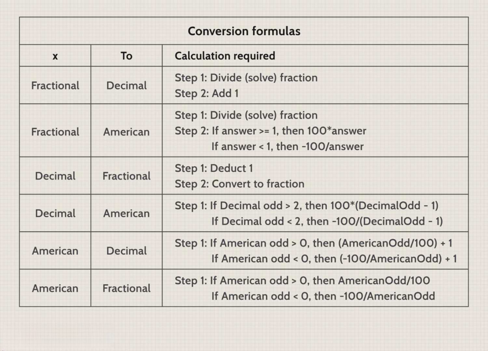

In a world where technology and mathematics have reshaped numerous industries, the gambling sector is no exception. The influence of mathematical principles and sophisticated algorithms in gambling is significant, primarily seen in the determination of betting odds and the application of algorithmic trading strategies. These advancements have transformed traditional betting practices, providing tools for more informed decision-making processes among bettors and traders.

Betting odds and their associated probabilities are central to the gambling landscape. Mathematical concepts such as probability theory are employed to estimate the likelihood of various outcomes, allowing bettors to make strategic decisions based on statistical evidence rather than mere chance. In gambling, probability formalizes the expected value of bets, offering a calculated approach to assessing potential risks and rewards.



Algorithmic strategies in gambling leverage advanced computational tools like machine learning and neural networks, analyzing vast datasets to identify patterns and trends. This computer-driven analysis enables enhanced predictions about sporting events or casino games, thereby refining the strategies employed by gamblers and traders to maximize their betting performances.

This guide provides a thorough exploration of these concepts, illustrating how cutting-edge algorithmic techniques intersect with traditional gambling frameworks. By bridging the gap between historical methodologies and technological advancements, we aim to illuminate the synergy between mathematics and technology in gambling, offering an in-depth understanding that enhances strategic developments in this evolving industry.

## Table of Contents

## Understanding Betting Odds

Betting odds are a fundamental component in the gambling industry, representing the probability or likelihood of a particular outcome occurring in an event. Understanding these odds is crucial for bettors as it allows them to assess the potential risk and reward associated with their wagers. There are three main types of betting odds—fractional, decimal, and moneyline (American)—each providing a different method of illustrating probabilities and potential returns.

Fractional odds, commonly used in the United Kingdom, are expressed as a ratio of the potential profit to the stake. For instance, odds of 5/1 suggest that for every unit staked, five units will be gained if the bet is successful. The formula to convert fractional odds to probability is:

$$
\text{Probability} = \frac{\text{Denominator}}{\text{Numerator} + \text{Denominator}}
$$

Using the 5/1 example, the implied probability is:

$$
\frac{1}{5 + 1} = \frac{1}{6} \approx 0.1667 \quad (\text{or } 16.67\%)
$$

Decimal odds, prevalent in Europe and Australia, simplify the conversion process by including both the stake and profit in a single figure. To calculate the probability from decimal odds, the formula is:

$$
\text{Probability} = \frac{1}{\text{Decimal Odds}}
$$

For example, decimal odds of 6.0 imply a probability of:

$$
\frac{1}{6.0} = 0.1667 \quad (\text{or } 16.67\%)
$$

Moneyline odds, favored in the United States, use positive and negative numbers to indicate potential returns. Positive moneyline odds reflect the potential profit from a $100 stake, while negative odds indicate how much must be staked to earn $100. To convert moneyline odds to probability:

- For positive odds (+x):

$$
\text{Probability} = \frac{100}{x + 100}
$$

- For negative odds (-y):

$$
\text{Probability} = \frac{y}{y + 100}
$$

For example, if the moneyline is +500, the implied probability is:

$$
\frac{100}{500 + 100} = \frac{100}{600} = \frac{1}{6} \approx 0.1667 \quad (\text{or } 16.67\%)
$$

Conversely, a moneyline of -200 suggests a probability of:

$$
\frac{200}{200 + 100} = \frac{200}{300} = \frac{2}{3} \approx 0.6667 \quad (\text{or } 66.67\%)
$$

Understanding the conversion between different types of odds and their respective probabilities is essential for identifying value bets. Value betting occurs when a bettor believes the actual probability of an outcome is higher than the bookmaker's implied probability, thus presenting a potentially profitable opportunity. Mastery of odds conversions and probability calculation is indispensable for gamblers seeking to make informed decisions and optimize their betting strategies.

## Probability and Gambling Mathematics

Probability theory is a cornerstone of gambling and serves as a mathematical tool to calculate the expected outcomes of bets and wagers. This involves understanding and quantifying the likelihood of various events occurring, thereby allowing bettors to assess potential risks and rewards. 

### Calculating Probabilities in Gambling

In its simplest form, probability is the measure of the likelihood that an event will occur. It is quantified as a number between 0 and 1, with 0 indicating impossibility and 1 indicating certainty. The probability $P$ of an event can be expressed as:

$$
P(E) = \frac{\text{Number of favorable outcomes}}{\text{Total number of possible outcomes}}
$$

For instance, when rolling a fair six-sided die, the probability of rolling a 4 is $\frac{1}{6}$, as there is one favorable outcome and six possible outcomes.

### Expected Value

One of the key concepts in gambling mathematics is the expected value (EV), which represents the average amount one can expect to win or lose per bet if the bets were repeated many times. The formula for expected value is:

$$
\text{EV} = \sum (P_i \times V_i)
$$

where $P_i$ is the probability of outcome $i$ and $V_i$ is the value associated with outcome $i$. Calculating the expected value helps gamblers determine whether a bet is likely to be profitable in the long run.

For example, if a game pays $10 for a win with a probability of $\frac{1}{4}$ and costs $2 to play, the expected value is calculated as:

$$
\text{EV} = \left( \frac{1}{4} \times 10 \right) + \left( \frac{3}{4} \times (-2) \right) = 2.5 - 1.5 = 1
$$

A positive expected value indicates a potentially profitable bet.

### Probability Distributions

Probability distributions, such as the binomial distribution and the normal distribution, are used by gamblers to model outcomes in games that are repeated multiple times or involve numerous variables. The binomial distribution, for example, can represent the number of successes in a series of independent and identically distributed Bernoulli trials, like flipping a coin multiple times.

### Strategic Decisions Using Mathematics

Professional gamblers and traders leverage mathematics to predict outcomes and make informed strategic decisions. They integrate complex mathematical models, including stochastic processes and Monte Carlo simulations, to assess and refine their strategies.

For instance, Monte Carlo simulations can simulate millions of random outcomes for a particular bet, providing a probability distribution of possible results. This allows bettors to quantify the odds of various outcomes and adjust their betting strategies accordingly.

```python
import random

def monte_carlo_simulation(num_trials, num_flips):
    success_count = 0
    for _ in range(num_trials):
        heads = sum(random.choice([0, 1]) for _ in range(num_flips))
        if heads > num_flips / 2:  # more heads than tails
            success_count += 1
    return success_count / num_trials

# Example: Run a simulation for flipping a coin 10 times, over 1,000,000 trials
probability_of_more_heads = monte_carlo_simulation(1000000, 10)
print(f"Probability of more heads than tails: {probability_of_more_heads}")
```

This Python script uses a simple Monte Carlo method to estimate the probability of getting more heads than tails when flipping a coin 10 times, illustrating how simulations can provide insights beyond basic probability calculations.

By applying these mathematical principles, individuals in the gambling industry can better manage risk and optimize their betting strategies, resulting in more informed and potentially profitable decision-making processes.

## Algorithmic Trading and Gambling

Algorithmic trading within the gambling industry involves utilizing mathematical models and computer algorithms to predict the outcomes of sporting events. This approach is aimed at improving prediction accuracy and maximizing profits for bettors by leveraging advanced technologies such as [machine learning](/wiki/machine-learning) and neural networks. 

Algorithms play a crucial role in processing vast datasets to uncover patterns and trends that may elude traditional human analysis. For example, these algorithms can analyze past performance metrics of sports teams, player [statistics](/wiki/bayesian-statistics), weather conditions, and even sentiment data from social media to provide more informed betting options. This extensive data analysis allows for betting strategies to be refined and optimized over time.

A common technique in [algorithmic trading](/wiki/algorithmic-trading) is regression analysis, which helps in identifying relationships between different variables. For instance, a multiple linear regression model might be used to predict the outcome of a football match based on historical performance data. The model can be represented mathematically as follows:

$$

Y = \beta_0 + \beta_1X_1 + \beta_2X_2 + \cdots + \beta_nX_n + \epsilon 
$$

where $Y$ is the predicted outcome, $\beta_0$ is the intercept, $\beta_1, \beta_2, \ldots, \beta_n$ are the coefficients for each variable $X_1, X_2, \ldots, X_n$, and $\epsilon$ is the error term.

Machine learning techniques, such as decision trees, support vector machines, or neural networks, further enhance prediction capabilities. Neural networks, particularly those involving [deep learning](/wiki/deep-learning), can model complex nonlinear interactions between input features, thus providing sophisticated ways to predict outcomes with high accuracy.

Despite the advanced capabilities of these technologies, algorithmic trading in gambling is not without its challenges. Dataset quality is paramount; inaccurate or insufficient data can lead to unreliable predictions. Overfitting, where a model is too complex and captures noise as if it were a signal, is another considerable risk that algorithm developers face. Additionally, the dynamic nature of sports events requires continuous adjustment and retraining of models to adapt to new data and circumstances.

In Python, implementing a simple betting algorithm might look something like this:

```python
import pandas as pd
from sklearn.model_selection import train_test_split
from sklearn.linear_model import LogisticRegression
from sklearn.metrics import accuracy_score

# Example feature and target datasets
data = pd.read_csv('sports_data.csv')
X = data.drop('outcome', axis=1)  # Features
y = data['outcome']  # Target

# Split the data
X_train, X_test, y_train, y_test = train_test_split(X, y, test_size=0.2, random_state=42)

# Initialize and train model
model = LogisticRegression()
model.fit(X_train, y_train)

# Predictions
predictions = model.predict(X_test)

# Model evaluation
accuracy = accuracy_score(y_test, predictions)
print(f'Model Accuracy: {accuracy:.2f}')
```

By integrating algorithmic strategies within gambling, bettors can gain a significant edge over traditional methods. Nevertheless, it remains essential to continuously evaluate these models and adjust for any changing dynamics in sports and betting markets to sustain profitability.

## Psychological Considerations in Gambling

Gambling involves not just mathematical precision but also psychological factors, which significantly affect decision making. Understanding human behavior, biases, and emotional triggers can enhance betting strategies and forecast outcomes. Psychological considerations play a crucial role in gambling, influencing not only how decisions are made but also the long-term success of betting strategies.

One of the key psychological aspects in gambling is the concept of biases. Cognitive biases, such as the Gambler’s Fallacy, occur when bettors erroneously believe that past events significantly affect future outcomes in purely random events. This fallacy might lead gamblers to believe that after a streak of losses, a win is due, which often results in increased and irrational betting. Such biases can lead to flawed decision-making if not recognized and corrected.

Another crucial [factor](/wiki/factor-investing) is the role of emotional triggers. Emotions such as excitement and fear can cloud judgment. For instance, a bettor experiencing fear of loss may avoid taking calculated risks, even when statistical analysis supports doing so. Conversely, overconfidence following a winning streak can result in negligence toward risk management, potentially increasing exposure to losses.

Behavioral economics provides insights into how these psychological elements affect gambling. Prospect theory, introduced by Daniel Kahneman and Amos Tversky, highlights how individuals perceive gains and losses asymmetrically. Gamblers might, therefore, irrationally avoid risk when facing potential gains but take excessive risks to avoid losses. Understanding these tendencies can help bettors adjust their strategies, promoting more rational decision-making.

Overcoming psychological challenges in gambling involves several strategies. Implementing self-regulation techniques and establishing pre-defined betting limits can help mitigate the effects of emotional decision-making. Additionally, maintaining a disciplined approach aligns with mathematical assessments, supporting more consistent outcomes. Bettors are encouraged to engage in periodic reflection and analysis of their betting patterns to identify potential biases.

This interplay between psychological elements and mathematical calculations often determines the success or failure of betting strategies. While mathematical models and algorithmic tools provide a significant advantage by offering analytical precision, integrating an awareness of psychological influences ensures that bettors can navigate the complexities of human behavior. This balanced approach combines statistical methodologies with behavioral understanding, fostering a comprehensive strategy that aims for sustainable success in gambling.

## Conclusion

The integration of gambling mathematics, betting odds, and algorithmic trading represents a compelling convergence of disciplines, emphasizing the synergy between mathematics, technology, and psychology. This amalgamation not only pushes the boundaries of traditional gambling but also paves the way for more informed and strategic decision-making processes. 

A thorough comprehension of mathematical probabilities and advanced algorithms undeniably enhances betting strategies. Algorithms, for instance, utilize statistical models to predict outcomes with higher precision. Employing Python, one could write a simple Monte Carlo simulation to estimate probabilities:

```python
import random

def monte_carlo_simulation(num_simulations, odds):
    wins = 0
    for _ in range(num_simulations):
        if random.random() < odds:
            wins += 1
    return wins / num_simulations

# Example: Running 10,000 simulations with a 0.4 probability
estimated_probability = monte_carlo_simulation(10000, 0.4)
print(f"Estimated Probability: {estimated_probability}")
```
While such tools are pivotal in advancing one's betting acumen, it is equally critical to acknowledge and address the psychological components influencing gambling behavior. Cognitive biases and emotional responses often skew decision-making, emphasizing the need for a balanced approach that merges human intuition with data-driven insights. 

Staying abreast of developments in algorithmic trading, from simple data analysis to complex machine learning models, provides a competitive advantage in an ever-evolving landscape. However, reliance solely on technology may overlook the subtleties of human judgment, underlining the importance of integrating personal insights with technological advancements. 

Ultimately, a holistic approach, incorporating both quantitative analysis and psychological consideration, offers the most comprehensive strategy. This dual perspective not only maximizes potential returns but also mitigates risks, ensuring that bettors and traders operate with well-rounded strategies in a complex and dynamic environment.

## References & Further Reading

[1]: Bergstra, J., Bardenet, R., Bengio, Y., & Kégl, B. (2011). ["Algorithms for Hyper-Parameter Optimization."](https://proceedings.neurips.cc/paper/2011/file/86e8f7ab32cfd12577bc2619bc635690-Paper.pdf) Advances in Neural Information Processing Systems 24.

[2]: ["Advances in Financial Machine Learning"](https://www.amazon.com/Advances-Financial-Machine-Learning-Marcos/dp/1119482089) by Marcos Lopez de Prado

[3]: ["Probability Theory: The Logic of Science"](https://www.amazon.com/Probability-Theory-Science-T-Jaynes/dp/0521592712) by E. T. Jaynes

[4]: ["Evidence-Based Technical Analysis: Applying the Scientific Method and Statistical Inference to Trading Signals"](https://www.amazon.com/Evidence-Based-Technical-Analysis-Scientific-Statistical/dp/0470008741) by David Aronson

[5]: ["Quantitative Trading: How to Build Your Own Algorithmic Trading Business"](https://books.google.com/books/about/Quantitative_Trading.html?id=j70yEAAAQBAJ) by Ernest P. Chan

[6]: ["Betting Systems: Professional Betting Systems for Horse Racing and..."](https://betandbeat.com/betting/horse-racing/systems/) by Alex Hayward

[7]: ["Superforecasting: The Art and Science of Prediction"](https://www.amazon.com/Superforecasting-Science-Prediction-Philip-Tetlock/dp/0804136718) by Philip E. Tetlock and Dan M. Gardner