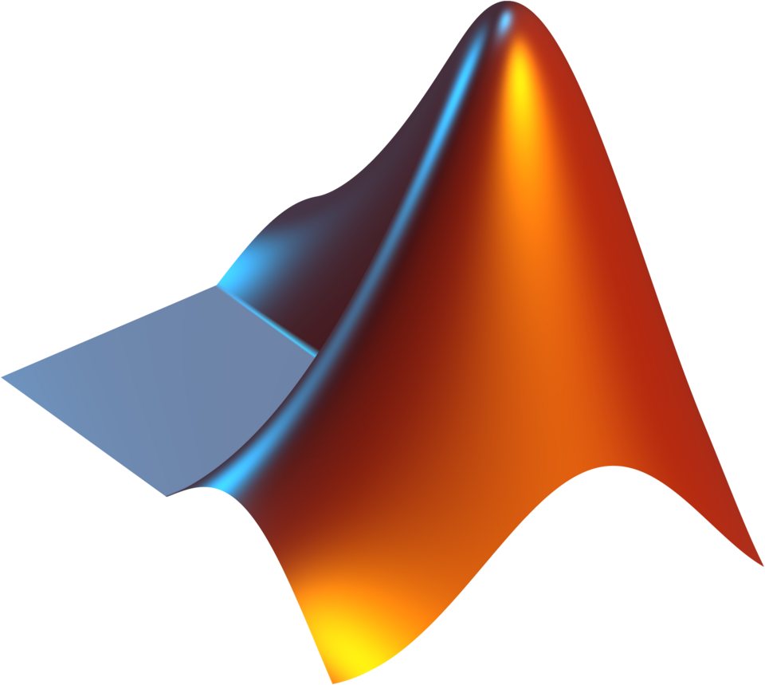

## Table of Contents

## What is MATLAB and what is it used for?

MATLAB is a computer program that helps people do math and science work easily. It is made by a company called MathWorks. People use MATLAB because it has special tools that make it simple to solve problems, draw graphs, and analyze data. You can write your own little programs in MATLAB, called scripts, to do tasks over and over again without starting from scratch each time.

MATLAB is used by many different kinds of people, like students, teachers, and engineers. It's popular in areas like engineering, finance, and science because it helps them work with numbers and data quickly. For example, an engineer might use MATLAB to design a new car part or to see how a bridge will hold up under different conditions. It's also used in schools to teach students about math and how to solve real-world problems.

## How do I install MATLAB on my computer?

To install MATLAB on your computer, first you need to go to the MathWorks website. Look for a button or link that says "Download" or "Get MATLAB". Click on it and you will need to sign in with your MathWorks account or create a new one if you don't have one yet. After signing in, you will see options to download MATLAB. Choose the version that matches your computer's operating system, like Windows, Mac, or Linux. Click on the download link, and a file will start downloading to your computer.

Once the file is downloaded, find it on your computer and double-click it to start the installation. Follow the instructions that appear on the screen. You will need to enter your license key, which you can get from your MathWorks account. After entering the key, the installer will ask you where you want to install MATLAB on your computer. Choose a location and let the installation finish. When it's done, you can open MATLAB and start using it.

## What are the basic data types in MATLAB?

In MATLAB, there are several basic data types that you can use. The most common one is the numeric type, which includes integers and floating-point numbers. Integers are whole numbers like 1, 2, or 3, while floating-point numbers have decimal points, like 3.14 or 0.5. You can also use complex numbers, which have a real part and an imaginary part, like 2 + 3i. Another important type is the character type, which is used for text. Each character is stored as a single element in a character array, and you can create strings by putting characters together.

MATLAB also has logical data types, which can only be true or false. These are useful for making decisions in your code, like if something is bigger than something else. Arrays and matrices are another key part of MATLAB. They can hold numbers, characters, or logical values, and they are organized in rows and columns. You can do math with arrays and matrices easily, which is why MATLAB is so popular for scientific and engineering work. Lastly, MATLAB has cell arrays, which can store different types of data in one place, like numbers and text together.

## How do I perform basic operations like addition and multiplication in MATLAB?

In MATLAB, you can do simple math like adding numbers together or multiplying them. To add two numbers, you just type the numbers with a plus sign between them, like this: `3 + 5`. When you press enter, MATLAB will show you the answer, which in this case would be `8`. For multiplication, you use the asterisk `*` instead of the plus sign. So if you want to multiply `4` by `6`, you would type `4 * 6` and MATLAB would give you `24`.

You can also do these operations with variables. If you want to add two numbers and save the result, you can use something called a variable. For example, if you type `a = 7` and then `b = 9`, you can add them by typing `c = a + b`. MATLAB will do the math and save the answer `16` in the variable `c`. The same goes for multiplication. If you type `d = 3` and `e = 8`, you can multiply them by typing `f = d * e`, and MATLAB will save `24` in the variable `f`. This way, you can use the results later in your work.

## What are matrices and how do I create them in MATLAB?

Matrices are like tables of numbers that are organized in rows and columns. In MATLAB, you can use matrices to do math with many numbers at once. This is really helpful for things like solving equations, working with data, or making graphs. A matrix can be as small as just one number or as big as you need it to be.

To create a matrix in MATLAB, you type numbers inside square brackets `[]`. You separate the numbers in a row with spaces or commas, and you use a semicolon `;` to start a new row. For example, if you want a matrix with the numbers 1, 2, 3 in the first row and 4, 5, 6 in the second row, you would type `[1 2 3; 4 5 6]`. When you press enter, MATLAB will show you the matrix you made. You can also use variables to make matrices, like if you type `A = [1 2 3; 4 5 6]`, MATLAB will save that matrix in the variable `A` so you can use it later.

## How can I use MATLAB for plotting graphs and charts?

In MATLAB, you can make different kinds of graphs and charts easily. To start, you need some numbers to plot. You can use a matrix or a list of numbers. For example, if you have a list of numbers like `x = [1, 2, 3, 4, 5]` and another list `y = [2, 4, 6, 8, 10]`, you can make a simple line graph by typing `plot(x, y)`. This command tells MATLAB to draw a line that connects the points where `x` and `y` meet. You can change the color or style of the line by adding things like `plot(x, y, 'r--')` for a red dashed line.

MATLAB can also make other kinds of charts, like bar charts or scatter plots. For a bar chart, you can use the `bar` function. If you type `bar(x, y)`, MATLAB will make a bar chart with the values of `x` on the bottom and the heights of the bars coming from `y`. For a scatter plot, which shows each point as a dot, you can use `scatter(x, y)`. This is useful when you want to see if there's a pattern between `x` and `y`. You can make your graphs look nicer by adding titles, labels, and legends with commands like `title('My Graph')`, `xlabel('X-axis')`, and `ylabel('Y-axis')`.

## What are functions in MATLAB and how do I define them?

Functions in MATLAB are like little programs that you can make to do specific jobs. They help you do the same thing over and over again without writing the same code each time. You can think of a function like a recipe that takes some ingredients, does something with them, and then gives you a result. In MATLAB, you give a function a name and tell it what to do with the information it gets. This makes your work easier because you can use the function whenever you need it, and it will always do the same thing.

To define a function in MATLAB, you start by writing the word `function` followed by the name you want to give it, and then you tell it what it should do. For example, if you want to make a function that adds two numbers, you might start with `function result = addNumbers(a, b)`. This line says that you're making a function called `addNumbers` that takes two numbers `a` and `b`, and it will give you a result. Then, you write the code inside the function, like `result = a + b;`. After that, you end the function. Now, whenever you want to add two numbers, you can just type `addNumbers(3, 4)` and MATLAB will give you `7`.

## How do I use control flow statements like if-else and loops in MATLAB?

In MATLAB, you can use if-else statements to make decisions in your code. An if-else statement checks if something is true or false and then does different things based on that. For example, if you want to check if a number is bigger than 10, you can write `if x > 10`. If `x` is bigger than 10, MATLAB will do whatever you tell it to do next, like `disp('x is bigger than 10')`. If `x` is not bigger than 10, you can use `else` to tell MATLAB what to do instead, like `else disp('x is not bigger than 10')`. This way, your code can do different things depending on what's true.

Loops in MATLAB let you do the same thing over and over again. There are two main kinds of loops: for loops and while loops. A for loop is good when you know how many times you want to do something. For example, if you want to print the numbers from 1 to 5, you can write `for i = 1:5, disp(i), end`. This will make MATLAB print each number from 1 to 5. A while loop is good when you want to keep doing something until a certain thing is true. For example, if you want to keep adding 1 to a number until it's bigger than 10, you can write `while x <= 10, x = x + 1, end`. This will keep adding 1 to `x` until it's bigger than 10, and then it will stop.

## What are toolboxes in MATLAB and how do they enhance its functionality?

Toolboxes in MATLAB are special sets of tools that you can add to the program to help you do specific kinds of work. They are like extra helpers that make MATLAB even better at certain jobs. For example, there's a toolbox for working with pictures, called the Image Processing Toolbox, and another for building control systems, called the Control System Toolbox. Each toolbox has its own set of functions and commands that are made just for that kind of work, so you don't have to start from scratch when you're trying to do something new.

Adding toolboxes to MATLAB makes it a lot more powerful because it lets you do things you couldn't do before. If you're working on a project that needs special math or data analysis, you can find a toolbox that has the right tools for the job. This saves you time and makes your work easier because you can use the ready-made functions in the toolbox instead of writing everything yourself. So, whether you're studying the stars, designing a new car, or analyzing data, there's probably a toolbox that can help you get the job done faster and better.

## How can I optimize my MATLAB code for better performance?

To make your MATLAB code run faster and use less memory, you can do a few things. First, try to use built-in MATLAB functions as much as you can. These functions are made to work quickly and are often faster than writing your own code to do the same thing. Also, pre-allocate your arrays before you start filling them with numbers. This means telling MATLAB how big your array will be before you start, which helps it use memory better. Another tip is to use vectorized operations instead of loops. Vectorized operations let you do math on whole arrays at once, which is usually faster than going through each number one by one in a loop.

Another way to speed up your MATLAB code is by using the right data types. For example, if you're working with whole numbers, use integers instead of floating-point numbers because they take up less space and can be processed faster. You can also turn off some MATLAB features that you don't need, like the profiler or the debugger, when you're running your code to make it run quicker. Lastly, if your code is taking a long time to run, you might want to try running it on a computer with more memory or a faster processor, or even use MATLAB's parallel computing toolbox to split the work across multiple processors.

## What are some advanced numerical methods available in MATLAB?

MATLAB has many advanced numerical methods that help you solve hard math problems. One of these methods is called the Finite Element Method, which is used a lot in engineering to see how things like bridges or car parts will behave under different conditions. MATLAB has special tools in its toolboxes, like the Partial Differential Equation Toolbox, that make it easy to use the Finite Element Method. Another method is called the Fast Fourier Transform, which is great for working with signals and sounds. It helps you break down complicated signals into simpler parts, and MATLAB has functions that make this process fast and easy.

Another useful method is solving differential equations, which are used to model how things change over time. MATLAB's ODE (Ordinary Differential Equations) Suite has different solvers that can handle all sorts of differential equations, from simple ones to very complex ones. These solvers are made to be fast and accurate, so you can trust the answers you get. Also, MATLAB has tools for optimization, which means finding the best solution to a problem. The Optimization Toolbox has functions that can help you find the smallest or largest value of a function, which is useful in many areas like finance or engineering design.

## How can I interface MATLAB with other programming languages and systems?

You can connect MATLAB with other programming languages and systems to make it work better with other tools you use. One way to do this is by using MATLAB's MEX files, which let you write parts of your program in languages like C or C++. This can make your code run faster because these languages are good at working quickly with numbers. You can also use MATLAB's built-in functions to talk to other programs. For example, MATLAB can send and receive data to and from Excel, which is helpful if you need to work with spreadsheets.

Another way to link MATLAB with other systems is by using the MATLAB Engine API. This lets you run MATLAB code from other languages like Python or Java. It's like having MATLAB as a helper that you can call when you need it. Also, MATLAB can work with different kinds of databases and web services. This means you can pull data from the internet or a database into MATLAB, do your work, and then send the results back. By connecting MATLAB with other languages and systems, you can use the best tools for each part of your project.

## What is Understanding Algorithmic Trading?

Algorithmic trading uses computer algorithms to execute trades systematically based on pre-defined criteria. By automating the trading process, algorithmic systems aim to reduce transaction costs and execute orders at optimal prices and times, thereby increasing the efficiency and profitability of trading operations.

One of the primary advantages of [algorithmic trading](/wiki/algorithmic-trading) is its ability to process vast amounts of data at high speed. This allows for the rapid identification of trading opportunities that would be impossible to detect using manual methods. Automated systems can scan multiple markets and securities, providing traders with a comprehensive view of the trading landscape.

Mathematical models and technical indicators play a crucial role in algorithmic trading. These tools help identify profitable trading opportunities by analyzing historical data and predicting future price movements. Commonly used indicators and models include moving averages, which smooth out price data to identify trends over time, and neural networks, which can model complex patterns in data thanks to their ability to learn and adapt.

Moving averages, for instance, can be implemented using a simple mathematical formula, where the n-period simple moving average (SMA) is calculated as:

$$
\text{SMA}_n = \frac{1}{n} \sum_{i=0}^{n-1} \text{Price}_i
$$

This formula helps in smoothing out short-term fluctuations and highlighting longer-term trends, making it a popular tool among traders.

Neural networks, on the other hand, mimic the human brain's structure to process information hierarchically. They consist of layers of interconnected nodes (or neurons), where each node processes input and passes the output to the next layer. This structure enables them to identify complex, nonlinear relationships in the data, proving valuable in predicting price movements and developing trading strategies.

Traders may also incorporate other sophisticated models such as regression analysis to forecast future prices based on historical data relationships. Additionally, optimization algorithms can be used to enhance the performance of trade execution strategies.

Overall, algorithmic trading combines the speed and precision of computer algorithms with advanced mathematical models to optimize trading strategies, offering a significant advantage in increasingly competitive financial markets.

## References & Further Reading

[1]: Bergstra, J., Bardenet, R., Bengio, Y., & Kégl, B. (2011). ["Algorithms for Hyper-Parameter Optimization."](https://papers.nips.cc/paper/4443-algorithms-for-hyper-parameter-optimization) Advances in Neural Information Processing Systems 24.

[2]: ["Advances in Financial Machine Learning"](https://www.amazon.com/Advances-Financial-Machine-Learning-Marcos/dp/1119482089) by Marcos Lopez de Prado

[3]: ["Evidence-Based Technical Analysis: Applying the Scientific Method and Statistical Inference to Trading Signals"](https://www.amazon.com/Evidence-Based-Technical-Analysis-Scientific-Statistical/dp/0470008741) by David Aronson

[4]: ["Machine Learning for Algorithmic Trading"](https://github.com/stefan-jansen/machine-learning-for-trading) by Stefan Jansen

[5]: ["Quantitative Trading: How to Build Your Own Algorithmic Trading Business"](https://books.google.com/books/about/Quantitative_Trading.html?id=j70yEAAAQBAJ) by Ernest P. Chan