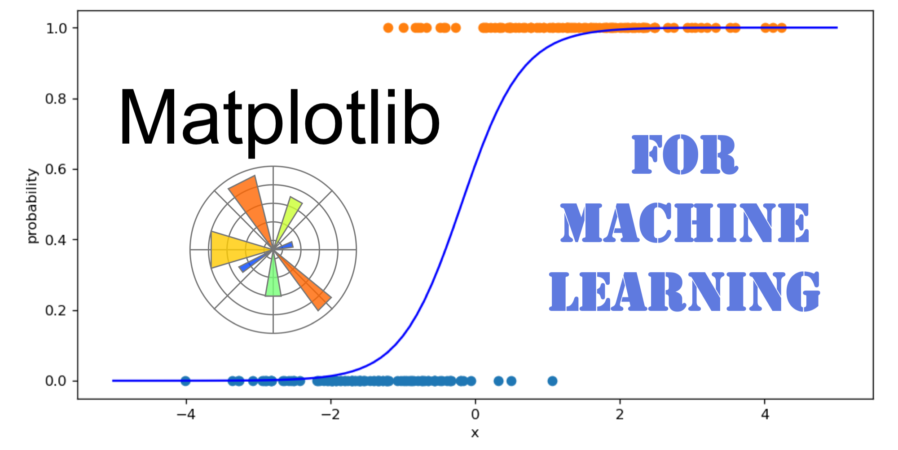

## Table of Contents

## What is Matplotlib and why is it used in machine learning?

Matplotlib is a popular plotting library for the Python programming language. It is used to create a wide variety of charts, graphs, and plots, making it easier for people to understand and analyze data visually. Think of it as a tool that helps you draw pictures of your data, which can be numbers, trends, or any other kind of information you want to study.

In machine learning, Matplotlib is very important because it helps data scientists and machine learning engineers to see what their data looks like before and after they work on it. For example, they can use Matplotlib to plot the data points and see if there are any patterns or trends. This can help them make better models that predict things more accurately. By visualizing the data, they can also check if their machine learning model is working well and make improvements if needed.

## How do you install Matplotlib for use in a machine learning project?

To install Matplotlib for your machine learning project, you need to use a tool called pip, which is a package installer for Python. Open your command line or terminal, and type in the command `pip install matplotlib`. This command will download and set up Matplotlib on your computer so you can use it in your projects. It's a simple process and usually takes just a few moments.

Once Matplotlib is installed, you can start using it in your Python scripts. To check if it's working, you can open a Python file or an interactive Python environment like Jupyter Notebook, and write a simple line of code to create a basic plot. For example, you can use the following code to create a simple line plot:

```python
import matplotlib.pyplot as plt
import numpy as np

x = np.linspace(0, 10, 100)
y = np.sin(x)

plt.plot(x, y)
plt.title('Simple Sine Wave')
plt.xlabel('x')
plt.ylabel('sin(x)')
plt.show()
```

This code will create a plot of a sine wave, showing that Matplotlib is correctly installed and ready for use in your [machine learning](/wiki/machine-learning) projects.

## What are the basic plotting functions in Matplotlib that are useful for data visualization in machine learning?

In machine learning, Matplotlib offers several basic plotting functions that help visualize data effectively. One of the most commonly used functions is `plt.plot()`, which allows you to create line plots. This is useful for showing trends over time or across a range of values. For example, you might use `plt.plot()` to visualize how a model's performance changes as you adjust its parameters. Another important function is `plt.scatter()`, which creates scatter plots. These are great for showing the relationship between two variables, helping you spot patterns or clusters in your data.

Another useful function is `plt.hist()`, which creates histograms. Histograms are helpful for understanding the distribution of a single variable. For instance, you can use a histogram to see how your data is spread out, which can guide you in choosing the right model or preprocessing steps. Additionally, `plt.boxplot()` is used to create box plots, which are excellent for summarizing the distribution of data through its quartiles and identifying outliers. This can be crucial when you need to understand the spread and central tendency of your dataset before feeding it into a machine learning model.

Lastly, `plt.imshow()` is essential for visualizing images or heatmaps. In machine learning, especially in fields like computer vision, you might need to see what your model is learning from image data. `plt.imshow()` allows you to display images and understand how different filters or layers in a [neural network](/wiki/neural-network) are processing them. Here's a simple example of how you might use these functions:

```python
import matplotlib.pyplot as plt
import numpy as np

# Line plot
x = np.linspace(0, 10, 100)
y = np.sin(x)
plt.plot(x, y)
plt.title('Simple Sine Wave')
plt.xlabel('x')
plt.ylabel('sin(x)')
plt.show()

# Scatter plot
x = np.random.rand(50)
y = np.random.rand(50)
plt.scatter(x, y)
plt.title('Random Scatter Plot')
plt.xlabel('x')
plt.ylabel('y')
plt.show()

# Histogram
data = np.random.randn(1000)
plt.hist(data, bins=30)
plt.title('Histogram of Random Data')
plt.xlabel('Value')
plt.ylabel('Frequency')
plt.show()

# Box plot
data = [np.random.normal(0, std, size=100) for std in range(1, 4)]
plt.boxplot(data)
plt.title('Box Plot of Different Distributions')
plt.xlabel('Distribution')
plt.ylabel('Value')
plt.show()

# Image plot
image = np.random.rand(10, 10)
plt.imshow(image, cmap='viridis')
plt.title('Random Image')
plt.colorbar()
plt.show()
```

These examples demonstrate how these basic plotting functions can be used to create different types of visualizations, each serving a specific purpose in understanding and analyzing data for machine learning projects.

## How can Matplotlib be used to visualize data distributions in machine learning datasets?

Matplotlib can be used to visualize data distributions in machine learning datasets by creating histograms and box plots. A histogram shows how often different values appear in your data, helping you see the shape of your data's distribution. For example, if you have a dataset of house prices, a histogram can show you if most houses are priced around a certain value, or if the prices are spread out evenly. This can be important for deciding how to preprocess your data or which type of machine learning model to use. You can create a histogram using the `plt.hist()` function in Matplotlib.

Another way to visualize data distributions is by using a box plot, which shows the median, quartiles, and any outliers in your data. This can help you understand the spread of your data and identify any unusual values that might affect your machine learning model. For instance, if you're looking at exam scores, a box plot can show you the range of scores and highlight any students who scored much higher or lower than the rest. You can create a box plot using the `plt.boxplot()` function in Matplotlib. Both histograms and box plots are powerful tools for understanding the characteristics of your dataset, which can lead to better machine learning outcomes.

Here's a simple example of how you might use these functions to visualize a dataset of exam scores:

```python
import matplotlib.pyplot as plt
import numpy as np

# Generate some example data
exam_scores = np.random.normal(75, 10, 1000)  # Mean of 75, standard deviation of 10

# Create a histogram
plt.figure(figsize=(10, 5))
plt.hist(exam_scores, bins=30, edgecolor='black')
plt.title('Distribution of Exam Scores')
plt.xlabel('Score')
plt.ylabel('Frequency')
plt.show()

# Create a box plot
plt.figure(figsize=(10, 5))
plt.boxplot(exam_scores)
plt.title('Box Plot of Exam Scores')
plt.ylabel('Score')
plt.show()
```

This code will create a histogram and a box plot of the exam scores, helping you visualize the distribution of the data and understand its key characteristics.

## What types of plots are most effective for displaying machine learning model performance metrics?

When displaying machine learning model performance metrics, line plots are often the most effective because they can clearly show how a model's performance changes over time or across different settings. For example, you might use a line plot to show how the accuracy of a model improves as it trains over more epochs. This can be done using `plt.plot()` in Matplotlib. By plotting the accuracy or loss on the y-axis and the number of epochs on the x-axis, you can easily see trends and decide if the model is learning well or if it needs more training.

Another useful type of plot for machine learning metrics is a bar plot, which is great for comparing the performance of different models or different versions of the same model. You can use `plt.bar()` to create a bar plot that shows the accuracy or other metrics for each model side by side. This makes it easy to see which model performs the best and helps in choosing the right one for your task. For example, if you have three different models, a bar plot can quickly show you which one has the highest accuracy.

Lastly, a confusion matrix plot is very helpful for understanding the performance of classification models. You can use `plt.imshow()` to create a heatmap that shows how often the model correctly predicts each class and where it makes mistakes. This plot helps you see if the model is good at distinguishing between different classes or if it tends to confuse certain classes with others. For example, if you're classifying images of dogs and cats, a confusion matrix can show you if the model often mistakes dogs for cats or if it's doing well at telling them apart.

## How can you customize Matplotlib plots to enhance the visualization of machine learning results?

Customizing Matplotlib plots can make the visualization of machine learning results clearer and more insightful. You can change the colors of lines and markers in your plots to make different models or data sets stand out. For example, if you are comparing the accuracy of two models over time, you might use different colors for each model's line to see which one performs better. You can also add labels to your plots to make them easier to understand. For instance, you can label the x-axis as "Epochs" and the y-axis as "Accuracy" when showing how a model improves over time. Adding a legend can also help, especially when you have multiple lines or bars on the same plot, as it tells you what each color or shape represents.

You can also adjust the style of your plots to make them look nicer. Matplotlib has different styles you can choose from, like 'ggplot' or 'seaborn', which can make your plots look more professional. If you want to focus on certain parts of your data, you can zoom in on specific areas of the plot by setting the axis limits. For example, if you are looking at the performance of a model over the last few epochs, you can set the x-axis to show only those epochs. Adding grid lines can also help you read the plot more easily, and you can change the size of your plot to make sure all the details are visible. Here's a simple example of how you might customize a plot to show the accuracy of a model over time:

```python
import matplotlib.pyplot as plt
import numpy as np

# Example data
epochs = np.arange(1, 101)
accuracy = 1 - np.exp(-epochs / 20)  # A simple model accuracy curve

# Create the plot
plt.figure(figsize=(10, 6))  # Set plot size
plt.plot(epochs, accuracy, color='blue', linewidth=2, label='Model Accuracy')  # Customize line
plt.title('Model Accuracy Over Epochs', fontsize=16)  # Add title
plt.xlabel('Epochs', fontsize=12)  # Label x-axis
plt.ylabel('Accuracy', fontsize=12)  # Label y-axis
plt.legend(fontsize=10)  # Add legend
plt.grid(True, linestyle='--', alpha=0.7)  # Add grid lines
plt.xlim(0, 100)  # Set x-axis limits
plt.ylim(0, 1)  # Set y-axis limits

# Use a different style
plt.style.use('seaborn')

plt.show()
```

This code shows how you can customize a plot to make the results of a machine learning model easier to understand and more visually appealing.

## How do you use Matplotlib to create interactive plots for exploring machine learning data?

Matplotlib itself doesn't support creating interactive plots out of the box, but you can use it together with other tools like Jupyter Notebooks to make your plots interactive. In Jupyter, you can use the `%matplotlib notebook` magic command to enable interactive plots. Once you do this, you can zoom in and out of your plots, pan around, and even save the plot directly from the notebook. This is very helpful for exploring machine learning data because you can look closely at different parts of your data and see patterns or unusual points more easily.

Here's an example of how you might create an interactive plot in a Jupyter Notebook to explore a dataset of exam scores. First, you'll need to run the magic command to enable interactivity. Then, you can create a scatter plot of the exam scores and use the interactive features to explore the data. For example, you might zoom in on a specific range of scores to see if there are any interesting patterns or outliers.

```python
%matplotlib notebook
import matplotlib.pyplot as plt
import numpy as np

# Generate some example data
exam_scores = np.random.normal(75, 10, 1000)  # Mean of 75, standard deviation of 10

# Create an interactive scatter plot
plt.figure()
plt.scatter(range(len(exam_scores)), exam_scores)
plt.title('Interactive Scatter Plot of Exam Scores')
plt.xlabel('Student Number')
plt.ylabel('Score')
plt.show()
```

This code will create an interactive scatter plot where you can zoom in, pan, and explore the exam scores data in detail, helping you understand the distribution and any interesting features of your dataset.

## What are some advanced Matplotlib techniques for visualizing high-dimensional data in machine learning?

When working with high-dimensional data in machine learning, one advanced technique in Matplotlib is to use dimensionality reduction methods like PCA (Principal Component Analysis) to visualize the data in a lower-dimensional space. For example, you might use PCA to reduce your data from many dimensions down to just two or three dimensions. This makes it possible to plot the data using scatter plots or other visualizations. By doing this, you can see patterns or clusters in the data that might not be obvious in the original high-dimensional space. You can use Matplotlib's `plt.scatter()` function to plot the first two principal components, helping you understand how different data points relate to each other.

Another technique is to use heatmaps to visualize the relationships between different features in your high-dimensional data. A heatmap can show you how strongly different features are correlated with each other, which is useful for understanding the structure of your data. You can create a heatmap using Matplotlib's `plt.imshow()` function, where the color of each cell represents the strength of the correlation between two features. This can help you identify which features might be important for your machine learning model and how they interact with each other. For example, if you have a dataset with many features, a heatmap can quickly show you which features tend to increase or decrease together, guiding your feature selection and model building process.

Here's an example of how you might use these techniques to visualize high-dimensional data:

```python
import matplotlib.pyplot as plt
import numpy as np
from sklearn.decomposition import PCA
import seaborn as sns

# Generate some high-dimensional data
np.random.seed(0)
X = np.random.randn(100, 10)

# PCA for dimensionality reduction
pca = PCA(n_components=2)
X_pca = pca.fit_transform(X)

# Scatter plot of the first two principal components
plt.figure(figsize=(10, 6))
plt.scatter(X_pca[:, 0], X_pca[:, 1])
plt.title('PCA of High-Dimensional Data')
plt.xlabel('First Principal Component')
plt.ylabel('Second Principal Component')
plt.show()

# Heatmap of the correlation matrix
correlation_matrix = np.corrcoef(X.T)
plt.figure(figsize=(10, 8))
sns.heatmap(correlation_matrix, annot=True, cmap='coolwarm')
plt.title('Correlation Heatmap of Features')
plt.show()
```

This code demonstrates how to use PCA to reduce the dimensionality of your data and create a scatter plot of the first two principal components, as well as how to use a heatmap to visualize the correlations between different features in your dataset.

## How can Matplotlib be integrated with other Python libraries like scikit-learn for machine learning workflows?

Matplotlib can be easily integrated with other Python libraries like scikit-learn to enhance machine learning workflows. For example, after training a model with scikit-learn, you can use Matplotlib to plot the model's performance metrics, such as accuracy or loss over time. This helps you understand how well your model is learning and if it's improving with more data. You might also use Matplotlib to visualize the decision boundaries of a classifier, which can show you how the model is making predictions and help you spot any areas where it might be making mistakes.

Another way to integrate Matplotlib with scikit-learn is by visualizing the results of dimensionality reduction techniques like PCA. You can use scikit-learn to reduce your high-dimensional data to two or three dimensions, and then use Matplotlib to create scatter plots of the transformed data. This can help you see patterns or clusters in your data that might not be obvious in the original high-dimensional space. For example, if you're working with a dataset of images, you might use PCA to reduce the image data to two dimensions and then plot the results to see if similar images group together.

Here's a simple example of how you might integrate Matplotlib with scikit-learn to visualize the performance of a model and the results of PCA:

```python
import matplotlib.pyplot as plt
import numpy as np
from sklearn.datasets import make_classification
from sklearn.model_selection import train_test_split
from sklearn.linear_model import LogisticRegression
from sklearn.decomposition import PCA

# Generate some data and train a model
X, y = make_classification(n_samples=1000, n_features=20, n_classes=2, random_state=42)
X_train, X_test, y_train, y_test = train_test_split(X, y, test_size=0.2, random_state=42)
model = LogisticRegression()
model.fit(X_train, y_train)

# Plot the model's accuracy over time
plt.figure(figsize=(10, 6))
plt.plot(model.n_iter_, model.score(X_test, y_test), label='Test Accuracy')
plt.plot(model.n_iter_, model.score(X_train, y_train), label='Train Accuracy')
plt.title('Model Accuracy Over Iterations')
plt.xlabel('Iterations')
plt.ylabel('Accuracy')
plt.legend()
plt.show()

# Use PCA to reduce dimensionality and plot the results
pca = PCA(n_components=2)
X_pca = pca.fit_transform(X)

plt.figure(figsize=(10, 6))
scatter = plt.scatter(X_pca[:, 0], X_pca[:, 1], c=y, cmap='viridis')
plt.title('PCA of High-Dimensional Data')
plt.xlabel('First Principal Component')
plt.ylabel('Second Principal Component')
plt.colorbar(scatter)
plt.show()
```

This code shows how you can use Matplotlib to visualize the performance of a logistic regression model trained with scikit-learn, as well as how to use PCA to reduce the dimensionality of your data and plot the results.

## What are best practices for using Matplotlib to communicate machine learning insights effectively?

When using Matplotlib to communicate machine learning insights, it's important to keep your plots simple and clear. Choose the right type of plot for your data, like a line plot for showing how a model's accuracy changes over time, or a scatter plot for showing relationships between two variables. Use colors and labels to make your plots easy to understand. For example, if you're comparing the performance of different models, use different colors for each model's line and add a legend to explain what each color means. This helps your audience quickly see which model is doing better.

Also, make sure your plots tell a story. Start with a title that explains what the plot is about, and use labels on the axes to show what each axis represents. If you're showing how a model's performance improves over time, label the x-axis as "Epochs" and the y-axis as "Accuracy". You can also add annotations to highlight important points, like the point where the model's performance starts to level off. This way, your audience can see the key insights at a glance, making your machine learning results more understandable and actionable.

Here's a simple example of how you might use Matplotlib to create a clear and informative plot:

```python
import matplotlib.pyplot as plt
import numpy as np

# Example data
epochs = np.arange(1, 101)
accuracy = 1 - np.exp(-epochs / 20)  # A simple model accuracy curve

# Create the plot
plt.figure(figsize=(10, 6))
plt.plot(epochs, accuracy, color='blue', linewidth=2)
plt.title('Model Accuracy Over Epochs', fontsize=16)
plt.xlabel('Epochs', fontsize=12)
plt.ylabel('Accuracy', fontsize=12)
plt.grid(True, linestyle='--', alpha=0.7)
plt.xlim(0, 100)
plt.ylim(0, 1)

# Add an annotation to highlight a key point
plt.annotate('Point of Diminishing Returns', xy=(50, 0.9), xytext=(60, 0.8),
             arrowprops=dict(facecolor='black', shrink=0.05))

plt.show()
```

This code shows how to create a plot that clearly communicates how a model's accuracy changes over time, with a title, labeled axes, and an annotation to highlight an important insight.

## How can you automate the generation of Matplotlib visualizations in a machine learning pipeline?

To automate the generation of Matplotlib visualizations in a machine learning pipeline, you can write a Python script that processes your data, trains your model, and creates the plots all in one go. You might use libraries like scikit-learn for training the model and pandas for handling the data. Once you have your results, you can use Matplotlib to create plots that show how well your model is doing. For example, you might plot the accuracy of your model over time or show how different features in your data relate to each other. By putting all these steps into a single script, you can run it whenever you have new data, and it will automatically create the visualizations you need.

Here's a simple example of how you might automate this process:

```python
import matplotlib.pyplot as plt
import numpy as np
from sklearn.datasets import make_classification
from sklearn.model_selection import train_test_split
from sklearn.linear_model import LogisticRegression

# Generate some data and train a model
X, y = make_classification(n_samples=1000, n_features=20, n_classes=2, random_state=42)
X_train, X_test, y_train, y_test = train_test_split(X, y, test_size=0.2, random_state=42)
model = LogisticRegression()
model.fit(X_train, y_train)

# Plot the model's accuracy over time
plt.figure(figsize=(10, 6))
plt.plot(model.n_iter_, model.score(X_test, y_test), label='Test Accuracy')
plt.plot(model.n_iter_, model.score(X_train, y_train), label='Train Accuracy')
plt.title('Model Accuracy Over Iterations')
plt.xlabel('Iterations')
plt.ylabel('Accuracy')
plt.legend()
plt.savefig('model_accuracy.png')  # Save the plot
plt.close()

# Use PCA to reduce dimensionality and plot the results
from sklearn.decomposition import PCA
pca = PCA(n_components=2)
X_pca = pca.fit_transform(X)

plt.figure(figsize=(10, 6))
scatter = plt.scatter(X_pca[:, 0], X_pca[:, 1], c=y, cmap='viridis')
plt.title('PCA of High-Dimensional Data')
plt.xlabel('First Principal Component')
plt.ylabel('Second Principal Component')
plt.colorbar(scatter)
plt.savefig('pca_plot.png')  # Save the plot
plt.close()
```

This script shows how you can automate the process of training a model and creating visualizations. It uses scikit-learn to generate data, train a logistic regression model, and then uses Matplotlib to plot the model's accuracy over time and a PCA plot of the data. By saving the plots as PNG files, you can easily include them in reports or share them with others. This way, every time you run the script, it will automatically update your visualizations with the latest results.

## What are some common pitfalls and how can they be avoided when using Matplotlib for machine learning visualizations?

One common pitfall when using Matplotlib for machine learning visualizations is creating plots that are too cluttered or confusing. This can happen if you try to show too much information on one plot, like using too many colors, lines, or labels. To avoid this, keep your plots simple and focused on the main point you want to show. For example, if you're plotting how a model's accuracy changes over time, just show the accuracy and maybe a few key points, like where the model starts to improve or level off. Use clear labels and a legend if you need to show more than one thing, but don't overdo it.

Another issue is choosing the wrong type of plot for your data. For instance, using a line plot to show data that doesn't have a clear trend over time can be misleading. To avoid this, think about what you want to show and pick the right plot. If you're looking at how different features in your data relate to each other, a scatter plot or a heatmap might be better than a line plot. Also, make sure your plot tells a clear story by using a good title and labels. This way, anyone looking at your plot can quickly understand what it's about and what insights it provides.