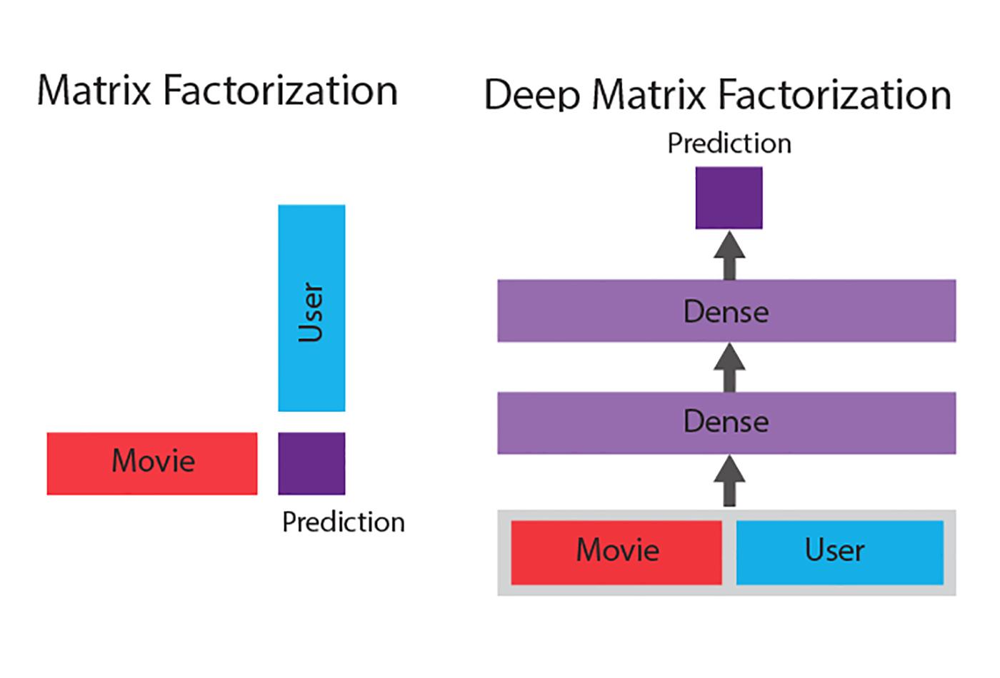

## Table of Contents

## What is Matrix Factorization in the context of machine learning?

Matrix Factorization is a technique used in machine learning to find patterns in data by breaking down a large matrix into smaller, more manageable matrices. Imagine you have a big table of numbers, like a spreadsheet, where rows represent users and columns represent items, such as movies or products. Each cell in the table shows how much a user likes a particular item. Matrix Factorization helps to find hidden structures in this data by splitting the big table into two smaller tables that, when multiplied together, closely match the original big table.

The goal of Matrix Factorization is often to make recommendations or predictions. For example, in a movie recommendation system, the technique can help predict how much a user might like a movie they haven't seen yet. This is done by finding patterns in the existing data, like which users tend to like similar movies. The smaller matrices created through factorization represent these patterns, such as user preferences and movie characteristics. By combining these smaller matrices, the system can estimate ratings for movies that users haven't rated yet, helping to suggest new movies they might enjoy.

## How does Matrix Factorization help in recommendation systems?

Matrix Factorization helps in recommendation systems by breaking down a large table of user ratings into smaller, simpler tables. Imagine you have a table where rows are users and columns are items like movies. Each cell shows how much a user likes a movie. Matrix Factorization splits this big table into two smaller tables. One table might show what kinds of movies users like, and the other might show what features movies have. By multiplying these two smaller tables together, you can get a good guess of how much a user would rate a movie they haven't seen yet.

This technique is useful because it finds patterns in the data that might not be obvious at first. For example, it can discover that users who like action movies also tend to like certain types of thrillers. By understanding these patterns, the recommendation system can suggest new movies to users that they are likely to enjoy. This makes the recommendations more personalized and accurate, improving the user experience on platforms like Netflix or Amazon.

## What are the basic types of Matrix Factorization techniques?

There are two basic types of Matrix Factorization techniques commonly used in [machine learning](/wiki/machine-learning): Singular Value Decomposition (SVD) and Non-negative Matrix Factorization (NMF). SVD is a general method that can be applied to any matrix. It breaks down a matrix into three smaller matrices: $$U$$, $$\Sigma$$, and $$V^T$$. The $$U$$ matrix represents the left singular vectors, $$\Sigma$$ is a diagonal matrix with singular values, and $$V^T$$ represents the right singular vectors. By multiplying these three matrices together, you can reconstruct the original matrix. SVD is powerful because it can capture the most important features of the data, but it can also be computationally expensive and may not work well with sparse data, which is common in recommendation systems.

On the other hand, Non-negative Matrix Factorization (NMF) is specifically designed to work with non-negative data, which is often the case with ratings or counts. NMF breaks down a matrix into two non-negative matrices: $$W$$ and $$H$$. The idea is that when you multiply $$W$$ and $$H$$ together, you get a good approximation of the original matrix. NMF is particularly useful in recommendation systems because it can find parts of the data that are meaningful and easy to interpret. For example, it can help identify groups of users with similar tastes and groups of items with similar characteristics. This makes NMF a popular choice for building recommendation engines, especially when dealing with sparse data.

## Can you explain the Singular Value Decomposition (SVD) method used in Matrix Factorization?

Singular Value Decomposition (SVD) is a method used in Matrix Factorization that breaks down a big table of numbers into three smaller tables. Imagine you have a spreadsheet where rows are users and columns are items, like movies. Each cell shows how much a user likes a movie. SVD splits this big table into three parts: the $$U$$ table, the $$\Sigma$$ table, and the $$V^T$$ table. The $$U$$ table shows patterns about the users, the $$\Sigma$$ table is a diagonal table with special numbers called singular values, and the $$V^T$$ table shows patterns about the movies. When you multiply these three tables together in the right order, you get back the original big table.

SVD is useful because it can find the most important patterns in the data. For example, it can discover that some users like action movies and others like comedies. By understanding these patterns, SVD can help predict how much a user might like a movie they haven't seen yet. This makes it a powerful tool for recommendation systems. However, SVD can be tricky to use because it's computationally heavy and might not work well with data that has a lot of missing values, which is common in recommendation systems. Despite these challenges, SVD remains a popular choice for breaking down complex data into simpler, more understandable parts.

## How do you implement Matrix Factorization using gradient descent?

Matrix Factorization using gradient descent is a way to break down a big table into smaller tables by slowly adjusting the numbers in the smaller tables to match the big table as closely as possible. Imagine you have a table where rows are users and columns are items like movies. Each cell shows how much a user likes a movie. You want to split this big table into two smaller tables, say $$P$$ and $$Q$$, where $$P$$ represents user features and $$Q$$ represents item features. The goal is to make $$P \times Q$$ as close as possible to the original big table. To do this, you start with random numbers in $$P$$ and $$Q$$ and then use gradient descent to tweak these numbers a little at a time, making the product of $$P$$ and $$Q$$ more and more like the original table with each tweak.

The process of tweaking the numbers in $$P$$ and $$Q$$ involves calculating how far off the product $$P \times Q$$ is from the original table, then figuring out how to change the numbers in $$P$$ and $$Q$$ to reduce this difference. This is done using a formula that looks at the error between the original table and the current product of $$P$$ and $$Q$$. You keep adjusting the numbers until the error gets as small as you need it to be. Here's a simple example of how you might do this in Python:

```python
import numpy as np

# Original matrix R
R = np.array([[5, 3, 0, 1],
              [4, 0, 0, 1],
              [1, 1, 0, 5],
              [1, 0, 0, 4],
              [0, 1, 5, 4]])

# Number of latent features
K = 2

# Initialize P and Q with random values
num_users, num_items = R.shape
P = np.random.rand(num_users, K)
Q = np.random.rand(num_items, K)

# Learning rate
alpha = 0.0002

# Number of iterations
num_iterations = 5000

for iteration in range(num_iterations):
    for i in range(num_users):
        for j in range(num_items):
            if R[i, j] > 0:
                eij = R[i, j] - np.dot(P[i, :], Q[j, :].T)
                for k in range(K):
                    P[i, k] += alpha * (2 * eij * Q[j, k])
                    Q[j, k] += alpha * (2 * eij * P[i, k])

# The approximated matrix
R_approx = np.dot(P, Q.T)
```

This code shows how to use gradient descent to find the best values for the smaller tables $$P$$ and $$Q$$ so that their product closely matches the original big table $$R$$.

## What are the challenges and limitations of Matrix Factorization?

Matrix Factorization is a powerful tool for finding patterns in data, but it comes with its own set of challenges and limitations. One major challenge is dealing with sparse data, which is common in recommendation systems where many users haven't rated most items. When a lot of data is missing, it can be hard for Matrix Factorization to find accurate patterns, leading to less reliable predictions. Another challenge is the computational cost. Techniques like Singular Value Decomposition (SVD) can be very time-consuming and resource-intensive, especially with large datasets. This can make it difficult to use Matrix Factorization in real-time applications where speed is important.

In addition to these challenges, Matrix Factorization also has some limitations. For example, it can struggle to capture complex relationships between users and items, especially if those relationships change over time. This means that the recommendations might not be as personalized or up-to-date as they could be. Another limitation is the cold start problem, where it's hard to make good recommendations for new users or new items because there isn't enough data yet. Matrix Factorization relies on historical data, so it can be less effective in situations where new data is constantly coming in and old data becomes less relevant. Despite these challenges and limitations, Matrix Factorization remains a valuable technique for many applications, but it's important to be aware of its potential drawbacks.

## How can Matrix Factorization be used to handle cold start problems in recommender systems?

Matrix Factorization can help with the cold start problem in recommender systems by using side information about new users or items. For example, if a new user signs up, the system might ask them to fill out a profile or rate a few items to get some initial data. This information can be used to create a starting point for the user's preferences in the smaller matrices $$P$$ and $$Q$$ used in Matrix Factorization. By incorporating this side information, the system can make better guesses about what the new user might like, even if they haven't rated many items yet.

Similarly, for new items, Matrix Factorization can use metadata like genre, actors, or product categories to help place the new item in the item matrix $$Q$$. By doing this, the system can start making recommendations for the new item based on how similar it is to existing items. While Matrix Factorization alone can't solve the cold start problem completely, using side information and metadata can make it much easier to give useful recommendations to new users or for new items.

## What are some advanced techniques to improve the performance of Matrix Factorization?

One advanced technique to improve the performance of Matrix Factorization is to use regularization. Regularization helps prevent overfitting, which is when the model becomes too focused on the existing data and doesn't work well with new data. By adding a penalty term to the error function used in Matrix Factorization, you can keep the values in the smaller matrices $$P$$ and $$Q$$ from getting too big. This makes the model more stable and better at making predictions for new users and items. For example, you can add a regularization term to the cost function like this: $$J = \sum_{(u,i) \in R} (R_{ui} - P_u Q_i^T)^2 + \lambda (\|P_u\|^2 + \|Q_i\|^2)$$, where $$\lambda$$ is the regularization parameter.

Another technique is to use alternating least squares (ALS). ALS is a way to update the matrices $$P$$ and $$Q$$ in Matrix Factorization by solving a simpler optimization problem. Instead of updating all the values at once, ALS updates the values in $$P$$ while keeping $$Q$$ fixed, and then updates the values in $$Q$$ while keeping $$P$$ fixed. This back-and-forth process can converge to a good solution faster than other methods like gradient descent. ALS is particularly useful for handling large, sparse datasets because it can be parallelized easily, making it faster to compute on big data.

Finally, incorporating side information or using hybrid approaches can also boost the performance of Matrix Factorization. For instance, you can use features like user demographics or item metadata to help fill in the gaps in the data. By combining Matrix Factorization with other recommendation techniques, such as content-based filtering or collaborative filtering, you can create a more robust system that leverages the strengths of each method. This hybrid approach can lead to more accurate and personalized recommendations, especially in cases where the data is sparse or when dealing with the cold start problem.

## How does Non-negative Matrix Factorization (NMF) differ from other Matrix Factorization methods?

Non-negative Matrix Factorization (NMF) is different from other Matrix Factorization methods because it only uses positive numbers. Imagine you have a big table of numbers, like a spreadsheet, where each cell shows how much a user likes an item. NMF breaks this big table into two smaller tables, $$W$$ and $$H$$, and both of these tables have only positive numbers. When you multiply $$W$$ and $$H$$ together, you get a good guess of the original big table. This is helpful because positive numbers can be easier to understand and work with, especially when you're dealing with things like ratings or counts that can't be negative.

Another way NMF differs is that it's good at finding parts of the data that are meaningful and easy to interpret. For example, in a recommendation system, NMF can help identify groups of users who like similar things and groups of items that have similar features. This makes it easier to understand why certain recommendations are being made. Other methods like Singular Value Decomposition (SVD) might use both positive and negative numbers, which can make the results harder to interpret. NMF is especially useful when you want to see clear patterns in the data, making it a popular choice for applications where understanding the data is important.

## Can you discuss the role of regularization in Matrix Factorization and its impact on model performance?

Regularization plays a crucial role in Matrix Factorization by helping to prevent the model from overfitting. Overfitting happens when the model learns the training data too well, including its noise and errors, which can make it perform poorly on new data. By adding a regularization term to the cost function, you can keep the values in the smaller matrices $$P$$ and $$Q$$ from becoming too large. This helps the model to generalize better, meaning it can make more accurate predictions for users and items it hasn't seen before. The regularization term often looks like this: $$J = \sum_{(u,i) \in R} (R_{ui} - P_u Q_i^T)^2 + \lambda (\|P_u\|^2 + \|Q_i\|^2)$$, where $$\lambda$$ is the regularization parameter that controls how much the model is penalized for large values.

The impact of regularization on model performance can be significant. Without regularization, Matrix Factorization might focus too much on fitting the existing data, leading to poor performance when making new predictions. By adding regularization, you can balance the model's ability to fit the data with its ability to generalize. This means the model can still capture important patterns in the data but won't be thrown off by small, random variations. As a result, the recommendations or predictions made by the model will be more reliable and useful, especially in real-world scenarios where new users and items are constantly being added.

## How do you evaluate the performance of a Matrix Factorization model?

Evaluating the performance of a Matrix Factorization model involves comparing the predictions it makes to the actual data. One common way to do this is by using a metric called Root Mean Square Error (RMSE). Imagine you have a big table of numbers where rows are users and columns are items, and each cell shows how much a user likes an item. The model tries to guess these numbers using smaller tables. RMSE measures how far off these guesses are from the real numbers. You calculate RMSE by taking the square root of the average of the squared differences between the predicted and actual values. The formula for RMSE is $$ \text{RMSE} = \sqrt{\frac{1}{n} \sum_{i=1}^{n} (y_i - \hat{y}_i)^2} $$, where $$y_i$$ is the actual value, $$\hat{y}_i$$ is the predicted value, and $$n$$ is the number of predictions. A smaller RMSE means the model's guesses are closer to the real values, which is good.

Another way to evaluate the model is by using metrics like Mean Absolute Error (MAE) or Precision and Recall, especially if you're using the model for recommendations. MAE is similar to RMSE but uses the absolute difference instead of the squared difference, making it less sensitive to large errors. The formula for MAE is $$ \text{MAE} = \frac{1}{n} \sum_{i=1}^{n} |y_i - \hat{y}_i| $$. Precision and Recall are used to see how well the model suggests items that users might like. Precision measures how many of the recommended items are actually liked by the user, while Recall measures how many of the items the user likes are included in the recommendations. By using these different metrics, you can get a full picture of how well your Matrix Factorization model is working and where it might need improvement.

## What are some real-world applications of Matrix Factorization beyond recommendation systems?

Matrix Factorization is not just useful for recommending movies or products. It can also be used in text analysis to find topics in large collections of documents. Imagine you have a big pile of articles. Matrix Factorization can break down the words in these articles into smaller groups, helping you see which words often appear together. This can show you the main topics in the articles, like sports, politics, or technology. For example, if many articles talk about "baseball," "pitcher," and "home run," Matrix Factorization can group these words together to show that they're about the topic of baseball.

Another real-world application of Matrix Factorization is in image processing. If you have a bunch of pictures, Matrix Factorization can help find patterns in the pixels of these images. This can be used for things like compressing images or recognizing objects in photos. By breaking down the image into smaller parts, Matrix Factorization can help find common features across different images, making it easier to store or analyze them. For instance, if you have pictures of different dogs, Matrix Factorization can help identify common features like ears, eyes, and fur, making it easier to recognize dogs in new pictures.