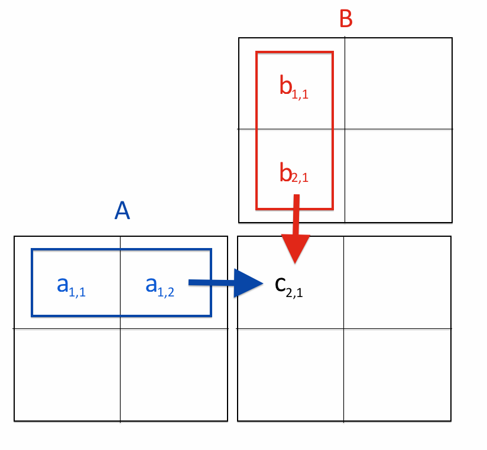

## Table of Contents

## What is matrix-matrix multiplication and why is it important?

Matrix-matrix multiplication is a way to combine two sets of numbers arranged in rows and columns, called matrices. When you multiply two matrices, you take the rows of the first matrix and the columns of the second matrix, and perform a series of multiplications and additions to create a new matrix. The result tells you how the two sets of numbers interact with each other. For example, if you have one matrix that represents the quantities of different products and another matrix that represents the prices of those products, multiplying them can give you the total cost for each product.

Matrix multiplication is important because it is used in many areas of science, engineering, and computer science. It helps solve complex problems by breaking them down into simpler steps. For instance, in computer graphics, matrix multiplication is used to transform and rotate images on a screen. In machine learning, it's used to process and analyze large amounts of data. Understanding matrix multiplication allows us to work with data in a more organized and efficient way, making it a fundamental tool in many fields.

## What are the benefits of using a GPU for matrix-matrix multiplication?

Using a GPU for matrix-matrix multiplication can make the process much faster. GPUs have many small processing units that can work on different parts of the matrix at the same time. This is called parallel processing. When you multiply two large matrices, a GPU can handle many calculations simultaneously, which means it can finish the job much quicker than a regular computer processor, or CPU.

Another benefit of using a GPU is that it can handle bigger matrices more easily. Because GPUs are designed to do many calculations at once, they can work with larger sets of data without slowing down as much as a CPU would. This is really helpful in fields like machine learning and scientific computing, where people often need to process huge amounts of data quickly. So, using a GPU can save time and help get results faster.

## What is Nvidia CUDA and how does it facilitate GPU computing?

Nvidia CUDA is a technology that lets you use Nvidia GPUs to do calculations faster. It's like a special language that helps computers understand how to use the GPU to solve problems. CUDA stands for Compute Unified Device Architecture. It was made by Nvidia to make it easier for people to use their GPUs for more than just graphics, like for math and science problems.

CUDA works by letting you write programs that can run on the GPU. When you use CUDA, your computer can split up big jobs into smaller pieces and let the GPU work on them all at the same time. This is really helpful for things like matrix multiplication, where you need to do a lot of calculations quickly. By using CUDA, people in fields like machine learning, physics, and finance can get their work done much faster than if they just used a regular computer processor.

## How do you set up a development environment for CUDA programming?

To set up a development environment for CUDA programming, you first need to make sure your computer has an Nvidia GPU that supports CUDA. You can check this on Nvidia's website. Once you confirm your GPU is compatible, download and install the latest version of the CUDA Toolkit from Nvidia's website. This toolkit includes everything you need to start programming with CUDA, like the compiler and libraries. After installing the toolkit, you'll also need to set up your system's PATH environment variable to include the CUDA binaries. This helps your computer find the CUDA tools when you need them.

Next, you'll need a code editor or an Integrated Development Environment (IDE) to write your CUDA programs. Popular choices include Visual Studio, Visual Studio Code, or JetBrains CLion. Make sure to install any CUDA-specific plugins or extensions for your chosen editor to get features like syntax highlighting and debugging support for CUDA code. Once your editor is set up, you can start writing and running CUDA programs. Remember to test your setup by compiling and running a simple CUDA program to ensure everything is working correctly.

## What are the basic steps to implement matrix-matrix multiplication using CUDA?

To implement matrix-matrix multiplication using CUDA, you first need to set up your CUDA environment and write a program that can run on the GPU. Start by defining the size of the matrices you want to multiply. Then, you need to allocate memory on the GPU for these matrices. You do this by using CUDA functions to copy the data from your computer's memory to the GPU's memory. After that, you write a CUDA kernel, which is a small program that runs on the GPU. This kernel will do the actual multiplication of the matrices. You launch this kernel with enough threads to cover all the elements in the result matrix.

Once the kernel finishes running, you need to copy the result back from the GPU's memory to your computer's memory. After you have the result, you can free the memory you allocated on the GPU. It's important to check for any errors during these steps to make sure everything worked correctly. This whole process uses the power of the GPU to do the matrix multiplication much faster than a regular computer processor could. By breaking down the work into smaller pieces and running them all at once, CUDA makes it possible to handle big calculations quickly and efficiently.

## How do you manage memory efficiently on the GPU for matrix operations?

Managing memory efficiently on the GPU for matrix operations is important because it helps your program run faster and use less resources. When you work with matrices on the GPU, you need to move data from your computer's memory to the GPU's memory. This can take time, so you want to do it as few times as possible. One way to do this is by making sure you only send the data you need to the GPU. For example, if you're doing a lot of matrix multiplications, you might want to keep the matrices on the GPU between operations instead of sending them back and forth.

Another way to manage memory efficiently is by using the right amount of memory for your matrices. GPUs have a limited amount of memory, so you need to make sure your matrices fit within that space. If your matrices are too big, you might need to break them into smaller pieces and process them one at a time. Also, it's a good idea to free up the memory you're not using anymore. This helps keep your GPU from running out of space and makes your program run smoother. By being careful with how you use memory, you can make your matrix operations on the GPU work better and faster.

## What are the common optimization techniques for matrix-matrix multiplication on GPUs?

One common way to make matrix multiplication faster on GPUs is by using something called tiling. Tiling breaks the big matrices into smaller pieces, called tiles. Each tile can be processed at the same time on the GPU. This helps because it makes better use of the GPU's memory and can do more calculations at once. Another technique is to use shared memory. Shared memory is a special kind of memory on the GPU that is faster than regular memory. By moving data into shared memory, you can make the multiplication happen quicker because the GPU can get to the data faster.

Another important technique is to use the right number of threads. GPUs work best when they have a lot of threads to work with. By setting up the right number of threads, you can make sure the GPU is always busy and not waiting around. Also, you can use something called loop unrolling. This means you write out the loops in your code so the GPU can do more work in one go, which can speed things up. By using these techniques together, you can make matrix multiplication on GPUs much faster and more efficient.

## How can you measure and improve the performance of CUDA matrix multiplication?

To measure the performance of CUDA matrix multiplication, you can use a tool called a profiler. A profiler helps you see how long it takes for your program to run and where it spends the most time. For CUDA, you can use Nvidia's Nsight or the command-line tool nvprof. These tools tell you how fast your matrix multiplication is happening and how much memory it's using. By looking at this information, you can find parts of your code that might be slow or using too much memory. Once you know where the problems are, you can start to make your code better.

To improve the performance of CUDA matrix multiplication, you can try different techniques. One way is to use tiling, which breaks the big matrices into smaller pieces that the GPU can handle more easily. Another way is to use shared memory, which is a faster type of memory on the GPU. You can also adjust the number of threads to make sure the GPU is always busy and not waiting. Sometimes, unrolling loops can help by letting the GPU do more work at once. By trying out these different techniques and measuring the performance each time, you can find the best way to make your matrix multiplication faster and more efficient.

## What are the challenges and limitations of using CUDA for matrix-matrix multiplication?

Using CUDA for matrix-matrix multiplication can be really helpful because it makes the calculations faster, but it also comes with some challenges. One big challenge is that you need to know how to program with CUDA. It's not as simple as writing regular code because you have to think about how to split up the work and use the GPU's memory correctly. Also, not all computers have the right kind of Nvidia GPU that can run CUDA programs. This means you might not be able to use CUDA on every computer you work on. Another challenge is that moving data between the computer's memory and the GPU's memory can take time, which can slow things down if you're not careful.

Another limitation is that GPUs have less memory than the computer's main memory. If you're working with really big matrices, they might not fit on the GPU, and you'll have to break them into smaller pieces. This can make your code more complicated and might not always be faster than just using the computer's regular processor. Also, while CUDA can make things faster, it can be hard to figure out the best way to use it. You might need to try different ways of setting up your code and measuring the performance to find what works best. So, while CUDA can be a powerful tool, it takes some work to use it well.

## How does the choice of data layout (e.g., row-major vs. column-major) affect performance in CUDA?

The way you set up your data, like whether you use row-major or column-major order, can make a big difference in how fast your CUDA program runs. Row-major means you store the numbers in a matrix row by row, while column-major means you store them column by column. In CUDA, how you set up your data matters because it affects how the GPU can access and process the data. If you choose the wrong layout, it can slow down your program because the GPU might have to wait longer to get the data it needs.

For matrix multiplication, the best data layout often depends on how you write your CUDA kernel. If your kernel is set up to work well with row-major data, using that layout can make things faster. But if your kernel is better with column-major data, then using that layout will help. It's important to try different layouts and see which one makes your program run the fastest. By picking the right data layout, you can make sure your CUDA program uses the GPU's power as well as possible.

## What advanced CUDA features can be used to further optimize matrix-matrix multiplication?

One advanced CUDA feature that can help make matrix multiplication faster is called cooperative groups. This feature lets different groups of threads work together more easily. When you're multiplying big matrices, you can use cooperative groups to make sure all the threads are working together smoothly. This can help the GPU do more work at once and finish the multiplication quicker. By using cooperative groups, you can make your code run faster and use the GPU's power better.

Another useful feature is CUDA graphs. CUDA graphs let you set up a series of operations that the GPU can run over and over again without having to start from scratch each time. For matrix multiplication, you can use CUDA graphs to set up the multiplication steps once and then repeat them many times. This can save time because the GPU doesn't have to keep setting up the same operations. By using CUDA graphs, you can make your matrix multiplication run faster and more smoothly, especially if you need to do the same multiplication many times.

## How do you scale matrix-matrix multiplication to handle very large matrices on multiple GPUs?

To handle very large matrices on multiple GPUs, you need to split the big matrix into smaller pieces that each GPU can work on. This is called data parallelism. You divide the matrix into parts and send each part to a different GPU. Each GPU then does its part of the matrix multiplication at the same time. After all the GPUs finish their work, you put the results back together to get the final answer. This way, you can use the power of many GPUs to handle big matrices that would be too large for just one GPU.

Another important thing is to make sure the GPUs can talk to each other well. This is called communication. When you're using multiple GPUs, they need to share data with each other to make sure the matrix multiplication works right. You can use special libraries like NCCL (Nvidia Collective Communications Library) to help the GPUs communicate faster. By setting up good communication, you can make sure that all the GPUs work together smoothly and finish the matrix multiplication quickly.

## What is the role of understanding matrix multiplication in algorithmic trading?

Matrix multiplication is integral to algorithmic trading as it underpins numerous mathematical models and analyses critical to financial decision-making. In portfolio optimization, traders seek to allocate assets in a way that maximizes returns while minimizing risk, often using matrices to represent asset covariances and expected returns. This requires solving systems of linear equations, eigenvalue problems, and quadratic programming, all of which extensively utilize matrix operations.

Similarly, risk assessment procedures, such as Value at Risk (VaR) and stress testing, often employ matrices to model correlations between various financial instruments. These matrices enable traders to anticipate potential losses under different market conditions by simulating the behavior of diverse asset classes and their interactions.

Despite the importance of these calculations, matrix multiplication is computationally expensive. The standard operation of multiplying two matrices, A and B, with dimensions m×n and n×p, respectively, involves O(mnp) operations. As the size of matrices increases, the computational burden becomes significant, potentially slowing down the execution of strategies that depend on real-time data analysis and decision-making.

To illustrate, consider two matrices A and B:

$$
A = \begin{bmatrix} a_{11} & a_{12} \\ a_{21} & a_{22} \end{bmatrix}, \quad B = \begin{bmatrix} b_{11} & b_{12} \\ b_{21} & b_{22} \end{bmatrix}
$$

The product C = AB is:

$$
C = \begin{bmatrix} c_{11} & c_{12} \\ c_{21} & c_{22} \end{bmatrix},
$$

where:

$$
c_{11} = a_{11}b_{11} + a_{12}b_{21}, \quad c_{12} = a_{11}b_{12} + a_{12}b_{22},
$$

$$
c_{21} = a_{21}b_{11} + a_{22}b_{21}, \quad c_{22} = a_{21}b_{12} + a_{22}b_{22}
$$

This simple example illustrates the multiplication's sequential nature, which can be a bottleneck.

Optimizing these operations is critical, and advancements in both hardware, like Graphics Processing Units (GPUs), and software, including parallel computing techniques, facilitate significant performance improvements. Leveraging these technologies enables traders to execute complex calculations more swiftly, ensuring the timely processing of data crucial for making informed trading decisions. As [algorithmic trading](/wiki/algorithmic-trading) continues to evolve, efficient matrix multiplication will be vital to developing more sophisticated and robust financial models.

## References & Further Reading

[1]: Sanders, J., & Kandrot, E. (2010). ["CUDA by Example: An Introduction to General-Purpose GPU Programming."](https://www.semanticscholar.org/paper/CUDA-by-example%3A-an-introduction-to-general-purpose-Sanders-Kandrot/05838c4056611a297804dfc62bfe18e63129bf93) Addison-Wesley Professional.

[2]: Kirk, D. B., & Hwu, W.-m. W. (2012). ["Programming Massively Parallel Processors: A Hands-on Approach."](https://www.sciencedirect.com/book/9780128119860/programming-massively-parallel-processors) Morgan Kaufmann.

[3]: Cohen, W. (2016). ["Financial Engineering for Algorithmic Trading."](https://www.sciencedirect.com/science/article/pii/S2214635021001210) SSRN.

[4]: Harris, M. (2005). ["Optimizing CUDA - Running a Kernel on the GPU."](https://stackoverflow.com/questions/2204527/how-do-you-profile-optimize-cuda-kernels) NVIDIA Blog.

[5]: Lopez de Prado, M. (2018). ["Advances in Financial Machine Learning."](https://www.amazon.com/Advances-Financial-Machine-Learning-Marcos/dp/1119482089) Wiley.