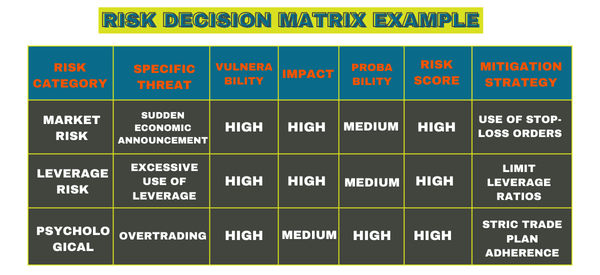

## Table of Contents

## What is matrix trading?

Matrix trading is a way of trading that uses a special tool called a matrix. This tool helps traders see and understand how different things they are trading, like stocks or currencies, are connected to each other. By using the matrix, traders can make better decisions about when to buy or sell these items. It's like having a map that shows how everything is linked, making it easier to see the best paths to take in trading.

The matrix in matrix trading is often shown as a grid or table. Each row and column in the grid represents a different item being traded. The places where rows and columns meet show how strong the connection is between those items. Traders look at this grid to find patterns and relationships that they can use to their advantage. This can help them predict how the prices of the items might change and plan their trades accordingly.

## How does matrix trading differ from traditional trading?

Matrix trading and traditional trading are different in how they help traders make decisions. In traditional trading, traders mostly look at the price and volume of one thing they are trading, like a stock or a currency. They use charts and graphs to see how the price has changed over time and try to guess where it might go next. They might also look at news and other information to help them decide when to buy or sell.

Matrix trading, on the other hand, uses a special tool called a matrix to show how different things being traded are connected. Instead of just looking at one thing at a time, traders can see a whole grid that shows how all the items relate to each other. This helps them understand bigger patterns and relationships that they might miss in traditional trading. By seeing these connections, traders can make more informed decisions about their trades, looking at the bigger picture rather than just focusing on one item at a time.

## What are the basic components of a trading matrix?

A trading matrix is made up of rows and columns that show different things being traded, like stocks or currencies. Each row and each column represents one of these items. Where the rows and columns meet, there are numbers or symbols that show how strong the connection is between the two items. This part of the matrix is really important because it helps traders see how the items are related to each other.

The numbers or symbols in the matrix can show if the items move up and down together, or if one goes up when the other goes down. Traders use this information to find patterns and make better decisions about when to buy or sell. The matrix also helps traders see the bigger picture, not just focusing on one item at a time, which can lead to smarter trading choices.

## Can you explain the concept of a trading matrix in simple terms?

A trading matrix is like a big chart that helps people who trade things like stocks or currencies. It's made up of rows and columns, and each row and column stands for one thing being traded. When you look at where a row and a column meet, you see a number or a symbol that tells you how those two things are connected. This helps traders see if different things they trade move up and down together or in opposite ways.

By using a trading matrix, traders can see the big picture of how everything they trade is related. Instead of just looking at one stock or currency at a time, they can see how all the different things they trade affect each other. This can help them make smarter choices about when to buy or sell, because they can spot patterns and connections that they might miss if they were just looking at one thing at a time.

## What are the potential benefits of using matrix trading?

Using matrix trading can help traders see the big picture of how different things they trade, like stocks or currencies, are connected. Instead of just looking at one thing at a time, traders can use the matrix to see how all the items they trade affect each other. This can help them spot patterns and relationships that they might miss if they were only looking at one stock or currency. By understanding these connections, traders can make smarter choices about when to buy or sell, which can lead to better trading results.

Another benefit of matrix trading is that it can help traders predict how prices might change. By seeing how different items move together or in opposite ways, traders can guess what might happen next. This can give them an edge in the market, helping them make trades that are more likely to be successful. Overall, using a trading matrix can make trading easier and more effective by providing a clear view of how everything is linked.

## What are the common risks associated with matrix trading?

Matrix trading can be helpful, but it also comes with some risks. One big risk is that the matrix might show connections that aren't really there or might not be as strong as they seem. Traders can sometimes see patterns in the matrix that make them think they know what will happen next, but these patterns might not be reliable. If traders make decisions based on these patterns and they're wrong, they could lose money.

Another risk is that matrix trading can be complicated. It takes time to learn how to use the matrix and understand what it's showing. If traders don't fully understand the matrix, they might make mistakes. Also, the matrix needs to be updated regularly with new information, and if it's not, the information it shows might be outdated, leading to bad trading decisions. So, while matrix trading can be a powerful tool, it's important for traders to be careful and make sure they really understand what they're doing.

## How can beginners start with matrix trading?

Beginners who want to start with matrix trading should first learn the basics of trading. This means understanding how to buy and sell things like stocks or currencies, and knowing how to read charts and graphs. Once they have a good grasp of these basics, they can start learning about matrix trading. It's important to find good resources, like [books](/wiki/algo-trading-books) or online courses, that explain how a trading matrix works. These resources should use simple language and examples to help beginners understand the connections shown in the matrix.

After learning the basics, beginners can start practicing with a trading matrix. They can use software or online tools that let them create and look at matrices. It's a good idea to start with a small amount of money and practice making trades based on what the matrix shows. Beginners should also keep learning and updating their knowledge because the information in the matrix can change. By taking it slow and being careful, beginners can get better at using matrix trading to make smart trading decisions.

## What advanced strategies can be employed in matrix trading?

Advanced strategies in matrix trading involve looking at more than just the simple connections between items. Traders can use the matrix to find complex patterns and relationships that are not easy to see. For example, they might look at how different items affect each other over time, not just at one moment. They can also use the matrix to predict how big changes in one item might cause a chain reaction in others. By understanding these deeper connections, traders can make more accurate guesses about what might happen next and plan their trades better.

Another advanced strategy is to use the matrix to find opportunities for [arbitrage](/wiki/arbitrage). This means buying something in one place and selling it in another place for a higher price. The matrix can help traders see when there are price differences between different markets or items. By quickly spotting these differences, traders can make trades that take advantage of them. This can be a smart way to make money, but it needs a lot of quick thinking and understanding of how the matrix works.

## How do market conditions affect matrix trading?

Market conditions can change how useful matrix trading is. When the market is calm and prices move slowly, the connections shown in the matrix are usually more stable and easier to understand. This makes it easier for traders to see patterns and make good decisions based on the matrix. But when the market is wild and prices jump around a lot, the connections in the matrix can change quickly. This can make it harder for traders to use the matrix to predict what will happen next. They need to be careful and keep updating their matrix with new information to stay on top of things.

In different market conditions, the way traders use the matrix can also change. For example, during times when the market is going up and down a lot, traders might look at the matrix more often to catch quick changes in how items are connected. They might also use the matrix to find safe places to put their money, like items that don't move as much as others. On the other hand, when the market is steady, traders might use the matrix to find small patterns and make trades that take advantage of slow changes in prices. Understanding how market conditions affect the matrix helps traders use it better and make smarter trading choices.

## Can you provide an example of a successful matrix trading strategy?

One successful matrix trading strategy is called [pair trading](/wiki/pair-trading). Imagine you have two stocks, Stock A and Stock B, that usually move up and down together. You can use a trading matrix to see how strong their connection is. If the matrix shows that Stock A and Stock B are closely linked, you can set up a pair trade. This means you buy Stock A and sell Stock B at the same time. If the matrix then shows that the connection between them is starting to break, you can make money by selling Stock A and buying back Stock B.

For example, let's say Stock A is a big tech company and Stock B is a smaller tech company that often follows the big one. The matrix shows they have a strong connection. You buy Stock A for $100 and sell Stock B for $50. Then, something happens, and the matrix shows their connection is weakening. Stock A goes up to $110, and Stock B goes down to $40. You sell Stock A for $110, making a $10 profit, and buy back Stock B for $40, making another $10 profit. By using the matrix to see the changing connection between Stock A and Stock B, you made a total of $20 profit from the pair trade.

## What tools and software are recommended for effective matrix trading?

For effective matrix trading, traders often use special software that helps them create and look at trading matrices. One popular tool is Excel, which many traders use because it's easy to use and can make simple matrices. There are also more advanced tools like MATLAB or Python, which can handle bigger and more complex matrices. These tools let traders add lots of data and see how different things they trade are connected. Some traders also use special trading platforms like MetaTrader or NinjaTrader, which have built-in tools for making matrices and doing other kinds of trading.

Another important tool for matrix trading is data feeds that give traders up-to-date information about prices and other important numbers. Good data feeds are crucial because the matrix needs fresh data to show the right connections. Some popular data feed providers are Bloomberg Terminal and Reuters Eikon, which give traders all the information they need. Traders also use charting software like TradingView, which can show the matrix in different ways and help them find patterns and make smart trading choices. By using these tools together, traders can get a clear picture of how everything they trade is connected and make better decisions.

## How can one mitigate risks when engaging in matrix trading?

To reduce risks in matrix trading, it's important to start by understanding how the matrix works and what it shows. Beginners should learn from books, courses, or experienced traders to get a good grasp of the basics. They should also practice with small amounts of money first, so they can get used to using the matrix without risking too much. Keeping the matrix updated with the latest information is crucial too, because old data can lead to bad decisions. By taking these steps, traders can lower the chance of making mistakes based on wrong or unclear connections in the matrix.

Another way to manage risks is to always be careful and not rely too much on what the matrix shows. Traders should double-check the patterns they see with other tools and information, like news or other charts. This helps make sure the connections in the matrix are real and not just something they imagined. It's also a good idea to set limits on how much money they are willing to lose on a trade. By setting these limits, traders can stop a losing trade before it gets too bad. Overall, by being careful, staying informed, and using the matrix along with other tools, traders can make safer and smarter trading choices.

## References & Further Reading

[1]: ["Fixed Income Securities: Tools for Today’s Markets"](https://www.amazon.com/Fixed-Income-Securities-Markets-Finance/dp/1119835550) by Bruce Tuckman and Angel Serrat

[2]: ["Algorithmic Trading: Winning Strategies and Their Rationale"](https://www.wiley.com/en-us/Algorithmic+Trading%3A+Winning+Strategies+and+Their+Rationale-p-9781118746912) by Ernie Chan

[3]: ["The Handbook of Fixed Income Securities"](https://www.amazon.com/Handbook-Fixed-Income-Securities/dp/0071440992) by Frank J. Fabozzi

[4]: Aldridge, I. (2013). ["High-Frequency Trading: A Practical Guide to Algorithmic Strategies and Trading Systems"](https://www.amazon.com/High-Frequency-Trading-Practical-Algorithmic-Strategies/dp/1118343506). Wiley Finance.

[5]: Kissell, R. (2013). ["The Science of Algorithmic Trading and Portfolio Management"](https://www.sciencedirect.com/book/9780124016897/the-science-of-algorithmic-trading-and-portfolio-management). Academic Press.