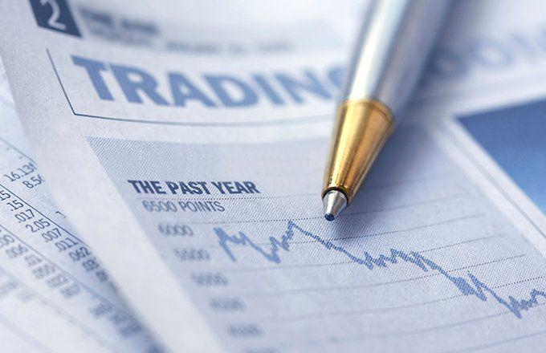

In the rapidly evolving world of finance, traders continuously seek innovative strategies to enhance their returns. Two key strategies that have gained prominence in recent times are matrix trading and algorithmic trading, commonly known as algo trading. These strategies utilize advanced techniques and technology to capitalize on market opportunities, demonstrating the transformative impact of technological advancements in the financial sector.

Matrix trading is a fixed income strategy that focuses on identifying discrepancies in yield curves to execute bond swaps effectively. By exploiting perceived mispricings in the yield spreads of bonds, traders aim to achieve better returns as the discrepancies correct themselves over time. This approach requires a keen understanding of the bond market and the ability to leverage financial instruments to optimize yield opportunities.



On the other hand, algorithmic trading automates trading processes by employing pre-programmed rules and extensive data analysis. This method minimizes human intervention, allowing trading to occur at high speeds and large volumes. The automation and efficiency provided by algorithmic trading have revolutionized the way trades are executed, reducing latency and increasing precision in capturing market movements.

However, the integration of matrix and algorithmic trading strategies comes with inherent risks that must be comprehensively understood. The potential for discrepancies in matrix trading not correcting over time and the dependency of algorithmic trading on technology pose significant challenges. Furthermore, technological glitches, data integrity issues, and cybersecurity threats present unique risks that require vigilant risk management.

This article investigates into the concept of financial risks associated with matrix and algorithmic trading strategies. By examining these risks, traders and stakeholders can better understand the complexities involved and adopt robust strategies to mitigate potential adverse impacts, ultimately navigating the modern financial markets more effectively.

## Table of Contents

## Understanding Matrix Trading

Matrix trading is a sophisticated financial strategy employed within the fixed income market, primarily aimed at capitalizing on yield curve discrepancies through bond swaps. This approach involves carefully analyzing the yield spreads of different bonds to identify potential mispricings. Traders participating in matrix trading strategically engage in swapping bonds with the expectation of profiting from corrections in these yield discrepancies over time.

The foundation of matrix trading lies in the yield curve, which represents the relationship between interest rates and the time to maturity of debt instruments, typically government bonds. Misalignments in the yield curve can occur due to various factors, including shifts in supply and demand, changes in interest rates, or broader economic conditions. These discrepancies create opportunities for traders to execute bond swaps—selling one bond and purchasing another—to exploit temporary mispricings.

A key principle underlying matrix trading is the anticipation that yield discrepancies will naturally adjust or correct themselves. Traders operate on the assumption that the market is efficient enough to eventually restore these misaligned yield spreads to equilibrium. Consequently, successful matrix trading requires not only identifying current mispricings but also having confidence in their eventual correction.

The process of matrix trading can be illustrated through a simple example. Suppose a trader identifies two bonds, Bond A and Bond B, with similar maturities and credit qualities, but Bond A offers a higher yield than Bond B. The trader might sell Bond B and buy Bond A, assuming that the yield spread between these bonds will narrow over time as the market corrects the pricing discrepancy. The trader profits if the yield of Bond A falls relative to Bond B, thereby increasing the price of Bond A.

Matrix trading is distinct from other fixed income strategies, such as buy-and-hold, as it requires a more active approach and a comprehensive understanding of the factors influencing yield spreads. While potentially lucrative, this strategy demands meticulous analysis and execution to mitigate risks associated with market [volatility](/wiki/volatility-trading-strategies) and economic changes.

In summary, matrix trading is a strategy targeted at exploiting yield curve fluctuations through bond swaps. It hinges on the premise of market efficiency, where observed yield discrepancies are expected to correct themselves, allowing traders to profit from these adjustments. This strategy, while promising, necessitates careful analysis and monitoring to achieve successful outcomes.

## Risks in Matrix Trading

Matrix trading, while often promising potential gains by capitalizing on yield curve discrepancies, is inherently fraught with risks. One primary risk arises from mispricings that may exist in bond yield spreads. These discrepancies might not be anomalies but could instead reflect legitimate, underlying factors related to economic conditions, issuer credit, and market demand. If these factors are misunderstood or disregarded, traders might face losses as price corrections fail to materialize.

Another significant risk in matrix trading comes from changes in market conditions. Economic indicators, fiscal policies, or geopolitical events can alter the market landscape significantly, sometimes exacerbating the mispricing rather than leading to corrections. For instance, an anticipated [interest rate](/wiki/interest-rate-trading-strategies) cut could increase bond yields beyond expectations, intensifying the mispricing and leading to potential losses.

Traders must remain vigilant, continually assessing the macroeconomic environment and sector-specific dynamics to ensure that any perceived mispricing is not simply part of a broader market trend. The complexity of accurately forecasting these elements adds a layer of unpredictability to matrix trading strategies, making risk assessment a critical component of the process.

## Overview of Algorithmic Trading

Algorithmic trading harnesses the power of computer algorithms to automate trading decisions, minimizing human intervention. This trading approach relies on pre-programmed rules and sophisticated data analysis to execute trades at high speeds and manage large volumes effectively. By systematically analyzing market data, algorithms can identify trading opportunities that meet specific criteria, making trades based on predetermined strategies.

At the core of [algorithmic trading](/wiki/algorithmic-trading) is the capability to execute trade orders with precision and efficiency. Algorithms can rapidly scan multiple markets and data points, enabling traders to capitalize on even the smallest market inefficiencies. This high-speed processing is particularly beneficial during periods of high market volatility, where quick reaction times are crucial for maintaining a competitive edge.

Despite these advantages, algorithmic trading is not without its challenges. The reliance on technology means that any technical failure or glitch can disrupt trading activities. For example, a malfunction in the trading infrastructure could lead to unanticipated losses or missed opportunities. Moreover, the robustness of the algorithms depends significantly on the quality and integrity of the data they process. Errors in data can lead to flawed trading decisions, thereby impacting the profitability and efficacy of the trading strategy.

Another critical challenge in algorithmic trading is the ever-present threat of cybersecurity breaches. Unauthorized access to trading systems can lead to financial losses and compromise sensitive strategic information. Additionally, as markets evolve, trading algorithms must adapt to changing conditions to remain effective. This necessitates continuous monitoring and regular updating of algorithms to prevent issues such as overfitting, where an algorithm performs well on historical data but fails to generalize to new market conditions.

In conclusion, while algorithmic trading offers numerous advantages, including the ability to operate at high speeds and manage significant trade volumes, it also presents unique challenges. Effective management of these challenges is vital to harnessing the full potential of algorithmic trading.

## Common Risks in Algo Trading

Algorithmic trading, widely adopted in financial markets, offers significant advantages by enhancing trading efficiency and speed. However, the reliance on technology introduces various risks that need to be managed meticulously to ensure smooth operations.

One of the primary challenges is technical glitches, which can originate from software bugs, hardware failures, or network disruptions. Such technical issues can cause unanticipated trading actions, leading to substantial financial losses. These glitches can occur due to errors in the coding of the trading algorithms or the malfunctioning of the hardware or trading platform. The infamous "Flash Crash" of 2010, where the Dow Jones Industrial Average plunged by about 1,000 points within minutes, underscored the potential havoc that technical glitches can wreak when algo trading systems malfunction.

Moreover, data quality and integrity are vital for the decision-making processes of algorithmic systems. Algo trading systems rely heavily on historical and real-time data to identify trading opportunities and execute trades. Any errors in data, be it inaccuracies, inconsistencies, or outdated information, can result in erroneous trading decisions. For instance, an incorrect feed might lead the algorithm to buy or sell assets based on false market perceptions, which can have cascading negative effects on trading portfolios.

Another significant concern in algorithmic trading is cybersecurity threats. These threats include unauthorized access to trading platforms, data breaches, and malicious software targeting trading systems. Successful attacks can lead to the manipulation of trades, exposure of sensitive trading strategies, and significant financial and reputational damage. For instance, hackers gaining access to a trading system could execute unauthorized trades, disrupting markets and leading to financial losses.

To mitigate these risks, robust systems need to be in place for software development, testing, and deployment. Regular audits and updates of trading algorithms can help prevent technical glitches by identifying potential issues early. Ensuring high-quality data sources and implementing comprehensive data validation processes can help maintain data integrity. Additionally, employing stringent cybersecurity measures, such as firewalls, encryption, and two-[factor](/wiki/factor-investing) authentication, is crucial for protecting trading systems against cyber threats. Furthermore, continuous monitoring and real-time risk assessment frameworks can help detect and respond to anomalies and threats promptly, minimizing potential impacts on trading activities.

## Strategies for Managing Risks

Effective risk management in trading requires a comprehensive understanding of potential risks coupled with the implementation of strategies to mitigate them. In the context of matrix and algorithmic trading, this involves various critical practices that enhance the robustness and security of trading systems.

Firstly, continuous monitoring and updating of trading algorithms are vital. Financial markets are dynamic, with conditions that can shift rapidly. Algorithms, initially designed to optimize trades, might become less effective or even detrimental if market conditions change or if the algorithms are overfitted to historical data. Overfitting occurs when an algorithm is excessively tailored to past data, potentially failing to predict future trends accurately. To address this, traders should regularly recalibrate their models, incorporating recent data and employing validation techniques. This can include cross-validation methods and walk-forward testing to ensure the models remain predictive and adaptive to new market conditions.

```python
# Example of cross-validation in Python using scikit-learn
from sklearn.model_selection import cross_val_score
from sklearn.ensemble import RandomForestRegressor
import numpy as np

# Assuming X_train and y_train are the features and target data
model = RandomForestRegressor()
# Perform cross-validation
scores = cross_val_score(model, X_train, y_train, cv=5)
print("Cross-validated scores:", scores)
```

Secondly, cybersecurity measures are essential in safeguarding algorithmic trading systems. Given the reliance on technology, these systems are susceptible to cyber threats that could lead to unauthorized access or manipulation. To prevent such breaches, robust cybersecurity protocols should be implemented. This includes encryption of sensitive data, using multi-factor authentication for system access, and regular audits of cybersecurity policies to identify and rectify vulnerabilities.

Moreover, compliance with regulatory standards is crucial to prevent legal repercussions and ensure the integrity of trading activities. Regulations such as the Markets in Financial Instruments Directive (MiFID II) in the European Union and the Dodd-Frank Act in the United States specify guidelines that affect algorithmic trading. These regulations often mandate comprehensive documentation of trading strategies, including the rationale for their design and execution steps. Maintaining regular compliance checks, supported by audit trails and transparency in trading operations, helps in building trust and reduces the risk of regulatory infractions.

In summary, effective risk management in matrix and algorithmic trading involves proactive strategies focused on maintaining up-to-date and flexible trading algorithms, reinforcing cybersecurity defenses, and adhering to regulatory standards. By adopting these practices, traders can better navigate the complexities of financial markets while minimizing potential risks.

## Conclusion

Both matrix and algorithmic trading strategies offer substantial opportunities for profit. Matrix trading capitalizes on yield curve discrepancies, aiming to exploit mispricings in bond yield spreads. Algorithmic trading leverages technology to automate trading processes, offering efficiency and speed that surpass human capabilities. When used effectively, these strategies have the potential to generate significant returns for traders.

However, both strategies are accompanied by inherent risks that necessitate robust management strategies. In matrix trading, the primary risk lies in the possibility that perceived mispricings are not errors to be corrected, but reflections of legitimate underlying factors. This misjudgment can result in substantial financial losses if the expected corrections do not materialize or market conditions worsen. 

Algorithmic trading faces different, yet equally critical, challenges. The dependency on technology makes it susceptible to technical glitches and disruptions, which can lead to severe trading errors or missed opportunities. Ensuring data quality and integrity is crucial since erroneous data can lead to poor decision-making. Cybersecurity threats also pose a significant risk, with unauthorized access potentially causing financial and strategic harm.

To effectively manage these risks, traders must employ comprehensive risk management strategies. This includes continuous monitoring and updating of trading algorithms to adapt to changing market conditions and prevent issues like overfitting. Strengthening cybersecurity measures and ensuring strict compliance with financial regulations are essential steps to maintaining the integrity and reliability of trading systems.

By understanding these risks and deploying appropriate mitigation techniques, traders can navigate the complexities of modern financial markets more effectively. With diligent risk management, the substantial opportunities offered by matrix and algorithmic trading can be capitalized upon, reducing potential drawbacks and enhancing profitability.

## References & Further Reading

[1]: ["Fixed Income Securities: Tools for Today’s Markets"](https://www.amazon.com/Fixed-Income-Securities-Markets-Finance/dp/1119835550) by Bruce Tuckman and Angel Serrat

[2]: ["Algorithmic Trading: Winning Strategies and Their Rationale"](https://www.wiley.com/en-us/Algorithmic+Trading%3A+Winning+Strategies+and+Their+Rationale-p-9781118746912) by Ernie Chan

[3]: ["The Handbook of Fixed Income Securities"](https://www.amazon.com/Handbook-Fixed-Income-Securities/dp/0071440992) by Frank J. Fabozzi

[4]: Aldridge, I. (2013). ["High-Frequency Trading: A Practical Guide to Algorithmic Strategies and Trading Systems"](https://www.amazon.com/High-Frequency-Trading-Practical-Algorithmic-Strategies/dp/1118343506). Wiley Finance.

[5]: Kissell, R. (2013). ["The Science of Algorithmic Trading and Portfolio Management"](https://www.sciencedirect.com/book/9780124016897/the-science-of-algorithmic-trading-and-portfolio-management). Academic Press.