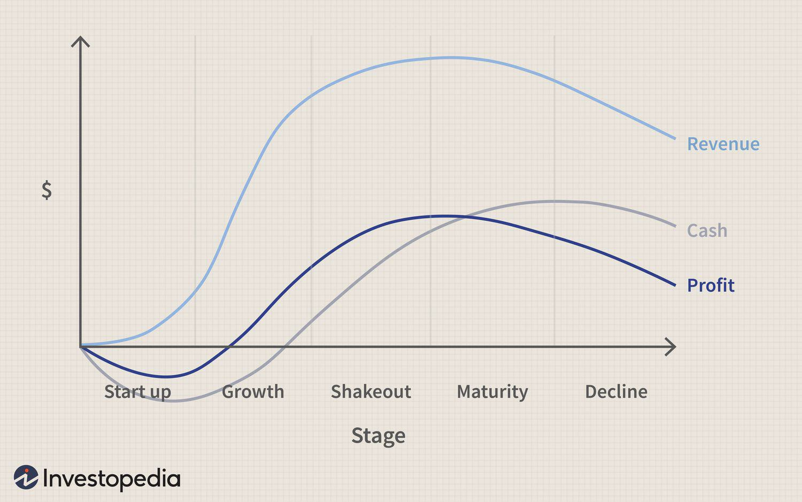

In today’s interconnected world, economic systems are evolving rapidly, driven by technological advancements and shifts in global trade dynamics. This evolution is marked by the increasing complexity of financial interactions, which necessitates a deeper understanding of the interplay between mature economies, economic development, and algorithmic trading.

Mature economies, characterized by stability and sustained growth, often serve as benchmarks for economic development. These economies typically possess advanced infrastructure, robust regulatory frameworks, and a high standard of living, which contribute to their resilience against global economic fluctuations. The transition from emerging to mature economies involves significant developments in these areas, underscoring the role of economic development in global economic transitions.

Algorithmic trading, a product of technological innovation, has become a critical component in modern economic systems. By utilizing complex algorithms and high-speed computing, this method of trading enhances market efficiency and liquidity across global financial markets. However, it also introduces challenges such as market volatility and systemic risks, necessitating vigilant regulatory oversight to ensure stability.

The synergy between these elements shapes modern financial systems and economic policies. Mature economies leverage technological advancements, such as algorithmic trading, to maintain their competitive edges, while emerging markets strive to overcome infrastructural and regulatory barriers to advance their economic development. This dynamic interaction highlights the importance of sustainable practices and innovation in driving long-term economic growth and stability.

As economic systems continue to evolve, understanding these interdependencies will be crucial for stakeholders aiming to influence future economic trajectories. This exploration sheds light on the importance of algorithmic trading and economic development in shaping resilient and dynamic economic landscapes, where growth is balanced with stability and environmental considerations.

## Table of Contents

## Understanding Economic Systems

Economic systems serve as the framework through which societies organize the production, distribution, and consumption of goods and services. These systems differ fundamentally in their approach to managing resources, addressing needs, and satisfying the demands of their populations. At the core, they are shaped by how wealth is distributed, and the roles assigned to government and private entities.

Key economic systems include capitalism, socialism, and mixed economies. Capitalism is characterized by private ownership of resources and means of production. The market forces of supply and demand largely dictate prices and resource allocation, with minimal government intervention. This system emphasizes efficiency, innovation, and competition, but can lead to significant disparities in wealth distribution.

Socialism, on the other hand, advocates for collective or governmental ownership and administration of resources and means of production. It prioritizes equal distribution of wealth, aiming to minimize socio-economic inequalities. The government typically plays a crucial role in economic planning and allocation of resources under socialism, which may sometimes limit individual entrepreneurial ventures.

Mixed economies incorporate elements from both capitalism and socialism. They feature varying degrees of private economic freedom juxtaposed with centralized economic planning and government regulation. Mixed economies strive to balance the benefits of a free market with the need for government intervention to correct market failures and ensure public welfare.

The evolution of these economic systems is significantly influenced by technological advancements, regulatory frameworks, and socio-political changes. As technology progresses, new production methods and economic models emerge, challenging traditional systems. For instance, digital currencies and blockchain technology are reshaping the financial landscape, necessitating regulatory adaptations.

In mature economies, well-established economic systems are instrumental in fostering stability and sustained growth. These systems are characterized by developed infrastructure, advanced technological integration, and robust institutional frameworks. Mature economies often focus on sustaining economic expansion, improving quality of life, and maintaining competitive advantages in a global market.

Technological advancements continuously reshape these systems by introducing automation, [artificial intelligence](/wiki/ai-artificial-intelligence), and enhanced data analytics, which streamline operations and contribute to economic efficiency. Regulatory frameworks and socio-political dynamics also adapt to ensure these systems remain responsive to both domestic needs and international trends.

## Characteristics of Mature Economies

Mature economies are distinguished by stable population growth and a deceleration in economic expansion, shifting the emphasis toward improving living standards and augmenting consumer spending. These economies prioritize quality of life, which is reflected in comprehensive social welfare systems and high investments in public services. Economic activities in such regions often revolve around service-oriented industries, reflecting a transition from manufacturing-based growth to service-driven development.

These regions are supported by advanced infrastructure and sophisticated financial markets, characterized by a significant degree of regulation and oversight. This high level of regulation ensures transparency, stability, and protection for investors and consumers, contributing to an environment conducive to sustainable economic practices. Countries such as the United States, Canada, Australia, Japan, and various nations in Western Europe epitomize mature economies. They have well-developed transportation networks, robust energy grids, and advanced telecommunications systems, which underpin their economic activities and global competitiveness.

Investment in technological innovation is a hallmark of mature economies. These nations actively pursue research and development to foster cutting-edge technologies, maintaining their competitive advantage in the global market. This focus on innovation is often supported by government policies encouraging private sector engagement in technology-driven industries.

Sustainable development is another key characteristic of these economies. Acknowledging environmental concerns, mature economies invest heavily in green technologies and sustainable practices. Through initiatives aimed at reducing carbon footprints and promoting renewable energy sources, these economies not only aim to comply with international environmental agreements but also seek to lead in the transition towards a sustainable future.

In summary, mature economies stand out due to their stabilized demographic trends, robust regulatory frameworks, and commitment to technological and sustainable advancements, ensuring their sustained development and global influence.

## Economic Development and Its Impact

Economic development represents a critical transition phase where an economy evolves from being classified as an emerging market to a mature economy. This transformation encompasses substantial improvements in infrastructure, industrialization, and the overall standards of living for the population. The infrastructure enhancements often involve the development of transportation networks, energy systems, and digital connectivity, which are essential to supporting industrial growth and economic activities. Industrialization adds to economic complexity by diversifying industries, leading to increased productivity, job creation, and income levels.

Investments in education, healthcare, and technology emerge as pivotal drivers of economic development. Education equips the workforce with skills necessary for advanced industries, fostering innovation and adaptability. Healthcare improvements contribute to a higher quality of life, increasing labor productivity and lifespan, which are necessary for sustained economic contributions. Meanwhile, technological advancements act as catalysts, enabling more efficient production processes, enhancing service delivery, and opening new markets.

Nevertheless, emerging economies encounter numerous challenges that can impede their developmental trajectory. Political instability can undermine economic confidence, deter investments, and disrupt markets, leading to inflation and corruption. Inadequate infrastructure poses additional hurdles as it hampers connectivity, raises operational costs, and limits access to markets and resources. These challenges necessitate well-structured policies and interventions to surmount obstacles and facilitate sustainable growth.

A quantitative measure often associated with economic development is the increase in Gross Domestic Product (GDP) per capita, reflecting improved economic output and living standards. However, GDP growth alone is not a comprehensive indicator. The Human Development Index (HDI) also serves as an essential parameter, integrating economic variables with social indicators like education and health.

Strategic planning for economic development involves both macroeconomic and microeconomic policies. On the macroeconomic level, policies must focus on stabilizing currency and inflation rates, while microeconomic strategies might prioritize sector-specific investments and entrepreneurship development. Technological integration in policy-making, such as embracing digital finance or e-governance solutions, can further expedite the pathway to mature economic status.

By overcoming these challenges and strategically investing in growth-promoting sectors, economies can successfully transition to maturity, characterized by stability, resilience, and enhanced quality of life.

## Algorithmic Trading in Modern Economies

Algorithmic trading is a transformative approach in modern financial markets, utilizing sophisticated algorithms and high-speed computing to execute large volumes of trade orders within fractions of a second. This method leverages statistical and quantitative models to make trading decisions, capitalizing on short-lived market inefficiencies that human traders might be too slow to exploit.

The primary advantage of [algorithmic trading](/wiki/algorithmic-trading) is its capacity to enhance market efficiency and [liquidity](/wiki/liquidity-risk-premium). By executing trades at high speed, algorithms can swiftly respond to market signals, ensuring that asset prices reflect available information rapidly. This heightened activity contributes to tighter bid-ask spreads and deeper order [books](/wiki/algo-trading-books), which are indicators of a liquid market. Consequently, algorithmic trading supports more efficient price discovery, benefiting investors by reducing transaction costs and improving market accessibility.

However, the integration of algorithmic trading in mature economies is not without challenges. While it bolsters financial stability by providing liquidity, it also introduces potential risks like market [volatility](/wiki/volatility-trading-strategies) and flash crashes. Flash crashes occur when rapid trades executed by algorithms trigger a cascade of sell orders, leading to a sudden and severe drop in asset prices. Notable examples include the 2010 Flash Crash, where the Dow Jones Industrial Average plummeted nearly 1,000 points in minutes, only to recover shortly thereafter.

To mitigate these risks, regulatory frameworks are paramount. Regulators have introduced measures such as circuit breakers to temporarily halt trading during significant market disturbances, allowing time for the market to absorb and react to information. Additionally, there are rigorous standards for algorithm testing to ensure their behavior under various market conditions is well understood before deployment. These regulations aim to maintain fair and stable trading environments while curbing the potential systemic risks posed by high-frequency and algorithmic trading.

Algorithmic trading is an integral component of contemporary financial markets, poised to evolve continually with advancements in technology. Its impact on market operations underscores the necessity for ongoing regulatory innovations and oversight to harness the benefits of this trading methodology while safeguarding against its risks.

## The Future of Economic Systems

The future of economic systems is set to be fundamentally reshaped by technological advancements, particularly with the integration of artificial intelligence (AI) and blockchain technology. These technologies are poised to revolutionize economic interactions and market structures by enhancing efficiency, transparency, and accessibility.

AI's role in economic systems is multifaceted. It offers robust data analysis capabilities, enabling more accurate market predictions and decision-making processes. AI-driven solutions can optimize resource allocation, streamline supply chains, and personalize consumer experiences, all of which contribute to greater economic efficiency. Additionally, AI can mitigate economic disparities by providing small and medium enterprises (SMEs) with tools that were previously accessible only to larger corporations, thereby democratizing business opportunities.

Blockchain technology further supports economic transformation through its decentralized and trustless nature. By ensuring secure, transparent, and immutable transactions, blockchain reduces the need for intermediaries, thereby lowering transactional costs and barriers. This technology can enhance financial inclusion by providing secure identification and financial services to unbanked populations, which is essential for sustainable economic development.

Mature economies are increasingly emphasizing sustainable development and the adoption of green technologies to mitigate environmental impacts. This shift is driven by the urgent need to address climate change and resource depletion while maintaining economic growth. Sustainable practices, such as renewable energy adoption, circular economy models, and eco-friendly technologies, are becoming integral to national and global economic policies. These approaches not only aim to reduce carbon footprints but also create new economic opportunities and industries.

Algorithmic trading is expected to evolve, with advanced AI and [machine learning](/wiki/machine-learning) algorithms enabling more sophisticated market strategies. These enhancements can lead to greater market liquidity and efficiency, as algorithms can process vast amounts of data in milliseconds. However, this evolution also necessitates comprehensive regulatory frameworks to prevent potential risks, such as excessive market volatility and systemic failures.

As economies continue to mature, balancing growth with stability and environmental concerns becomes more pertinent. This balance involves fostering innovation and economic resilience while addressing social and environmental obligations. Policymakers must focus on creating an adaptable economic infrastructure that promotes technological innovation while ensuring equitable opportunities and safeguarding the environment for future generations. These efforts, alongside technological integration, will shape the sustainable trajectory of global economic systems.

## Conclusion

Economic systems in mature economies are integral to steering both national and global economic advances. These systems are inherently complex, encompassing diverse elements like regulatory frameworks, market dynamics, and socio-economic policies that collectively shape financial and economic trajectories. A key ingredient in maintaining a robust economic system is the ongoing development supplemented by technological innovations, with algorithmic trading being a prominent example. This trading technology, which utilizes sophisticated algorithms to execute trades at unprecedented speeds, enhances market efficiency and liquidity, contributing to economic resilience.

For stakeholders, understanding the dynamic interplay between technological advancements and economic systems is vital. Such an understanding enables them to make informed decisions and strategies that can effectively anticipate and leverage future economic trends. The ability to navigate these relationships is crucial for influencing economic trajectories and ensuring that growth aligns with broader goals of economic stability and sustainability.

The constant evolution and development within economic systems underscore the importance of sustainable practices and innovation. These elements are not merely operational considerations but foundational principles required for driving long-term stability and economic growth. Sustainable development initiatives, aimed at minimizing environmental impact, cater to a global consciousness of ecological responsibility, while innovations in technology provide the tools needed to achieve these goals effectively.

In summary, mature economies, through their structured and resilient economic systems, provide a blueprint for continuous development oriented towards achieving a sustainable and prosperous future. Emphasizing the integration of technology and sustainable practices, these economies set a precedent for how nations can harness innovation to foster economic and environmental well-being simultaneously.

## References & Further Reading

[1]: Gomber, P., Arndt, B., Lutat, M., & Uhle, T. (2011). ["High-Frequency Trading."](https://papers.ssrn.com/sol3/papers.cfm?abstract_id=1858626) Business & Information Systems Engineering, 3(2), 85-89. 

[2]: Harris, L. (2003). ["Trading and Exchanges: Market Microstructure for Practitioners."](https://www.amazon.com/Trading-Exchanges-Market-Microstructure-Practitioners/dp/0195144708) Oxford University Press.

[3]: Lopez de Prado, M. (2018). ["Advances in Financial Machine Learning."](https://www.amazon.com/Advances-Financial-Machine-Learning-Marcos/dp/1119482089) Wiley. 

[4]: Aldridge, I. (2013). ["High-Frequency Trading: A Practical Guide to Algorithmic Strategies and Trading Systems."](https://www.amazon.com/High-Frequency-Trading-Practical-Algorithmic-Strategies/dp/1118343506) Wiley. 

[5]: Fabozzi, F. J., Focardi, S. M., & Kolm, P. N. (2010). ["Quantitative Equity Investing: Techniques and Strategies."](https://www.semanticscholar.org/paper/Quantitative-Equity-Investing%3A-Techniques-and-Fabozzi-Focardi/1c49a2a53919f7e65cb96f16691b8ff726fd3cd7) Wiley.

[6]: Goh, J. (2012). ["Mature Economies and Structural Changes in the Global Market."](https://www.sciencedirect.com/science/article/pii/B9780128158982000161) Cambridge Journal of Regions, Economy and Society, 5(2), 263-280.

[7]: Grech, V., & Calleja, N. (2018). ["Blockchain as an Integrative Solution for a Mature Economy."](https://pubmed.ncbi.nlm.nih.gov/29678516/) The Lancet.