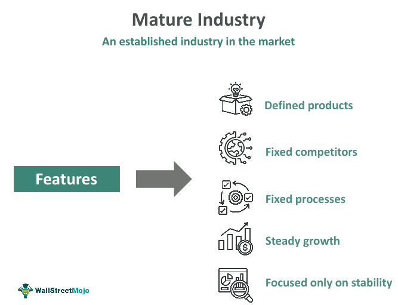

## Table of Contents

## What is a mature economy?

A mature economy is an economy that has reached a high level of development and stability. It has strong industries, good infrastructure, and a stable financial system. Countries with mature economies usually have high living standards and a lot of wealth. Examples of countries with mature economies include the United States, Japan, and many countries in Western Europe.

In a mature economy, growth might be slower compared to developing economies, but it is more stable and predictable. These economies focus on maintaining their high standards rather than rapid growth. They often have well-established markets and regulations that help keep the economy running smoothly. People in mature economies enjoy more job security and better social services, which contribute to a higher quality of life.

## How does a mature economy differ from an emerging economy?

A mature economy and an emerging economy are different in many ways. A mature economy is like a well-grown tree that has strong roots and branches. It has been around for a long time, so it is stable and developed. Countries with mature economies, like the United States or Germany, have good roads, schools, and hospitals. They also have lots of businesses and people who have jobs. These countries grow slowly but steadily, and people there usually have a good life with many comforts.

On the other hand, an emerging economy is like a young tree that is still growing. These economies are found in countries that are developing and trying to get better. Countries like India or Brazil are examples of emerging economies. They are working hard to build better roads, schools, and hospitals. Their businesses are growing fast, and they want to catch up with mature economies. Life in these countries can change a lot, and sometimes it's not as stable, but there is a lot of hope and energy for the future.

In summary, the main difference between a mature economy and an emerging economy is their stage of development. Mature economies are stable and have reached a high level of growth, while emerging economies are still growing and trying to improve. Both types of economies have their own challenges and opportunities, but they are at different points in their journey.

## What are the key characteristics of a mature economy?

A mature economy is like a big, strong tree that has grown for a long time. It has strong roots, which means it has good infrastructure like roads, bridges, and schools. It also has many big businesses and factories that make lots of things. People in a mature economy usually have good jobs and earn enough money to live well. The government in these countries helps by making rules that keep the economy running smoothly. Countries like the United States, Japan, and Germany are examples of mature economies.

These economies don't grow as fast as younger, developing economies, but they are very stable. This means that people can count on things staying the same and not changing too much. In a mature economy, people enjoy a high standard of living, which means they have good healthcare, education, and other services. Because the economy is stable, people feel safe and secure in their jobs and homes. While mature economies might not have the excitement of fast growth, they offer a comfortable and predictable life for their people.

## What industries typically thrive in a mature economy?

In a mature economy, industries that focus on services and technology often do very well. These economies have a lot of people who need things like healthcare, education, and banking services. Companies that provide these services grow because people in mature economies have the money to pay for them. Technology companies also thrive because people and businesses need new gadgets and software to make their lives and work easier.

Another type of industry that does well in a mature economy is the finance industry. Banks, insurance companies, and investment firms are important because they help people save money, protect their belongings, and invest for the future. Since people in mature economies have more money to save and invest, these financial services are in high demand. These industries help keep the economy stable and help people plan for their future.

Manufacturing can also be strong in a mature economy, but it often focuses on high-quality, specialized products. Instead of making a lot of simple things, these economies make fewer, but more complex and valuable items. This includes things like cars, airplanes, and advanced machinery. These products need a lot of skill and technology to make, which mature economies have. So, while they might not produce as many goods as developing economies, the goods they do produce are often of very high quality.

## How does a mature economy impact the standard of living?

A mature economy helps make life better for people. In these economies, people usually have good jobs and earn enough money to live comfortably. They can afford nice homes, good food, and fun activities. The government in a mature economy makes sure there are good schools, hospitals, and roads. This means people can get a good education, stay healthy, and move around easily. Because the economy is stable, people feel safe and can plan for the future without worrying too much about money.

Services like healthcare and education are very important in a mature economy. People can go to the doctor when they are sick and get the care they need. Schools are good, so kids can learn a lot and have a bright future. There are also many services like banks and insurance companies that help people save money and protect their belongings. All these things make life easier and more enjoyable. In a mature economy, the focus is on making sure everyone can live a good life, not just on growing the economy quickly.

## What are the common economic indicators used to identify a mature economy?

Economists use certain signs to tell if an economy is mature. One big sign is a high Gross Domestic Product (GDP) per person. This means the country is rich, and people have a lot of money to spend. Another sign is a low unemployment rate, which means most people have jobs. Mature economies also have low inflation, which means prices don't go up too fast. These economies have good infrastructure, like roads and schools, and lots of businesses that make things or provide services.

Another important sign is the stability of the economy. Mature economies don't grow super fast, but they grow steadily and predictably. This makes people feel safe and secure. They also have strong financial systems, with banks and stock markets that work well. People in these economies can save money, get loans, and invest for the future. Mature economies often have a lot of trade with other countries, which helps them stay strong and connected to the world.

Overall, mature economies are known for their high living standards and stable growth. People enjoy good healthcare, education, and other services. The government makes rules to keep the economy running smoothly. All these factors help make life better for everyone in a mature economy.

## How do mature economies manage economic growth and stability?

Mature economies manage economic growth and stability by using smart policies and good planning. They make sure businesses can grow but not too fast, so the economy stays stable. They do this by setting rules for banks and companies, which helps prevent big problems like crashes or bubbles. Governments in mature economies also spend money on things like roads, schools, and hospitals, which helps keep the economy strong and people happy. They also help people who lose their jobs by giving them support, so they can find new work and keep spending money.

Another way mature economies keep things stable is by working with other countries. They trade goods and services, which helps their own economy grow. They also join groups like the World Bank and the International Monetary Fund, which help them work together with other countries to solve big problems. By doing all these things, mature economies can grow slowly but steadily, making sure everyone has a good life and the economy stays strong for a long time.

## What role does government policy play in a mature economy?

Government policy is very important in a mature economy. It helps keep the economy stable and growing slowly but steadily. The government makes rules for banks and companies to follow, which stops big problems like economic crashes or bubbles from happening. They also spend money on things like roads, schools, and hospitals, which makes life better for people and keeps the economy strong. By doing these things, the government makes sure businesses can grow without causing too much trouble.

The government also helps people who lose their jobs by giving them support, so they can find new work and keep spending money. This helps keep the economy moving. Mature economies often work with other countries, trading goods and services, which helps their own economy grow. They also join groups like the World Bank and the International Monetary Fund, which help them work together with other countries to solve big problems. By using smart policies and good planning, the government in a mature economy helps make sure everyone has a good life and the economy stays strong for a long time.

## How do mature economies handle inflation and unemployment?

Mature economies use smart policies to keep inflation and unemployment under control. Inflation is when prices go up, and mature economies try to keep it low so people can afford things. They do this by setting interest rates, which is like the cost of borrowing money. If inflation is too high, the government might raise interest rates to make borrowing more expensive, which slows down spending and helps bring prices down. On the other hand, if inflation is too low, they might lower interest rates to make borrowing cheaper, which encourages people to spend more and helps prices go up a little.

Unemployment is when people who want jobs can't find them. Mature economies work hard to keep unemployment low so people can have jobs and earn money. They do this by helping businesses grow and by giving support to people who lose their jobs. For example, the government might offer training programs to help people learn new skills and find new jobs. They also might spend money on big projects like building roads or schools, which creates jobs. By doing these things, mature economies make sure most people can work and have a good life.

## What are the challenges faced by mature economies in the global market?

Mature economies face some big challenges in the global market. One big challenge is competition from other countries, especially those with emerging economies. These countries can make things cheaper because they have lower costs for things like labor and materials. This makes it hard for businesses in mature economies to sell their products at a good price. Another challenge is keeping up with new technology. Mature economies need to keep investing in new ideas and inventions to stay ahead, but this can be expensive and risky.

Another challenge is dealing with changes in the world economy. Things like trade wars, changes in currency values, and global financial crises can make it hard for mature economies to stay stable. They need to be ready to change their policies quickly to handle these problems. Also, mature economies often have an aging population, which means fewer people are working and more people need support. This can slow down the economy and make it harder to grow. By understanding these challenges, mature economies can work on finding ways to stay strong and competitive in the global market.

## How do technological advancements influence the functionality of a mature economy?

Technological advancements help mature economies work better and stay competitive. New technology can make businesses more efficient, which means they can make things faster and cheaper. This is good for the economy because it can lead to more jobs and higher profits. For example, computers and the internet have changed how people work and buy things. Now, people can work from home and shop online, which makes life easier and helps the economy grow. But, mature economies need to keep investing in new technology to stay ahead. If they don't, other countries might catch up and take their place in the global market.

However, technological advancements can also create challenges for mature economies. When new technology comes along, some jobs can disappear. For example, robots and computers can do work that people used to do, which can lead to unemployment. Mature economies need to find ways to help people who lose their jobs because of technology. They can do this by offering training programs so people can learn new skills and find new jobs. Also, new technology can be expensive, so mature economies need to be smart about how they spend money on it. By managing these challenges well, mature economies can use technology to keep growing and improving life for everyone.

## What strategies can mature economies adopt to sustain long-term growth?

Mature economies can keep growing by focusing on new ideas and technology. They need to spend money on research and development to come up with new inventions and better ways of doing things. This can help businesses make things more efficiently and create new products that people want to buy. Mature economies should also help small businesses grow because they can bring new ideas and jobs to the economy. By supporting education and training, these economies can make sure people have the skills they need to work with new technology and start their own businesses.

Another way mature economies can keep growing is by trading with other countries. They should make it easy for businesses to sell their products around the world. This can help them reach more customers and make more money. Mature economies also need to be ready to change their policies if the world economy changes. They should have plans to deal with things like trade wars or financial crises. By staying flexible and working with other countries, mature economies can keep growing and stay strong in the global market.

## References & Further Reading

[1]: Gomber, P., Arndt, B., Lutat, M., & Uhle, T. (2011). ["High-Frequency Trading."](https://papers.ssrn.com/sol3/papers.cfm?abstract_id=1858626) Business & Information Systems Engineering, 3(2), 85-89. 

[2]: Harris, L. (2003). ["Trading and Exchanges: Market Microstructure for Practitioners."](https://www.amazon.com/Trading-Exchanges-Market-Microstructure-Practitioners/dp/0195144708) Oxford University Press.

[3]: Lopez de Prado, M. (2018). ["Advances in Financial Machine Learning."](https://www.amazon.com/Advances-Financial-Machine-Learning-Marcos/dp/1119482089) Wiley. 

[4]: Aldridge, I. (2013). ["High-Frequency Trading: A Practical Guide to Algorithmic Strategies and Trading Systems."](https://www.amazon.com/High-Frequency-Trading-Practical-Algorithmic-Strategies/dp/1118343506) Wiley. 

[5]: Fabozzi, F. J., Focardi, S. M., & Kolm, P. N. (2010). ["Quantitative Equity Investing: Techniques and Strategies."](https://www.semanticscholar.org/paper/Quantitative-Equity-Investing%3A-Techniques-and-Fabozzi-Focardi/1c49a2a53919f7e65cb96f16691b8ff726fd3cd7) Wiley.

[6]: Goh, J. (2012). ["Mature Economies and Structural Changes in the Global Market."](https://www.sciencedirect.com/science/article/pii/B9780128158982000161) Cambridge Journal of Regions, Economy and Society, 5(2), 263-280.

[7]: Grech, V., & Calleja, N. (2018). ["Blockchain as an Integrative Solution for a Mature Economy."](https://pubmed.ncbi.nlm.nih.gov/29678516/) The Lancet.