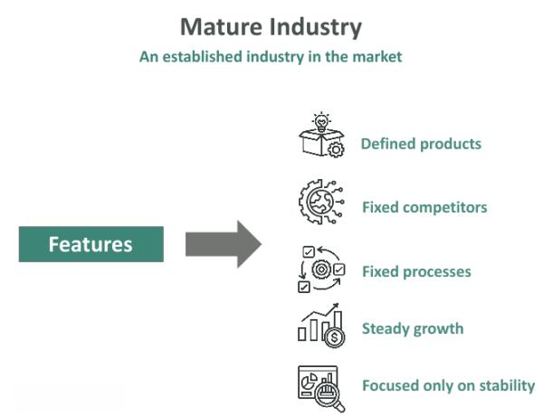

In today's rapidly evolving global marketplace, understanding industry dynamics is key to strategic planning. Recognizing which industries are mature and understanding their characteristics can provide valuable insights for decision-making and investment opportunities. Mature industries, defined by their phase of slow to moderate growth, play a critical role in the economy by offering stability and reliable returns. This article will explore the characteristics of such industries, highlight specific examples, and examine how algorithmic trading serves as a significant component in these sectors.

Mature industries are known for their standardized products or services, emphasizing efficiency and cost management. They are dominated by well-established companies with limited expansion opportunities, yet their importance cannot be overstated as they form the backbone of many economies. In these settings, where innovation rates are typically low, companies must focus on maintaining a competitive advantage by optimizing operations and exploring incremental improvements.



We will investigate how these industries operate within a stable yet challenging environment. The discussion will include an examination of algorithmic trading, a cutting-edge technological advancement that offers a transformative potential for mature industries. Algorithmic trading leverages advanced algorithms and high-speed computing to execute trades, optimizing both speed and precision. This technology can significantly enhance market insights, enable efficient financial portfolio management, and minimize errors associated with human judgment.

This article aims to provide insights not just for industry experts, but also for investors, analysts, and entrepreneurs interested in mature industries and algorithmic trading. Through examining various industry characteristics and examples, we will gain a deeper understanding of business lifecycles and the potential of algorithmic trading to innovate operations within established sectors.

## Table of Contents

## Understanding Mature Industries

A mature industry is characterized by reaching a phase of slow to moderate growth after a period of rapid expansion. Typically, these industries exhibit widespread market acceptance and offer standardized products or services. The standardization leads to a saturation point where growth diminishes as potential customers are already reached. 

In mature industries, the focus shifts towards operational efficiency and cost management rather than innovation. This results from technological advancement hurdles or product saturation, which limit the potential for groundbreaking innovations. Consequently, incremental improvements are more common, aiming at enhancing processes or product features to maintain competitiveness.

Companies operating in mature industries are generally well-established and face limited avenues for significant expansion. The market dynamics in such industries are defined by stable competition, where market shares experience minimal fluctuations barring any substantial technological breakthroughs or changes. As a result, businesses in these sectors concentrate on optimizing resource utilization and reducing costs to maintain or improve profit margins, which are often pressured by intense price competition.

Despite the restricted growth, mature industries hold critical importance to the economy. They provide a foundation of stability, and because of their established market dynamics, they often deliver reliable returns. These industries also tend to benefit from economies of scale, which further contribute to their ability to offer competitive pricing.

Examples of mature industries include sectors such as automotive, where companies like Ford and Toyota dominate; steel, led by key players such as ArcelorMittal who focus on standardization and cost management; and consumer electronics, where giants like Samsung and Sony thrive on brand loyalty and incremental product enhancements. In these industries, the focus is often on achieving operational efficiencies and maintaining competitive advantages in a challenging environment.

## Characteristics of Mature Industries

Mature industries exhibit several defining characteristics, each contributing to a relatively stable yet competitive market environment. One prominent feature is market saturation. In mature industries, the majority of potential customers have already been reached, resulting in slower market growth. This saturation means that companies often need to find innovative ways to maintain their customer base or expand their market share, typically through incremental improvements or cost reductions.

Standardization is another characteristic of mature industries. As products and services have achieved widespread acceptance, they tend to become quite similar across different competitors. This standardization limits differentiation, pushing companies to compete primarily on price, efficiency, and brand loyalty rather than unique product features.

The competition in mature industries is generally stable. Market share fluctuations are minimal unless a major innovation occurs. Companies are often well-established and maintain their positions through extensive resources and market knowledge. Consequently, the introduction of disruptive innovations is rare, which maintains a predictable competitive landscape.

Innovation in mature industries tends to be incremental rather than revolutionary. Companies focus on refining existing products and processes rather than developing entirely new offerings. This reduction in breakthrough innovations may stem from technological plateaus, where the potential for groundbreaking technological advancements has diminished.

Profit margins in mature industries, while stable, face pressure from price competition and cost management challenges. As companies vie to retain or expand their market share, they often engage in price wars, which can erode profit margins. To combat this, businesses may seek efficiencies in production and operations to sustain profitability.

Lastly, economies of scale play a critical role in mature industries. Large players benefit significantly from cost efficiencies due to their ability to spread costs over a large [volume](/wiki/volume-trading-strategy) of production. This advantage helps in maintaining competitive pricing and can act as a barrier to entry for smaller firms trying to penetrate the market. These economies of scale contribute to sustaining competitive advantage and, crucially, enable large firms to retain their dominant market positions.

## Algorithmic Trading in Mature Industries

Algorithmic trading has revolutionized the way trading operations are conducted in mature industries. By utilizing complex algorithms and high-speed computing, this form of trading enhances the execution of trades, maximizing speed and efficiency. In mature industries such as financial services, where market [volatility](/wiki/volatility-trading-strategies) is typically low, [algorithmic trading](/wiki/algorithmic-trading) confers significant advantages. It offers precision in trade execution, allowing companies to refine their market insights and strategies.

One of the notable benefits of algorithmic trading is its ability to manage financial portfolios with high accuracy. Unlike traditional trading, which is subject to human error and emotional biases, algorithmic trading methods employ objective, data-driven processes. This approach ensures consistent decision-making and enhances the management of risk, which is crucial in mature industries.

The use of algorithmic trading is particularly prominent in the financial services sector, a quintessential mature industry. Institutions within this sector have increasingly adopted algorithmic techniques as they strive for improved returns. The rapid processing of large sets of market data allows for timely decisions that can capitalize on fleeting opportunities, an essential capability in a low-growth environment. The minimization of transaction costs and enhanced risk management further solidify the role of algorithmic trading as an indispensable tool in these stable, yet competitive, markets.

For example, Python has emerged as a popular language for developing algorithmic trading strategies due to its extensive libraries such as NumPy, pandas, and scikit-learn, which enable efficient data manipulation and predictive modeling. A simple algorithmic trading strategy can be implemented using Python as follows:

```python
import pandas as pd

def sma_strategy(prices, short_window, long_window):
    signals = pd.DataFrame(index=prices.index)
    signals['price'] = prices
    signals['short_mavg'] = prices.rolling(window=short_window, min_periods=1).mean()
    signals['long_mavg'] = prices.rolling(window=long_window, min_periods=1).mean()

    signals['signal'] = 0.0
    signals['signal'][short_window:] = np.where(
        signals['short_mavg'][short_window:] > signals['long_mavg'][short_window:], 1.0, 0.0)

    signals['positions'] = signals['signal'].diff()
    return signals

# Example usage: prices is a pandas Series of asset prices
strategy_signals = sma_strategy(prices, short_window=40, long_window=100)
```

This code snippet demonstrates a basic strategy using short-term and long-term simple moving averages to generate buy and sell signals. The culmination of technological advancement and sophisticated algorithms has fortified algorithmic trading's position in mature industries, equipping them with the tools needed to maintain competitiveness and adapt to evolving market conditions.

## Examples of Mature Industries

The landscape of mature industries encompasses various sectors that have reached a phase where growth is moderate and market dynamics are stable. This section provides examples of such industries, highlighting their characteristics and the strategies employed by major players to maintain their positions.

Automotive: The automotive industry is characterized by its focus on operational efficiencies and product reliability. Dominated by renowned brands such as Ford and Toyota, these companies invest heavily in streamlining production processes and enhancing the durability of their vehicles to maintain competitiveness. With technological advancements, they have incorporated automation and robotics into their manufacturing processes to achieve cost efficiencies and consistent quality.

Steel: Within the steel industry, standardization and cost management are crucial. Giants like ArcelorMittal lead the sector by optimizing their production processes to achieve economies of scale. This involves the utilization of advanced metallurgical techniques and efficient resource allocation to minimize production costs. The industry continues to face challenges such as fluctuating raw material prices and environmental regulations, prompting companies to innovate and seek sustainable practices.

Consumer Electronics: Companies such as Samsung and Sony dominate the consumer electronics sector, competing fiercely on product upgrades and brand loyalty. The market is saturated with similar products, necessitating a focus on incremental innovations and differentiation through marketing strategies. These corporations leverage their extensive research and development capabilities to introduce new features and maintain consumer interest, while also engaging in branding efforts to foster customer loyalty.

Financial Services: The financial services industry operates under heavy regulatory environments, which has led to the adoption of technology-driven solutions like algorithmic trading to enhance performance. By employing advanced algorithms and high-speed computing, financial institutions can execute trades with precision and efficiency. This not only optimizes profitability but also aids in risk management, providing a competitive edge in a mature sector where margin improvements are essential. Algorithmic trading is increasingly vital as it helps bankers and asset managers navigate complex financial landscapes and optimize investment strategies.

## Challenges and Opportunities in Mature Industries

Mature industries face several challenges that test their ability to maintain competitive advantage and profitability. A prominent challenge is price competition. As industries mature, products and services become commoditized, leading companies to compete primarily on price. This necessitates efficient production processes and stringent cost management practices to sustain profit margins. For instance, companies might use lean manufacturing techniques or adopt advanced supply chain technologies to optimize cost-efficiency.

Regulatory pressures present another significant challenge. Mature industries often operate in heavily regulated environments, which can affect strategic decision-making. Companies must remain agile to adapt to changes in regulation, maintaining compliance while preserving their market position. This is particularly important in industries like automotive and financial services, where regulations can change rapidly and have extensive impacts on operations.

Technological disruption is both a risk and an opportunity for mature industries. While it poses the threat of making existing products or processes obsolete, those companies that successfully leverage technology can differentiate themselves from competitors. For example, automation and [artificial intelligence](/wiki/ai-artificial-intelligence) can enhance operational efficiencies and customer experience. 

Considering the potential for strategic realignment, mature industries can look towards forming strategic alliances, engaging in mergers, or pursuing diversification as pathways for growth. These strategies can provide access to new markets, technologies, or customer bases, thus enhancing growth prospects. By forming partnerships or acquiring new businesses, companies can expand their capabilities and mitigate risks associated with stagnation. 

In summary, while mature industries confront challenges such as price competition and regulatory pressures, they also have opportunities to innovate through technology and strategic growth initiatives. Companies that effectively navigate these dynamics can sustain their competitive advantage and achieve long-term success.

## Conclusion

Mature industries, characterized by steady growth and reliable returns, form the backbone of the global economy. These industries provide stability through established market dynamics and benefit significantly from economies of scale. In these sectors, large firms leverage their size to achieve cost efficiencies, resulting in competitive pricing and consistent profits.

Algorithmic trading presents a transformative opportunity for mature industries, enhancing efficiency and precision in financial decision-making. By utilizing complex algorithms and high-speed computing, businesses can optimize trade execution, minimize errors, and reduce the influence of human emotion on decisions. This technological advancement is crucial for financial services, where firms seek to enhance returns and effectively manage risks.

For businesses operating in mature industries, continuous adaptation and strategic planning are vital for navigating the inherent challenges. The incremental pace of innovation and intense price competition necessitate a proactive approach to maintain competitive advantages. Companies need to regularly reassess their strategies, embracing technology and innovation to explore new opportunities for growth and differentiation.

Investors and businesses must strike a careful balance between the stability offered by mature industries and the pursuit of growth. Leveraging technology, forming strategic partnerships, and adapting to market changes are essential strategies for sustained success. By doing so, they can not only maintain their market position but also capitalize on emerging opportunities to enhance their long-term performance.

## References & Further Reading

[1]: Bergstra, J., Bardenet, R., Bengio, Y., & Kégl, B. (2011). ["Algorithms for Hyper-Parameter Optimization."](https://dl.acm.org/doi/10.5555/2986459.2986743) Advances in Neural Information Processing Systems 24.

[2]: ["Advances in Financial Machine Learning"](https://www.amazon.com/Advances-Financial-Machine-Learning-Marcos/dp/1119482089) by Marcos Lopez de Prado

[3]: ["Evidence-Based Technical Analysis: Applying the Scientific Method and Statistical Inference to Trading Signals"](https://www.amazon.com/Evidence-Based-Technical-Analysis-Scientific-Statistical/dp/0470008741) by David Aronson

[4]: ["Machine Learning for Algorithmic Trading"](https://github.com/stefan-jansen/machine-learning-for-trading) by Stefan Jansen

[5]: ["Quantitative Trading: How to Build Your Own Algorithmic Trading Business"](https://github.com/LucindaYa/quant-resources/blob/master/Quantitative%20Trading%20How%20to%20Build%20Your%20Own%20Algorithmic%20Trading%20Business.pdf) by Ernest P. Chan