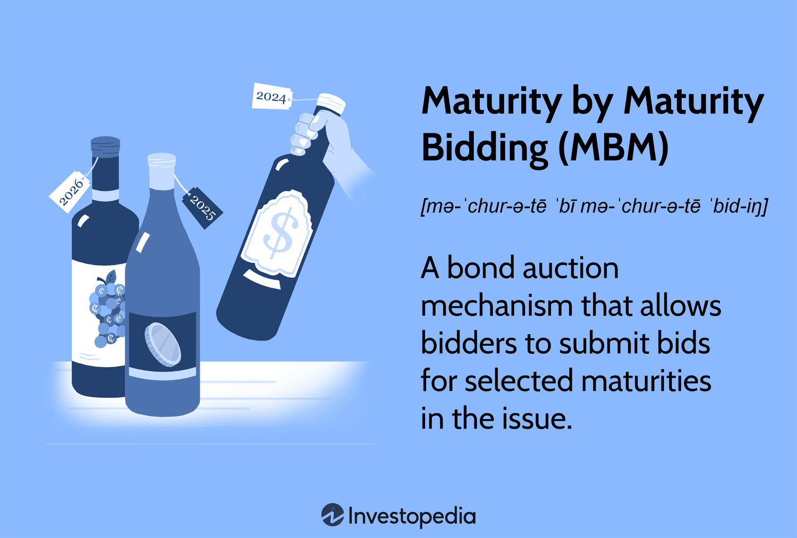

In the rapidly evolving world of finance, the intersection of maturity bidding, investment strategies, and algorithmic trading is becoming increasingly important. This article seeks to explore how these concepts intertwine to create sophisticated investment strategies that can optimize financial outcomes. By analyzing the fundamentals of maturity bidding, we aim to highlight its potential as a flexible bond auction mechanism that allows investors to select specific maturities, enhancing their investment strategies. 

Investment strategies are evolving to better manage risks while maximizing returns, and understanding maturity bidding can be pivotal in this process. With a focus on methodologies such as laddering and barbell investing, investors can refine their strategies to effectively navigate interest rate fluctuations and achieve financial goals. 

In addition to traditional investment tactics, the role of algorithmic trading in modern financial markets is becoming a cornerstone of strategic decision-making. Algorithmic trading harnesses sophisticated algorithms to automatically execute trades, offering an edge by capitalizing on minute market opportunities that human traders might overlook. 

For investors, embracing technology's role in finance is essential for enhancing portfolio performance and making strategic investment decisions. This article will provide insights into leveraging algorithmic trading to identify and capitalize on market opportunities, ultimately supporting more informed investment strategies. Understanding these interconnected concepts is crucial for investors who wish to adeptly navigate today’s complex financial landscape and harness technological advancements for portfolio enhancement.

## Table of Contents

## Understanding Maturity Bidding

Maturity by maturity bidding (MBM) is an auction process within bond markets that allows bidders to select specific bond maturities rather than placing bids on an entire bond issue. This auction-style offers bond buyers, notably in municipal bond markets, a higher degree of flexibility by allowing them to tailor their investments according to specific maturity preferences. Investors can align their bond portfolios more precisely with their financial strategies, resulting in improved cash flow management and enhanced alignment with financial goals.

In traditional all-or-none bidding methods, investors must bid on the full range of maturities offered in a bond issue without the liberty to pick and choose maturities that fit their needs. This limitation can often lead to suboptimal portfolio management, as investors may end up with bonds that do not match their cash flow requirements or risk preferences. MBM, on the other hand, empowers investors to target specific maturities, optimizing their investment strategies without committing to undesired maturity lengths. 

For instance, a municipal bond investor with an impending need for [liquidity](/wiki/liquidity-risk-premium) in five years might choose to bid only on bonds maturing in that timeframe. By doing so, the investor avoids the risk of holding longer-term bonds that may not align with their liquidity needs. This level of precision is particularly beneficial for those interested in cash flow matching and [interest rate](/wiki/interest-rate-trading-strategies) risk management. 

Real-world applications of MBM illustrate its viability and advantages. For example, consider a municipal authority conducting a bond auction to fund a significant infrastructure project. Through MBM, institutional investors select maturities that align with their investment horizons and risk assessments, thereby distributing the financing burden more efficiently. This approach ensures that each series of the bond is accounted for by investors who specifically desire those particular maturities. The tailored nature of these bids often leads to increased market participation, potentially lowering the overall borrowing costs due to better interest rate offerings from targeted investor pools.

In conclusion, MBM offers several tactical advantages over the conventional all-or-none bidding approach. The flexibility it provides allows for more precise investment decisions, better cash flow management, and alignment with long-term financial strategies. As such, MBM holds significant potential for optimizing bond investment outcomes and warrants consideration by both investors and issuers seeking to achieve strategic financial objectives.

## Investment Strategies and Maturity

Investment strategies are fundamentally shaped by the dual objectives of risk management and return maximization, with maturity dates playing a pivotal role in their formulation. The interplay between maturity dates and investment strategies is critical, as it influences the allocation and performance of various investment vehicles such as bonds, loans, and derivatives.

One commonly employed strategy is laddering. Laddering involves purchasing bonds with staggered maturity dates to balance income flow and reduce exposure to interest rate fluctuations. By holding bonds that mature at regular intervals, investors can reinvest proceeds at prevailing market rates, effectively averaging interest rate risks over time.

Another notable strategy is barbell investing, which combines short-term and long-term bonds, leaving a gap between their maturities. This approach capitalizes on both ends of the yield curve, offering liquidity from short-term bonds while aiming for higher yields from long-term bonds. Barbell strategies hedge against the [volatility](/wiki/volatility-trading-strategies) of interest rate changes, providing a structural advantage in uncertain markets.

Bond swaps are also integral to maturity-focused investment strategies. Investors may exchange a bond with a nearing maturity or a less favorable yield for one with a more advantageous maturity structure or yield profile. Swaps allow investors to realign their portfolios in response to shifting economic conditions or changes in personal investment goals.

When assessing how maturity affects different investment vehicles, it's crucial to understand that bonds are generally more sensitive to interest rate changes compared to loans or derivatives. For instance, the relationship between bond prices and interest rates is inversely proportional; as rates increase, bond prices typically decrease, affecting long-maturity bonds more significantly due to their greater duration.

Investors must tailor their maturity selections based on liquidity needs, risk tolerance, and financial objectives. For those requiring liquidity, shorter maturities are preferable, whereas long-dated securities might suit investors seeking higher yields and willing to tolerate more risk.

Interest rate fluctuations significantly influence investment decisions regarding maturities. In a rising interest rate environment, short-term maturities may be preferred to provide flexibility for reinvestment at higher rates. Conversely, in a declining rate scenario, locking in long-term rates might mitigate the risk of reinvesting at lower yields.

Understanding these dynamics enables investors to craft strategies that not only weather economic variability but also strategically leverage maturity structures for optimization of returns and efficient risk management.

## Algorithmic Trading in Finance

Algorithmic trading, often referred to as algo-trading, represents a groundbreaking development in financial markets by automating trade execution using complex algorithms. These algorithms process vast quantities of data to facilitate decision-making, optimizing trading efficiency and accuracy. The incorporation of maturity dates into these algorithms enhances strategy precision and enables traders to execute high-frequency strategies adeptly, aligning trades with prevailing market conditions. This integration allows for a granular approach to trading that can adapt to changing dynamics with minimal latency, thus capturing fleeting market opportunities effectively.

The integration of [machine learning](/wiki/machine-learning) (ML) and [artificial intelligence](/wiki/ai-artificial-intelligence) (AI) in [algorithmic trading](/wiki/algorithmic-trading) has revolutionized the landscape by offering enhanced predictive capabilities and sophisticated risk management techniques. Machine learning models, such as neural networks, support vector machines, and decision trees, contribute to developing algorithms that can identify complex patterns and trends. For instance, algorithms can be trained to predict price movements based on historical data, market sentiment, and even macroeconomic indicators, improving return projections and reducing risk exposure.

Several types of algo-trading strategies exemplify the breadth and depth of this approach:

1. **Trend Following**: This strategy capitalizes on the momentum of asset price movements. Algorithms identify and follow trends by analyzing historical price data and indicators, such as moving averages. The logic is that assets in motion tend to continue moving in the same direction.

2. **Mean Reversion**: This strategy is based on the concept that asset prices tend to revert to their historical averages over time. Algorithms monitor for deviations from this mean and execute trades to profit from anticipated reversions. It requires the accurate assessment of a ‘normal’ range for an asset's price movement.

3. **Statistical Arbitrage**: This involves complex mathematical models to identify pricing inefficiencies between related securities. Algorithms execute trades to exploit these discrepancies, often involving high-frequency trading. A common statistical arbitrage strategy is pairs trading, where two historically correlated securities are traded against each other based on temporary deviations from their correlation.

The impact of algorithmic trading extends beyond individual strategy performance to influence broader market dynamics. Algo-trading significantly enhances market liquidity by reducing the bid-ask spread and improving price discovery by rapidly incorporating information into asset prices. However, it also introduces challenges such as potential market manipulation and increased volatility during periods of market stress.

The transformative role of algorithmic trading in modern finance is underscored by its prevalence and impact across global markets. As technology advances, the continuous improvement of algorithms and analytical techniques promises to refine trading strategies further, enhancing market efficiency and offering sophisticated tools for investors to manage risks and optimize returns.

## Conclusion

The convergence of maturity bidding, investment strategies, and algorithmic trading presents an evolving landscape for investors, replete with both opportunities and challenges. Mastery of these concepts can significantly improve decision-making processes, supporting the development of more adaptable and responsive investment strategies. By understanding how maturity bidding can align investment horizons with financial goals, investors gain the precision necessary for effective cash flow management and risk adjustment. Similarly, discerning the intricacies of various investment strategies allows for optimized asset allocation in response to changes in market conditions and interest rates.

Algorithmic trading further augments these capabilities by automating complex trading decisions and processing large datasets with precision and speed. Incorporating advanced technologies like machine learning enhances predictive accuracy, allowing for nuanced adjustments to trading strategies based on real-time data analysis. For instance, machine learning models can identify latent patterns in market movements that may inform strategic timing for maturity purchases or sales. Such integration promises more refined risk management and the ability to capitalize on fleeting market opportunities.

As financial markets continue to evolve, embracing these modern techniques is vital for maintaining a competitive edge in wealth management. Continuous learning and adaptation are paramount, as investors must remain informed about emerging tools and technologies to navigate an increasingly intricate financial environment effectively. The ongoing synthesis of technology and finance is likely to drive the next wave of innovations in investment strategy, offering sophisticated solutions to complex financial challenges.

Embracing these advancements not only empowers investors to make strategic and well-informed decisions but also prepares them to leverage cutting-edge developments, ensuring their portfolios remain resilient and growth-oriented amidst market volatility.

## References & Further Reading

[1]: ["Advances in Financial Machine Learning"](https://www.amazon.com/Advances-Financial-Machine-Learning-Marcos/dp/1119482089) by Marcos Lopez de Prado

[2]: ["Machine Learning for Algorithmic Trading"](https://github.com/stefan-jansen/machine-learning-for-trading) by Stefan Jansen

[3]: ["Quantitative Trading: How to Build Your Own Algorithmic Trading Business"](https://www.amazon.com/Quantitative-Trading-Build-Algorithmic-Business/dp/1119800064) by Ernest P. Chan

[4]: ["Evidence-Based Technical Analysis: Applying the Scientific Method and Statistical Inference to Trading Signals"](https://www.amazon.com/Evidence-Based-Technical-Analysis-Scientific-Statistical/dp/0470008741) by David Aronson