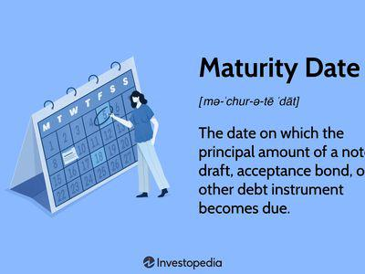

## Table of Contents

## What is a maturity date?

A maturity date is the final date when a financial instrument, like a bond or a loan, must be paid back. It's the day when the borrower has to return the money they borrowed, plus any interest that has built up over time. For example, if you take out a loan that has a maturity date in five years, you need to pay back the entire loan on that specific date.

This date is important because it helps both the borrower and the lender plan their finances. The borrower knows exactly when they need to have the money ready, and the lender knows when they will get their money back. Knowing the maturity date helps everyone involved manage their money better and avoid surprises.

## Why are maturity dates important in financial instruments?

Maturity dates are important in financial instruments because they tell everyone when the money needs to be paid back. This is really helpful for planning. If you know when you have to pay back a loan, you can make sure you have the money ready by that date. It's the same for the person or bank that lent you the money; they know exactly when they will get their money back.

This date also helps people manage their money better. For example, if you have a bond that matures in ten years, you can plan your investments and savings around that time. It gives everyone a clear timeline, which reduces surprises and helps keep finances stable. Knowing the maturity date makes it easier for everyone to stay on top of their financial responsibilities.

## Can you explain how maturity dates work with bonds?

When you buy a bond, you're basically lending money to the company or government that issued it. The maturity date of a bond is like a promise from them. It tells you exactly when they will give your money back, plus any interest they owe you. For example, if you buy a bond that matures in 5 years, the issuer has to pay you back everything on that specific date.

This date is super important because it helps you plan your finances. If you know when your bond will mature, you can decide what to do with the money when you get it back. Maybe you'll invest it in something else, or maybe you'll use it to buy a new car. Knowing the maturity date helps you stay organized and make good financial choices.

## How do maturity dates affect the interest rates of loans?

Maturity dates can affect the interest rates of loans because they tell lenders how long they have to wait to get their money back. If a loan has a long maturity date, like 30 years, it might have a higher [interest rate](/wiki/interest-rate-trading-strategies). This is because the lender is taking a bigger risk by waiting longer to get their money back. They want to be paid more for that risk, so they charge more interest.

On the other hand, if a loan has a short maturity date, like 1 year, it might have a lower interest rate. This is because the lender doesn't have to wait as long to get their money back, so it's less risky for them. They might be okay with charging less interest because they get their money back faster. So, the length of time until the maturity date can make a big difference in how much interest you have to pay on a loan.

## What is the difference between short-term and long-term maturity dates?

Short-term maturity dates are for loans or bonds that need to be paid back quickly, usually within a year. These are good if you need money for a short time, like for a small project or to cover a temporary cash shortage. Because the money is paid back fast, short-term loans often have lower interest rates. It's less risky for the lender because they get their money back soon.

Long-term maturity dates are for loans or bonds that take longer to pay back, often many years. These are useful for big things like buying a house or starting a business, where you need the money for a long time. Because the lender has to wait longer to get their money back, long-term loans usually have higher interest rates. It's riskier for the lender, so they charge more interest to make up for that risk.

## How can investors use maturity dates to manage their portfolios?

Investors can use maturity dates to plan when they will get their money back from bonds or other financial instruments. If an investor knows that a bond will mature in five years, they can plan to use that money for something else at that time, like buying a new car or investing in another opportunity. This helps them spread out their investments over time and make sure they always have money coming in from different sources.

Knowing the maturity dates also helps investors balance risk and reward. For example, if an investor has a lot of bonds that mature at the same time, they might be at risk if something goes wrong with the market at that moment. By choosing bonds with different maturity dates, they can spread out their risk. This way, they won't have all their money tied up in one place at one time, which can make their portfolio more stable and safer over the long run.

## What are some common examples of financial products with maturity dates?

Some common financial products with maturity dates are bonds and loans. A bond is like a promise from a company or government to pay you back your money plus interest on a specific date. For example, if you buy a bond from a company that matures in 10 years, you know you will get your money back after that time. Loans work the same way. When you take out a loan to buy a house or a car, the bank tells you when you have to pay back all the money, which is the maturity date.

Another example is a certificate of deposit (CD). A CD is a type of savings account where you agree to keep your money in the bank for a certain time, and in return, the bank gives you a higher interest rate. The maturity date is when you can take your money out without paying a penalty. For instance, if you have a 2-year CD, you have to wait until the end of those 2 years to get your money back with the interest. Knowing these maturity dates helps people plan their finances better.

## How do maturity dates impact the valuation of fixed income securities?

Maturity dates play a big role in how much fixed income securities, like bonds, are worth. When a bond is close to its maturity date, it's usually worth more because the investor will get their money back soon. If the bond is far from its maturity date, it might be worth less because the investor has to wait longer to get their money back. This is because the longer you have to wait, the more things can change, like interest rates or the financial health of the company that issued the bond.

The time until the maturity date also affects how sensitive the bond's price is to changes in interest rates. If interest rates go up, the price of a bond with a long maturity date will drop more than the price of a bond with a short maturity date. This is because investors can get a better return from new bonds with higher interest rates, so they won't pay as much for the old bond. On the other hand, if interest rates go down, the price of a bond with a long maturity date will go up more than the price of a bond with a short maturity date. Knowing the maturity date helps investors understand how much their bond might be worth in the future.

## What strategies can be employed when dealing with multiple maturity dates in a diversified investment?

When you have a lot of different investments with different maturity dates, one good strategy is to spread them out over time. This is called "laddering." Imagine you have bonds that mature in one year, three years, and five years. By doing this, you make sure that you get some of your money back every few years. This way, you can use that money to invest in something new or to cover any expenses you might have. It also helps reduce risk because you won't have all your money tied up in one place at one time.

Another strategy is to match your investments' maturity dates with your future financial needs. For example, if you know you'll need a big chunk of money in ten years to buy a house, you can invest in a bond that matures around that time. This way, you know you'll have the money when you need it. By planning ahead like this, you can make sure your investments are working for you and helping you reach your goals.

## How do changes in interest rates influence the choice of maturity dates for investments?

Changes in interest rates can really affect which maturity dates you pick for your investments. When interest rates go up, it might be a good idea to choose shorter maturity dates. This is because you can get your money back sooner and then invest it again in new bonds or savings accounts that offer higher interest rates. If you have long-term investments when rates go up, you might miss out on [earning](/wiki/earning-announcement) more money because your money is stuck in the old, lower-rate investment until it matures.

On the other hand, when interest rates go down, it might be better to pick longer maturity dates. This way, you can lock in the higher interest rate you have now for a longer time. If you only have short-term investments when rates drop, you'll have to reinvest your money at the lower rate once your investment matures. By thinking about where interest rates are headed, you can choose maturity dates that help you make the most of your money.

## Can you discuss the role of maturity dates in derivatives and options?

Maturity dates in derivatives and options are like deadlines. They tell you when the contract ends. For example, if you buy an option, it gives you the right to buy or sell something at a certain price, but only until the maturity date. After that date, the option is no more, and you can't use it. So, the maturity date is really important because it tells you how long you have to make your move.

In derivatives, like futures contracts, the maturity date is when the deal has to be settled. If you agreed to buy something in the future, you have to do it on the maturity date. This date helps everyone plan because they know exactly when they need to have the money or the thing they agreed to buy or sell. It's like a big reminder that keeps everyone on track and makes sure the market runs smoothly.

## What advanced techniques can be used to optimize returns based on maturity date analysis?

One advanced technique to optimize returns based on maturity date analysis is called "duration matching." This means you try to match the time when your investments mature with when you need the money. For example, if you know you'll need money in five years, you can buy bonds that mature in five years. This way, you make sure your money is there when you need it, and you can earn interest until then. It's like planning ahead so your investments work perfectly with your life plans.

Another technique is called "yield curve positioning." This is about looking at the interest rates for different maturity dates and choosing the ones that give you the best return. If short-term interest rates are high, you might choose short-term investments. If long-term rates are better, you might go for longer maturities. By understanding the yield curve, you can pick the right times to invest and get more money back. It's like [picking](/wiki/asset-class-picking) the best spots on a ladder to climb higher and reach your financial goals.

## What are the maturity dates across different financial instruments?

Understanding the maturity dates of various financial instruments is crucial for investors and financial professionals, as these dates significantly influence investment strategies, yields, and associated risks.

### Maturity Dates in Bonds
Bonds are fixed-income instruments that entail borrowing funds from investors and repaying them at a specified maturity date. The bond's maturity date is crucial because it affects both yield and risk. A bond's yield to maturity (YTM) considers the total return an investor can expect if the bond is held until maturity, factoring in coupon payments and the difference between the purchase price and the face value.

Mathematically, the YTM is found by solving the equation:

$$

P = \sum_{t=1}^{n} \frac{C}{(1 + r)^t} + \frac{F}{(1 + r)^n} 
$$

where $P$ is the current price of the bond, $C$ is the coupon payment, $F$ is the face value, $r$ is the yield to maturity, and $n$ is the number of periods to maturity. Bonds with longer maturities generally have higher yields to compensate for greater risk, such as interest rate fluctuations and inflation. Conversely, they tend to be riskier due to greater exposure to changes in market conditions over time.

### Maturity in Loans
For loans, maturity refers to the length of time the borrower has to repay the debt in full, including personal, auto, and mortgage loans. Personal loans typically have shorter maturity terms, often ranging from one to five years. These shorter terms mean lenders assume less risk, which can influence interest rates and loan eligibility criteria.

Auto loans usually span from three to seven years, impacting monthly payment amounts and the total interest paid over the life of the loan. Longer maturities result in lower monthly payments but more overall interest, whereas shorter terms achieve the opposite.

Mortgage loans, often the most significant financial commitment for individuals, have maturities that typically range from 15 to 30 years. The choice between a shorter or longer-term mortgage affects not only monthly payments and interest rates but also the total interest paid over the loan's life. Shorter maturities mean less interest paid over time but higher monthly payments.

### Maturity in Derivative Markets
In derivative markets, maturity can sometimes be confused with expiration. However, the two differ substantially. For options, the expiration date is when the option contract becomes void, and the buyer must decide whether to exercise the option. An option's maturity, in contrast, reflects the entire span from the inception of the contract to its expiration date.

The timing of maturity is pivotal in options trading, as it affects an option's premium—comprising intrinsic value and time value—and its sensitivity to the underlying asset's price changes. Understanding these distinctions allows traders to align trading strategies with market expectations and risk tolerances.

By grasping how maturity dates impact different financial instruments, investors can make more informed decisions, aligning their investments with their financial goals and risk preferences.

## References & Further Reading

[1]: ["Maturity in Finance: Understanding the Basics."](https://www.investopedia.com/terms/m/maturity.asp) Investopedia.

[2]: Lopez de Prado, M. (2018). ["Advances in Financial Machine Learning."](https://www.amazon.com/Advances-Financial-Machine-Learning-Marcos/dp/1119482089) John Wiley & Sons.

[3]: Aronson, D. R. (2007). ["Evidence-Based Technical Analysis: Applying the Scientific Method and Statistical Inference to Trading Signals."](https://onlinelibrary.wiley.com/doi/book/10.1002/9781118268315) John Wiley & Sons.

[4]: Chincarini, L., & Kim, D. (2006). ["Quantitative Equity Portfolio Management: An Active Approach to Portfolio Construction and Management."](https://www.amazon.com/Quantitative-Equity-Portfolio-Management-Construction/dp/0071459391) McGraw-Hill Education.

[5]: Jansen, S. (2020). ["Machine Learning for Algorithmic Trading."](https://github.com/stefan-jansen/machine-learning-for-trading) Packt Publishing.