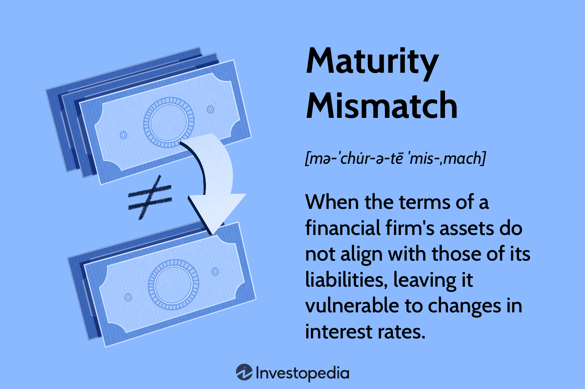

The finance sector deals with a variety of risks, particularly those concerning the alignment of assets and liabilities, a concept known as maturity mismatch. Maturity mismatch occurs when a financial institution's short-term liabilities exceed its short-term assets, potentially leading to liquidity issues. This imbalance can pose significant challenges, as institutions may face difficulties meeting their obligations if their assets do not mature in time to cover their liabilities.

This article explores the concept of maturity mismatch, focusing on its implications for financial institutions and traders, and examines various strategies employed to manage and mitigate associated risks. We also investigate the role of algorithmic trading as a tool for managing financial risks linked to maturity mismatches. Algorithmic trading, through its data-driven approach, allows for the dynamic adjustment of portfolios, helping in the real-time management of risks.



Understanding these concepts is vital for financial professionals, as effective maturity mismatch management is crucial for maintaining liquidity and sustaining profitability. As we proceed, we begin by defining maturity mismatch and consider ways it can be managed to prevent financial distress and ensure operational stability. This understanding is particularly important in a rapidly changing economic environment, where proactive strategies are needed to adapt to new challenges.

## Table of Contents

## Understanding Maturity Mismatch

Maturity mismatch refers to the discrepancy between the durations of a company's short-term liabilities and its short-term assets. This misalignment can lead to significant liquidity challenges, where an organization might find itself unable to meet its short-term obligations due to an insufficient pool of short-term assets. In such situations, a company may be forced to sell long-term assets at unfavorable prices or borrow funds at high interest rates to cover its obligations, potentially leading to financial distress.

Several factors contribute to maturity mismatches. Primarily, changes in interest rates can heavily influence the value and duration of assets and liabilities. For instance, an increase in short-term interest rates might increase the cost of rolling over short-term liabilities, while the returns on long-term assets remain fixed, resulting in a potentially hazardous financial scenario. Inadequate asset-liability management (ALM) is another significant [factor](/wiki/factor-investing). Organizations that lack a robust ALM strategy often fail to align their assets and liabilities appropriately, thereby increasing their exposure to maturity mismatches.

Detecting maturity mismatches early is crucial to avoiding financial distress. Financial institutions can employ various strategies, such as stress testing and scenario analysis, to identify potential mismatches. By simulating different market conditions and interest rate environments, companies can better understand their liquidity positions and take proactive measures to manage their asset and liability durations effectively. Early recognition of these mismatches allows organizations to implement corrective actions, such as re-balancing their portfolios or adjusting their funding strategies, to maintain liquidity and financial stability.

## Financial Risk Management Strategies

Asset-liability management (ALM) is an essential approach to mitigating maturity mismatch risks within financial institutions. By carefully balancing the maturities of assets and liabilities, ALM helps to ensure [liquidity](/wiki/liquidity-risk-premium) and financial stability. This process typically involves several strategies and techniques aimed at offsetting potential mismatches in financial exposures.

### Hedging Techniques

Hedging, a fundamental risk management strategy, employs financial instruments to mitigate potential losses from adverse price movements. Derivatives, such as futures, options, and swaps, are commonly used tools. For instance, [interest rate](/wiki/interest-rate-trading-strategies) swaps allow institutions to exchange fixed-interest obligations for floating ones, aligning cash flows and reducing interest rate risks associated with maturity mismatches. Consider the scenario where a bank has long-term liabilities but short-term assets; by entering into a swap, the bank can better align the timeline of income and obligations.

### Role of Diversification

Diversification plays a pivotal role in managing maturity mismatches. By spreading investments across various asset classes and maturities, institutions can align their assets more closely with their liability profiles. This strategic allocation reduces the reliance on any single source of cash flow and mitigates the risk of liquidity shortages. An example of diversification might involve holding a mix of short-term bonds, long-term loans, and equities, thereby smoothing out cash flow peaks and troughs and enhancing the capacity to meet immediate financial obligations.

### Stress Testing and Scenario Analysis

Stress testing and scenario analysis are critical components in anticipating and responding to adverse market conditions that may exacerbate maturity mismatch risks. Stress testing involves simulating extreme but plausible adverse scenarios to assess the resilience of a financial institution's balance sheet. For example, unexpected changes in interest rates or economic downturns can impact the valuation and cash flow generation of assets and liabilities. Scenario analysis, on the other hand, involves evaluating the effects of hypothetical market shifts to understand potential vulnerabilities and adapt strategies accordingly.

Python can be employed to conduct stress testing and scenario analysis:

```python
import numpy as np

# Example stress test model
def stress_test(initial_cash_flow, rate_change):
    # Simulate cash flow change due to interest rate hike
    adjusted_cash_flow = initial_cash_flow * np.exp(-rate_change)
    return adjusted_cash_flow 

# Hypothetical initial cash flow and interest rate change
initial_cash_flow = 1_000_000
rate_change = 0.05  # 5% increase in interest rates

adjusted_cash_flow = stress_test(initial_cash_flow, rate_change)
print(f"Adjusted Cash Flow: ${adjusted_cash_flow:,.2f}")
```

In conclusion, managing maturity mismatch requires a multifaceted approach involving ALM, hedging techniques, diversification, and advanced analytical tools like stress testing. By adopting these strategies, financial institutions can enhance their ability to maintain liquidity and meet obligations, particularly under challenging economic conditions.

## The Role of Algo Trading in Managing Maturity Mismatch

Algorithmic trading (algo trading) has become a pivotal component in contemporary financial risk management, especially in addressing maturity mismatches. This practice leverages computer algorithms to execute trades at speeds and frequencies that are impossible for human traders, thereby enhancing the ability to swiftly adjust portfolios in response to market conditions.

### Optimizing Asset Allocations

Algo trading algorithms can process vast amounts of real-time data to identify optimal asset allocation strategies. By analyzing current market trends, historical data, and economic indicators, these algorithms can forecast potential mismatches between asset maturities and liabilities. This predictive capability allows financial institutions to reallocate assets efficiently, minimizing exposure to maturity mismatch risks.

Python, due to its extensive libraries for data analysis like pandas and numpy, is often used by financial institutions for [algorithmic trading](/wiki/algorithmic-trading). A basic example of using Python to optimize asset allocation might involve linear programming to adjust portfolio weights to minimize risk:

```python
from scipy.optimize import minimize
import numpy as np

# Example covariance matrix of asset returns
cov_matrix = np.array([[0.0004, 0.0002], [0.0002, 0.0003]])

# Objective function: minimize portfolio variance
def portfolio_variance(weights, cov_matrix):
    return np.dot(weights.T, np.dot(cov_matrix, weights))

# Constraints and bounds
constraints = ({'type': 'eq', 'fun': lambda x: np.sum(x) - 1})
bounds = ((0, 1), (0, 1))

# Initial guess
init_weights = np.array([0.5, 0.5])

# Optimization for minimum variance
optimized = minimize(portfolio_variance, init_weights, args=(cov_matrix), 
                     method='SLSQP', bounds=bounds, constraints=constraints)

optimal_weights = optimized.x
```

This script calculates the optimal weights to minimize variance, a proxy for risk, thereby aligning investment strategies with maturity structures.

### Enhancing Decision-Making 

Algorithmic tools improve decision-making in financial risk management by enabling more precise and timely responses to changing market conditions. Algorithms can automate the monitoring of indicators such as interest rates and liquidity measures, providing alerts when conditions suggest potential maturity mismatches. This real-time analysis allows traders and risk managers to make informed adjustments, maintaining liquidity and profitability.

Additionally, the integration of [machine learning](/wiki/machine-learning) techniques can enhance the predictive accuracy of algo trading systems. Machine learning can identify complex patterns and correlations within financial markets, predicting possible shifts in asset values that could impact maturity alignment.

By transforming vast datasets into actionable insights, algorithmic trading significantly reduces the cognitive load on human managers, allowing them to focus on strategic oversight rather than operational details.

In conclusion, algo trading not only provides the speed and efficiency necessary to manage maturity mismatches effectively but also empowers financial institutions with advanced capabilities to foresee and mitigate associated risks. The incorporation of sophisticated algorithms and real-time data analysis has thus become a cornerstone of modern financial risk management strategies.

## Case Studies and Real-World Applications

Case studies provide valuable insights into how companies effectively manage maturity mismatch risks. These real-world applications highlight the importance of strategic asset-liability management (ALM) and the role of algorithmic trading in mitigating financial risks.

### Case Study 1: Northern Rock

Northern Rock, a UK-based bank, offers a pivotal example of maturity mismatch management necessity. During the 2007–08 financial crisis, Northern Rock faced significant liquidity issues due to its reliance on short-term wholesale funding to finance long-term mortgage assets. The mismatch between asset and liability maturities led to severe funding problems when the wholesale markets froze. In response to these challenges, Northern Rock and its successional banks implemented more rigorous ALM practices, emphasizing matching the maturities of assets and liabilities more closely and diversifying funding sources to reduce reliance on short-term debt.

### Case Study 2: Barclays Bank

Barclays Bank demonstrates the effective use of algorithmic trading in managing maturity mismatches. As part of its risk management strategy, the bank implemented algorithms that continuously monitor market conditions and adjust asset allocations in real-time. This technology allowed for dynamic hedging strategies that minimized the impact of interest rate fluctuations on long-term and short-term asset values. By incorporating real-time data analysis and predictive modeling, Barclays optimized its portfolio to achieve a better maturity match and reduce liquidity risk, thus maintaining financial stability.

### Lessons Learned

1. **Proactive Asset-Liability Management**: Both Northern Rock and Barclays illustrate the critical importance of proactively managing the maturities of assets and liabilities. Ensuring alignment can protect institutions from liquidity crises, especially during volatile market conditions.

2. **Diversification and Flexibility**: Northern Rock's experience underlines the need for diversified funding sources. A broad approach to funding reduces the impact of market disruptions on a single source of finance.

3. **Technology Utilization**: Barclays' use of algorithmic trading highlights the significant advantages of leveraging technology for risk management. Algorithms can provide quick responses to market changes, optimizing asset allocations, and improving the maturity match.

These examples show that careful planning, strategic ALM implementation, and technological advancement play crucial roles in mitigating the risks associated with maturity mismatches. Companies can enhance their financial resilience by learning from these cases and adopting these critical strategies.

## Conclusion

Maturity mismatches pose substantial risks to financial institutions by potentially undermining liquidity and profitability. This risk arises when the maturity structure of assets does not align with liabilities, leading to cash flow discrepancies that can escalate financial instability. However, through strategic planning and the incorporation of technological advancements, such as algorithmic trading, these mismatches can be effectively managed.

Continuous monitoring is critical to ensuring that financial systems remain robust against maturity mismatch risks. Regular assessment allows institutions to identify discrepancies promptly and make proactive adjustments. This ongoing evaluation fosters an adaptable financial framework capable of responding to evolving market conditions and regulatory changes. Advanced analytical tools, including real-time data analysis and predictive modeling, play an essential role in anticipating potential risks and devising effective mitigation strategies.

The integration of sophisticated risk management strategies, including algorithmic trading, offers enhanced resilience against maturity mismatches. Algorithmic systems provide institutions with the capability to rapidly adjust asset allocations based on complex data analytics and market predictions. These systems streamline decision-making processes, allowing for swift response to misalignments and minimizing exposure to liquidity risks. Algorithmic trading tools facilitate efficient portfolio management, ensuring that maturities are effectively synchronized with financial obligations.

For financial professionals, embracing these tools and strategies is not just advantageous but essential for maintaining competitive edge and stability. By adopting an aggressive approach to risk management and leveraging technological innovations, financial institutions can better withstand the challenges posed by maturity mismatches. This proactive stance enables continuous improvement of financial systems, securing a robust defense against potential economic disruptions and paving the way for sustained operational success.

## Additional Resources

For those seeking to expand their knowledge on maturity mismatch, financial risk management, and algorithmic trading, the following resources offer valuable insights and practical guidance:

1. **Books:**
   - "Financial Risk Management: Models, History, and Institutions" by Allan M. Malz provides an in-depth understanding of risk management models and their application in financial institutions.
   - "Asset Liability Management Optimisation: A Practitioner's Guide to Balance Sheet Management and Remodelling" by Beata Lubinska guides readers through effective ALM practices and techniques for managing balance sheet risks.
   - "Machine Trading: Deploying Computer Algorithms to Conquer the Markets" by Ernest P. Chan explores how to implement algorithmic strategies to optimize trading activities, including managing maturity mismatches.

2. **Online Courses:**
   - The University of Michigan offers a course on Coursera titled "Financial Engineering and Risk Management," which covers various aspects of risk management, including asset-liability management.
   - "Algorithmic Trading and Finance Models with Python, R, and Stata Essential Training" on LinkedIn Learning introduces algorithmic tools and programming languages to develop trading strategies and manage financial risks effectively.
   - edX provides a course titled "Risk Management in Banking and Financial Markets" from Humboldt University, focusing on frameworks and methodologies used to manage financial risks in banks, including maturity mismatches.

3. **Online Tools:**
   - The QuantConnect platform allows users to design and test algorithmic trading strategies using real-market data, which can be beneficial for managing maturity mismatches through optimized trading activities.
   - Python libraries like pandas and NumPy offer essential tools for data analysis and risk management modeling. These can be utilized to create custom solutions for examining and mitigating maturity mismatch risks.
   - The MATLAB Financial Toolbox provides functions for asset-liability management, scenario analysis, and other essential financial modeling tasks, aiding professionals in crafting strategies to handle maturity mismatches.

These resources furnish financial professionals with theoretical insights, practical applications, and the technological prowess necessary to effectively manage maturity mismatches and related financial risks.

## References & Further Reading

[1] Acharya, V. V., & Naqvi, H. (2012). ["The Seeds of a Crisis: A Theory of Bank Liquidity and Risk Taking Over the Business Cycle."](https://www.sciencedirect.com/science/article/pii/S0304405X12000967) Review of Financial Studies.

[2] Diamond, D. W., & Rajan, R. G. (2001). ["Liquidity Risk, Liquidity Creation, and Financial Fragility: A Theory of Banking."](https://www.nber.org/papers/w7430) Journal of Political Economy, 109(2), 287-327.

[3] Brunnermeier, M. K. (2009). ["Deciphering the Liquidity and Credit Crunch 2007-2008."](https://www.princeton.edu/~markus/research/papers/liquidity_credit_crunch.pdf) Journal of Economic Perspectives, 23(1), 77-100.

[4] Brealey, R. A., Myers, S. C., & Allen, F. (2020). "Principles of Corporate Finance." The section on risk management strategies provides insights into asset-liability management.

[5] Chan, E. (2017). ["Machine Trading: Deploying Computer Algorithms to Conquer the Markets."](https://github.com/ftvision/quant_trading_echan_book) Wiley Trading.

[6] Malz, A. M. (2011). ["Financial Risk Management: Models, History, and Institutions."](https://books.google.com/books/about/Financial_Risk_Management.html?id=rFX2f6AxH1QC) Wiley Finance.

[7] Gorton, G. B., & Metrick, A. (2012). ["Getting Up to Speed on the Financial Crisis: A One-Weekend-Reader's Guide."](https://www.nber.org/system/files/working_papers/w17778/w17778.pdf) Journal of Economic Literature, 50(1), 128-150.