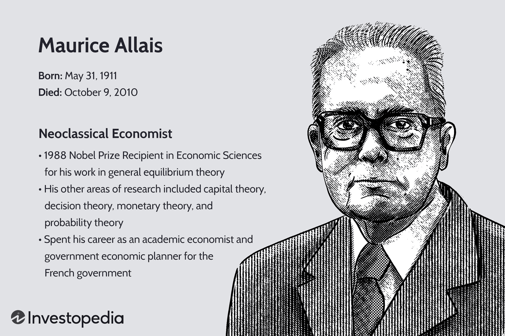

Maurice Allais was a distinguished French economist, celebrated for his significant contributions to market equilibrium and behavioral economics. His pioneering work laid the groundwork for numerous economic theories and practices that remain influential today. Born on May 31, 1911, in Paris, Allais rose to prominence through his profound insights into market dynamics and decision-making processes. He was awarded the Nobel Prize in Economic Sciences in 1988, highlighting his deep impact on economic theory and practice.

Allais' explorations of market efficiency and national economic policies provided a robust framework for understanding economic systems. His theories concerning decision-making under uncertainty, exemplified by the renowned "Allais Paradox," have become cornerstones of modern economic thought, influencing subsequent developments in behavioral economics. This paradox challenged the expected utility theory by unveiling inherent inconsistencies in human decision-making, paving the way for future research by economists such as Daniel Kahneman and Amos Tversky.



The implications of Allais' work extend beyond theoretical economics and into practical applications, including algorithmic trading. His insights into market behavior and efficiency inform strategies that model market dynamics and predict trends, optimizing trading decisions in an increasingly automated world. This article explores the significant elements of Allais’ biography, his seminal works, and the enduring influence of his theories on contemporary economic practices and the development of trading algorithms.

## Table of Contents

## Early Life and Education

Maurice Allais was born on May 31, 1911, in Paris, France, into a world marred by the impending conflicts of the 20th century. The early years of his life were shadowed by the loss of his father, who perished during World War I, an event that had a profound impact on his formative years. Despite these hardships, Allais exhibited remarkable academic prowess from a young age.

His education was marked by exceptional achievements at the Ecole Polytechnique, one of France's most prestigious institutions. There, Allais developed a strong foundation in the disciplines that would shape his later work—economics and physics. His rigorous training in physics and mathematics complemented his growing interest in economics, providing him with the analytical skills necessary for his later contributions to the field.

Allais harbored a passion for history and physics during his early education, which informed his unique approach to economic theory. This combination of interests enabled him to view economic problems through a broader analytical lens, marrying historical context with scientific precision. This holistic perspective allowed Allais to scrutinize economic phenomena with the rigor and objectivity of a physicist while appreciating the historical and social dimensions of economic systems.

His academic journey at the Ecole Polytechnique not only provided him with the technical expertise needed for his groundbreaking work in economics but also instilled in him a scientific curiosity that would drive his explorations into market equilibria and decision-making under uncertainty.

## World War II and Academic Career

During World War II, Maurice Allais served on the Italian front as a part of his military duties. This period was marked by significant geopolitical turmoil, greatly impacting many in his generation, including Allais. His military service was a precursor to his later academic career, where he began to channel his analytical skills toward economic studies.

After the war, Allais transitioned into academia, where he began to build a substantial career. He became a professor at the Higher National School of Mining in Paris, one of France's leading institutions for engineering and applied sciences. This position allowed him to influence young minds and contribute to the academic field with his profound knowledge in both physics and economics. 

In addition to his role at the Higher National School of Mining, Allais was appointed as the head of research at the National Center for Scientific Research (CNRS) in France. This prestigious position underscored his commitment to advancing scientific inquiry and innovation. Through his work at CNRS, Allais conducted research that sought to bridge theoretical insights with practical economic issues, thereby enriching the academic discourse of the time.

Allais further extended his influence internationally by taking on teaching positions in various countries. His global engagement allowed him to exchange ideas and collaborate with economists worldwide, thus broadening his perspective and enhancing the diversity of his academic contributions. This international exposure not only elevated his status as a thought leader in economics but also fostered a wider appreciation and application of his theories across different economic systems and cultures.

## Contributions to Economic Theory

Maurice Allais made substantial contributions to economic theory, primarily through his work on general equilibrium and decision-making under risk. His insights into these areas have provided a foundation for modern economic theory and practice. 

Allais' advancements in general equilibrium theory seek to understand how different factors of an economy interact to maintain balance. He emphasized that an efficient allocation of resources is critical to achieving economic equilibrium. His mathematical models and formulations underscore the relationships between supply, demand, and prices, helping to optimize resource distribution to achieve economic efficiency. 

A key element of Allais' work is his analysis of decision-making under risk, prominently demonstrated through the Allais Paradox. This paradox highlights human inconsistencies in expected utility theory, showing that people often make decisions that contradict the predictions of traditional models of rational choice under uncertainty. The paradox is illustrated by contrasting decisions in two lotteries, where the preference for certain outcomes over probabilistic ones reveals irrationality in decision-making patterns. This finding has led to the development of behavioral economics, encouraging economists to integrate psychological factors when modeling consumer behavior.

In addressing real-world issues, Allais also tackled income distribution. He postulated that the role of the state should be reevaluated concerning monopolies and economic organization. He challenged traditional views on state intervention, arguing for models that promote efficiency through competitive markets while considering the social impact of economic policies.

Allais' principles have continued to influence economic modeling, particularly in regard to state-owned monopolies and organizational structures. By addressing how these entities can affect resource allocation and societal welfare, Allais provided insights into the management and regulation of markets. His strategies for state entities focus on fostering competitive environments that enhance economic stability and social equity.

Overall, the contributions of Maurice Allais to economic theory offer valuable perspectives on achieving equilibrium and efficiency. His integration of mathematical rigor and focus on practical implications have provided a basis for ongoing research and applications in current economic practices. His work on the structure of markets and decision-making processes remains relevant, influencing contemporary economic policies and the understanding of market dynamics.

## The Allais Paradox and Behavioral Economics

The Allais Paradox presents a critical challenge to the expected utility theory, which serves as a cornerstone of traditional economic thought on decision-making under risk. First introduced by Maurice Allais in 1953, the paradox highlights inconsistencies in human choices when individuals are faced with risky outcomes. In a typical demonstration of the paradox, participants are asked to select between different sets of probabilistic outcomes. Despite the mathematical equivalence in expected utility terms, empirical results show that people often prefer outcomes inconsistent with expected utility maximization.

To illustrate the Allais Paradox, consider the following two scenarios:

1. **Scenario A:**
   - Option 1: Receive $1 million with certainty.
   - Option 2: 10% chance to win $5 million, 89% chance to win $1 million, and 1% chance to win nothing.

2. **Scenario B:**
   - Option 1: 11% chance to win $1 million, 89% chance to win nothing.
   - Option 2: 10% chance to win $5 million, 90% chance to win nothing.

According to expected utility theory, preferences should remain consistent across comparable scenarios, making the expected utility of each option critical. However, many individuals choose Option 1 in Scenario A for the certainty of $1 million, while in Scenario B, they prefer Option 2 for its higher potential gain despite similar probabilities. This shift in preference violates the independence axiom of expected utility theory, illustrating how psychological factors and perceived value influence decision-making.

Tversky and Kahneman leveraged the insights gained from the Allais Paradox to advance behavioral economics, emphasizing how psychological factors affect economic decision-making. They proposed prospect theory, which accounts for observed behaviors inconsistent with expected utility theory. Prospect theory addresses preferences in risky situations by introducing concepts such as loss aversion and probability weighting, providing a more accurate model for predicting human behavior.

The implications of the Allais Paradox extend into fields requiring rapid decisions under uncertainty, such as finance and [algorithmic trading](/wiki/algorithmic-trading). Recognizing these behavioral tendencies, traders and financial analysts can refine algorithms to account for market participants' potential irrational behaviors, ultimately improving the robustness and success of automated trading systems. Integrating behavioral insights reduces the discrepancy between theoretically optimal decisions and actual human actions in market environments.

## Impact on Algorithmic Trading

Maurice Allais' contributions to economic theory have significant implications for algorithmic trading, an area that thrives on the ability to predict and respond to market behaviors with precision. His insights into market equilibrium and efficiency provide foundational principles for developing sophisticated trading algorithms. These algorithms attempt to capture the complexities of market dynamics, which include not only price movements but also the underlying behavioral patterns of market participants.

At the core of Allais' contributions is his exploration of market equilibrium, which seeks to understand how supply and demand interact to find a state of balance. His work on maximizing economic efficiency is particularly pertinent to trading algorithms, which aim to optimize trading decisions by determining the most efficient points to enter and [exit](/wiki/exit-strategy) markets. By leveraging concepts such as Pareto efficiency, algorithmic models can establish conditions under which no participant can be better off without making someone else worse off, thereby finding optimal trading solutions.

Moreover, Allais' theories on decision-making under risk, particularly through what is known as the Allais Paradox, underscore the discrepancies between predicted and actual human behavior when faced with uncertain outcomes. This paradox revealed that individuals often deviate from rational choice theory, exhibiting preferences that contradict expected utility theory. Algorithmic trading systems utilize these insights to anticipate such behavioral inconsistencies, thereby enhancing the robustness of predictive models. By accounting for potential irrationalities in human decision-making, trading algorithms can better adapt to sudden shifts in market sentiment and [volatility](/wiki/volatility-trading-strategies).

In constructing these algorithms, one might incorporate probabilistic models and [machine learning](/wiki/machine-learning) techniques to simulate market behaviors observed through Allais' theories. For instance, using Python, a simple code snippet to start modeling market prices incorporating stochastic processes could look like this:

```python
import numpy as np

def simulate_market_prices(n_steps=1000, initial_price=100, volatility=0.01):
    price = np.zeros(n_steps)
    price[0] = initial_price
    for t in range(1, n_steps):
        random_shock = np.random.normal(0, volatility)
        price[t] = price[t-1] * (1 + random_shock)
    return price

market_prices = simulate_market_prices()
```

This approach captures the random nature of market prices while allowing for the inclusion of parameters that represent behavioral nuances as elucidated by Allais' findings. As automated trading systems continue to evolve, they increasingly rely on the integration of behavioral economic theories to navigate the complexities of financial markets effectively.

Hence, Maurice Allais' contributions extend far beyond theoretical economics, influencing the construction and refinement of automated trading frameworks which seek to harness the full potential of economic theories in practical applications. Understanding and applying Allais' insights into market behavior empower trading systems to not only respond to current market conditions but also anticipate future trends, enhancing their adaptability and effectiveness.

## Selected Publications

Maurice Allais made significant contributions to economic literature, with many of his works being initially published in French. Among his most notable publications are "Économie et Intérêt" (Economy and Interest) and "Économie pure et rendement social" (Pure Economics and Social Yield). These works are seminal in the formulation of economic theories that integrate rigorous mathematical methods to address complex economic issues.

"Économie et Intérêt" is renowned for its innovative approach to capital theory and interest rates. Allais proposed mathematical models that attempted to predict economic phenomena based on the concept of intertemporal choice, which examines how people decide between immediate and future benefits. This work laid a firm foundation for understanding how present economic decisions are influenced by potential future returns and costs, thereby contributing substantially to investment and consumption theories.

In "Économie pure et rendement social," Allais explored theoretical economics and their implications on social efficiency and welfare. This publication delved into the mathematical underpinnings of market equilibrium, introducing models that encapsulated his ideas on optimal resource allocation and distribution. His mathematical formulations, such as the maximization of utility functions under constraints, provided insights into how economic systems could achieve social welfare without sacrificing efficiency.

Despite the initial language barrier, Allais' works crossed linguistic boundaries and gained recognition worldwide. The depth of his analysis and the precision of his mathematical approaches captivated economists, subsequently integrating his ideas into broader economic discourse. His methodologies influenced both theory and empirical research, finding applications in policy formulation and economic modeling across various countries.

The impact of Maurice Allais' publications is reflected in their longstanding influence on both contemporary theories and practical economic applications. By rigorously applying mathematical principles to traditional economic problems, Allais set a precedent that has been instrumental in shaping modern economic thought and analysis.

## Conclusion

Maurice Allais's contributions to economic thought have had a profound and enduring influence on both theoretical and applied economics. His focused examination of efficiency and equilibrium provided foundational insights into how economic systems operate and achieve balance. By elucidating the dynamics of market behavior, Allais not only advanced the understanding of economic systems but also set the stage for significant developments in decision-making processes under uncertainty.

Allais's work, particularly his exploration of decision-making, remains pivotal in academic discussions and professional applications, notably in fields like automated trading. By highlighting the inconsistencies in human decision-making, such as those demonstrated in the Allais Paradox, he spurred a re-evaluation of traditional economic theories that assume rational behavior. This opened pathways for the emergence of behavioral economics, which seeks to incorporate psychological insights into economic theory, thereby enhancing the predictive power and applicability of economic models.

The recognition of Allais's contributions is crucial for appreciating the complexity and richness of contemporary economics and financial disciplines. His theories provide essential tools for understanding how markets can be modeled and predicted, a necessity in today’s high-frequency trading environments where algorithmic strategies must account for inefficiencies and human behavior. Allais's legacy is a testament to the importance of rigorous analytical frameworks in meeting both academic and practical economic challenges, ensuring his influence will be felt by future generations of economists and financial theorists.

## References & Further Reading

[1]: ["Maurice Allais – Facts."](https://www.nobelprize.org/prizes/economic-sciences/1988/allais/facts/) The Nobel Prize. 

[2]: Kahneman, D., & Tversky, A. (1979). ["Prospect Theory: An Analysis of Decision under Risk."](https://www.jstor.org/stable/1914185) Econometrica, 47(2), 263-291.

[3]: ["Économie et Intérêt"](https://www.semanticscholar.org/paper/Economie-et-Interet.-Shackle-Allais/18fecc07f8ca7345987e331b28d68e28d807ac89) by Maurice Allais

[4]: ["Advances in Behavioral Economics"](https://press.princeton.edu/books/paperback/9780691116822/advances-in-behavioral-economics) edited by Colin F. Camerer, George Loewenstein, and Matthew Rabin

[5]: Thaler, R. H. (1988). ["The Winner's Curse."](https://pubs.aeaweb.org/doi/pdfplus/10.1257/jep.2.1.191) Princeton University Press.

[6]: Jarrow, R. A., & Protter, P. (2016). ["A Short History of Stochastic Integration and Mathematical Finance: The Early Years, 1880–1970."](https://www.semanticscholar.org/paper/A-short-history-of-stochastic-integration-and-the-Jarrow-Protter/90c0801a7627fb88f0c3010e745e31795d6f0f5b) Finance and Stochastics, 20(3), 595-608.