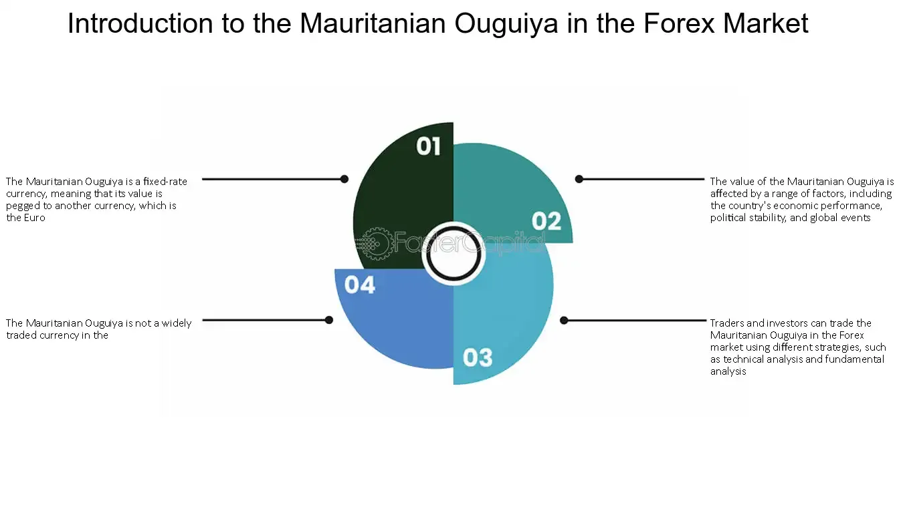

## Table of Contents

## What is the Mauritanian Ouguiya?

The Mauritanian Ouguiya is the official money used in Mauritania, a country in Africa. It started being used in 1973. The symbol for the Ouguiya is "UM" and it is divided into 5 khoums. However, khoums are not used anymore because of inflation, which means prices went up a lot.

In 2018, Mauritania made a new version of the Ouguiya. They changed it because the old money was losing value quickly. The new Ouguiya is worth 10 times more than the old one. This change helped to make prices more stable and easier to handle for people in Mauritania.

## How is the Mauritanian Ouguiya abbreviated?

The Mauritanian Ouguiya is shortened to "UM". This is the official way to write it when you are talking about money in Mauritania.

Before 2018, the Ouguiya was also written as "MRO". But when they made the new Ouguiya, they changed the abbreviation to "MRU" to show that it is different from the old money.

## What is the current exchange rate of the Mauritanian Ouguiya to the US Dollar?

The exchange rate between the Mauritanian Ouguiya and the US Dollar changes every day. As of today, 1 US Dollar is equal to about 35 Mauritanian Ouguiyas. This rate can go up or down depending on many things like how the economy is doing in both countries.

It's a good idea to check the latest exchange rate before you do any money changing or buying things in Mauritania. You can find the most up-to-date rate on websites that track money exchange or by asking at a bank.

## What are the main economic sectors in Mauritania?

Mauritania's economy depends a lot on mining. The country has a lot of iron ore, which they dig out of the ground and sell to other countries. This makes a big part of their money. They also have gold and copper, which help the economy too. The mining business brings in a lot of cash, but it also means that if the prices of these metals go down, it can be tough for Mauritania.

Fishing is another big part of Mauritania's economy. The country has a long coastline along the Atlantic Ocean, and there are many fish in these waters. People catch fish and sell it, both inside Mauritania and to other countries. This helps to create jobs and bring in money. But, like mining, the fishing industry can have ups and downs depending on how many fish there are and what the world wants to buy.

Apart from mining and fishing, agriculture and livestock are important too. Many people in Mauritania grow crops like dates and millet, and they also raise animals like goats and camels. These activities help feed the people and also make some money, but they are not as big as mining and fishing in terms of how much they add to the economy.

## How has the Mauritanian economy performed in the last decade?

Over the last ten years, Mauritania's economy has had some good times and some tough times. The country depends a lot on mining, especially iron ore, and when the prices of these minerals were high, the economy did well. But when the prices went down, it was harder for Mauritania. They also got help from other countries and organizations, which helped to keep things stable. Overall, the economy grew, but not as fast as some other countries in Africa.

Fishing has been another important part of the economy. The waters off Mauritania's coast have a lot of fish, and selling this fish to other countries has brought in money. But, the fishing industry has faced problems too, like overfishing and changes in the world's demand for fish. Agriculture and raising animals have also played a role, but they are smaller parts of the economy compared to mining and fishing. In recent years, the government has tried to make the economy more diverse by encouraging other kinds of businesses, but it's still a work in progress.

## What role does mining play in the Mauritanian economy?

Mining is very important for Mauritania's economy. The country has a lot of iron ore, which they dig out of the ground and sell to other countries. This makes a big part of their money. They also have gold and copper, which help the economy too. The mining business brings in a lot of cash, but it also means that if the prices of these metals go down, it can be tough for Mauritania. 

Because mining is such a big part of the economy, it can make things unstable. If the price of iron ore goes up, the economy does well. But if the price goes down, it can be hard. The government knows this and tries to find other ways to make money, like encouraging new businesses. But for now, mining is still the most important part of Mauritania's economy.

## How does the government regulate the Ouguiya?

The government of Mauritania controls the Ouguiya through the Central Bank of Mauritania. They make sure that the money stays stable and does not lose value too quickly. If the Ouguiya starts to lose value, the Central Bank can do things like change interest rates or buy and sell foreign money to help keep it stable. They also keep an eye on how much money is being printed so that there is not too much of it, which could make it worth less.

In 2018, the government made a big change to the Ouguiya. They introduced a new version of the money that was worth 10 times more than the old one. This was done to fight inflation, which means prices were going up a lot. By changing the money, the government hoped to make prices more stable and easier for people to handle. They also changed the way the money looked to make it harder to fake.

## What are the inflation trends in Mauritania over the past 5 years?

Over the past five years, inflation in Mauritania has gone up and down. At the start of this period, inflation was pretty high, around 2 to 3 percent each year. This means prices were going up a little bit every year. But then, things changed. In 2020, inflation went down because of the global health crisis. People were buying less, and this helped keep prices from going up too much. That year, inflation was very low, around 0.5 percent.

After 2020, inflation started to go up again. In 2021 and 2022, it went back to around 3 to 4 percent each year. This was because the world started to get back to normal, and people were buying more things again. By the end of 2022, inflation was still going up, but not as fast as before. The government and the Central Bank of Mauritania are always trying to keep inflation under control so that prices do not go up too fast and make life harder for people.

## How do international trade policies affect the Mauritanian economy?

International trade policies can have a big impact on Mauritania's economy. Since Mauritania depends a lot on mining and fishing, any changes in trade rules can affect how much money they make. For example, if other countries put taxes on Mauritania's iron ore or fish, it can make it harder to sell these things. This could mean less money coming into the country. Also, if there are trade agreements that help Mauritania sell their products more easily, it can be good for the economy. These agreements can open up new markets and help bring in more money.

Another way trade policies affect Mauritania is through the prices of things they need to buy. Mauritania imports a lot of food, machines, and other goods. If the countries they buy from change their trade policies, it can make these things more expensive. This can lead to higher prices for people in Mauritania and make life harder. The government tries to make trade deals that help keep prices down and make sure they can still sell their own products. But it's always a balance, and changes in the world can make things tricky.

## What are the major challenges facing the Mauritanian economy?

One big challenge for Mauritania's economy is that it depends a lot on mining and fishing. If the prices of iron ore or fish go down, it can be hard for the country. This means the economy can be up and down. Also, the government wants to make the economy more diverse by starting new kinds of businesses, but it's hard to do. They need to find new ways to make money so that the country is not just relying on mining and fishing.

Another challenge is dealing with inflation. Over the last few years, prices have been going up and down. The government and the Central Bank try to keep inflation under control, but it's not easy. If prices go up too fast, it can make life harder for people. Also, international trade policies can affect Mauritania. If other countries change their rules, it can make it harder for Mauritania to sell their products or buy things they need. This can lead to more problems for the economy.

## How does the Mauritanian Ouguiya compare to other currencies in the region?

The Mauritanian Ouguiya is the money used in Mauritania. It is not as strong as some other currencies in the region, like the Moroccan Dirham or the Tunisian Dinar. For example, 1 US Dollar is worth about 35 Ouguiyas, while it is worth around 10 Moroccan Dirhams. This means that the Ouguiya is weaker compared to these other currencies. 

The Ouguiya also faces challenges because Mauritania's economy depends a lot on mining and fishing. If the prices of these things go down, the Ouguiya can lose value. Other countries in the region, like Senegal, use the West African CFA Franc, which is tied to the Euro. This makes the CFA Franc more stable than the Ouguiya. So, when people in Mauritania want to buy things from other countries, it can be more expensive for them because their money is not as strong.

## What future economic strategies are being considered by Mauritania to enhance growth?

Mauritania is thinking about different ways to make its economy grow better in the future. One big idea is to not just rely on mining and fishing. They want to start new kinds of businesses, like making things or providing services. This can help the economy be more stable because if one part is not doing well, other parts can still bring in money. The government is also trying to make it easier for people to start their own businesses by giving them help and making rules simpler.

Another strategy is to make better use of the country's natural resources. Mauritania has a lot of sun and wind, which can be used to make electricity. By building more solar and wind farms, they can create jobs and sell the extra power to other countries. This can bring in more money and help the environment too. The government is also looking at ways to improve farming and raising animals, so that people can grow more food and not have to buy as much from other places.

## What is the impact of algorithmic trading on MRO?

Algorithmic trading, a sophisticated method of executing orders using automated, pre-programmed trading instructions, has the potential to significantly impact the trading of the Mauritanian Ouguiya (MRO). The integration of such technology into the forex market primarily enhances market efficiency by processing extensive data volumes rapidly and executing trades with precision. This precision results in potentially narrower bid-ask spreads, which represent the difference between the price at which a market maker is willing to buy and sell.

The Mauritanian Ouguiya (MRO), characterized by its lower trading frequency compared to major currencies, might experience increased volatility due to algorithmic trading. Volatility, a statistical measure of the [dispersion](/wiki/dispersion-trading) of returns, often intensifies when automated systems take positions or [exit](/wiki/exit-strategy) based on market conditions and available data information. Mathematically, volatility $\sigma$ is often represented using the standard deviation formula:

$$
\sigma = \sqrt{\frac{1}{N-1} \sum_{i=1}^{N} (x_i - \bar{x})^2}
$$

where $x_i$ represents each data point and $\bar{x}$ is the mean of these data points. For the MRO, heightened volatility could present new opportunities for traders looking to capitalize on price differentials within short timeframes. However, it simultaneously poses risks, as unexpected fluctuations can lead to substantial losses for those unprepared or without adequate risk management strategies.

The introduction of algorithmic trading into the MRO market opens possibilities for both institutional and retail investors. Institutional investors, equipped with advanced analytical tools and technologies, may find the relatively untapped nature of the MRO market appealing for diversification. Retail investors, although facing challenges due to the potentially high volatility, may uncover unique investment opportunities, provided they engage in thorough market analysis and apply effective risk control measures such as stop-loss and take-profit orders.

Algorithmic trading also introduces the potential for arbitrage opportunities where price discrepancies between different exchanges or market inefficiencies can be exploited for profit. These opportunities usually rely on high-frequency trades, capable of operating within milliseconds, an area where human capabilities are inherently limited.

In conclusion, while algorithmic trading may foster enhanced efficiency and new prospects in trading the MRO, it requires nuanced understanding and strategic foresight given the currency's inherent volatility and market characteristics. Both institutional and retail investors must weigh these factors carefully to leverage the full potential of algorithmic trading in the Mauritanian forex market.

## References & Further Reading

[1]: Besada, H. (2013). ["Africa’s Natural Resources: Curse or Blessing?"](https://www.geni.com/people/Louis-VI-the-Fat-king-of-France/6000000003714562119) Wiley-Blackwell.

[2]: Dufrénot, G., & Yehoue, E. B. (2005). ["Real Exchange Rate Misalignment: A Panel Co-Integration and Common Factor Analysis."](https://www.imf.org/external/pubs/ft/wp/2005/wp05164.pdf) International Monetary Fund.

[3]: Chance, D. M., & Brooks, R. (2010). ["An Introduction to Derivatives and Risk Management."](https://books.google.com/books/about/Introduction_to_Derivatives_and_Risk_Man.html?id=b8PgBQAAQBAJ) South-Western College Pub.

[4]: Chan, E. P. (2008). ["Quantitative Trading: How to Build Your Own Algorithmic Trading Business."](https://github.com/ftvision/quant_trading_echan_book) Wiley.

[5]: Mantegna, R. N., & Stanley, H. E. (1999). ["Introduction to Econophysics: Correlations and Complexity in Finance."](https://assets.cambridge.org/052162/0082/sample/0521620082WS.pdf) Cambridge University Press. 

[6]: López de Prado, M. (2018). ["Advances in Financial Machine Learning."](https://www.amazon.com/Advances-Financial-Machine-Learning-Marcos/dp/1119482089) Wiley.