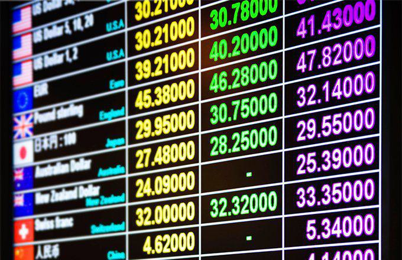

Mauritania, located in Northwestern Africa, relies heavily on its natural resources, with sectors like agriculture, fishing, and mining forming the backbone of its economy. This economic foundation is closely tied to the Mauritanian Ouguiya (MRO), the country’s national currency. The economy's performance directly influences the MRO’s value, affecting its stability and appeal to investors.

Globally, the financial landscape has experienced significant changes with the rise of technology-driven investment strategies. One of the most prominent developments is algorithmic trading, which has become increasingly popular thanks to its ability to process large volumes of financial data and execute trades with speed and precision. This trend is particularly noticeable in the currency markets, where traditional trading methods are making way for these automated systems.



This article examines Mauritania's economic environment, exploring the impact of its economic activities on the MRO. It looks into the evolution and characteristics of the MRO itself and considers how algorithmic trading is reshaping the dynamics within the forex market. Understanding these factors can provide insights into potential opportunities and challenges for traders and investors engaging with this economically unique currency.

## Table of Contents

## Understanding the Mauritanian Economy

Mauritania's economy hinges significantly on its agricultural, fishing, and mining sectors. Agriculture in Mauritania largely revolves around subsistence farming, with millet, sorghum, and dates being some of the primary crops. However, the sector is susceptible to the frequent droughts that considerably affect productivity. Fishing is a vital industry due to Mauritania’s extensive Atlantic coastline, providing crucial employment and export revenue. The nation’s Exclusive Economic Zone is noted for its rich fish stocks, although overfishing and insufficient processing infrastructure pose significant challenges.

Mining also plays a pivotal role, with iron ore, gold, and copper being central to Mauritania's exports. Iron ore mining is particularly significant, with the country being one of the world’s top exporters. Yet, despite these resources, political instability and inadequate infrastructure often hinder the full potential of these industries. The economic growth is further restrained by the lack of diversification and a dependency on fluctuating global commodity prices.

International aid has been instrumental in Mauritania's economic landscape. Organizations such as the International Monetary Fund (IMF) and the World Bank provide financial assistance and policy advice, often focusing on structural reforms to foster economic stability and growth. These reforms typically emphasize improving governance, strengthening fiscal management, and enhancing social protection systems. Progress in these areas is essential, given the underlying challenges of high unemployment rates, poverty, and the need for more resilient economic structures.

While there are external supports, lasting solutions require internal progress and governance improvements. As the nation navigates these complex economic dimensions, balanced development across sectors and effective policy implementation remain crucial for sustainable growth.

## What is Mauritanian Ouguiya (MRO)?

The Mauritanian Ouguiya (MRO) serves as the official currency of Mauritania. It is distinguished by its division into five subunits called khoums, which sets it apart as one of the few global currencies not divisible by the more common 10 or 100 units. This unique division aligns with the traditional monetary system in the region and reflects cultural and historical influences on the currency structure.

Introduced in 1973, the MRO replaced the CFA franc, which earlier served as the currency for numerous West African countries. Historically, the MRO displayed a pegged relationship with the euro, stabilizing its exchange rate and facilitating trade agreements with European partners. Such pegged arrangements are strategic for countries like Mauritania, which aim to mitigate the effects of volatile currency fluctuations on their small, open economies.

The value of the MRO is subject to influence by Mauritania's economic policies and prevailing external market conditions. Factors impacting its valuation include changes in the global demand for Mauritania's key exports, such as iron ore and fish. Economic development policies, such as initiatives to attract foreign direct investment or strategies to manage fiscal deficits, also contribute to shaping the currency’s worth.

Given its relatively minor role in global currency markets, the MRO might experience [volatility](/wiki/volatility-trading-strategies) influenced by both local economic developments and broader international financial trends. This volatility can impact currency stability and may demand prudent management by Mauritania's financial authorities to safeguard macroeconomic stability and foster confidence in the ouguiya.

## The Transition to Algorithmic Trading

Algorithmic trading utilizes computer algorithms to automate the process of buying and selling currencies in the [forex](/wiki/forex-system) market. This form of trading is designed to exploit price inefficiencies through high-frequency, data-driven strategies. Algorithmic trading has gained popularity due to its precision and ability to operate at speeds unattainable by human traders. By employing strategies such as [arbitrage](/wiki/arbitrage), [trend following](/wiki/trend-following), and mean reversion, algorithms can swiftly respond to changing market conditions, enhancing overall market efficiency.

In the case of the Mauritanian Ouguiya (MRO), [algorithmic trading](/wiki/algorithmic-trading) presents an opportunity to significantly alter the currency's [liquidity](/wiki/liquidity-risk-premium) and volatility dynamics. The MRO, with its distinctive subdivision into five khoums, could see improved liquidity as algorithms facilitate faster trading and tighter bid-ask spreads. This improvement in liquidity can lower transaction costs and make the MRO more appealing to both institutional and retail investors.

Furthermore, the implementation of algorithmic trading could impact the volatility of the MRO. While increased market efficiency typically reduces volatility, for less frequently traded currencies, higher volatility can result due to sudden shifts in supply and demand dynamics automated by trading algorithms. This volatility introduces both opportunities and risks, attracting traders seeking higher returns from exotic currencies but also requiring robust risk management strategies.

Incorporating algorithmic trading into the Mauritanian forex market could also lead to greater market transparency and price discovery. As algorithms analyze and react to vast amounts of market data, they contribute to a more accurate reflection of currency value. This transparency is advantageous for investors looking to gain insights into the MRO's price movements and potential trends.

The transition towards algorithmic trading in the Mauritanian Ouguiya market could drive technological advancement and global interest, positioning the MRO as a unique player in the forex trading arena. However, the success of this transition largely depends on the infrastructure and regulatory environment supporting algorithmic trading practices in Mauritania.

## Impact of Algorithmic Trading on MRO

Algorithmic trading, a sophisticated method of executing orders using automated, pre-programmed trading instructions, has the potential to significantly impact the trading of the Mauritanian Ouguiya (MRO). The integration of such technology into the forex market primarily enhances market efficiency by processing extensive data volumes rapidly and executing trades with precision. This precision results in potentially narrower bid-ask spreads, which represent the difference between the price at which a market maker is willing to buy and sell.

The Mauritanian Ouguiya (MRO), characterized by its lower trading frequency compared to major currencies, might experience increased volatility due to algorithmic trading. Volatility, a statistical measure of the [dispersion](/wiki/dispersion-trading) of returns, often intensifies when automated systems take positions or [exit](/wiki/exit-strategy) based on market conditions and available data information. Mathematically, volatility $\sigma$ is often represented using the standard deviation formula:

$$
\sigma = \sqrt{\frac{1}{N-1} \sum_{i=1}^{N} (x_i - \bar{x})^2}
$$

where $x_i$ represents each data point and $\bar{x}$ is the mean of these data points. For the MRO, heightened volatility could present new opportunities for traders looking to capitalize on price differentials within short timeframes. However, it simultaneously poses risks, as unexpected fluctuations can lead to substantial losses for those unprepared or without adequate risk management strategies.

The introduction of algorithmic trading into the MRO market opens possibilities for both institutional and retail investors. Institutional investors, equipped with advanced analytical tools and technologies, may find the relatively untapped nature of the MRO market appealing for diversification. Retail investors, although facing challenges due to the potentially high volatility, may uncover unique investment opportunities, provided they engage in thorough market analysis and apply effective risk control measures such as stop-loss and take-profit orders.

Algorithmic trading also introduces the potential for arbitrage opportunities where price discrepancies between different exchanges or market inefficiencies can be exploited for profit. These opportunities usually rely on high-frequency trades, capable of operating within milliseconds, an area where human capabilities are inherently limited.

In conclusion, while algorithmic trading may foster enhanced efficiency and new prospects in trading the MRO, it requires nuanced understanding and strategic foresight given the currency's inherent volatility and market characteristics. Both institutional and retail investors must weigh these factors carefully to leverage the full potential of algorithmic trading in the Mauritanian forex market.

## Challenges and Opportunities in Trading MRO

Trading with the Mauritanian Ouguiya (MRO) involves navigating a set of unique challenges and opportunities, which can significantly impact investors' strategies and outcomes.

One of the primary challenges in trading the MRO is its low market liquidity. The limited number of participants in the Mauritanian currency market can result in larger bid-ask spreads, meaning that trading costs can be higher compared to more liquid currencies like the US Dollar or Euro. This low liquidity can also lead to increased price volatility, making it difficult for traders to enter or exit positions without affecting the market price significantly.

Limited historical data is another challenge that investors face when trading the MRO. Due to the currency's relative obscurity in the global forex market, there is a scarcity of comprehensive historical data, which is crucial for conducting technical analysis and [backtesting](/wiki/backtesting) trading strategies. Without sufficient data, developing reliable predictive models becomes more difficult, potentially increasing the risk of trading decisions.

Political risks in Mauritania present additional hurdles. Political instability can lead to abrupt changes in economic policies, impacting exchange rates. The uncertainty associated with political decisions can deter foreign investment and create fluctuations in the currency's value. Investors must constantly assess the political environment to estimate future movements of the MRO.

Nonetheless, trading the MRO offers notable opportunities. For investors seeking diversification, the MRO's volatility can be leveraged to achieve high returns. Its relative isolation from major global currencies can provide a hedge against risks associated with more interconnected markets. Diversifying an investment portfolio with exotic currencies like the MRO can reduce overall risk and potentially enhance returns, following the modern portfolio theory, which suggests that a diversified portfolio is less volatile than the sum of its parts.

To effectively navigate these challenges, investors must conduct thorough research and implement robust risk management strategies. This might include setting stop-loss orders, diversifying across multiple asset classes, and using hedging techniques to mitigate potential losses. Additionally, remaining informed about the geopolitical and economic developments in Mauritania will provide valuable foresight into potential market disruptions.

Engaging with algorithmic trading tools can also be beneficial. Algorithms can analyze data patterns more efficiently than humans, offering insights even when historical data is scarce. Using Python, traders can develop algorithms to automate trading processes, backtest strategies using whatever data is available, and execute trades rapidly to capitalize on fleeting market opportunities.

```python
import numpy as np

# Example of a simple moving average crossover strategy for trading
def moving_average_crossover(data, short_window=20, long_window=50):
    """
    Calculate moving average crossover strategy signals.

    :param data: historical price data
    :param short_window: window for short-term moving average
    :param long_window: window for long-term moving average
    :return: trading signals based on moving averages
    """
    signals = np.zeros(len(data))
    short_ma = np.convolve(data, np.ones(short_window) / short_window, mode='valid')
    long_ma = np.convolve(data, np.ones(long_window) / long_window, mode='valid')

    # Initial signal based on crossover
    for i in range(len(short_ma)):
        if short_ma[i] > long_ma[i]:
            signals[i + (long_window-1)] = 1  # Buy signal
        elif short_ma[i] < long_ma[i]:
            signals[i + (long_window-1)] = -1  # Sell signal

    return signals

# Example usage with hypothetical MRO data
mro_prices = np.random.normal(100, 5, 100)  # Hypothetical price data
signals = moving_average_crossover(mro_prices)
print(signals)
```

Risk management and algorithmic trading can provide a significant advantage, allowing investors to manage the unique challenges of trading the MRO and potentially turn them into profitable opportunities.

## Future Prospects

Advancements in trading technology and increasing global interest are poised to have a significant impact on the Mauritanian forex market. The proliferation of algorithmic trading platforms enables more efficient and rapid execution of trades. This could heighten the appeal of the Mauritanian Ouguiya (MRO) by improving transparency and liquidity, which are critical components for enticing more substantial trading volumes. These developments in technology allow traders to overcome some of the current hurdles intrinsic to dealing with less frequently traded currencies like the MRO, potentially attracting more international investors.

Economic reforms in Mauritania could further enhance the strength and stability of the MRO. Initiatives geared towards stabilizing the political landscape, improving fiscal policies, and fostering a more robust banking system could make the MRO more appealing to global traders. Strengthening legal frameworks and ensuring adherence to international financial regulations can bolster investor confidence, while potential improvements in the monetary policy could lead to a more stable currency value.

Investors exploring fresh market opportunities might find the MRO to be an attractive option due to its unique characteristics and the potential for high volatility that can yield high returns. Given the continuous evolution of forex trading landscapes, particularly with technological progress, the Mauritanian currency offers diversification benefits. Investors capable of navigating the accompanying risks, such as limited market data and economic fluctuations, might find lucrative prospects in venturing into the MRO market, leveraging the currency’s volatility and its under-explored status.

In conclusion, the interplay of technology, economic reforms, and market exploration presents promising prospects for the Mauritanian forex sphere. As advancements continue to reshape forex trading, the MRO stands to benefit significantly, providing traders with a distinctive opportunity within an evolving global economy.

## Conclusion

The Mauritanian economy and its currency, the Mauritanian Ouguiya (MRO), present intriguing possibilities for investors targeting exotic currencies. The implementation of algorithmic trading introduces fresh prospects, capitalizing on the unique attributes of MRO. However, the transition to such technology demands attentive management of the inherent complexities and risks.

Algorithmic trading can potentially enhance the efficiency of trades involving MRO by enabling rapid execution and minimizing human error. Yet, this same speed and efficiency can amplify volatility, especially in less liquid markets like Mauritania's. Traders must remain vigilant as they adapt to quickly shifting trends influenced by external market conditions and technological advancements.

For global traders, the MRO offers rare investment opportunities. Its distinctive character, exemplified by its unconventional division into five subunits known as khoums, highlights both the currency's exotic appeal and the potential pitfalls associated with trading it. Furthermore, Mauritania's abundant natural resources, along with ongoing economic reforms and international collaborations, can gradually strengthen its market presence.

As technology continues to influence financial markets worldwide, those willing to engage with and understand the intricacies of the Mauritanian economy might find valuable prospects. While algorithmic trading can enhance trading experiences, it is crucial to integrate thorough market analysis, risk assessments, and adaptive strategies to effectively harness the potential of the MRO. The evolving landscape of forex trading positions Mauritania as a compelling area of interest for innovative and forward-thinking investors.

## References & Further Reading

[1]: Besada, H. (2013). ["Africa’s Natural Resources: Curse or Blessing?"](https://www.geni.com/people/Louis-VI-the-Fat-king-of-France/6000000003714562119) Wiley-Blackwell.

[2]: Dufrénot, G., & Yehoue, E. B. (2005). ["Real Exchange Rate Misalignment: A Panel Co-Integration and Common Factor Analysis."](https://www.imf.org/external/pubs/ft/wp/2005/wp05164.pdf) International Monetary Fund.

[3]: Chance, D. M., & Brooks, R. (2010). ["An Introduction to Derivatives and Risk Management."](https://books.google.com/books/about/Introduction_to_Derivatives_and_Risk_Man.html?id=b8PgBQAAQBAJ) South-Western College Pub.

[4]: Chan, E. P. (2008). ["Quantitative Trading: How to Build Your Own Algorithmic Trading Business."](https://github.com/ftvision/quant_trading_echan_book) Wiley.

[5]: Mantegna, R. N., & Stanley, H. E. (1999). ["Introduction to Econophysics: Correlations and Complexity in Finance."](https://assets.cambridge.org/052162/0082/sample/0521620082WS.pdf) Cambridge University Press. 

[6]: López de Prado, M. (2018). ["Advances in Financial Machine Learning."](https://www.amazon.com/Advances-Financial-Machine-Learning-Marcos/dp/1119482089) Wiley.