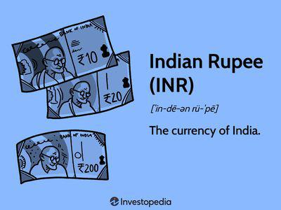

## Table of Contents

## What is the Mauritius Rupee and when was it introduced?

The Mauritius Rupee is the official currency of Mauritius, a small island nation located in the Indian Ocean. It is abbreviated as MUR and is used for all transactions within the country. The currency is managed by the Bank of Mauritius, which is the central bank responsible for issuing and regulating the Mauritian Rupee.

The Mauritius Rupee was introduced in 1876, replacing the Indian Rupee, which was used before that time. This change was made because Mauritius was a British colony at the time, and the British wanted to establish a separate currency for the island. Since its introduction, the Mauritian Rupee has gone through various changes in its denominations and designs, but it remains the primary currency used in Mauritius today.

## What was the historical context that led to the creation of the Mauritius Rupee?

Mauritius was a British colony in the 19th century. Before 1876, the island used the Indian Rupee as its currency. This was because India was also under British rule, and it was easier for the British to use the same money in both places. But as Mauritius grew and became more important, the British decided it needed its own money. So, they created the Mauritius Rupee in 1876.

The main reason for making a new currency was to give Mauritius more control over its own money. The British wanted to show that Mauritius was different from India, even though both were colonies. By having its own currency, Mauritius could better manage its economy and trade. This change helped Mauritius grow and develop on its own, separate from India.

## How has the design of the Mauritius Rupee changed over time?

When the Mauritius Rupee was first introduced in 1876, the design was simple and similar to the Indian Rupee. The early coins and notes featured Queen Victoria's portrait because Mauritius was a British colony at that time. Over the years, as Mauritius gained more independence and its own identity, the designs on the currency changed. In 1967, when Mauritius became independent, the currency started to show more local symbols and figures. For example, the dodo bird, a famous extinct animal from Mauritius, appeared on some coins.

Today, the Mauritius Rupee has many different designs that reflect the country's culture and history. The banknotes show important people from Mauritius, like Sir Seewoosagur Ramgoolam, who was a key leader in the country's independence movement. There are also pictures of famous places in Mauritius, like the Aapravasi Ghat, which is a UNESCO World Heritage Site. The coins often feature animals and plants that are special to the island, like the sugar cane plant, which is very important to Mauritius's economy. These designs help to tell the story of Mauritius and make the currency unique.

## What are the denominations of the Mauritius Rupee currently in circulation?

The Mauritius Rupee comes in different amounts of money, called denominations. For paper money, you can find notes worth 25, 50, 100, 200, 500, 1000, and 2000 rupees. These notes are used for bigger purchases or when you need to [carry](/wiki/carry-trading) a lot of money.

For coins, there are smaller amounts like 1, 5, and 10 rupees. There are also coins for smaller change, like 20 and 50 cents. These coins are handy for everyday buying and when you need exact change.

## How is the value of the Mauritius Rupee determined?

The value of the Mauritius Rupee is decided by how much people want to buy and sell it. This is called the exchange rate, and it changes every day. When a lot of people want to buy the Mauritius Rupee, its value goes up. But if more people want to sell it, the value goes down. The Bank of Mauritius, which is like a big boss for money in the country, helps keep the value stable by making rules and watching the market.

The value of the Mauritius Rupee also depends on what is happening in Mauritius and around the world. If Mauritius's economy is doing well, more people might want to buy things from there, which can make the Rupee stronger. But if there are problems, like a big storm or if other countries' economies are not doing well, the value of the Rupee can go down. The Bank of Mauritius works hard to make sure the Rupee stays strong and useful for everyone in the country.

## What major economic events have significantly impacted the Mauritius Rupee?

Several big events have changed the value of the Mauritius Rupee over time. One important event was the global financial crisis in 2008. This crisis made many countries' economies weak, and it also affected Mauritius. People were scared and did not want to spend money, so the value of the Mauritius Rupee went down. The government and the Bank of Mauritius had to work hard to make the economy better and keep the Rupee stable.

Another event that impacted the Mauritius Rupee was the COVID-19 pandemic in 2020. The pandemic made it hard for people to travel and for businesses to work normally. Mauritius depends a lot on tourism, so when fewer tourists came, the economy suffered. This made the value of the Rupee drop because people were not spending as much money. The government had to help businesses and people to try and keep the economy going during this tough time.

## How does the Mauritius Rupee's exchange rate affect the country's economy?

The exchange rate of the Mauritius Rupee is important because it affects how much things cost in Mauritius. When the Rupee is strong, it means people in Mauritius can buy more things from other countries because their money is worth more. This is good for people who like to buy things from abroad. But it can be bad for businesses in Mauritius that sell things to other countries because their products become more expensive for people outside Mauritius to buy.

When the Rupee is weak, it means people in Mauritius have to pay more for things from other countries. This can make things more expensive at home. But a weak Rupee can help businesses in Mauritius that sell things to other countries because their products become cheaper for people outside Mauritius to buy. This can help these businesses sell more and make more money. The Bank of Mauritius tries to keep the exchange rate stable so that the economy stays balanced and people can afford what they need.

## What are the inflation trends in Mauritius and how do they relate to the Rupee?

Inflation in Mauritius means that prices for things like food, clothes, and other stuff go up over time. In recent years, Mauritius has seen some ups and downs in inflation. Sometimes, prices go up a lot, and other times they stay the same or go up just a little. The government and the Bank of Mauritius watch inflation closely because it affects how much money people can spend and how much things cost.

The value of the Mauritius Rupee is connected to inflation. When the Rupee is weak, it can make inflation go up because it costs more to buy things from other countries. This can make prices at home go up too. But when the Rupee is strong, it can help keep inflation down because it's cheaper to buy things from abroad. The Bank of Mauritius tries to keep the Rupee stable to help control inflation and make sure people can afford what they need.

## How does the Bank of Mauritius manage the monetary policy in relation to the Rupee?

The Bank of Mauritius is like a big boss that takes care of the money in the country. It makes rules to help keep the Mauritius Rupee strong and useful. One way it does this is by deciding how much money should be in the economy. If there's too much money, prices can go up a lot, which is called inflation. So, the Bank of Mauritius can change the interest rates, which is like the price of borrowing money. When interest rates go up, people borrow less, and there's less money in the economy. When interest rates go down, people borrow more, and there's more money in the economy.

The Bank of Mauritius also watches the exchange rate, which is how much the Rupee is worth compared to other countries' money. If the Rupee is getting too weak or too strong, the Bank can step in and buy or sell Rupees to make it more stable. This helps keep the economy balanced and makes sure that people can afford things they need. By managing these things carefully, the Bank of Mauritius tries to make sure the Rupee stays strong and the economy stays healthy.

## What role does the Mauritius Rupee play in international trade and foreign investment?

The Mauritius Rupee is important for international trade and foreign investment. When Mauritius trades with other countries, the value of the Rupee matters a lot. If the Rupee is strong, it means that things made in Mauritius are more expensive for other countries to buy. This can make it harder for businesses in Mauritius to sell their products abroad. But if the Rupee is weak, it means that things from Mauritius are cheaper for other countries to buy, which can help businesses sell more and make more money.

Foreign investment is also affected by the value of the Mauritius Rupee. When the Rupee is stable and strong, it can attract more investors from other countries. They feel safer putting their money into businesses in Mauritius because they know their money will not lose value quickly. But if the Rupee is weak and changing a lot, it can scare investors away because they might lose money if the Rupee keeps going down. So, the Bank of Mauritius works hard to keep the Rupee stable to help with trade and attract foreign investment.

## How have recent global economic changes influenced the stability of the Mauritius Rupee?

Recent global economic changes have made it harder for the Mauritius Rupee to stay stable. Big events like the COVID-19 pandemic and changes in the world's economy have caused the Rupee to go up and down a lot. When the pandemic hit, fewer tourists came to Mauritius, which hurt the economy. This made the Rupee weaker because people were not spending as much money. Also, when big countries like the United States change their interest rates, it affects the whole world, including Mauritius. If the U.S. raises its rates, money can move out of Mauritius to the U.S., making the Rupee weaker.

The Bank of Mauritius has been working hard to keep the Rupee stable during these tough times. They watch the exchange rate closely and sometimes buy or sell Rupees to keep it steady. They also change interest rates in Mauritius to control how much money is in the economy. When there's too much money, prices can go up too fast, which is bad for the Rupee. By making these changes, the Bank of Mauritius tries to keep the economy balanced and the Rupee strong, even when the world's economy is changing a lot.

## What are the future predictions for the Mauritius Rupee based on current economic analyses?

People who study the economy think that the Mauritius Rupee might keep facing ups and downs in the future. This is because the world's economy is always changing, and things like big events or changes in other countries can affect the Rupee. For example, if there's another big health crisis or if big countries like the U.S. or China change their money rules, it could make the Rupee weaker. Also, because Mauritius depends a lot on tourism, if fewer tourists come, it can hurt the economy and make the Rupee go down.

But there's hope too. The Bank of Mauritius is working hard to keep the Rupee stable. They are doing things like watching the exchange rate closely and changing interest rates to make sure there's not too much money in the economy. If they keep doing this well, the Rupee could stay strong. Also, if Mauritius can find new ways to make money, like growing more businesses or finding new things to sell to other countries, it could help the Rupee stay stable and even get stronger in the future.

## References & Further Reading

[1]: Allen, D. E., McAleer, M., & Singh, A. K. (2019). ["An Empirical Assessment of Algorithmic Trading Strategies Using GP Data on the Australian Index Futures Market."](https://researchers.mq.edu.au/en/publications/daily-market-news-sentiment-and-stock-prices) Applied Economics.

[2]: Pillai, P. R., & Shah, A. (2012). ["Algorithmic Trading in India: An Overview."](https://acp.copernicus.org/articles/12/8979/2012/acp-12-8979-2012-discussion.html) Indira Gandhi Institute of Development Research Working Paper.

[3]: Bank of Mauritius. ["Financial Stability Report,"](https://www.bom.mu/publications-and-statistics/publications/financial-stability-report) various issues.

[4]: Agarwal, V. (2010). ["Algorithmic Trading."](https://scholar.google.com/citations?user=YiXA97YAAAAJ&hl=en) University of New Hampshire.

[5]: Kanabar, P. (2005). ["An Overview of Algorithmic Trading Systems."](https://www.sciencedirect.com/science/article/pii/S0957417422006479) Economic Systems ResearchInstitut.