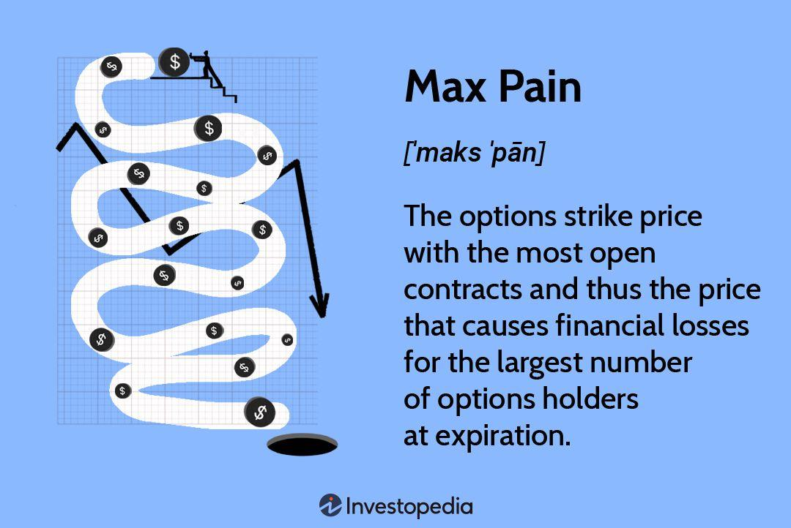

## Table of Contents

## What is Max Pain in options trading?

Max Pain, or Maximum Pain, is a theory in options trading that suggests the stock price will gravitate towards a point where the most number of options contracts (both calls and puts) will expire worthless. This point is called the Max Pain price. The idea behind this theory is that big investors, like market makers, would prefer the options they sold to expire worthless, so they can keep the premiums they collected. This means they might try to influence the stock price to stay close to the Max Pain price.

To find the Max Pain price, you look at all the open options contracts for a stock and calculate how much money would be lost by option holders if the stock closed at different prices. The price at which the total loss for option holders is the highest is the Max Pain price. While this theory is popular among some traders, it's not always accurate, and many factors can affect a stock's price. Still, it's an interesting concept that traders might consider when making their trading decisions.

## Why is Max Pain important for options traders?

Max Pain is important for options traders because it helps them guess where the stock price might go on the expiration day. The theory says that the stock price will move towards a point where the most options will expire without being used. This point is called the Max Pain price. Traders use this information to decide if they should buy or sell options, and at what price. If a trader thinks the stock will end up close to the Max Pain price, they might choose options that are near that price.

Even though Max Pain is not always right, it gives traders another tool to think about. It can help them understand how big investors might try to keep the stock price at a certain level. By knowing the Max Pain price, traders can make smarter choices about their options trades. They might avoid options that are far away from the Max Pain price because those options are less likely to make money. Overall, Max Pain is a helpful idea for traders who want to make better guesses about where the stock price might go.

## How is the Max Pain point calculated?

To find the Max Pain point, you need to look at all the open options contracts for a stock. These contracts include both calls and puts at different strike prices. You then imagine the stock closing at each of these strike prices. For each strike price, you calculate how much money option holders would lose if the stock closed at that price. You do this by figuring out which options would expire worthless and how much money that would mean for the option holders.

Next, you add up all the losses for each strike price. The strike price where the total losses for option holders are the highest is the Max Pain point. This is the price where the most options would expire without being used, causing the biggest loss for the people who bought the options. While this calculation can be complex and is often done using special software, the basic idea is to find the price that would cause the most pain to the most option holders.

## What data is needed to calculate the Max Pain point?

To calculate the Max Pain point, you need to know all the open options contracts for a stock. This includes both call and put options at different strike prices. You also need to know how many contracts are open for each strike price. This information tells you how many options would expire worthless if the stock closed at any given price.

Once you have this data, you imagine the stock closing at each strike price. For each price, you figure out which options would expire worthless and how much money that would mean for the option holders. You add up all the losses for each strike price. The strike price where the total losses for option holders are the highest is the Max Pain point. This is the price where the most options would expire without being used, causing the biggest loss for the people who bought the options.

## Can you explain the concept of Max Pain with a simple example?

Imagine a company called ABC has a stock that's trading at $50. There are options for this stock at different prices, like $45, $50, and $55. Let's say there are 100 call options at $45, 200 put options at $50, and 100 call options at $55. If the stock closes at $45 on the expiration day, the 100 call options at $45 would expire worthless, and the people who bought them would lose money. But if the stock closes at $50, the 200 put options at $50 would expire worthless, and more people would lose money.

The Max Pain point is the price where the most people lose money because their options expire worthless. In this example, if the stock closes at $50, 200 people lose money because their put options expire worthless. If it closes at $45 or $55, only 100 people lose money. So, the Max Pain point for ABC stock is $50 because that's where the most options expire worthless, causing the biggest loss for the people who bought the options.

## How does the Max Pain theory affect options pricing?

The Max Pain theory can affect options pricing because traders might think the stock price will move towards the Max Pain point on the expiration day. If many traders believe this, they might buy or sell options based on where they think the stock will end up. This can push the price of options up or down. For example, if traders think the stock will stay close to the Max Pain price, options far away from that price might become cheaper because they are less likely to be used.

On the other hand, options near the Max Pain price might get more expensive because more people want to buy them. But, the Max Pain theory is not always right, and many other things can change options prices too. Things like news about the company, how the market is doing, and what other traders are doing can all make a difference. So, while the Max Pain theory can give traders some ideas, it's just one part of the puzzle when it comes to figuring out options prices.

## What are the limitations of the Max Pain theory?

The Max Pain theory is not always right. It's just a guess about where the stock price might go on the expiration day. Many other things can change the stock price, like news about the company, how the market is doing, and what other traders are doing. So, even if the Max Pain theory says the stock will go to a certain price, it might not happen because of these other factors.

Also, the Max Pain theory assumes that big investors, like market makers, can control the stock price. But this is not always true. Big investors can try to move the stock price, but they can't always make it go where they want. And sometimes, they might not even want to move the stock price to the Max Pain point. So, while the Max Pain theory can be a helpful tool for traders, it has its limits and should not be the only thing traders use to make decisions.

## How can Max Pain be used in trading strategies?

Traders can use the Max Pain theory to help them decide which options to buy or sell. If they think the stock price will end up close to the Max Pain point on the expiration day, they might choose options that are near that price. For example, if the Max Pain point is $50, a trader might buy a call option with a strike price of $50 instead of one with a strike price of $55. This is because they think the stock will stay close to $50, making the $50 option more likely to be in the money.

But, traders should not rely only on the Max Pain theory. It's just one part of the puzzle. They should also look at other things like news about the company, how the market is doing, and what other traders are doing. Sometimes, the stock price might not go to the Max Pain point because of these other factors. So, while the Max Pain theory can be a helpful tool, traders should use it along with other information to make their trading decisions.

## Are there any tools or software that can help calculate Max Pain?

Yes, there are tools and software that can help calculate Max Pain. Some websites and trading platforms offer Max Pain calculators. These tools take the data about open options contracts and do the math to find the Max Pain point. They make it easier for traders because they don't have to do the calculations themselves. Popular websites like Yahoo Finance and some brokerage platforms have these calculators.

These tools can be very helpful, but traders should remember that they are just tools. The Max Pain point is just a guess about where the stock price might go on the expiration day. Many other things can change the stock price, so traders should not rely only on the Max Pain calculator. They should use it along with other information to make their trading decisions.

## How does Max Pain relate to other options metrics like Open Interest and Volume?

Max Pain, Open Interest, and Volume are all important numbers that traders look at when they trade options. Open Interest tells you how many options contracts are open for a certain stock at different prices. Volume tells you how many options contracts were traded that day. Max Pain is different because it's a guess about where the stock price might go on the expiration day. It's the price where the most options would expire without being used, causing the biggest loss for the people who bought the options.

Even though Max Pain, Open Interest, and Volume are different, they can help each other. For example, if a lot of options are open at a certain price (high Open Interest) and a lot of those options were traded that day (high Volume), it might mean that price is important to traders. If that price is close to the Max Pain point, it might make traders think the stock will go to that price on the expiration day. But, Max Pain is just one part of the puzzle. Traders should look at all these numbers together to make the best guesses about where the stock price might go.

## What are some real-world examples where Max Pain has influenced options expiration?

One real-world example where Max Pain seemed to influence options expiration happened with Tesla stock in 2020. As the expiration date for Tesla options got closer, the stock price moved towards the Max Pain point. Many traders noticed this and started talking about it. They thought big investors were trying to keep the stock price at the Max Pain point so more options would expire worthless. This made the stock price behave in a way that seemed to follow the Max Pain theory.

Another example was with Apple stock in 2019. As the options were about to expire, the stock price seemed to hover around the Max Pain point. Traders saw that the price stayed close to where the most options would expire without being used. This made some people think that the Max Pain theory was at work. But, it's hard to say for sure if Max Pain was the only reason the stock price moved that way, because many other things can affect stock prices too.

## How do professional traders and market makers use Max Pain in their decision-making process?

Professional traders and market makers use the Max Pain theory to guess where a stock's price might go on the expiration day. They know that if the stock price ends up at the Max Pain point, it will make the most options expire without being used. This can help them decide which options to buy or sell. For example, if they think the stock will stay close to the Max Pain price, they might sell options at that price because they think those options will expire worthless, letting them keep the money they got for selling them.

But, professional traders and market makers don't just use the Max Pain theory. They also look at other things like the news about the company, how the market is doing, and what other traders are doing. They know that the Max Pain theory is just a guess and that many other things can change the stock price. So, they use the Max Pain point along with other information to make their trading decisions. This helps them make smarter choices about which options to trade and when.

## How do you calculate the Max Pain Point?

To calculate the Max Pain point in options trading, it is essential to evaluate the open interest at each strike price for both call and put options. This process provides insight into where the most option holders are exposed to potential financial losses. The Max Pain theory suggests that the stock price will gravitate towards the strike price that causes the greatest total monetary loss to option holders at expiration, thus maximizing their financial pain.

The calculation starts by aggregating the open interest data across various strike prices. Open interest refers to the total number of outstanding option contracts that are not yet exercised or closed. Both call and put options open interest are considered. For each strike price, potential losses are computed by assuming that the stock price closes at that strike and determining the payouts for all options.

Here is a step-by-step breakdown of the calculation:

1. **Data Collection**: Gather open interest data for both puts and calls across all relevant strike prices of the options series. This can typically be obtained from a financial data provider or trading platform.

2. **Potential Loss Calculation**: For each strike price, calculate the potential losses that would occur if the stock closes at that price. This involves summing the intrinsic value of all in-the-money options that would be exercised. The intrinsic value is the difference between the stock price at expiration and the strike price, multiplied by the open interest.

3. **Summation of Total Loss**: For each strike price, sum the potential losses for both call and put options. These calculations will yield the total monetary losses for option holders if the stock closes at each respective strike price.

   - For a call option at strike price $K$:
     - If $S > K$, the intrinsic value is $S - K$.
     - If $S \leq K$, the intrinsic value is 0.
   - For a put option at strike price $K$:
     - If $S < K$, the intrinsic value is $K - S$.
     - If $S \geq K$, the intrinsic value is 0.

   The formula for total loss at strike price $K$:
$$
   \text{Total Loss}(K) = \sum (\text{Open Interest Call} \times \text{Intrinsic Value Call} + \text{Open Interest Put} \times \text{Intrinsic Value Put})

$$

4. **Identify Max Pain Point**: The strike price with the highest total loss sum is the Max Pain point. This is the price that, according to the theory, the stock is likely to approach at expiration, minimizing the payouts to option holders.

In practice, this calculation can be implemented using programming languages like Python, which can efficiently handle the data processing and mathematical calculations involved:

```python
# Example Python code to calculate Max Pain point
strike_prices = [/* list of strike prices */]
open_interest_calls = [/* list of open interest for calls */]
open_interest_puts = [/* list of open interest for puts */]
stock_price = /* current stock price */

def calculate_max_pain(strike_prices, open_interest_calls, open_interest_puts, stock_price):
    total_losses = []
    for i, K in enumerate(strike_prices):
        # Calculate intrinsic values
        intrinsic_value_calls = max(stock_price - K, 0) * open_interest_calls[i]
        intrinsic_value_puts = max(K - stock_price, 0) * open_interest_puts[i]
        # Sum total losses
        total_loss = intrinsic_value_calls + intrinsic_value_puts
        total_losses.append(total_loss)
    # Find the strike price with maximum total loss
    max_pain_index = total_losses.index(max(total_losses))
    return strike_prices[max_pain_index]

max_pain_point = calculate_max_pain(strike_prices, open_interest_calls, open_interest_puts, stock_price)
```

This approach provides traders with a systematic way to identify the Max Pain point, which can potentially guide their trading strategies around options expiration dates. However, it is important to understand that market dynamics can be influenced by various factors, and the Max Pain point should be considered as a tool rather than a forecast.

## References & Further Reading

[1]: Natenberg, S. (1994). ["Option Volatility and Pricing: Advanced Trading Strategies and Techniques."](https://www.amazon.com/Option-Volatility-Pricing-Strategies-Techniques/dp/0071818774) McGraw-Hill Education.

[2]: Cottle, R., Fekete, D., & Mohan, P. (2021). ["Options Pricing and Strategy Patterns."](https://www.researchgate.net/publication/351245898_Marketing_Strategy_Pricing_strategies_and_its_influence_on_consumer_purchasing_decision) Cambridge University Press.

[3]: Espen Gaarder Haug. (2007). ["The Complete Guide to Option Pricing Formulas."](https://www.amazon.com/Complete-Guide-Option-Pricing-Formulas/dp/0786312408) McGraw-Hill Education.

[4]: Hull, J. C. (2017). ["Options, Futures, and Other Derivatives."](https://www.semanticscholar.org/paper/Options%2C-Futures%2C-and-Other-Derivatives-Hull/89bdee500c8623864fc9eb7a471546aa713acc44) Pearson Education.

[5]: [Ser-Huang Poon](https://research.manchester.ac.uk/en/persons/ser-huang.poon) (2005). "A Practical Guide to Forecasting Financial Market Volatility." John Wiley & Sons.